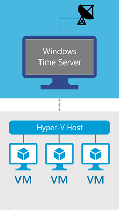
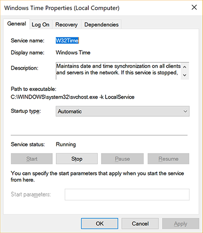

---
ms.assetid: 
title: Configuring Systems for High Accuracy
description: Time synchronization in Windows 10 and Windows Server 2016 has been substantially improved.  Under reasonable operating conditions, systems can be configured to maintain 1ms (millisecond) accuracy or better (with respect to UTC).
author: eross-msft
ms.author: dacuo
ms.date: 05/08/2018
ms.topic: article
ms.prod: windows-server
ms.technology: networking
---

# Configuring Systems for High Accuracy
>Applies to: Windows Server 2016, and Windows 10 version 1607 or later

Time synchronization in Windows 10 and Windows Server 2016 has been substantially improved.  Under reasonable operating conditions, systems can be configured to maintain 1ms (millisecond) accuracy or better (with respect to UTC).

The following guidance will help you configure your systems to achieve high accuracy.  This article discusses the following requirements:

- Supported Operating Systems
- System configuration 

> [!WARNING]
> **Prior Operating Systems Accuracy Goals** 
>Windows Server 2012 R2 and below can not meet the same high accuracy objectives. These operating systems are not supported for high accuracy.
>
>In these versions, the Windows Time service satisfied the following requirements:
>
> - Provided the necessary time accuracy to satisfy Kerberos version 5 authentication requirements.
> - Provided loosely accurate time for Windows clients and servers joined to a common Active Directory forest.
>
>Greater tolerances on 2012 R2 and below are outside the design specification of the Windows Time service.

## Windows 10 and Windows Server 2016 Default Configuration

While we support accuracy up to 1ms on Windows 10 or Windows Server 2016, the majority of customers do not require highly accurate time.

As such, the **default configuration** is intended to satisfy the same requirements as prior operating systems which are to:

- Provide the necessary time accuracy to satisfy Kerberos version 5 authentication requirements.
- Provide loosely accurate time for Windows clients and servers joined to a common Active Directory forest.

## How to Configure Systems for High Accuracy

>[!IMPORTANT]
>**Note Regarding Supportability of Highly Accurate Systems** 
> Time accuracy entails the end-to-end distribution of accurate time from the authoritative time source to the end device.  Anything that adds assymetry in measurements along this path will negatively influence accuracy will affect the accuracy achievable on your devices.
>
>For this reason, we have documented the [Support boundary to configure the Windows Time service for high-accuracy environments](support-boundary.md) outlining the environmental requirements that must also be satisfied to reach high accuracy targets.

### Operating System Requirements

High accuracy configurations require Windows 10 or Windows Server 2016.  All Windows devices in the time topology must meet this requirement including higher stratum Windows time servers, and in virtualized scenarios, the Hyper-V Hosts that run the time-sensitive virtual machines. All of these devices must be at least Windows 10 or Windows Server 2016.

In the illustration shown below, the virtual machines requiring high accuracy are running Windows 10 or Windows Server 2016.  Likewise, the Hyper-V Host on which the virtual machines reside, and the upstream Windows time server must also run Windows Server 2016.

>[!TIP] 
>**Determining the Windows Version** 
> You can run the command `winver` at a command prompt to verify the OS version is 1607 (or higher) and OS Build is 14393 (or higher) as shown below:
>
> 

### System Configuration

Reaching high accuracy targets requires system configuration.  There are a variety of ways to perform this configuration, including directly in the registry or through group policy.  More information for each of these settings can be found in the Windows Time Service Technical Reference – [Windows Time Service Tools](Windows-Time-Service-Tools-and-Settings.md#windows-time-service-tools).

#### Windows Time service Startup Type

The Windows Time service (W32Time) must run continuously.  To do this, configure the Windows Time service's startup type to 'Automatic' start.

#### Cumulative one-way network latency

Measurement uncertainty and "noise" creeps in as network latency increases.  As such, it is imperative that a network latency be within a reasonable boundary.  The specific requirements are dependent on your target accuracy and are outlined in the [Support boundary to configure the Windows Time service for high-accuracy environments](support-boundary.md) article.

To calculate the cumulative one-way network latency, add the individual one-way delays between pairs of NTP client-server nodes in the time topology, starting with the target and ending at the high-accuracy stratum 1 time source.

For example: Consider a time sync hierarchy with a highly accurate source, two intermediary NTP servers A and B, and the target machine in that order. To obtain the cumulative network latency between the target and source, measure the average individual NTP roundtrip times (RTTs) between:

- The target and time server B
- Time server B and time server A
- Time server A and the Source

This measurement can be obtained using the inbox w32tm.exe tool.  To do this:

1. Perform the calculation from the target and time server B.
    
    `w32tm /stripchart /computer:TimeServerB /rdtsc /samples:450 > c:\temp\Target_TsB.csv`

2. Perform the calculation from time server b against (pointed at) time server a.
    
    `w32tm /stripchart /computer:TimeServerA /rdtsc /samples:450 > c:\temp\Target_TsA.csv`

3. Perform the calculation from time server a against the source.
 
4. Next, add the average RoundTripDelay measured in the previous step and divide by 2 to obtain the cumulative network delay between target and source.

#### Registry Settings

# [MinPollInterval](#tab/MinPollInterval)
Configures the smallest interval in log2 seconds allowed for system polling.

|  |  | 
|---------|---------|
|Key location     | HKLM:\SYSTEM\CurrentControlSet\Services\W32Time\Config        |
|Setting    | 6        |
|Outcome | The minimum polling interval is now 64 seconds. |

The following command signals Windows Time to pick up the updated settings:

`w32tm /config /update`

# [MaxPollInterval](#tab/MaxPollInterval)
Configures the largest interval in log2 seconds allowed for system polling.

|  |  |  
|---------|---------|
|Key location     | HKLM:\SYSTEM\CurrentControlSet\Services\W32Time\Config        |
|Setting    | 6        |
|Outcome | The maximum polling interval is now 64 seconds.  |

The following command signals Windows Time to pick up the updated settings:

`w32tm /config /update`

# [UpdateInterval](#tab/UpdateInterval)
The number of clock ticks between phase correction adjustments.

|  |  |  
|---------|---------|
|Key location     | HKLM:\SYSTEM\CurrentControlSet\Services\W32Time\Config       |
|Setting    | 100        |
|Outcome | The number of clock ticks between phase correction adjustments is now 100 ticks. |

The following command signals Windows Time to pick up the updated settings:

`w32tm /config /update`

# [SpecialPollInterval](#tab/SpecialPollInterval)
Configures the poll interval in seconds when the SpecialInterval 0x1 flag is enabled.

|  |  |  
|---------|---------|
|Key location     | HKLM:\SYSTEM\CurrentControlSet\Services\W32Time\TimeProviders\NtpClient        |
|Setting    | 64        |
|Outcome | The poll interval is now 64 seconds. |

The following command restarts Windows Time to pick up the updated settings:

`net stop w32time && net start w32time`

# [FrequencyCorrectRate](#tab/FrequencyCorrectRate)

|  |  |  
|---------|---------|
|Key location     | HKLM:\SYSTEM\CurrentControlSet\Services\W32Time\Config      |
|Setting    | 2        |

---
