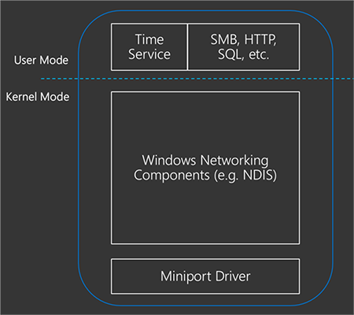

# Insider preview 

## Leap second support

>Applies to: Windows Server 2019 and Windows 10, version 1809

A leap second is an occasional 1-second adjustment to UTC. As the earth's rotation slows, [UTC](https://en.wikipedia.org/wiki/Coordinated_Universal_Time) (an atomic timescale) diverges from [mean solar time](https://en.wikipedia.org/wiki/Solar_time#Mean_solar_time) or astronomical time.  Once UTC has diverged by at most .9 seconds, a [leap second](https://en.wikipedia.org/wiki/Leap_second) is inserted to keep UTC in-sync with mean solar time.

Leap seconds have become important to meet the accuracy and traceability regulatory requirements both in the United States and the European Union.

For more information, see:

-  Our [announcement blog](https://blogs.technet.microsoft.com/networking/2018/07/18/top10-ws2019-hatime/)

-  Validation Guide for the [Developers](https://aka.ms/Dev-LeapSecond)

-  Validation Guide for the [IT Pro](https://aka.ms/ITPro-LeapSecond)

## Precision time protocol

>Applies to: Windows Server 2019 and Windows 10, version 1809

A new time provider included in Windows Server 2019 and Windows 10 (version 1809) allows you to synchronize time using the Precision Time Protocol (PTP). As time distributes across a network, it encounters delay (latency), which if not accounted for, or if it is not symmetric, it becomes increasingly difficult to understand the time-stamp sent from the time server. PTP enables network devices to add the latency introduced by each network device into the timing measurements thereby providing a far more accurate time sample to the windows client.

For more information, see:

-  Our [announcement blog](https://blogs.technet.microsoft.com/networking/2018/07/18/top10-ws2019-hatime/)

-  Validation Guide for the [IT Pro](https://aka.ms/PTPValidation)

## Software timestamping

>Applies to: Windows Server 2019 and Windows 10, version 1809

When receiving a timing packet over the network from a time server, it must be processed by the operating system's networking stack before being consumed in the time service. Each component in the networking stack introduces a variable amount of latency that affects the accuracy of the timing measurement.

To address this problem, software timestamping allows us to timestamp packets before and after the “Windows Networking Components” shown above to account for the delay in the operating system.

For more information, see:

-  Our [announcement blog](https://blogs.technet.microsoft.com/networking/2018/07/18/top10-ws2019-hatime/)

-  Validation Guide for the [IT Pro](https://github.com/Microsoft/SDN/blob/master/FeatureGuide/Validation%20Guide%20-%20RS5%20-%20Software%20Timestamping.docx)

---