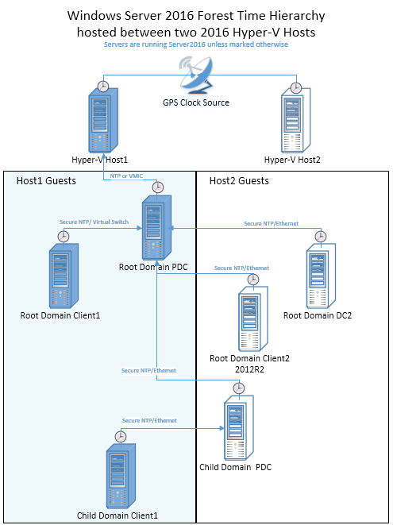
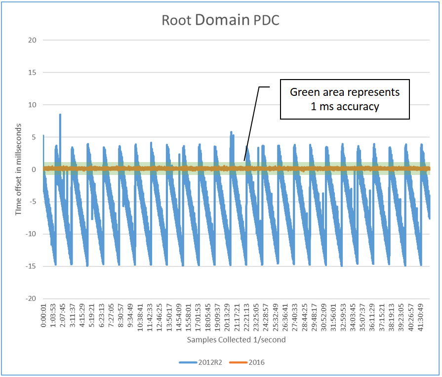
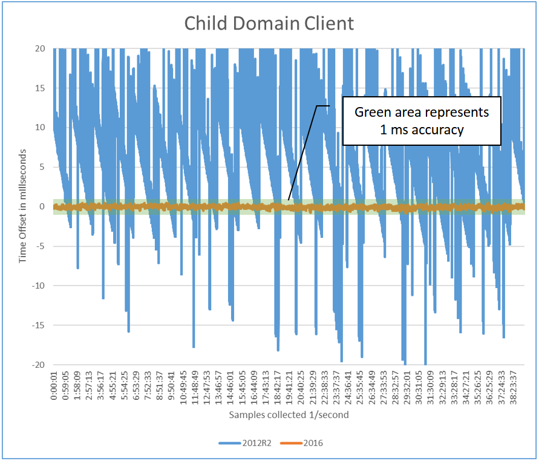

# Windows Server 2016 improvements

This article includes information about improvements made in Windows Server 2016.

## Windows Time Service and NTP

Windows Server 2016 has improved the algorithms it uses to correct time and condition the local clock to synchronize with UTC. NTP uses 4 values to calculate the time offset, based on the timestamps of the client request/response and server request/response. However, networks are noisy, and there can be spikes in the data from NTP due to network congestion and other factors that affect network latency. Windows 2016 algorithms average out this noise using a number of different techniques which results in a stable and accurate clock. Additionally, the source we use for accurate time references an improved API which gives us better resolution. With these improvements we are able to achieve 1 ms accuracy with regards to UTC across a domain.

## Hyper-V

Windows 2016 has improved the Hyper-V TimeSync service. Improvements include more accurate initial time on VM start or VM restore and interrupt latency correction for samples provided to w32time. This improvement allows us to stay with-in 10µs of the host with an RMS, (Root Mean Squared, which indicates variance), of 50µs, even on a machine with 75% load. For more information, see [Hyper-V architecture](https://msdn.microsoft.com/library/cc768520.aspx).

> [!NOTE]
> Load was created using prime95 benchmark using balanced profile.

Additionally, the stratum level that the Host reports to the guest is more transparent. Previously the Host would present a fixed stratum of 2, regardless of its accuracy. With the changes in Windows Server 2016, the host reports a stratum one greater than the host stratum, which results in better time for virtual guests. The host stratum is determined by w32time through normal means based on its source time. Domain joined Windows 2016 guests will find the most accurate clock, rather than defaulting to the host. It was for this reason that we advised to manually disable Hyper-V Time Provider setting for machines participating in a domain in Windows 2012R2 and below.

## Monitoring
Performance monitor counters have been added. These allow you to baseline, monitor, and troubleshoot time accuracy. These counters include:

|Counter|Description|
|----- | ----- |
|Computed Time Offset| The absolute time offset between the system clock and the chosen time source, as computed by W32Time Service in microseconds. When a new valid sample is available, the computed time is updated with the time offset indicated by the sample. This is the actual time offset of the local clock. W32time initiates clock correction using this offset and updates the computed time in between samples with the remaining time offset that needs to be applied to the local clock. Clock accuracy can be tracked using this performance counter with a low polling interval (eg:256 seconds or less) and looking for the counter value to be smaller than the desired clock accuracy limit.|
|Clock Frequency Adjustment| The absolute clock frequency adjustment made to the local system clock by W32Time in parts per billion. This counter helps visualize the actions being taken by W32time.|
|NTP Roundtrip Delay| Most recent round-trip delay experienced by the NTP Client in receiving a response from the server in microseconds. This is the time elapsed on the NTP client between transmitting a request to the NTP server and receiving a valid response from the server. This counter helps characterize the delays experienced by the NTP client. Larger or varying roundtrips can add noise to NTP time computations, which in turn may affect the accuracy of time synchronization through NTP.|
|NTP Client Source Count| Active number of NTP Time sources being used by the NTP Client. This is a count of active, distinct IP addresses of time servers that are responding to this client's requests. This number may be larger or smaller than the configured peers, depending on DNS resolution of peer names and current reach-ability.|
|NTP Server Incoming Requests| Number of requests received by the NTP Server (Requests/Sec).|
|NTP Server Outgoing Responses| Number of requests answered by NTP Server (Responses/Sec).|

The first 3 counters target scenarios for troubleshooting accuracy issues. The Troubleshooting Time Accuracy and NTP section below, under Best Practices, has more detail.
The last 3 counters cover NTP server scenarios and are helpful when determine the load and baselining your current performance.

## Configuration Updates per Environment
The following describes the changes in default configuration between Windows 2016 and previous versions for each Role. The settings for Windows Server 2016 and Windows 10 Anniversary Update (build 14393), are now unique which is why there are shown as separate columns.

|Role|Setting|Windows Server 2016|Windows 10|Windows Server 2012 R2 Windows Server 2008 R2 Windows 10|
|---|---|---|---|---|
|**Standalone/Nano Server**||||
| |*Time Server*|time.windows.com|NA|time.windows.com|
| |*Polling Frequency*|64 - 1024 seconds|NA|Once a week|
| |*Clock Update Frequency*|Once a second|NA|Once a hour|
|**Standalone Client**||||
| |*Time Server*|NA|time.windows.com|time.windows.com|
| |*Polling Frequency*|NA|Once a day|Once a week|
| |*Clock Update Frequency*|NA|Once a day|Once a week|
|**Domain Controller**||||
| |*Time Server*|PDC/GTIMESERV|NA|PDC/GTIMESERV|
| |*Polling Frequency*|64 -1024 seconds|NA|1024 - 32768 seconds|
| |*Clock Update Frequency*|Once a day|NA|Once a week|
|**Domain Member Server**||||
| |*Time Server*|DC|NA|DC|
| |*Polling Frequency*|64 -1024 seconds|NA|1024 - 32768 seconds|
| |*Clock Update Frequency*|Once a second|NA|Once every 5 minutes|
|**Domain Member Client**||||
| |*Time Server*|NA|DC|DC|
| |*Polling Frequency*|NA|1204 - 32768 seconds|1024 - 32768 seconds|
| |*Clock Update Frequency*|NA|Once every 5 minutes|Once every 5 minutes|
|**Hyper-V Guest**||||
| |*Time Server*|Chooses best option based on stratum of Host and Time server|Chooses best option based on stratum of Host and Time server|Defaults to Host|
| |*Polling Frequency*|Based on Role above|Based on Role above|Based on Role above|
| |*Clock Update Frequency*|Based on Role above|Based on Role above|Based on Role above|

>[!NOTE]
>For Linux in Hyper-V, see the Allowing Linux to use Hyper-V Host Time section below.

## Impact of increased polling and clock update frequency

In order to provide more accurate time, the defaults for polling frequencies and clock updates are increased which allow us to make small adjustments more frequently. This will cause more UDP/NTP traffic, however, these packets are small so there should be very little or no impact over broadband links. The benefit, however, is that time should be better on a wider variety of hardware and environments.

For battery backed devices, increasing the polling frequency can cause issues. Battery devices don't store the time while turned off. When they resume, it may require frequent corrections to the clock. Increasing the polling frequency will cause the clock to become unstable and could also use more power. Microsoft recommends you do not change the client default settings.

Domain Controllers should be minimally impacted even with the multiplied effect of the increased updates from NTP Clients in an AD Domain. NTP has a much smaller resource consumption as compared to other protocols and a marginal impact. You are more likely to reach limits for other domain functionality before being impacted by the increased settings for Windows Server 2016. Active Directory does use secure NTP, which tends to sync time less accurately than simple NTP, but we've verified it will scale up to clients two stratum away from the PDC.

As a conservative plan, you should reserve 100 NTP requests per second per core. For instance, a domain made up of 4 DCs with 4 cores each, you should be able to serve 1600 NTP requests per second. If you have 10k clients configured to sync time once every 64 seconds, and the requests are received uniformly over time, you would see 10,000/64 or around 160 requests/second, spread across all DCs. This falls easily within our 1600 NTP requests/sec based on this example. These are conservative planning recommendations and of course have a large dependency on your network, processor speeds and loads, so as always baseline and test in your environments.

It is also important to note that if your DCs are running with a considerable CPU load, greater than 40%, this will almost certainly add noise to NTP responses and affect your time accuracy in your domain. Again, you need to test in your environment to understand the actual results.

## Time Accuracy Measurements
### Methodology
To measure the time accuracy for Windows Server 2016, we used a variety of tools, methods and environments. You can use these techniques to measure and tune your environment and determine if the accuracy results meet your requirements. 

Our domain source clock consisted of two high precision NTP servers with GPS hardware. We also used a separate reference test machine for measurements, which also had high precision GPS hardware installed from a different manufacturer. For some of the testing, you will need an accurate and reliable clock source to use as a reference in addition to your domain clock source.

We used four different methods to measure accuracy with both physical and virtual machines. Multiple methods provided independent means to validate the results.

1. Measure the local clock, that is conditioned by w32tm, against our reference test machine which has separate GPS hardware. 
2. Measure NTP pings from the NTP server to clients using W32tm “stripchart”
3. Measure NTP pings from the client to the NTP server using W32tm “stripchart”
4. Measure Hyper-V results from the host to the guest using the Time Stamp Counter (TSC). This counter is shared between both partitions and the system time in both partitions. We calculated the difference of the host time and the client time in the virtual machine. Then we use the TSC clock to interpolate the host time from the guest, since the measurements don't happen at the same time. Also, we use the TSV clock factor out delays and latency in the API.

W32tm is built-in, but the other tools we used during our testing are available for the Microsoft repository on GitHub as open source for your testing and usage. The WIKI on the repository has more information describing how to use the tools to do measurements.

> [https://github.com/Microsoft/Windows-Time-Calibration-Tools](https://github.com/Microsoft/Windows-Time-Calibration-Tools)

The test results shown below are a subset of measurements we made in one of the test environments. They illustrate the accuracy maintained at the start of the time hierarchy, and child domain client at the end of the time hierarchy. This is compared to the same machines in a 2012 based topology for comparison.

### Topology
For comparison, we tested both a Windows Server 2012R2 and Windows Server 2016 based topology. Both topologies consist of two physical Hyper-V host machines that reference a Windows Server 2016 machine with GPS clock hardware installed. Each host runs 3 domain joined windows guests, which are arranged according to the following topology. The lines represent the time hierarchy, and the protocol/transport that is used.

### Graphical Results Overview
The following two graphs represent the time accuracy for two specific members in a domain based on the topology above. Each graph displays both the Windows Server 2012R2 and 2016 results overlaid, which demonstrates the improvements visually. The accuracy was measure from with-in the guest machine compared to the host. The graphical data represents a subset of the entire set of tests we've done and shows the best case and worst case scenarios. 

### Performance of the Root Domain PDC
The Root PDC is synchronized to the Hyper-V host (using VMIC) which is a Windows Server 2016 with GPS hardware that is proven to be both accurate and stable. This is a critical requirement for 1 ms accuracy, which is shown as the green shaded area.

### Performance of the Child Domain Client
The Child Domain Client is attached to a Child Domain PDC which communicates to the Root PDC. It time is also within the 1 ms requirement.

### Long Distance Test
The following chart compares 1 virtual network hop to 6 physical network hops with Windows Server 2016. Two charts are overlaid on each other with transparency to show overlapping data. Increasing network hops mean higher latency, and larger time deviations. The chart is magnified and so the 1 ms bounds, represented by the green area, is larger. As you can see, the time is still within 1 ms with multiple hops. It's negatively shifted, which demonstrates a network asymmetry. Of course, every network is different, and measurements depend on a multitude of environmental factors.

## Best Practices for accurate timekeeping
### Solid Source Clock
A machines time is only as good as the source clock it synchronizes with. In order to achieve 1 ms of accuracy, you'll need GPS hardware or a time appliance on your network you reference as the master source clock. Using the default of time.windows.com, may not provide a stable and local time source. Additionally, as you get further away from the source clock, the network affects the accuracy. Having a master source clock in each data center is required for the best accuracy.

### Hardware GPS Options
There are various hardware solutions that can offer accurate time. In general, solutions today are based on GPS antennas. There are also radio and dial-up modem solutions using dedicated lines. They attach to your network as either an appliance, or plug into a PC, for instance Windows via a PCIe or USB device. Different options will deliver different levels of accuracy, and as always, results depend on your environment. Variables which affect accuracy include GPS availability, network stability and load, and PC Hardware. These are all important factors when choosing a source clock, which as we stated, is a requirement for stable and accurate time.

### Domain and Synchronizing Time
Domain members use the domain hierarchy to determine which machine they use as a source to synchronize time. Each domain member will find another machine to sync with and save it as it's clock source. Each type of domain member follows a different set of rules in order to find a clock source for time synchronization. The PDC in the Forest Root is the default clock source for all Domains. Listed below are different roles and high level description for how they find a source:

- **Domain Controller with PDC role** – This machine is the authoritative time source for a domain. It will have the most accurate time available in the domain, and must sync with a DC in the parent domain, except in cases where GTIMESERV role is enabled.
- **Any other Domain Controller** – This machine will act as a time source for clients and member servers in the domain. A DC can sync with the PDC of its own domain, or any DC in its parent domain.
- **Clients/Member Servers** – This machine can sync with any DC or PDC of its own domain, or a DC or PDC in the parent domain.

Based on the available candidates, a scoring system is used to find the best time source. This system takes into account the reliability of the time source and its relative location. This happens once when the time is service started. If you need to have finer control of how time synchronizes, you can add good time servers in specific locations or add redundancy. See the [Specify a Local Reliable Time Service Using GTIMESERV section for more information.

#### Mixed OS Environments (Win2012R2 and Win2008R2)
While a pure Windows Server 2016 Domain environment is required for the best accuracy, there are still benefits in a mixed environment. Deploying Windows Server 2016 Hyper-V in a Windows 2012 domain will benefit the guests because of the improvements we mentioned above, but only if the guests are also Windows Server 2016. A Windows Server 2016 PDC, will be able to deliver more accurate time because of the improved algorithms it will be a more stable source. As replacing your PDC might not be an option, you can instead add a Windows Server 2016 DC with the GTIMESERV roll set which would be an upgrade in accuracy for your domain. A Windows Server 2016 DC can deliver better time to downstream time clients, however, it's only as good as its source NTP time.

Also as stated above, the clock polling and refresh frequencies have been modified with Windows Server 2016. These can be changed manually to your down-level DCs or applied via group policy. While we haven't tested these configurations, they should behave well in Win2008R2 and Win2012R2 and deliver some benefits.

Versions before Windows Server 2016 had a multiple issues keeping accurate time keeping which resulted in the system time drifting immediately after an adjustment was made. Because of this, obtaining time samples from an accurate NTP source frequently and conditioning the local clock with the data leads to smaller drift in their system clocks in the intra-sampling period, resulting in better time keeping on down-level OS versions. The best observed accuracy was approximately 5 ms when a Windows Server 2012R2 NTP Client, configured with the high-accuracy settings, synchronized its time from an accurate Windows 2016 NTP server.

In some scenarios involving guest domain controllers, Hyper-V TimeSync samples can disrupt domain time synchronization. This should no longer be an issue for Server 2016 guests running on Server 2016 Hyper-V hosts.

To disable the Hyper-V TimeSync service from providing samples to w32time, set the following guest registry key:

 HKEY_LOCAL_MACHINE\SYSTEM\CurrentControlSet\Services\W32Time\TimeProviders\VMICTimeProvider 
 "Enabled"=dword:00000000

#### Allowing Linux to use Hyper-V Host Time
For Linux guests running in Hyper-V, clients are typically configured to use the NTP daemon for time synchronization against NTP servers. If the Linux distribution supports the TimeSync version 4 protocol and the Linux guest has the TimeSync integration service enabled, then it will synchronize against the host time. This could lead to inconsistent time keeping if both methods are enabled.

To synchronize exclusively against the host time, it is recommended to disable NTP time synchronization by either:

- Disabling any NTP servers in the ntp.conf file
- or Disabling the NTP daemon

In this configuration, the Time Server parameter is this host. Its Polling Frequency is 5 seconds and the Clock Update Frequency is also 5 seconds.

To synchronize exclusively over NTP, it is recommended to disable the TimeSync integration service in the guest.

> [!NOTE]
> Note: Support for accurate time with Linux guests requires a feature that is only supported in the latest upstream Linux kernels and it isn't something that's widely available across all Linux distros yet. Please reference [Supported Linux and FreeBSD virtual machines for Hyper-V on Windows](https://technet.microsoft.com/windows-server-docs/virtualization/hyper-v/supported-linux-and-freebsd-virtual-machines-for-hyper-v-on-windows) for more details about support distributions.

#### Specify a Local Reliable Time Service Using GTIMESERV
You can specify one or more domain controllers as accurate source clocks by using the GTIMESERV, Good Time Server, flags. For instance, specific domain controllers equipped with GPS hardware can be flagged as a GTIMESERV. This will insure your domain references a clock based on the GPS hardware.

> [!NOTE]
> More information about domain flags can be found in the [MS-ADTS protocol documentation](https://msdn.microsoft.com/library/mt226583.aspx).

TIMESERV is another related Domain Services Flag which indicates whether a machine is currently authoritative, which can change if a DC loses connection. A DC in this state will return “Unknown Stratum” when queried via NTP. After trying multiple times, the DC will log System Event Time-Service Event 36.

If you want to configure a DC as a GTIMESERV, this can be configured manually using the following command. In this case the DC is using another machine(s) as the master clock. This could be an appliance or dedicated machine.

 w32tm /config /manualpeerlist:"master_clock1,0x8 master_clock2,0x8" /syncfromflags:manual /reliable:yes /update

> [!NOTE]
> For more information, see [Configure the Windows Time Service](https://technet.microsoft.com/library/cc731191.aspx)

If the DC has the GPS hardware installed, you need to use these steps to disable the NTP client and enable the NTP server.

Start by disabling the NTP Client and enable the NTP Server using these registry key changes.

 reg add HKEY_LOCAL_MACHINE\SYSTEM\CurrentControlSet\Services\w32time\TimeProviders\NtpClient /v Enabled /t REG_DWORD /d 0 /f

 reg add HKEY_LOCAL_MACHINE\SYSTEM\CurrentControlSet\Services\w32time\TimeProviders\NtpServer /v Enabled /t REG_DWORD /d 1 /f

Next, restart the Windows Time Service

 net stop w32time && net start w32time

Finally, you indicate that this machine has a reliable time source using.
  
 w32tm /config /reliable:yes /update

To check that the changes have been done properly, you can run the following commands which affect the results shown below. 

 w32tm /query /configuration

Value|Expected Setting|
----- | ----- |
AnnounceFlags| 5 (Local)|
NtpServer |(Local)|
DllName |C:\WINDOWS\SYSTEM32\w32time.DLL (Local)|
Enabled |1 (Local)|
NtpClient| (Local)|

 w32tm /query /status /verbose

Value| Expected Setting|
----- | ----- |
Stratum| 1 (primary reference - syncd by radio clock)|
ReferenceId| 0x4C4F434C (source name: "LOCAL")|
Source| Local CMOS Clock|
Phase Offset| 0.0000000s|
Server Role| 576 (Reliable Time Service)|

#### Windows Server 2016 on 3rd Party Virtual Platforms
When Windows is virtualized, by default the Hypervisor is responsible for providing time. But domain joined members need to be sychronized with the Domain Controller in order for Active Directory to work properly. It is best to disable any time virtualization between the guest and the host of any 3rd party virtual platforms.

#### Discovering the Hierarchy
Since the chain of time hierarchy to the master clock source is dynamic in a domain, and negotiated, you will need to query the status of a particular machine to understand it's time source and chain to the master source clock. This can help diagnose time synchronization problems.

Given you want to troubleshoot a specific client; the first step is to understand its time source by using this w32tm command.

 w32tm /query /status

The results display the Source among other things. The Source indicates with whom you synchronize time in the domain. This is the first step of this machines time hierarchy.
Next use Source entry from above and use the /StripChart parameter to find the next time source in the chain.

 w32tm /stripchart /computer:MySourceEntry /packetinfo /samples:1

Also useful, the following command lists each domain controller it can find in the specified domain and prints a result which lets you determine each partner. This command will include machines that have been configured manually.
 
 w32tm /monitor /domain:my_domain

Using the list, you can trace the results through the domain and understand the hierarchy as well as the time offset at each step. By locating the point where the time offset gets significantly worse, you can pinpoint the root of the incorrect time. From there you can try to understand why that time is incorrect by turning on w32tm logging.

#### Using Group Policy
You can use Group Policy to accomplish stricter accuracy by, for instance, assigning clients to use specific NTP servers or to control how down-level OS's are configured when virtualized. 
Below is a list of possible scenarios and relevant Group Policy settings:

**Virtualized Domains** - In order to control Virtualized Domain Controllers in Windows 2012R2 so that they synchronize time with their domain, rather than with the Hyper-V host, you can disable this registry entry.  For the PDC, you don't want to disable the entry as the Hyper-V host will deliver the most stable time source. The registry entry requires that you restart the w32time service after it is changed.

 [HKEY_LOCAL_MACHINE\SYSTEM\CurrentControlSet\Services\W32Time\TimeProviders\VMICTimeProvider]
 "Enabled"=dword:00000000

**Accuracy Sensitive Loads** - For time accuracy sensitive workloads, you could configure groups of machines to set the NTP servers and any related time settings, such as polling and clock update frequency. This is normally handled by the domain, but for more control you could target specific machines to point directly to the master clock.

Group Policy Setting| New Value|
----- | ----- |
NtpServer| ClockMasterName,0x8|
MinPollInterval| 6 – 64 seconds|
MaxPollInterval| 6|
UpdateInterval| 100 – Once per second|
EventLogFlags| 3 – All special time logging|

> [!NOTE]
> The NtpServer and EventLogFlags settings are located under System\Windows Time Service\Time Providers using the Configure Windows NTP Client settings. The other 3 are located under System\Windows Time Service using the Global Configuration settings.

**Remote Accuracy Sensitive Loads Remote** – For systems in branch domains for instance Retail and the Payment Credit Industry (PCI), Windows uses the current site information and DC Locator to find a local DC, unless there is a manual NTP time source configured. This environment requires 1 second of accuracy, which uses faster convergence to the correct time. This option allows the w32time service to move the clock backwards. If this is acceptable and meets your requirements, you can create the following policy.  As with any environment, makes sure to test and baseline your network. 

Group Policy Setting| New Value|
----- | ----- |
MaxAllowedPhaseOffset| 1, if more than on second, set clock to correct time.|

The MaxAllowedPhaseOffset setting is located under System\Windows Time Service using the Global Configuration settings.

> [!NOTE]
> For more information on group policy and related entries, see [Windows Time Service Tools](windows-time-service-tools-and-settings.md) and Settings article on TechNet.

## Azure and Windows IaaS considerations

### Azure Virtual Machine: Active Directory Domain Services
If the Azure VM running Active Directory Domain Services is part of an existing on-premises Active Directory Forest, then TimeSync(VMIC), should be disabled. This is to allow all DCs in the Forest, both physical and virtual, to use a single time sync hierarchy. Refer to the best practice whitepaper [“Running Domain Controllers in Hyper-V”](https://technet.microsoft.com/library/virtual_active_directory_domain_controller_virtualization_hyperv.aspx)

### Azure Virtual Machine: Domain-joined machine
If you are hosting a machine which is domain joined to an existing Active Directory Forest, virtual or physical, the best practice is to disable TimeSync for the guest and ensure W32Time is configured to synchronize with its Domain Controller via configuring time for Type=NTP5

### Azure Virtual Machine: Standalone workgroup machine
If the Azure VM is not joined to a domain, nor is it a Domain Controller, the recommendation is to keep the default time configuration and have the VM synchronize with the host.

## Windows Application Requiring Accurate Time
### Time Stamp API
Programs which require the greatest accuracy with regards to UTC, and not the passage of time, should use the [GetSystemTimePreciseAsFileTime API](https://msdn.microsoft.com/library/windows/desktop/Hh706895.aspx). This assures your application gets System Time, which is conditioned by the Windows Time service.

### UDP Performance
If you have an application that uses UDP communication for transactions and it's important to minimize latency, there are some related registry entries you can use to configure a range of ports to be excluded from port the base filtering engine. This will improve both the latency and increase your throughput. However, changes to the registry should be limited to experienced administrators. Additionally, this work around excludes ports from being secured by the firewall. See the article reference below for more information.

For Windows Server 2012 and Windows Server 2008, you will need to install a Hotfix first. You can reference this KB article: [Datagram loss when you run a multicast receiver application in Windows 8 and in Windows Server 2012](https://support.microsoft.com/kb/2808584)

### Update Network Drivers
Some network vendors have driver updates which improve performance with regards to driver latency and buffering UDP packets. Please contact your network vendor to see if there are updates to help with UDP throughput.

## Logging for Auditing Purposes
To comply with time tracing regulations you can manually archive w32tm logs, event logs and performance monitor information. Later, the archived information can be used to attest compliance at a specific time in the past. The following factors are used to indicate the accuracy.

1. Clock accuracy using the Computed Time Offset performance monitor counter. This shows the clock with in the desired accuracy.
2. Clock source looking for “Peer Response from” in the w32tm logs.  Following the message text is the IP address or VMIC, which describes the time source and the next in chain of reference clocks to validate.
3. Clock condition status using the w32tm logs to validate that “ClockDispl Discipline: \*SKEW\*TIME\*” are occurring. This indicates that w32tm is active at the time.

### Event Logging
To get the complete story, you will also need Event log information. By collecting the System Event log, and filtering on Time-Server, Microsoft-Windows-Kernel-Boot, Microsoft-Windows-Kernel-General, you may be able to discover if there are other influences that have changed the time, for instance, third parties. These logs might be necessary to rule out external interference. Group policy can affect which event logs are written to the log. See the section above on Using Group Policy for more details.

### W32time Debug Logging
To enable w32tm for auditing purposes, the following command enables logging that shows the periodic updates of the clock and indicates the source clock. Restart the service to enable the new logging. 

For more information, see [How to turn on debug logging in the Windows Time Service](https://support.microsoft.com/kb/816043).

 w32tm /debug /enable /file:C:\Windows\Temp\w32time-test.log /size:10000000 /entries:0-73,103,107,110

### Performance Monitor
The Windows Server 2016 Windows Time service exposes performance counters which can be used to collect logging for auditing. These can be logged locally or remotely. You can record the Computer Time Offset and Round Trip delay counters. 
And like any performance counter, you can monitor them remotely and create alerts using System Center Operations Manager. You can, for instance, use an alert to alarm you when the Time Offset drifts from the desired accuracy. The [System Center Management Pack](https://social.technet.microsoft.com/wiki/contents/articles/15251.system-center-management-pack-authoring-guide.aspx) has more information.

### Windows Traceability Example
From w32tm log files you will want to validate two pieces of information. The first is an indication that the log file is currently condition clock. This prove that your clock was being conditioned by the Windows Time Service at the disputed time.

 151802 20:18:32.9821765s - ClockDispln Discipline: *SKEW*TIME* - PhCRR:223 CR:156250 UI:100 phcT:65 KPhO:14307
 151802 20:18:33.9898460s - ClockDispln Discipline: *SKEW*TIME* - PhCRR:1 CR:156250 UI:100 phcT:64 KPhO:41
 151802 20:18:44.1090410s - ClockDispln Discipline: *SKEW*TIME* - PhCRR:1 CR:156250 UI:100 phcT:65 KPhO:38

The main point is that you see messages prefixed with ClockDispln Discipline which is proof w32time is interacting with your system clock.
 
Next you need to find the last report in the log before the disputed time which reports the source computer which is currently being used as the reference clock. This could be an IP address, computer name, or the VMIC provider, which indicates that it's syncing with the Host for Hyper-V. The following example provides an IPv4 address of 10.197.216.105.

 151802 20:18:54.6531515s - Response from peer 10.197.216.105,0x8 (ntp.m|0x8|0.0.0.0:123->10.197.216.105:123), ofs: +00.0012218s

Now that you've validated the first system in the reference time chain, you need to investigate the log file on reference time source and repeat the same steps. This continues until you get to a physical clock, like GPS or a known time source like NIST. If the reference clock is GPS hardware, then logs from the manufactured might also be required.

## Network Considerations
The NTP protocol algorithms have a dependency on the Symmetry of your network. As your increase the number of network hops, the probability of asymmetry increases. There for, it's difficult to predict what types of accuracies you will see in your specific environments. 

Performance Monitor and the new Windows Time counters in Windows Server 2016 can be used to assess your environments accuracy and create baselines. Additionally, you can perform troubleshooting to determine the current offset of any machine on your network.

There are two general standards for accurate time over the network. PTP ([Precision Time Protocol - IEEE 1588](https://www.nist.gov/el/intelligent-systems-division-73500/introduction-ieee-1588)) has tighter requirements on network infrastructure but can often provide sub-microsecond accuracy. NTP ([Network Time Protocol – RFC 1305](https://tools.ietf.org/html/rfc1305)) works on a larger variety of networks and environments, which makes it easier to manage. 

Windows supports Simple NTP (RFC2030) by default for non-domain joined machines. For Domain joined machines, we use a secure NTP called [MS-SNTP](https://msdn.microsoft.com/library/cc246877.aspx), which leverages domain negotiated secrets which provide a management advantage over Authenticated NTP described in RFC1305 and RFC5905.  

Both the domain and non-domain joined protocols requires UDP port 123. For more information about NTP best practices, refer to [Network Time Protocol Best Current Practices IETF Draft](https://tools.ietf.org/html/draft-ietf-ntp-bcp-00).

### Reliable Hardware Clock (RTC)
Windows does not step time, unless certain bounds are exceeded, but rather disciplines the clock. That means w32tm adjusts the frequency of the clock at a regular interval, using the Clock Update Frequency setting, which defaults to once a second with Windows Server 2016. If the clock is behind, it accelerates the frequency and if it's ahead, it slows the frequency down. However, during that time between clock frequency adjustments, the hardware clock is in control. If there's an issue with the firmware or the hardware clock, the time on the machine can become less accurate.

This is another reason you need to test and baseline in your environment. If the “Computed Time Offset” performance counter does not stabilize at the accuracy you are targeting, then you might want to verify your firmware is up to date. As another test, you can see if duplicate hardware reproduce the same issue.

### Troubleshooting Time Accuracy and NTP
You can use the Discovering the Hierarchy section above to understand the source of the inaccurate time. Looking at the time offset, find the point in the hierarchy where time diverges the most from its NTP Source. Once you understand the hierarchy, you'll want to try and understand why that particular time source doesn't receive accurate time. 

Focusing on the system with divergent time, you can use these tools below to gather more information to help you determine the issue and to find a resolution. The UpstreamClockSource reference below, is the clock discovered using “w32tm /config /status”.

- System Event logs
- Enable logging using: w32tm logs - w32tm /debug /enable /file:C:\Windows\Temp\w32time-test.log /size:10000000 /entries:0-300
- w32Time Registry key HKEY_LOCAL_MACHINE\SYSTEM\CurrentControlSet\Services\W32Time
- Local network traces
- Performance Counters (from the local machine or the UpstreamClockSource)
- W32tm /stripchart /computer:UpstreamClockSource
- PING UpstreamClockSource to understand latency and number of hops to Source
- Tracert UpstreamClockSource

Problem| Symptoms| Resolution|
----- | ----- | ----- |
| Local TSC clock is not stable.| Using Perfmon - Physical Computer – Sync clock stable clock, but you still see that every 1-2 minutes of several 100us. | Update Firmware or validate different hardware doesn't display the same issue.|
| Network Latency| w32tm stripchart displays a RoundTripDelay of more than 10 ms. Variation in the delay cause noise as large as ½ of the round trip time, for instance a delay that is only in one direction.  UpstreamClockSource is multiple hops, as indicated by PING. TTL should be close to 128.  Use Tracert to find the latency at each hop.  | Find a closer clock source for time. One solution is to install a source clock on the same segment or manually point to source clock that is geographically closer. For a domain scenario, add a machine with the GTimeServ role. | 
Unable to reliably reach the NTP source| W32tm /stripchart intermittently returns “Request timed out” |NTP Source isn't responsive|
NTP Source isn't responsive| Check Perfmon counters for NTP Client Source Count, NTP Server Incoming Requests, NTP Server Outgoing Responses and determine your usage as compared to your baselines.| Using server performance counters, determine if load has changed in reference to your baselines.  Are there network congestion issues?|
Domain Controller not using the most accurate clock| Changes in the topology or recently added master time clock.| w32tm /resync /rediscover|
Client Clocks are drifting| Time-Service event 36 in System event log and/or text in log file describing that: "NTP Client Time Source Count" counter going from 1 to 0|Troubleshoot the upstream source and understand if it's running into performance issues.|

### Baselining Time
Baselining is important so that you can first, understand the performance and accuracy of your network, and compare with the baseline in the future when problems occur. You'll want to baseline the root PDC or any machines marked with the GTIMESRV. We would also recommend you baseline the PDC in every forest. Finally pick any critical DCs or machines that have interesting characteristics, like distance or high loads and baseline those.

It is also useful to baseline Windows Server 2016 vs 2012 R2, however you only have w32tm /stripchart as a tool you can use to compare, since Windows Server 2012R2 doesn't have performance counters. You should pick two machines with the same characteristics, or upgrade a machine and compare the results after the update. The Windows Time Measurements addendum has more information on how to do detailed measurements between 2016 and 2012.

Using the all the w32time performance counters, collect data for at least a week. This will insure you have enough of a reference to account for various in the network over time and enough of a run to provide confidence that your time accuracy is stable.

### NTP Server Redundancy
For manual NTP Server configuration used with non-domain joined machines or the PDC, having more than one server is a good redundancy measure in case of availability. It might also give better accuracy, assuming the all the sources are accurate and stable. However, if the topology is not well designed, or the time sources are not stable, the resulting accuracy could be worse so caution is advised. The limit of supported time servers w32time can manually reference is 10. 

## Leap Seconds
The earth's rotation period varies over time, caused by climatic and geological events. Typically, the variation is about a second every couple of years. Whenever the variation from atomic time grows too large, a correction of one second (up or down) is inserted, called a leap second. This is done in such a way that the difference never exceeds 0.9 seconds. This correction is announced six months ahead of the actual correction. Before Windows Server 2016, the Microsoft Time Service was not aware of leap seconds, but relied on the external time service to take care of this. With the increased time accuracy of Windows Server 2016, Microsoft is working on a more suitable solution for the leap second problem.

## Secure Time Seeding
W32time in Server 2016 includes the Secure Time Seeding feature. This feature determines the approximate current time from outgoing SSL connections. This time value is used to monitor the local system clock and correct any gross errors. You can read more about the feature in [this blog post](https://blogs.msdn.microsoft.com/w32time/2016/09/28/secure-time-seeding-improving-time-keeping-in-windows/). In deployments with a reliable time source(s) and well monitored machines that include monitoring for time offsets, you may choose to not use the Secure Time Seeding feature and rely on your existing infrastructure instead. 

You can disable the feature with these steps:

1. Set the UtilizeSSLTimeData registry configuration value to 0 on a specific machine:

    reg add HKEY_LOCAL_MACHINE\SYSTEM\CurrentControlSet\Services\w32time\Config /v UtilizeSslTimeData /t REG_DWORD /d 0 /f

2. If you are unable to reboot the machine immediately due to some reason, you can notify W32time service about the configuration update. This stops time monitoring and enforcement based on time data collected from SSL connections.

    W32tm.exe /config /update

3. Rebooting the machine makes the setting effective immediately and also causes it to stop collecting any time data from SSL connections. The latter part has a very small overhead and should not be a perf concern.

4. To apply this setting in an entire domain, please set the UtilizeSSLTimeData value in W32time group policy setting to 0 and publish the setting. When the setting is picked up by a Group Policy Client, W32time service is notified and it will stop time monitoring and enforcement using SSL time data. The SSL time data collection will stop when each machine reboots. If your domain has portable slim laptops/tablets and other devices, you may want to exclude such machines from this policy change. These devices will eventually face battery drain and need the Secure Time Seeding feature to bootstrap their time.
