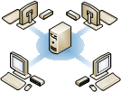

# Managing Your MultiPoint Services System
MultiPoint Services enables multiple stations to be connected to one computer. A traditional station consists of a [*station hub*](Switch-Between-Modes.md) or zero client, monitor, keyboard, and mouse. Network-connected Remote Desktop Protocol (RDP) clients are also supported.  
  
The following illustration shows an example layout of a MultiPoint Services system that contains four *stations*. Such a setup enables multiple users to use the computer at the same time, and to perform independent work or a group activity.  
  
  
  
MultiPoint Services includes MultiPoint Manager, which helps you, as an administrative user, to monitor and manage your MultiPoint system, and MultiPoint Dashboard, which provides day-to-day administrative functionality. The topics included in this Help guide describe many of the tasks that you can perform in MultiPoint Manager and MultiPoint Dashboard.  
  
## See Also  
[Manage User Desktops Using MultiPoint Dashboard](Manage-User-Desktops-Using-MultiPoint-Dashboard.md)  
[Privacy and Security Considerations](Privacy-and-Security-Considerations.md)  