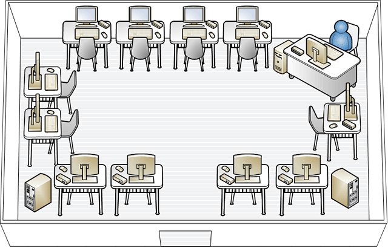

# MultiPoint Services Site Planning
You should consider the location where one or more computers running MultiPoint Services and its associated stations will be deployed.  
  
The computer that is running MultiPoint Services role should have convenient access to a power supply and to the peripheral devices that are connected directly to it, such as a printer. Additionally, the computer running MultiPoint Services must have convenient access to a network connection. A network connection is required for accessing the Internet, and where available, a LAN.  
  
Additional factors to consider include the following:  
  
-   Will the MultiPoint Services system be set up in a specific room, or will it be set up on a rolling cart or table, so that it can be moved from place to place?  
  
    > [!NOTE]  
    > If you plan to use a mobile setup, you can *associate* the stations with MultiPoint Services every time you reconnect them to make sure that each keyboard and mouse is associated with the appropriate monitor.  
  
-   Will the primary station be located next to the other stations, or will it be separate? For example, if the MultiPoint Services system is set up in a classroom, will the primary station be on the teacher's desk and the standard stations positioned elsewhere in the room? When the computer running MultiPoint Services is restarted, the primary station will have access to the startup screens. If you are concerned about this level of access in a classroom setting, you may prefer to put the primary station at the teacher's desk.  
  
-   How many stations will fit in the room?  
  
-   Do you need a network? A single server solution that uses direct video connected or USB zero client connected stations does not need a network.  
  
-   Are there enough network connections in the room to support the required number of computers running MultiPoint Services  
  
-   Where are the power outlets located?  
  
-   Will you need an additional display device, such as a projector? If you plan to use a projector, will it hang from the ceiling, or will it be positioned on a table?  
  
-   What kind of cables will be required, and how many will be needed?  
  
-   Consider how you might want to expand in the future. Will you be adding more stations?  
  
## Station layout and configuration  
The physical layout of your site may affect your choice of station type. For more details about the different station types, refer to [MultiPoint Stations](MultiPoint-services-Stations.md) in this guide. Multiple station types are allowed on a single MultiPoint Services. This provides you with extra flexibility to meet your installation needs.  
  
### Layout for direct-video-connected stations  
  
-   For a direct-video-connected station, the distance between the monitors and computer is limited by the video cable length.  
  
-   Using intermediate hubs or daisy-chained station hubs is supported for ease-of-deployment, but the maximum recommended number of consecutive hubs is three. This means that the maximum distance from the computer to the station hub is 15 meters, because each USB 2.0 cable has the maximum length of five meters.  
  
> [!IMPORTANT]  
> There should always be at least one direct video connected station per computer to act as the primary station.  
  
### Layout for USB zero client connected stations  
  
-   Using intermediate hubs or daisy-chained station hubs is supported for ease-of-deployment, but the maximum recommended number of consecutive hubs is three. This means that the maximum distance from the computer to the station hub is 15 meters, because each USB 2.0 cable has the maximum length of five meters.  
  
-   The maximum recommended number of USB zero clients connected to a single intermediate hub is three.  
  
    > [!NOTE]  
    > Some computers come with a generic hub on the motherboard, which has the effect of adding an additional hub between the *root hub* of the computer and the station hubs.  
  
-   If video will be heavily used, it is recommended that you connect no more than two USB zero clients to a USB port on the server. For example, if an intermediate hub is used, only two USB zero clients should be connected to it. Or if you are daisy chaining USB zero clients, only two USB zero clients should be chained together. The addition of each USB zero client to the USB port on the server decreases the video bandwidth available.  
  
-   If you plan to connect more than three USB zero clients to a single USB port on the server, using USB 3.0 between the server and the intermediate hub is recommended.  
  
> [!NOTE]  
> It is recommended that you verify the performance by using your applications and hardware to decide how many USB zero clients you can connect to a USB port on the server.  
  
  
  
**Figure 5** MultiPoint Services system with three USB zero clients connected to a single intermediate hub  
  
### Layout for RDP-over-LAN connected stations  
There are no physical distance limitations for LAN clients. As long as they are on the LAN, they can connect to the MultiPoint Services system.  
  
## Using additional hubs  
Additional hubs can be used to make installation easier. There are three types of hubs that are used on a MultiPoint Services system:  
  
-   [Station hubs](#station-hubs)  
  
-   [Intermediate hubs](#intermediate-hubs)  
  
-   [Downstream hubs](#downstream-hubs)  
  
### Station hubs  
A station hub is an external hub that has been associated with a MultiPoint Services station. As a minimum, the station hub will have a keyboard plugged-in to it. It may also have additional peripherals attached. A station hub can be a generic USB hub that conforms to the USB 2.0 or later specification. Station hubs should be externally powered if high-powered devices will plugin to them.  
  
**Root hub** A USB hub that is built-in to the host controller on a computer's motherboard is known as a *root hub*. Station hubs are generally plugged-in to the root hub on the computer running MultiPoint Services.  
  
> [!NOTE]  
> Root hubs should not be used as station hubs. When USB ports are built-in to a computer, often it is not possible to determine which USB root hub they are internally connected to. As such, if you plugged-in a station keyboard and mouse directly to the USB ports of the computer, you may actually be plugging-in the keyboard and mouse to different USB root hubs. To guarantee that the keyboard and mouse are on the same hub, plug-in a station hub to the computer's USB port, and then plug-in the keyboard and mouse to that station hub.  
  
**Daisy chaining stations** It may be easier to connect station hubs to another station hub rather than directly to the computer. This allows you to connect a USB hub to a station hub that is already plugged-in to the computer, so that you have a station hub attached to another station hub.  
  
There should be no more than three USB zero clients or station hubs daisy chained consecutively. Care must be taken that the USB bandwidth is not exceeded when daisy chaining station hubs.  
  
  
  
**Figure 6** MultiPoint Services system with daisy-chained stations  
  
### Intermediate hubs  
An intermediate hub is a hub that is between the server and a station hub. It is typically used to increase the number of ports that are available for station hubs or to extend the distance of the stations from the computer. It is recommended that no more than two intermediate hubs are used between a station hub and the server.  
  
Intermediate hubs must be USB 2.0 or later, and they must be externally powered. USB 3.0 is recommended between the server and the intermediate hub if you are connecting more than three USB zero clients to an intermediate hub.  
  
### Downstream hubs  
A downstream hub is connected to a station hub to add more available ports for station devices. A downstream hub can be externally powered or bus-powered, depending on the devices that are plugged-in to the hub.  
  
  
  
**Figure 7** MultiPoint Services system with an intermediate hub, a station hub, and a downstream hub  
  
## Users, stations, and computers  
The number of stations you will need depends on the number of people who will have to access the computers running MultiPoint Services at the same time. Similarly, the number of computers running MultiPoint Services you will need depends on the total number of stations required. Direct-video-connected stations, USB-zero-client-connected stations, and RDP-over-LAN-connected stations are all considered stations. In addition, if the split-screen functionality is used, each half is considered a station.  
  
## Power considerations  
The following components require access to a power strip or outlet:  
  
-   Server  
-   Monitors
-   Intermediate hubs \(if used\) 
-   Some USB zero clients  
-   Powered USB devices, such as some external storage devices and DVD drives  
  
## Sample MultiPoint Services system layouts  
Depending on the available furniture, the size of the room, the number of computers that are running MultiPoint Services, and the stations in the room, there are a variety of ways that the physical stations can be arranged. The following diagrams illustrate five possible alternatives.  
  
> [!NOTE]  
> Some of these diagrams show a projector connected to the MultiPoint Services system. This is only an example; including a projector in a MultiPoint Services system is optional.  
  
**Computer lab** In this setup, the stations are arranged around the walls of the room, with the students facing the walls.  
  
  
  
**Groups** In this setup, there are three computers that are running MultiPoint Services, with stations clustered around each computer.  
  
  
  
**Lecture room** In this setup, the stations are set up in rows. An advantage of this setup is that all of the students face the instructor.  
  
  
  
**Activity center** This setup consists of a traditional lecture-room layout for the desks, and it has a separate area with a single computer that is running MultiPoint Services with its associated stations.  
  
  
  
**Small business office** In this setup, the computer that is running MultiPoint Services is placed in a central location and users throughout the office connect to it by using a local area network \(LAN\).  
  
