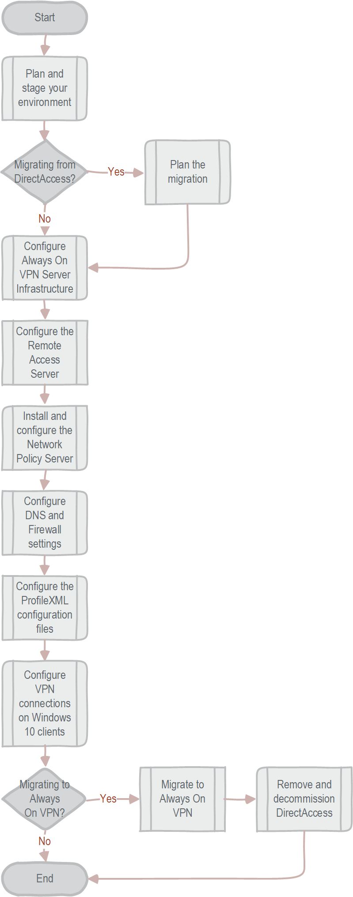

# Always On VPN Deployment Guide for Windows Server and Windows 10

>Applies To: Windows Server (Semi-Annual Channel), Windows Server 2016, Windows Server 2012 R2, Windows 10

What is Always On VPN and why use it instead of DirectAccess? That’s a really great question! In previous versions of the Windows VPN architecture, platform limitations made it difficult to provide the critical functionality needed to replace DirectAccess (such as automatic connections initiated before users sign in). Always On VPN, however, is the next generation VPN platform for Windows 10 and has expanded the VPN functionality beyond the capabilities of DirectAccess.

## Benefits of Always On VPN

Always On VPN has many benefits over the Windows VPN solutions of the past. The key improvements that align Always On VPN with Microsoft’s cloud-first, mobile-first vision:

-   Platform integration

-   Security

-   Connectivity

-   Networking control

-   Compatibility

Because many of the devices that require remote access are personal devices, Always On VPN does not require that a device be domain joined. Always On VPN provides a single, cohesive solution for remote access for your connected devices going forward, even personally owned devices. Also, organizations can choose which management platform they prefer for deploying the Always On VPN configuration because the CSP is not vendor-specific.

For more information about the advantages of Always On VPN, see [Always On VPN and DirectAccess Features Comparison](../../remote-access/vpn/vpn-map-da.md).

### Platform integration

Always On VPN has improved integration with the Windows operating system and third-party solutions to provide a robust platform for countless advanced connection scenarios. Microsoft has introduced or improved the following integration capabilities in Always On VPN:

| Key improvement | Description |
| ---- | ---- |
| **[Windows Information Protection (WIP)](https://docs.microsoft.com/en-us/windows/threat-protection/windows-information-protection/protect-enterprise-data-using-wip)** | Integration with WIP allows network policy enforcement to determine whether traffic is permitted to go over the VPN. If the user profile is active and WIP policies are applied, Always On VPN is automatically triggered to connect. Also, when you use WIP, there's no need to specify AppTriggerList and TrafficFilterList rules separately in the VPN profile (unless you want more advanced configuration) because the WIP policies and application list automatically take effect. |
| **[Windows Hello for Business](https://docs.microsoft.com/en-us/windows/access-protection/hello-for-business/hello-overview)** | Always On VPN natively supports Windows Hello for Business (in certificate-based authentication mode) to provide a seamless single sign-on experience for both sign-in to the machine and connection to the VPN. Therefore, no secondary authentication (user credentials) is needed for the VPN connection, making it possible to use an Always On connection with Windows Hello for Business authentication. |
| **[Microsoft Azure conditional access](https://docs.microsoft.com/en-us/azure/active-directory/active-directory-conditional-access-controls)** | The Always On VPN client integrates with the Azure conditional access platform to enforce multifactor authentication (MFA), device compliance, or a combination of the two. When compliant with conditional access policies, Azure Active Directory (Azure AD) issues a short-lived (by default, 60 minutes) IP Security (IPsec) authentication certificate that can then be used to authenticate to the VPN gateway. Device compliance uses System Center Configuration Manager/Intune compliance policies, which can include the device health attestation state as part of the connection compliance check. For more information on conditional access, see [VPN and conditional access](https://docs.microsoft.com/windows/access-protection/vpn/vpn-conditional-access).  When combined with Remote Authentication Dial-In User Service (RADIUS) services and the Network Policy Server (NPS) extension for Azure MFA, VPN authentication can use strong MFA. For more information, see [Integrate RADIUS authentication with Azure Multi-Factor Authentication Server](https://docs.microsoft.com/azure/multi-factor-authentication/multi-factor-authentication-get-started-server-radius). |
| **Third-party VPN plug-in** | With the Universal Windows Platform (UWP), third-party VPN providers can create a single application for the full range of Windows 10 devices. The UWP provides a guaranteed core API layer across devices, eliminating the complexity of and problems often associated with writing kernel-level drivers. Currently, Windows 10 UWP VPN plug-ins exist for Pulse Secure, F5 Access, Check Point Capsule VPN, FortiClient, and SonicWall Mobile Connect; no doubt, others will appear in the future. |

### Security

VPNs create a pinhole connection in your network firewall. Securing that connection is important, especially when that connection is active most of the time. Always On VPN has new, advanced security capabilities to restrict the type of traffic, which applications can use the VPN connection, and which authentication methods you can use to initiate the connection. The primary improvements in security are in the following areas:

| Key improvement | Description |
| ---- | ---- |
| **[Traffic filters](https://docs.microsoft.com/windows/access-protection/vpn/vpn-security-features)** | Through traffic filters, you can specify client-side policies that determine which traffic is allowed into the corporate network. In this way, administrators can apply app or traffic restrictions on the VPN interface, limiting its use to certain sources, destination ports, and IP addresses. Two types of filtering rules are available:<ul><li>**App-based rules.** App-based firewall rules are based on a list of specified applications so that only traffic originating from these apps are permitted to go over the VPN interface.</li><li>**Traffic-based rules.** Traffic-based firewall rules are based on network requirements like ports, addresses, and protocols. Use these rules to require that only traffic that matches these specific conditions are permitted to go over the VPN interface.</li></ul> |
| **LockDown VPN** | LockDown VPN secures the device to allow only network traffic over the VPN interface and provides a configuration option suitable for highly security-conscious organizations. |
| **Per-App VPN** | Per-App VPN is like having an app-based traffic filter, but it goes farther to combine application triggers with an app-based traffic filter so that VPN connectivity is constrained to a specific application as opposed to all applications on the VPN client. The feature is automatically initiated when the app starts. |
| **Support for customized IPsec cryptography algorithms** | Always On VPN supports the use of both RSA and elliptic curve cryptography–based custom cryptographic algorithms to meet stringent government or organizational security policies. |
| **Native Extensible Authentication Protocol (EAP) support** | Always On VPN natively supports EAP, which allows you to use a diverse set of Microsoft and third-party EAP types as part of the authentication workflow. EAP provides secure authentication based on the following authentication types:<ul><li>User name and password</li><li>Smart card (both physical and virtual)</li><li>User or machines certificates</li><li>Windows Hello for Business</li><li>One-time password (OTP) or MFA support by way of EAP RADIUS integration</li></ul>The application vendor controls third-party UWP VPN plug-in authentication methods, although they have an array of available options, including custom credential types and OTP support. |
| **Trusted Platform Module (TPM) Key Attestation** | Always On VPN supports a user certificate with a TPM-attested key that provides higher security assurance, backed up by non-exportability, anti-hammering, and isolation of keys provided by the TPM. For more information, see [TPM Key Attestation](https://docs.microsoft.com/windows-server/identity/ad-ds/manage/component-updates/tpm-key-attestation) or [VPN technical guide](https://docs.microsoft.com/windows/access-protection/vpn/vpn-guide).

### VPN connectivity

Windows 10 has improved connectivity options over previous versions of the Windows operating system. When comparing DirectAccess to Always On VPN in the past, the options available in connectivity is where DirectAccess often stood out. Until Always On VPN in Windows 10, the ability to create a persistent connection through either user or device authentication was not possible. Now, using the Always On feature with or without Device Tunnel, you can easily configure a persistent connection by using user or device authentication.

With Always On VPN, the connection type does not have to be exclusively user or device but can be a combination of both. For example, you could enable device authentication for remote device management, and then enable user authentication for connectivity to internal company sites and services. The following are the primary improvements in Always On VPN connectivity:

| Key improvement | Description |
| ---- | ---- |
| **Always On** | Always On is a Windows 10 feature that enables the active VPN profile to connect automatically and remain connected based on triggers—namely, user sign-in, network state change, or device screen active. Always On is also integrated into the connected standby experience to maximize battery life. |
| **[Application triggering](https://docs.microsoft.com/en-us/windows/security/identity-protection/vpn/vpn-auto-trigger-profile)** | You can configure VPN profiles in Windows 10 to connect automatically on the launch of a specified set of applications. You can configure both desktop and UWP applications to trigger a VPN connection. |
| **Name-based triggering** | With Always On VPN, you can define rules so that specific domain name queries trigger the VPN connection. Windows 10 now supports name-based triggering for domain-joined and nondomain-joined machines (previously, only nondomain-joined machines were supported). |
| **Trusted network detection** | Always On VPN includes this feature to ensure that VPN connectivity is not triggered if a user is connected to a trusted network within the corporate boundary. You can combine this feature with any of the triggering methods mentioned earlier to provide a seamless "only connect when needed" user experience. |
| **[Device Tunnel](https://docs.microsoft.com/en-us/windows-server/remote/remote-access/vpn/vpn-device-tunnel-config)** | Always On VPN gives you the ability to create a dedicated VPN profile for device or machine. Unlike _User Tunnel_, which only connects after a user logs on to the device or machine, _Device Tunnel_ allows the VPN to establish connectivity before user sign-in. Additionally, Device Tunnel provides feature parity with the _Infrastructure Tunnel_ concept of DirectAccess. You can use traffic filters to control which corporate resources as available through the Device Tunnel and when machine certificate authentication is employed. Both Device Tunnel and User Tunnel operate independently with their VPN profiles, can be connected at the same time, and can use different authentication methods and other VPN configuration settings as appropriate. |

### Networking

Microsoft added advanced networking capabilities to Always On VPN to allow administrators to specify routing policies at a more granular level—even down to the individual application—which is perfect for line-of-business (LOB) apps that require special remote access. Always On VPN is also fully compatible with both Internet Protocol version 4 (IPv4) and version 6 (IPv6). Unlike DirectAccess, there is no specific dependency on IPv6. The following are some of the networking improvements in Always On VPN:

| Key improvement | Description |
| ---- | ---- |
| **Dual-stack support for IPv4 and IPv6** | Always On VPN natively supports the use of both IPv4 and IPv6 in a dual-stack approach. It has no specific dependency on one protocol over the other, which allows for maximum IPv4/IPv6 application compatibility combined with support for future IPv6 networking needs. |
| **Application-specific routing policies** | In addition to defining global VPN connection routing policies for internet and intranet traffic separation, it is possible to add routing policies to control the use of split tunnel or force tunnel configurations on a per-application basis. This option gives you more granular control over which apps are allowed to interact with which resources through the VPN tunnel. |
| **Exclusion routes** | Always On VPN supports the ability to specify exclusion routes that specifically control routing behavior to define which traffic should traverse the VPN only and not go over the physical network interface.  **Important.** Exclusion routes only work in a Split Tunnel setup. |
| **Server resilience and load balancing** | In environments that require high availability or support large numbers of requests, you can increase the performance and resiliency of Remote Access by using load balancing between multiple servers that are running Network Policy Server (NPS) and enabling Remote Access server clustering. For more information, see [NPS Proxy Server Load Balancing](https://docs.microsoft.com/en-us/windows-server/networking/technologies/nps/nps-manage-proxy-lb) or [Deploy Remote Access in a Cluster](https://docs.microsoft.com/windows-server/remote/remote-access/ras/cluster/deploy-remote-access-in-cluster) |
| **Geographic site resilience** | For IP-based geolocation, you can use Global Traffic Manager with DNS in Windows Server 2016. For more robust geographic load balancing, you can use Global Server Load Balancing solutions, such as Microsoft Azure Traffic Manager. For more information, see [Overview of Traffic Manager](https://docs.microsoft.com/azure/traffic-manager/traffic-manager-overview) and [Microsoft Azure Traffic Manager](https://azure.microsoft.com/en-us/services/traffic-manager). |

### Configuration and compatibility

You can deploy and manage Always On VPN in several ways, giving Always On VPN several advantages over other VPN client software with platform limitations. As long as the standard protocols and authentication mechanisms work with the additional gateways, you can use the features of Always On VPN without having to set up an Always On VPN server infrastructure. The following are some of the configuration and compatibility improvements in Always On VPN:

| Key improvement | Description |
| ---- | ---- |
| **Third-party VPN gateway compatibility** | The Always On VPN client does not require the use of a Microsoft-based VPN gateway to operate. Through the support of the IKEv2 protocol, the client facilitates interoperability with third-party VPN gateways that support this industry-standard tunneling type. Always On VPN also has backward-compatibility with Secure Socket Tunneling Protocol (SSTP), Layer 2 Tunneling Protocol/IPsec, and Point-to-Point Tunneling Protocol. You can also achieve interoperability with third-party VPN gateways by using a UWP VPN plug-in combined with a custom tunneling type without sacrificing Always On VPN platform features and benefits. |
| **Industry-standard IKEv2 VPN protocol support** | The Always On VPN client supports IKEv2, one of today's most widely used industry-standard tunneling protocols. This compatibility maximizes interoperability with third-party VPN gateways. |
| **Platform support** | Always On VPN supports domain-joined, nondomain-joined (workgroup), or Azure AD–joined devices to allow for both enterprise and bring your own device (BYOD) scenarios. Also, Always On VPN is available in all Windows editions. |
| **Diverse management and deployment mechanisms** | You can use many management and deployment mechanisms to manage VPN settings (called a *VPN profile*), including Windows PowerShell, System Center Configuration Manager, Intune (or third-party mobile device management [MDM] tool), and Windows Configuration Designer. These options simplify the configuration of Always On VPN regardless of the client management tools you use. |
| **Standardized VPN profile definition** | Always On VPN supports configuration using a standard XML profile (ProfileXML), providing a standard configuration template format that most management and deployment toolsets use. |

## Always On VPN Connection Process Overview

The following illustration shows the infrastructure that is required to deploy
Always On VPN.

Always On VPN Infrastructure

1.  Using public DNS servers, the Windows 10 VPN client performs a name resolution query for the IP address of the VPN gateway.

2.  Using the IP address returned by DNS, the VPN client sends a connection request to the VPN gateway.

3.  The VPN gateway is also configured as a Remote Authentication Dial In User Service (RADIUS) Client; the VPN RADIUS Client sends the connection request to the organization/corporate NPS server for connection request processing. 

4.  The NPS server processes the connection request, including performing authorization and authentication, and determines whether to allow or deny the connection request.

5.  The NPS server forwards an Access-Accept or Access-Deny response to the VPN gateway.

6.  The connection is initiated or terminated based on the response that the VPN server received from the NPS server.

For more information on each infrastructure component depicted in the illustration above, see [Always On VPN Technology Overview](always-on-vpn-technologies.md).

## Always On VPN Deployment and Migration Overview

In previous versions of the Windows VPN architecture, platform limitations made it difficult to provide the critical functionality needed to replace DirectAccess (like automatic connections initiated before users sign in). Always On VPN, however, has mitigated most of those limitations or expanded the VPN functionality beyond the capabilities of DirectAccess. Always On VPN addresses the previous gaps between Windows VPNs and DirectAccess. 

Always On VPN requires a specific process to deploy or migrate the Always On VPN connections for remote Windows 10 client computers that are domain joined. The Always On VPN deployment and migration process consist of these primary components and high-level processes:

1.  **Plan and stage your environment.** Deploying Always On VPN requires proper planning to determine your deployment phases, which helps identify any issues before they affect the entire organization.

2.  **(Migration step) If you are migrating from DirectAccess, plan the migration to Always On VPN.** Migrating from DirectAccess to Always On VPN requires proper planning to determine your migration phases, which helps identify any issues before they affect the entire organization. The primary goal of the migration is for users to maintain remote connectivity to the office throughout the process. If you perform tasks out of order, a race condition may occur, leaving remote users with no way to access company resources.

    >[!NOTE] 
    >The word *phase* is not intended to indicate that this process is long. Whether you move through each phase in a couple of days or a couple of months, Microsoft recommends that you take advantage of side-by-side migration and use a phased approach.

4.  **Configure the Remote Access Server for Always On VPN.** The next step in the Always On VPN deployment process is to install and configure the Remote Access server role on the VPN server.

5.  **Install and configure the Network Policy Server (NPS).** The next step in the Always On VPN deployment process is to install and configure the Network Policy Server (NPS). The NPS allows you to create and enforce organization-wide network access policies for connection request authentication and authorization.

3.  **Configure authentication templates and enroll certificates.** Configuring the server infrastructure is the first thing you do to deploy Always On VPN.

6.  **Configure DNS and Firewall settings for Always On VPN.** When remote VPN clients connect, they use the same DNS servers that your internal clients use, which allows them to resolve names in the same manner as the rest of your internal workstations. Ensure that the computer name that external clients use to connect to the VPN server matches the subject alternative name that is defined in the certificates you issue to the VPN server.

7.  **Configure the ProfileXML configuration files.** You use ProfileXML in all the delivery methods this guide describes, including Windows PowerShell,  Microsoft System Center Configuration Manager (SCCM, and Microsoft Intune. 

8.  **Configure Always On VPN connections on Windows 10.** The final step in the Always On VPN deployment process, unless you are migrating from DirectAccess to Always On VPN, is to configure the Always On VPN connection in Windows 10 client. If you are migrating from DirectAccess to Always On VPN, see Migrate from DirectAccess to Always On VPN section.

9.  **(Migration step) Start migrating users from DirectAccess.** After the Always On VPN infrastructure is ready, you will create and publish the required certificates to the client. When the clients have received the certificates, you will deploy the VPN_Profile.ps1 configuration script. Alternatively, you can use Intune to configure the VPN client. Use Microsoft System Center Configuration Manager or Microsoft Intune to monitor for successful VPN configuration deployments.

10. **(Migration step) Remove and decommission DirectAccess.** As users migrate successfully, you remove their devices from the DirectAccess security group before you remove DirectAccess from your environment. Use Microsoft System Center Configuration Manager or Microsoft Intune to determine device-assignment information and discover which device belongs to each user. Once you have successfully migrated all clients to Always On VPN, you remove DirectAccess from your environment.

>[!IMPORTANT] 
>It is not a requirement that your infrastructure servers, such as computers running Active Directory Domain Services, Active Directory Certificate Services, and Network Policy Server, are running Windows Server 2016. You can use earlier versions of Windows Server, such as Windows Server 2012 R2, for the infrastructure servers and for the server that is running Remote Access.

## DirectAccess deployment scenario

In this deployment scenario, you use a simple DirectAccess deployment scenario as a starting point for the migration this guide presents. You do not need to match this deployment scenario before migrating to Always On VPN, but for many organizations, this simple setup is an accurate representation of their current DirectAccess deployment. The table below provides a list of basic features for this setup.

Many DirectAccess deployment scenarios and options exist, so your implementation is likely to be different from the one described here. If so, refer to [Feature mapping between DirectAccess and Always On VPN](../../remote-access/vpn/vpn-map-da.md) to determine the Always On VPN feature set mapping for your current additions, and then add those features to your configuration. 

### Deployment scenario feature list

| DirectAccess feature | Typical scenario |
|-----|----|
| Deployment scenario                   | Deploy full DirectAccess for client access and remote management                                               |
| Network adapters                      | 2                                                                                                              |
| User authentication                   | Active Directory credentials                                                                                   |
| Use computer certificates             | Yes                                                                                                            |
| Security groups                       | Yes                                                                                                            |
| Single DirectAccess server            | Yes                                                                                                            |
| Network topology                      | Network address translation (NAT) behind an edge firewall with two network adapters                            |
| Access mode                           | End to edge                                                                                                    |
| Tunneling                             | Split tunnel                                                                                                   |
| Authentication                        | Standard public key infrastructure (PKI) authentication with machine certificate plus Kerberos (not KerbProxy) |
| Protocols                             | IP over HTTPS (IP-HTTPS)                                                                                       |
| Network location server (NLS) off-box | Yes                                                                                                            |

## Always On VPN deployment scenario

In this deployment scenario, you focus on migrating a simple DirectAccess environment to a simple Always On VPN environment, which is the DirectAccess replacement solution. The following table provides the features used in this simple solution. 

### Always On VPN features used in the simple environment

| VPN feature | Deployment scenario configuration |
|-----|-----|
| Connection type | Native Internet Key Exchange version 2 (IKEv2) |
| Routing | Split Tunneling |
| Name resolution | Domain name information list and Domain Name System (DNS) suffix |
| Triggering | Always on and trusted network detection |
| Authentication  | Protected Extensible Authentication Protocol-Transport Layer Security (PEAP-TLS) with Trusted Platform Module–protected user certificates |

Following are RAS Gateway resources.

-   [Configure RRAS with a Computer Authentication Certificate](https://technet.microsoft.com/en-us/library/dd458982.aspx)

-   [Troubleshooting IKEv2 VPN Connections](https://technet.microsoft.com/en-us/library/dd941612.aspx)

-   [Configure IKEv2-based Remote Access](https://technet.microsoft.com/en-us/library/ff687731.aspx)

## What this guide does not provide

This guide does not provide instructions for deploying the following items:

-   Active Directory Domain Services (AD DS)

-   Active Directory Certificate Services (AD CS) and a Public Key
    Infrastructure (PKI).

-   Dynamic Host Configuration Protocol (DHCP) automatic IP address assignment
    to computers and other devices that are configured as DHCP clients.

-   Network hardware, such as Ethernet cabling, firewalls, switches, and hubs.

-   Additional network resources, such as application and file servers, that
    remote users can access over an Always On VPN connection.

-   Internet connectivity

## Next steps 

|If you...  |Then see...  |
|---------|---------|
|Want to know more about DirectAccess and Always On VPN feature comparison     |[Always On VPN and DirectAccess Features Comparison](../../remote-access/vpn/vpn-map-da.md)         |
|Want to know more about the Always On VPN technologies    |[Always On VPN Technology Overview](always-on-vpn-technologies.md)         |
|What to know more about VPN Device Tunnels in Always On VPN | [VPN Device Tunnels in Always On VPN](../../remote-access/vpn/vpn-device-tunnel-config.md) |
|Want to know more about configuring Always On VPN on Windows clients | Windows 10 [VPN technical guide](https://docs.microsoft.com/windows/access-protection/vpn/vpn-guide) |
|Want to know how to create VPN profiles in System Center Configuration Manager |[How to Create VPN profiles in System Center Configuration Manager](https://docs.microsoft.com/sccm/protect/deploy-use/create-vpn-profiles)    |
|Want to know more about the options for VPN profiles |[VPN profile options](https://docs.microsoft.com/en-us/windows/access-protection/vpn/vpn-profile-options)   |
|Are ready to get started planning your Always On VPN deployment     |[STEP 1: Plan and stage your environment](always-on-vpn-deploy-planning.md)         |

<!-- put a related documents section here with the external docs that are referenced -->

