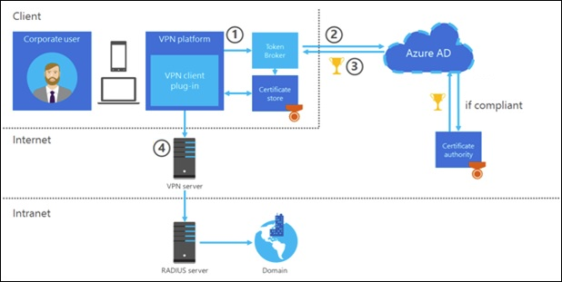

# Conditional Access for Always On VPN

>Applies To: Windows Server (Semi-Annual Channel), Windows Server 2016, Windows Server 2012 R2, Windows 10 RS2 (version) 1703 or later

Conditional access is a capability of Azure Active Directory (AD) that enables you to define conditions under which authorized users can access your apps. With Azure AD, you can easily accomplish multi-factor authentication for users accessing a service when they are off the corporate network. In Azure AD, the VPN server is modeled by an Azure AD cloud application with a new service principal with the DisplayName of **VPN Server**. The VPN Server cloud application is created when you create the first root certificate in the **VPN Connectivity** blade. You can create multiple certificates to handle expiration dates to avoid outages. However, only one certificate can be marked as **primary**. 

After a **primary** certificate is created, you must link a conditional access policy to the **VPN Server** cloud application. By using conditional access policies, you can apply the right access controls under the required conditions. Azure AD conditional access provides you with added security when needed and stays out of your user’s way when it isn’t.

For the Always On VPN clients to request a client access token from the VPN server cloud application, you must deploy [VPNv2 profiles](https://docs.microsoft.com/en-us/windows/client-management/mdm/vpnv2-csp#examples). The VPNv2 profiles are based Open Mobile Alliance (OMA) Device Management (DM),
via Mobile Device Management (MDM).

<!-- 
To configure conditional access for VPN connectivity, you need to complete the following steps:

1.  Configure your VPN server. This step configures root certificates for VPN authentication with Azure AD.

2.  Configure your VPN client.

3.  Configure your conditional access policy.

-->

## Authentiction flow

The authentication process happens when a device compliance-enabled VPN connection profile is triggered either manually or automatically.

Authentication Flow

1.  Always On VPN containing `<DeviceCompliance> <Enabled>true</Enabled>` in the VPNv2 profile tells the VPN client to retrieve the user's Primary Refresh Token (PRT) by issuing a `gettoken()` API call to Web Account Manager (WAM) (aka: Token Broker) service.

2.  The WAM authenticates to Azure AD by making a WebRequest call to the **VPN Server** cloud application in Azure AD in an attempt to get an access token for the user. It does this by providing the PRT and other information about the device that is trying to connect. A device check is performed by Azure AD to determine whether the device complies with the VPN policy.

    | If the device is... | Then...                                                                                                        |
    |---------------------|----------------------------------------------------------------------------------------------------------------|
    | Compliant           | Azure AD requests a token from Azure AD certificate authority.                                                 |
    | NOT compliant       | remediation steps are preformed \@Reviewer, where are these steps and who does them? can the customer do this? |

3.  After Azure AD receives a token from Azure AD certificate authority, Azure pushes a short-lived (1-hour) certificate to the user's certificate store (certmgr.msc) via the WAM. The certificated that is short-lived is signed by the root certificate that was marked as Primary in the **VPN connectivity** blade. The WAM returns control over to the VPN client for further connection processing.

4.  The VPN client retrieves the Azure AD-issued certificate from the user's personal Certificate Store by selecting the certificate containing the `<EKUName>AAD Conditional Access</EKUName>` and `<EKUOID>1.3.6.1.4.1.311.87</EKUOID>` values defined in the section of the VPNv2 profile. The VPN client passes this certificate to the VPN server where it is verified to chain correctly to the 'primary' certificate that was downloaded from the 'VPN connectivity' blade and added to the Trusted Root Certificate Store of the on-premises RADIUS (VPN) server and the Windows 10 clients.

## Features and requirements
Microsoft recommends that you review the design and deployment guides for each of the technologies that are used in the deployment scenario. These guides help you determine whether this deployment scenario provides the services and configuration you need for your organization's network.

>[!IMPORTANT] 
>For this deployment, it is not a requirement that your infrastructure servers, such as computers running Active Directory Domain Services (AD DS), Active Directory  Certificate Services (AD CS), and Network Policy Server (NPS), are running Windows Server 2016. You can use earlier versions of Windows Server, such as Windows Server 2012 R2, for the infrastructure servers and for the server that is running Remote Access.

### Servers
|Requirement  |Description  |
|---------|---------|
|Azure Active Directory (AD) | |
|Azure AD Connect |Syncs user accounts from on-premise to Azure AD. |
|Active Directory Domain Services (AD DS)     |Contains the user accounts, computer accounts, and account properties. These properties are required by Protected Extensible Authentication Protocol (PEAP) to authenticate user credentials and to evaluate authorization for VPN connection requests.        |
|Domain Name System (DNS)     |Hosts the information that enables client computers and servers to resolve IP addresses.         |
|Active Directory Certificate Services (AD CS)     |Allows you to build a public key infrastructure (PKI) and provide public key cryptography, digital certificates, and digital signature capabilities of your organization.          |
|Perimeter network with two firewalls   |Allows the traffic necessary for both VPN and RADIUS communications to function correctly.         |
|Remote Access as a RAS Gateway VPN Server (on\-premise) with two ethernet network adapters and connected to the perimeter network  |Provides centralized administration, configuration, and monitoring of VPN remote access services.         |
|NPS as a RADIUS server on either a new or existing physical server or VM     |Allows you to create and enforce organization-wide network access policies for connection request authentication and authorization. If you have an existing NPS on your network, you can modify it rather than add a new server.  Use ports: UDP 1812 and 1813, or UDP ports 1645 and 1646        |
|Enhanced Key Usage (EKU) | IPSec IKE intermediate (1.3.6.1.5.5.8.2.2) Server Authentication (1.3.6.1.5.5.7.3.1) |

<!-- there's a disconnect in the content -- the above table says that you can use a VM for the VPN server -->
>[!IMPORTANT]
>This guide is designed for deploying Always On VPN with the Remote Access server role on an on\-premises organization network. Do not attempt to deploy Remote Access on a virtual machine \(VM\) in Microsoft Azure. Using Remote Access in Microsoft Azure is not supported, including both Remote Access VPN and DirectAccess. For more information, see [Microsoft server software support for Microsoft Azure virtual machines](https://support.microsoft.com/help/2721672/microsoft-server-software-support-for-microsoft-azure-virtual-machines).

### Clients
The remote client computers must be joined to the Active Directory domain and is running the Windows 10 Anniversary Update version 1607 or later.

### VPNv2 profile
The VPNv2 profile must contain:
- An entry of `<DeviceCompliance> true</Enabled>`, which tells the VPN client to request an Azure AD (AAD) Certificate.
- Gateway enforcement, or VPN client certificate filtering using the `<TLSExtension>`, which contains `<EKUName>AAD Conditional Access</EKUName>` and `<EKUOID>1.3.6.1.4.1.311.87</EKUOID>`. The Object Identifier (OID) filter tells the VPN client which certificate in the user's store should be used.
- The `<TrustedRootCA>5a 89 fe cb 5b 49 a7 0b 1a 52 63 b7 35 ee d7 1c c2 68 be 4b </TrustedRootCA>` entry must contain the Thumbprint of the Root Certificate Authority at the top of the chain of the Server Authentication certificate. Additional root certificates can be added by adding additional `<TrustedRootCA></TrustedRootCA>` entries. If the CA that issued the Server Authentication certificate was an Intermediate authority, this is not the certificate thumbprint to use. It must be the root CA. This should not contain the thumbprint of the cloud root certificates

## Tools
The following tools are an important aspect to the deployment of Conditional Access for Always On VPN:

|Tool  |Description  |
|---------|---------|
|certutil.exe     |For this instance, [certutil](https://docs.microsoft.com/en-us/windows-server/administration/windows-commands/certutil) deploys the VPN certificate created in Azure AD to the NTAuth store of the on-premise Active Directory.         |
|MDMDiagnostics logs     |The MDM Diagnostic Information report shows the applied configuration states of your device including Policy CSPSettings, certificates, configuration sources, and resource information.         |
|Client logs     |         |
|NPS Server Event logs     |         |
|AzureAD or MSOnline PowerShell modules, or Azure CLI     |         |
|LogsMiner / Kusto     |         |
|Microsoft EMS/Intune or [System Center Configuration Manager (SCCM)](vpn-deploy-client-vpn-connections.md#vpn-deploy-client-sccm)    |         |

## Microsoft Online Directory Synchronization (MSODS) objects and attributes
The VPN Server cloud application is created when you create the first root certificate in the VPN Connectivity blade. You can view the service principal that was created in your tenant using the `Get-MsolServicePrincipal -SearchString "VPN Server"` cmdlet.

## Deployment and testing

## Next steps

| If you...      | Then see...            |
|----------------|------------------------------------------------|
| Want to know more about Conditions                                     | [Conditions in Azure Active Directory conditional access](https://docs.microsoft.com/en-us/azure/active-directory/active-directory-conditional-access-conditions)             |
| Want to know more about Access controls                                | [Access controls in Azure Active Directory conditional access](https://docs.microsoft.com/en-us/azure/active-directory/active-directory-conditional-access-controls)          |
| Get experience with configuring conditional access                     | [Get started with Role-Based Access Control in the Azure portal](https://docs.microsoft.com/en-us/azure/active-directory/role-based-access-control-what-is)                   |
| Want to know about the best practices for conditional access policies in your environment | [Best practices for conditional access in Azure Active Directory](https://docs.microsoft.com/en-us/azure/active-directory/active-directory-conditional-access-best-practices) |
| Are ready to configure conditional access policies in your environment |  |
