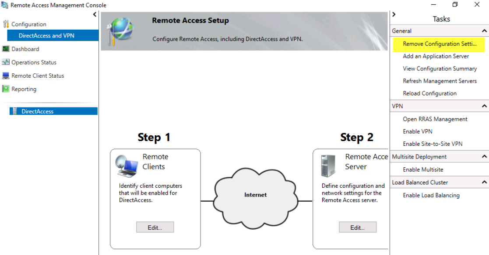

# STEP 9: Migrate from DirectAccess to Always On VPN 

>Applies To: Windows Server (Semi-Annual Channel), Windows Server 2016, Windows 10

Since you are migrating from DirectAccess, you must add a method to identify when a client has received the required certificate and is ready to receive the VPN configuration information. If you do not have a method to identify when a client has received the required certificate, you could deploy the VPN configuration before the certificate has been issued to the user, causing the VPN connection to fail.

As part of the migration process, you run the **GetUsersWithCert.ps1** script to synchronize users who have received the certificate to the VPN Deployment Ready group. Running this script prevents connection failures. Another part of the migration process, you use that security group to target your VPN configuration deployment in System Center Configuration Manager or Intune, which ensures that the managed client does not receive the VPN configuration before it has received the certificate.

## Prerequisites

Before starting the migration process from DirectAccess to Always On VPN, be sure you have divided the migration effort into multiple phases.

## STEP 9.1: Identify users who have received a VPN authentication certificate

As the VPN authentication certificates are issued, and you run the **GetUsersWithCert.ps1** script, the users are added to the VPN Deployment Ready security group.

**Procedure:**

1.  Run the **GetUsersWithCert.ps1** script to add users who are currently issued nonrevoked certificates originating from the specified template name to a specified AD DS security group.<br><br>For example, after running the **GetUsersWithCert.ps1** script, any user issued a valid certificate from the VPN Authentication Certificate template is added to the VPN Deployment Ready group.

>   **GetUsersWithCert.ps1**
    ```powershell
    Import-module ActiveDirectory
    Import-Module AdcsAdministration
    
    $TemplateName = 'VPNUserAuthentication'##Certificate Template Name (not the friendly name)
    $GroupName = 'VPN Deployment Ready' ##Group you will add the users to
    $CSServerName = 'localhost\corp-dc-ca' ##CA Server Information
    
    $users= @()
    $TemplateID = (get-CATemplate | Where-Object {$_.Name -like $TemplateName} | Select-Object oid).oid
    $View = New-Object -ComObject CertificateAuthority.View
    $NULL = $View.OpenConnection($CSServerName)
    $View.SetResultColumnCount(3)
    $i1 = $View.GetColumnIndex($false, "User Principal Name")
    $i2 = $View.GetColumnIndex($false, "Certificate Template")
    $i3 = $View.GetColumnIndex($false, "Revocation Date")
    $i1, $i2, $i3 | %{$View.SetResultColumn($_) }
    $Row= $View.OpenView()
    
    while ($Row.Next() -ne -1){
    $Cert = New-Object PsObject
    $Col = $Row.EnumCertViewColumn()
    [void]$Col.Next()
    do {
    $Cert | Add-Member -MemberType NoteProperty $($Col.GetDisplayName()) -Value $($Col.GetValue(1)) -Force
          }
    until ($Col.Next() -eq -1)
    $col = ''
    
    if($cert."Certificate Template" -eq $TemplateID -and $cert."Revocation Date" -eq $NULL){
       $users= $users+= $cert."User Principal Name"
    $temp = $cert."User Principal Name"
    $user = get-aduser -Filter {UserPrincipalName -eq $temp} –Property UserPrincipalName
    Add-ADGroupMember $GroupName $user
       }
      }
    ```

| If you are using...                 | Then...                                                             |
|-------------------------------------|---------------------------------------------------------------------|
| System Center Configuration Manager | Create a user collection based on that security group's membership. |
| Intune                              | Simply target the security group directly once it is synchronized.<br>  |

2.  Each time you run the **GetUsersWithCert.ps1** configuration script, you must also run an AD DS discovery rule to update the security group membership in SCCM.

3.  Ensure that the membership update for the deployment collection frequently occurs enough (aligned with the script and discovery rule).

>[!NOTE] 
>Incorporating these migration-specific tasks is a critical difference between a simple Always On VPN deployment and migration from DirectAccess to Always On VPN. Be sure to properly define the collection to target the security group rather than using the method in the deployment guide.

## STEP 9.2: Remove devices from the DirectAccess security group

As users receive the authentication certificate and the **VPN_Profile.ps1** configuration script, you see corresponding successful VPN configuration script deployments in either SCCM or Intune.

After each deployment, remove that user's device from the DirectAccess security group so that you can later remove DirectAccess. Both Intune and SCCM contains user device assignment information to help you determine each user's device.

>[!NOTE] 
>If you are applying DirectAccess GPOs through organizational units (OUs) rather than computer groups, move the user's computer object out of the OU.

## STEP 9.3: Decommission the DirectAccess infrastructure

When you have finished migrating all your DirectAccess clients to Always On VPN, you can decommission the DirectAccess infrastructure and remove the DirectAccess settings from Group Policy. Microsoft recommends performing the following steps to remove DirectAccess from your environment gracefully:

1.  **Remove the configuration settings.** Remove the GPOs and the Remote Access Group policy settings Remote Access created by opening the Remote Access Management console and selecting Remove Configuration Settings, as shown in the image below. If you remove the group before you remove the configuration, you will likely get errors.

    

2.  **Remove the DirectAccess security group.** When you have completed the process in this guide, the DirectAccess security group should be empty. As the deployment of Always On VPN continues, remove devices for each user from the DirectAccess security group so that you can remove DirectAccess from your environment. **Do not** remove the security group if it still contains members. If you do remove the security group with members in it, you risk leaving employees without remote access from their devices.

2.  **Clean up DNS.** Be sure to remove any records from your internal DNS server and public DNS server related to DirectAccess, for example, DA.contoso.com, DAGateway.contoso.com.

3.  **Decommission the DirectAccess server.** When you have successfully removed the configuration settings and DNS records, you are ready to tear down the DirectAccess server. To do so, either remove the role in Server Manager or decommission the server and remove it from AD DS.

4.  **Remove any DirectAccess certificates from Active Directory Certificate Services.** If you used computer certificates for your DirectAccess implementation, remove the published templates from the Certificate Templates folder in the Certification Authority console.

## Next steps

You are complete with the Always On VPN deployment. Ensure to test the Always On VPN connections, and if necessary, refer to the Always On VPN Troubleshooting section.