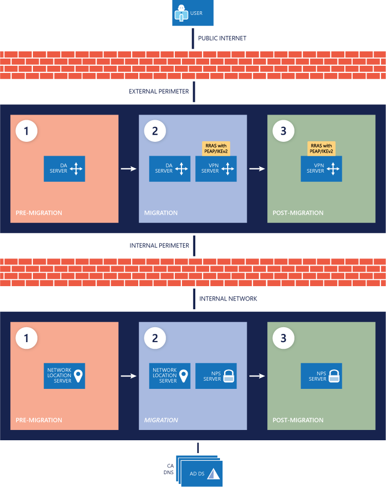

This guide provides instructions for migrating server infrastructure and
connected clients from Microsoft DirectAccess to the Always On Virtual Private
Network (VPN). Always On VPN is a feature of the Windows 10 operating system
that enables the active VPN profile to connect automatically and remain
connected based on triggers such as user sign-in, network state change, or
device screen active. After reading this guide, you will understand the
Microsoft vision for better remote access connectivity to your organization, why
this feature aligns with that vision, and how to migrate from your existing
DirectAccess setup to Always On VPN while maintaining client connectivity
throughout the process.

This guide contains the following sections:

-   About this guide

-   Remote Access Always On VPN migration overview

-   Remote Access Always On VPN migration planning

-   Remote Access Always On VPN migration deployment

About this guide
================

In the past, remote connectivity to the corporate network was primarily limited
to domain-joined machines. Using DirectAccess, companies could manage these
devices by using a persistent network connection that the device initiated,
making the connection seamless for users and providing constant control over the
device. DirectAccess provides a clear value proposition in this use case.

Today, more and more devices remotely connected to the organization are not
domain joined or even company owned. Instead, they’re personal devices employees
use for work, as well, and so present unique access and authentication scenarios
that require a more flexible remote access solution, like Always On VPN. To
maximize user productivity in such a scenario, IT organizations must provide a
remote access solution that’s secure but also flexible enough to meet unique
personal device situations.

This guide introduces you to the new features available in Always On VPN that
make it a viable replacement for DirectAccess, especially for the changing
connected-device landscape. This guide also provides a process you can follow to
migrate machines running Windows 10 from DirectAccess to Always On VPN. Finally,
the guide provides external resources for additional detail.

**Note   **This guide is not a deployment guide for Always On VPN. If you
currently have no VPN technology or are simply looking at implementing Always On
VPN in your environment, see [Remote Access Always On VPN Deployment Guide for
Windows Server and
Windows 10](https://docs.microsoft.com/windows-server/remote/remote-access/vpn/always-on-vpn/deploy/always-on-vpn-deploy).

Remote Access Always On VPN migration overview
==============================================

In previous versions of the Windows VPN architecture, platform limitations made
it difficult to provide critical functionality needed to replace DirectAccess
(like automatic connections initiated before users sign in). Windows 10 VPN,
however, has mitigated most of those limitations or expanded the VPN
functionality beyond the capabilities of DirectAccess. This guide introduces you
to the new functionality available in Windows 10 VPN, how that functionality
addresses the previous gaps between Windows VPNs and DirectAccess, and how to
migrate from DirectAccess to Always On VPN.

The section DirectAccess deployment scenario describes the typical DirectAccess
scenario that’s the starting point for the migration this guide presents. The
section Always On VPN deployment scenario describes the basic DirectAccess
replacement solution using Always On VPN that this guide references. Many
DirectAccess deployment scenarios and options exist, so your implementation will
likely be different from the one described here. If so, use the section Feature
mapping between DirectAccess and Windows 10 VPN to determine the Windows 10 VPN
feature set mapping for your current additions, and then add those features to
your configuration. In addition, you can refer to the section Windows 10 VPN
enhancements to add options to your Always On VPN deployment.

**Note   **This guide describes migrating domain-joined machines from
DirectAccess to Always On VPN. For nondomain-joined devices, there are
additional considerations, such as certificate enrollment. For details, see
[Remote Access Always On VPN Deployment Guide for Windows Server and
Windows 10](https://docs.microsoft.com/windows-server/remote/remote-access/vpn/always-on-vpn/deploy/always-on-vpn-deploy).

DirectAccess deployment scenario
--------------------------------

This guide uses a simple DirectAccess deployment scenario as a starting
reference architecture. You don’t need to match this deployment scenario before
migrating to Always On VPN, but for many organizations, this simple setup is an
accurate representation of their current DirectAccess deployment. Table 1
provides a list of basic features for this setup.

Table 1. Deployment scenario feature list

| **DirectAccess design or deployment feature** | **Typical scenario**                                                                                           |
|-----------------------------------------------|----------------------------------------------------------------------------------------------------------------|
| Deployment scenario                           | Deploy full DirectAccess for client access and remote management                                               |
| Network adapters                              | 2                                                                                                              |
| User authentication                           | Active Directory credentials                                                                                   |
| Use computer certificates                     | Yes                                                                                                            |
| Security groups                               | Yes                                                                                                            |
| Single DirectAccess server                    | Yes                                                                                                            |
| Network topology                              | Network address translation (NAT) behind an edge firewall with two network adapters                            |
| Access mode                                   | End to edge                                                                                                    |
| Tunneling                                     | Split tunnel                                                                                                   |
| Authentication                                | Standard public key infrastructure (PKI) authentication with machine certificate plus Kerberos (not KerbProxy) |
| Protocols                                     | IP over HTTPS (IP-HTTPS)                                                                                       |
| Network location server (NLS) off-box         | Yes                                                                                                            |

Always On VPN deployment scenario
---------------------------------

This guide focuses on migrating a simple DirectAccess environment to a simple
Always On VPN environment. Table 2 provides the features used in this simple
solution. For more detailed information about additional enhancements to the
Windows 10 VPN client, see the section Windows 10 VPN enhancements.

Table 2. Always On VPN features used in the simple environment

| **VPN feature** | **Deployment scenario configuration**                                                                                                     |
|-----------------|-------------------------------------------------------------------------------------------------------------------------------------------|
| Connection type | Native Internet Key Exchange version 2 (IKEv2)                                                                                            |
| Routing         | Split tunneling                                                                                                                           |
| Name resolution | Domain name information list and Domain Name System (DNS) suffix                                                                          |
| Triggering      | Always on and trusted network detection                                                                                                   |
| Authentication  | Protected Extensible Authentication Protocol-Transport Layer Security (PEAP-TLS) with Trusted Platform Module–protected user certificates |

Remote Access Always On VPN migration planning
==============================================

Migrating from DirectAccess to Always On VPN requires proper planning. This
section discusses feature similarities and differences between DirectAccess and
Always On VPN and shows you how to separate users for the migration. It also
provides a high-level look at the DirectAccess–to–Always On VPN migration
process, which consists of three primary components:

-   **Planning.** Planning for Always On VPN includes user phase separation as
    well as infrastructure and functionality planning.

-   **Migration.** Following a specific process to migrate clients helps
    minimize race conditions that arise from performing migration steps out of
    order.

-   **Removal and decommission.** Properly decommission the environment after
    you have migrated everyone off DirectAccess.

After reading this section, you should have a good picture of how your current
DirectAccess feature set maps to Always On VPN and how to migrate your
DirectAccess clients. This section also provides the configuration options
necessary for your VPN configuration script, which you can construct by
following the [Remote Access Always On VPN Deployment Guide for Windows Server
and
Windows 10](https://docs.microsoft.com/windows-server/remote/remote-access/vpn/always-on-vpn/deploy/always-on-vpn-deploy).

Migration process overview
--------------------------

The migration of clients from DirectAccess to Always On VPN should be gradual.
The goal is for users to maintain remote connectivity to the office throughout
the process. If you perform tasks out of order, a race condition may occur,
leaving remote users with no way to access company resources. Therefore,
Microsoft recommends performing a planned, side-by-side migration from
DirectAccess to Always On VPN. Starting with an existing DirectAccess
infrastructure, perform the following high-level steps to complete the
migration:

1.  **Identify your migration phases.** As in most other system migrations,
    target client migrations in phases to help identify any issues before they
    affect the entire organization. The first part of Always On VPN migration is
    no different. The section Build migration rings provides a template for
    separating users into migration phases, and then managing those phases.
    Regardless of the user phase separation method you choose, maintain a single
    VPN Users group for easier management when the migration is complete.

2.  **Review comparable and new features.** Similar to DirectAccess, Always On
    VPN has many security, connectivity, authentication, and other options.
    Start by reviewing the section Feature mapping between DirectAccess and
    Windows 10 VPN to determine how your existing DirectAccess feature set maps
    to Always On VPN. From there, review the section Windows 10 VPN enhancements
    to discover new or improved features that Always On VPN offers to improve
    your configuration.

3.  **Stand up the VPN infrastructure.** When you have determined your migration
    phases and the features you want to include in your deployment, stand up
    your VPN infrastructure. To do so, review [Remote Access Always On VPN
    Deployment Guide for Windows Server and
    Windows 10](https://docs.microsoft.com/windows-server/remote/remote-access/vpn/always-on-vpn/deploy/always-on-vpn-deploy).

4.  **Deploy certificates and the VPN configuration script.** When the new
    infrastructure is ready, create and publish the required certificates. When
    the clients have received the certificates, deploy the VPN configuration
    script. You must ensure that the configuration script comes *after* the
    certificate has been issued so that the VPN client doesn’t attempt to
    connect without it. To do that, you execute a script that adds only those
    users who have enrolled in the certificate to your VPN Deployment Ready
    group, which you use to deploy the Always On VPN configuration. For more
    information about how the Windows client migration process works, see the
    section Windows client migration.

5.  **Remove DirectAccess from clients when they show a successful deployment
    status.** Monitor Microsoft System Center Configuration Manager or Microsoft
    Intune for successful VPN configuration deployments. Then, use reporting to
    determine device-assignment information and discover which device belongs to
    each user. As users are successfully migrated, remove their devices from the
    DirectAccess group so that you can remove DirectAccess.

6.  **Decommission DirectAccess.** When you have successfully migrated all
    clients to Always On VPN, follow the steps in the section Decommission the
    DirectAccess infrastructure to remove DirectAccess from your environment.

For further details about each step in the process, see the section Windows
client migration.

Build migration rings
---------------------

You use migration rings to the Always On VPN client migrations into smaller
chunks. By the time you get to the last phase, your process should be well
tested and consistent.

**Note   **The word *phase* is not intended to indicate that this is a long
process. Whether you move through each phase in a couple of days or a couple of
months, Microsoft recommends that you take advantage of side-by-side migration
and use a phased approach.

-   **Mass outage protection.** By a migration into phases, the number of people
    a migration-generated issue can affect is much smaller.

-   **Process or communication improvement from feedback.** When each phase is
    complete, solicit feedback from those who. Ideally, users didn’t even notice
    that the migration occurred. If their experience was less than optimal,
    however, their feedback give you an opportunity to improve your
    communication plan to include the possibility of whatever occurred or help
    you avoid that issue in the future.

When building your migration rings, keep the following tips in mind:

-   **Identify remote users.** Start by separating users into two buckets: those
    who frequently come into the office and those who don’t. The migration
    process is the same for both groups, but it will likely take longer for the
    remote clients to receive the update than for those who connect more
    frequently. Each migration phase should include members from each bucket.

-   **Prioritize users.** VIP users such as executives are typically among the
    last users to be migrated. When prioritizing users, however, consider their
    business productivity impact if migration of their client computer were to
    fail. For example, if you had a rating of 1 to 3, with 1 meaning that the
    employee would not be able to work and 3 meaning no immediate work
    interruption, a business analyst using only internal line-of-business (LOB)
    apps remotely would be a 1, whereas a salesperson using a cloud app would be
    a 3.

-   **Don’t migrate an entire department at once.** Microsoft strongly
    recommends that you don't migrate an entire department at the same time. If
    an issue should arise, you don’t want it to hinder remote work for the whole
    department. Instead, migrate each department or business unit in at least
    two phases.

-   **Gradually increase user counts.** Most migration scenarios start with
    members of the IT organization and then move to business users followed by
    leadership and other high-impact users. Each migration phase typically
    involves progressively more people. For example, the first phase may include
    10 users, and the final group may include 5,000 users. To simplify the
    deployment, create a single VPN Users security group, and add users to it as
    their phase arrives. In this way, you end up with a single VPN Users group
    to which you can add members in the future.

Standard configuration considerations
-------------------------------------

Windows 10 VPN has many configuration options. When migrating from DirectAccess
to Always On VPN, however, consider starting with configuration options that are
comparable to what you have, and then expand from there. However you choose your
VPN configuration, though, include the following information:

-   **Connection type.** Connection protocol selection is important and
    ultimately goes hand in hand with the type of authentication you’ll use. For
    details about the tunneling protocols available, see [VPN connection
    types](https://docs.microsoft.com/windows/access-protection/vpn/vpn-connection-type).

-   **Routing.** In this context, routing rules determine whether users can use
    other network routes while connected to the VPN. *Split tunneling* allows
    simultaneous access to other networks, such as the internet; *force
    tunneling* requires all traffic to go exclusively through the VPN and does
    not allow simultaneous access to other networks.

-   **Triggering.** *Triggering* determines how and when a VPN connection is
    initiated (for example, when an app opens, when the device is turned on,
    manually by the user). For triggering options, see the section VPN
    connectivity.

-   **Device or user authentication.** DirectAccess uses machine certificates to
    enable devices to initiate the remote connection. This approach results in
    persistent remote network connectivity, with no user action required. Always
    On VPN can also use device certificates and device-initiated connection
    through a feature called *Device Tunnel.* That connection can be initiated
    automatically and will be persistent, resembling a DirectAccess
    infrastructure tunnel connection.

By using user certificates, the Always On VPN client can still connect
automatically, but it does so at the user level (after user sign-in) instead of
at the device level (before user sign-in). The experience is still seamless to
the user, but it supports more advanced authentication mechanisms, like Windows
Hello for Business.

Windows 10 VPN enhancements
---------------------------

Windows 10 VPN has many benefits over the Windows VPN solutions of the past. Key
improvements in integration, security, connectivity, networking control, and
compatibility align Windows 10 VPN with Microsoft’s cloud-first, mobile-first
vision.

Because many of the devices that require remote access are personal devices,
Windows 10 VPN does not require that a device be domain joined. When you migrate
domain-joined devices that use DirectAccess, Always On VPN can provide a single,
cohesive solution for remote access for all your connected devices going
forward, even personally owned devices. , organizations can choose which
management platform they prefer for deploying the Always On VPN configuration
because the configuration service provider (CSP) isn’t vendor specific.

**Note**   For additional details about the advantages of Windows 10 VPN, see
Always On VPN and DirectAccess Features Comparison.

### Platform integration

Windows 10 VPN has improved integration with the Windows operating system and
third-party solutions to provide a robust platform for countless advanced
connection scenarios. Microsoft has introduced or improved the following
integration capabilities in Windows 10 VPN:

-   **Windows Information Protection (WIP).** Integration with WIP allows
    network policy enforcement to determine whether traffic is allowed to go
    over the VPN. If the user profile is active and WIP policies are applied,
    Always On VPN is automatically triggered to connect. , when you use WIP,
    there’s no need to specify AppTriggerList and TrafficFilterList rules
    separately in the VPN profile (unless you want more advanced configuration)
    because the WIP policies and application lists automatically take effect.

-   **Windows Hello for Business.** Windows 10 VPN natively supports Windows
    Hello for Business (in certificate-based authentication mode) to provide a
    seamless single sign-on experience for both sign-in to the machine and
    connection to the VPN. Therefore, no secondary authentication (user name and
    password) is needed for the VPN connection, making it possible to use an
    Always On connection with Windows Hello for Business authentication.

-   **Microsoft Azure conditional access.** The Windows 10 VPN client can
    integrate with the Azure conditional access platform to enforce multifactor
    authentication (MFA), device compliance, or a combination of the two. When
    compliant with conditional access policies, Azure Active Directory
    (Azure AD) issues a short-lived (by default, 60 minutes) IP Security (IPsec)
    authentication certificate that can then be used to authenticate to the VPN
    gateway. Device compliance uses System Center Configuration Manager/Intune
    compliance policies, which can include the device health attestation state
    as part of the connection compliance check.

-   **Azure MFA.** When combined with Remote Authentication Dial-In User Service
    (RADIUS) services and the Network Policy Server (NPS) extension for Azure
    MFA, VPN authentication can use strong MFA.

-   **Third-party VPN plug-in.**

### Security

VPNs create a pinhole connection in your network firewall. Securing that
connection is important, especially when that connection is active most of the
time. Windows 10 VPN has new, advanced security capabilities to restrict the
type of traffic, which applications can use the VPN connection, and which
authentication methods you can use to initiate the connection. The primary
improvements in security are in the following areas:

-   **Traffic filters.** Through traffic filters, you can specify client-side
    policies that determine which traffic is allowed into the corporate network.
    In this way, administrators have the ability to apply app or traffic
    restrictions on the VPN interface, limiting its use to certain sources. Two
    types of filtering rules are available:

-   **App-based rules.** pp-based firewall rules

-   **Traffic-based rules.** Traffic-based firewall rules are based on network
    requirements like ports, addresses, and protocols. Use these rules to
    require that only traffic that matches these specific conditions go over the
    VPN interface.

-   **LockDown VPN.** LockDown VPN secures the device to allow only network
    traffic over the VPN interface and provides a configuration option suitable
    for highly security-conscious organizations.

-   **Per-App VPN.** Per-App VPN is similar to having an app-based traffic
    filter, but it goes farther to combine application triggers with an
    app-based traffic filter so that VPN connectivity is constrained to a
    specific application as opposed to all applications on the VPN client. The
    feature is automatically initiated when the app starts.

-   **Support for customized IPsec cryptography algorithms.** Always On VPN
    supports the use of both RSA and elliptic curve cryptography–based custom
    cryptographic algorithms to meet stringent government or organizational
    security policies.

-   **Native Extensible Authentication Protocol (EAP) support.** Always On VPN
    natively supports EAP, which allows you to use a diverse set of Microsoft
    and third-party EAP types as part of the authentication workflow. EAP
    provides secure authentication based on the following authentication types:

-   User name and password

-   Smart card (both physical and virtual)

-   User or machines certificates

-   Windows Hello for Business

-   One-time password (OTP) or MFA support by way of EAP RADIUS integration

**Note   **Third-party UWP VPN plug-in authentication methods are controlled by
the application vendor, although they have an array of available options,
including custom credential types and OTP support.

### VPN connectivity

Windows 10 has improved connectivity options over previous versions of the
Windows operating system. When comparing DirectAccess to Always On VPN in the
past, this is where DirectAccess often stood out. Until Always On VPN in
Windows 10, the ability to create a persistent connection through either user or
device authentication wasn’t possible. Now, using the Always On feature with or
without Device Tunnel, you can easily configure a persistent connection by using
user or device authentication.

With Always On VPN, the connection type doesn’t have to be exclusively user or
device but can be a combination of both. For example, you could enable device
authentication for remote device management, and then enable user authentication
for connectivity to internal company sites and services. The following are the
primary improvements in Windows 10 VPN connectivity:

-   **Always On.** Always On is a Windows 10 VPN feature that enables the active
    VPN profile to connect automatically and remain connected based on
    triggers—namely, user sign-in, network state change, or device screen
    active. Always On is also integrated into the connected standby experience
    to maximize battery life.

-   **Application triggering.** You can configure VPN profiles in Windows 10 to
    connect automatically on the launch of a specified set of applications. You
    can configure both desktop and UWP applications to trigger a VPN connection.

-   **Name-based triggering.** With Windows 10 VPN, you can define rules so that
    specific domain name queries will trigger the VPN connection. Windows 10 now
    supports name-based triggering for domain-joined and nondomain-joined
    machines (previously, only nondomain-joined machines were supported).

-   **Trusted network detection.** Windows 10 VPN includes this feature to
    ensure that VPN connectivity isn’t triggered if a user is connected to a
    trusted network within the corporate boundary. You can combine this feature
    with any of the triggering methods mentioned earlier to provide a seamless
    “only connect when needed” user experience.

-   **Device Tunnel.** Windows 10 VPN gives you the ability to create a
    dedicated VPN profile for device or machine connectivity independent of the
    typical user-based VPN connection (termed the *User Tunnel*). This tunnel
    allows the VPN to establish connectivity prior to user sign-in and provides
    feature parity with the *Infrastructure Tunnel* concept of DirectAccess. You
    can use traffic filters to control which corporate resources as available
    through the Device Tunnel and when machine certificate authentication is
    employed. Both Device Tunnel and User Tunnel operate independently with
    their own VPN profiles, can be connected at the same time, and can use
    different authentication methods and other VPN configuration settings as
    appropriate.

### Networking

Microsoft added advanced networking capabilities to Windows 10 VPN to allow
administrators to specify routing policies at a more granular level—even down to
the individual application—which is perfect for LOB apps that require special
remote access. Windows 10 VPN is also fully compatible with both Internet
Protocol version 4 (IPv4) and version 6 (IPv6). Unlike DirectAccess, there is no
specific dependency on IPv6. The following are some of the networking
improvements in Windows 10 VPN:

-   **Dual-stack support for IPv4 and IPv6.** Windows 10 VPN natively supports
    the use of both IPv4 and IPv6 in a dual-stack approach. It has no specific
    dependency on one protocol over the other, which allows for maximum
    IPv4/IPv6 application compatibility combined with support for future IPv6
    networking needs.

-   **Application-specific routing policies.** In addition to defining global
    VPN connection routing policies for internet and intranet traffic
    separation, it’s possible to add routing policies to control the use of
    split tunnel or force tunnel configurations on a per-application basis. This
    option gives you more granular control over which apps are allowed to
    interact with which resources through the VPN tunnel.

-   **Exclusion routes.** Windows 10 VPN supports the ability to specify
    exclusion routes that specifically control routing behavior to define which
    traffic should traverse the VPN only and not go over the physical network
    interface.

### Configuration and compatibility

You can deploy and manage Always On VPN in several ways, which gives Windows 10
VPN several advantages over other VPN client software that may require advanced
software packaging and deployment, end user involvement in the configuration, or
simply lack features like Always On or Device Tunnel. As long as the standard
protocols and authentication mechanisms work with the additional gateways, you
can use the features of Windows 10 VPN without having to set up a Windows 10 VPN
server infrastructure. The following are some of the configuration and
compatibility improvements in Windows 10 VPN:

-   **Third-party VPN gateway compatibility.** The Windows 10 VPN client does
    not require the use of a Microsoft-based VPN gateway to operate. Through the
    support of the IKEv2 protocol, the client facilitates interoperability with
    third-party VPN gateways that support this industry-standard tunneling type.
    Windows 10 VPN also has backward-compatibility with Secure Socket Tunneling
    Protocol (SSTP), Layer 2 Tunneling Protocol/IPsec, and Point-to-Point
    Tunneling Protocol. You can also achieve interoperability with third-party
    VPN gateways by using a UWP VPN plug-in combined with a custom tunneling
    type without sacrificing Windows 10 VPN platform features and benefits.

-   **Industry-standard IKEv2 VPN protocol support.** The Windows 10 VPN client
    supports IKEv2, one of today’s most widely used industry-standard tunneling
    protocols. This compatibility maximizes interoperability with third-party
    VPN gateways.

-   **Platform support.** Windows 10 VPN supports domain-joined,
    nondomain-joined (workgroup), or Azure AD–joined devices to allow for both
    enterprise and bring your own device (BYOD) scenarios. In addition, Windows
    10 VPN is available in all Windows editions.

-   **Diverse management and deployment mechanisms.** You can use many
    management and deployment mechanisms to manage VPN settings (called a *VPN
    profile*), including Windows PowerShell, System Center Configuration
    Manager, Intune (or a third-party mobile device management [MDM] tool), and
    Windows Configuration Designer. These options simplify the configuration of
    Windows 10 VPN regardless of the client management tools you use.

-   **Standardized VPN profile definition.** Windows 10 VPN supports
    configuration by means of a standard XML profile (ProfileXML.xml), providing
    a standard configuration template format that most management and deployment
    toolsets use.

Feature mapping between DirectAccess and Windows 10 VPN
-------------------------------------------------------

This section covers specific DirectAccess features and scenarios and shows how
they translate to Always On VPN. This list isn’t exhaustive, but it does include
some of the most common features and functions of DirectAccess. The features and
scenarios discussed fall into three categories:

-   **Equivalent functionality.** These are scenarios and features used in
    DirectAccess that have a directly related capability in Windows 10 VPN.
    Where possible, this guide provides the CSP parameter for configuring each
    option so that you’re aware of the XML setting name.

-   **Improved functionality.** These are situations or scenarios in which
    Windows 10 VPN provides improved functionality over DirectAccess or fills a
    gap in functionality. Where possible, this guide provides the CSP parameter
    for configuring each option so that you’re aware of the XML setting name.

-   **Limited comparable functionality.** In a few situations, Windows 10 VPN
    requires an alternate way to incorporate existing functionality. This
    section discusses those changes and how you can gain the functionality with
    Windows 10 VPN.

**Note**   For additional details about the feature comparison between
DirectAccess and Windows 10 VPN, see [Always On VPN and DirectAccess Features
Comparison](https://docs.microsoft.com/windows-server/remote/remote-access/vpn/vpn-map-da).

### Equivalent functionality

Each item in this section is a use case scenario or commonly used DirectAccess
feature for which Windows 10 VPN has an equivalent. The DirectAccess
functionality is in bold, followed by an explanation of how Windows 10 VPN
achieves the equivalent functionality:

-   **Seamless, transparent connectivity to the corporate network.** You can
    configure Windows 10 VPN to support auto-triggering based on application
    launch or namespace resolution requests; you can also set it for permanent
    connection through Always On VPN.

    **Note   **Define this functionality by using the following VPNv2 CSP
    parameters:

    VPNv2/ProfileName/AlwaysOn

    VPNv2/ProfileName/AppTriggerList

    VPNv2/ProfileName/DomainNameInformationList/AutoTrigger

-   **Use of a dedicated Infrastructure Tunnel to provide connectivity to the
    corporate network when the user is not signed in.** You can achieve this
    functionality by using the Device Tunnel (prelogon) feature in the VPN
    profile.

    **Note   **Define this functionality by using the following VPNv2 CSP
    parameter:

    VPNv2/ProfileName/DeviceTunnel

-   **Use of manage-out to allow remote connectivity to DirectAccess-connected
    clients from management clients located on the corporate network.** You can
    achieve this functionality by using the Device Tunnel (prelogon) feature in
    the VPN profile combined with configuring the VPN connection to dynamically
    register the IP addresses assigned to the VPN interface with internal DNS
    services.

    **Note   **Define this functionality by using the following VPNv2 CSP
    parameter:

    VPNv2/ProfileName/DeviceTunnel

>   VPNv2/ProfileName/RegisterDNS

-   **Fall back to IP-HTTPS when DirectAccess clients are behind firewalls or
    proxy servers.** You can configure Windows 10 VPN to fall back to SSTP (from
    IKEv2) by using the automatic tunnel/protocol type within the VPN profile.

    **Note   **Define this functionality by using the following VPNv2 CSP
    parameter:

    VPNv2/ProfileName/NativeProfile/NativeProtocolType

-   **Support for DirectAccess end-to-edge access mode.** Windows 10 VPN
    provides connectivity to corporate resources by using tunnel policies that
    require authentication and encryption until they reach the VPN gateway. By
    default, the tunnel sessions are terminated at the VPN gateway, which also
    functions as the IKEv2 gateway, providing end-to-edge security.

-   **Support for limited access to specific application servers using
    DirectAccess end-to-end access mode.** DirectAccess provides the ability to
    extend end-to-edge IPsec policies all the way to specified application
    servers. You can configure similar capability in Windows 10 VPN by using an
    IPsec transport policy tunneled inside the end-to-edge VPN tunnel. The VPN
    gateway then forwards the authenticated and traffic-protected IPsec sessions
    to the application servers. In addition, you can employ traffic filters to
    limit connectivity to specific destinations across the Windows 10 VPN
    connection, providing end-to-end security to specific servers.

-   **Support for load balancing using Windows Network Load Balancing (NLB) or
    external load balancers.** Windows 10 VPN supports the use of integrated
    Windows NLB or third-party hardware load-balancing solutions to provide VPN
    load-balancing capabilities. Both IKEv2 and SSTP tunnel types/protocols can
    be successfully load balanced.

-   **Support for machine certificate authentication.** The IKEv2 protocol type
    available as part of the Windows 10 VPN platform specifically supports the
    use of authentication by machine or computer certificates for VPN
    authentication.

    **Note   **Define this functionality by using the following VPNv2 CSP
    parameter:

    VPNv2/ProfileName/NativeProfile/Authentication/MachineMethod

-   **Use DirectAccess security groups to limit remote access functionality to
    specific clients.** You can configure Windows 10 VPN to support granular
    authorization when using RADIUS, which includes the use of security groups
    to control VPN access.

-   **Support for DirectAccess servers behind an** edge **firewall or NAT
    device.** Windows 10 VPN gives you the ability to use protocols like IKEv2
    and SSTP that fully support the use of a VPN gateway that is behind a NAT
    device or edge firewall.

-   **Use of NLS to determine intranet connectivity when connected to the
    corporate network.** Trusted network detection provides a similar capability
    to DirectAccess NLS for detecting corporate network connections, but it’s
    based on assessment of the connection-specific DNS suffix assigned to
    network interfaces rather than depending on a web service probe mechanism
    and associated internal web server infrastructure to function.

    **Note   **Define this functionality by using the following VPNv2 CSP
    parameter:

    VPNv2/ProfileName/TrustedNetworkDetection

-   **DirectAccess compliance using Network Access Protection (NAP).** The
    Windows 10 VPN client can integrate with Azure conditional access to enforce
    MFA, device compliance, or a combination of both. When compliant with
    conditional access policies, Azure AD issues a short-lived (by default,
    60 minutes) IPsec authentication certificate that the client can then use to
    authenticate to the VPN gateway. Device compliance takes advantage of System
    Center Configuration Manager/Intune compliance policies, which have the
    ability to include the device health attestation state.

    At this time, Azure VPN conditional access provides the closest replacement
    to the existing NAP solution, although there is no form of remediation
    service or quarantine network capabilities.

    **Note   **Define this functionality by using the following VPNv2 CSP
    parameter:

    VPNv2/ProfileName/DeviceCompliance

-   **Ability to define which management servers are accessible prior to user
    sign-in.** You can achieve this functionality in Windows 10 VPN by using the
    Device Tunnel feature (available in version 1709) in the VPN profile
    combined with traffic filters to control which management systems on the
    corporate network are accessible through the Device Tunnel.

    **Note   **Define this functionality by using the following VPNv2 CSP
    parameters:

    VPNv2/ProfileName/DeviceTunnel

    VPNv2/ProfileName/TrafficFilterList

-   **Monitoring of DirectAccess operational status.** Although not strictly
    specific to Windows 10 VPN, the Windows Server 2016 Remote Access Management
    console natively provides the operational status of VPN services.

-   **Monitoring of DirectAccess remote access client status.** Although not
    strictly specific to the Windows 10 VPN, the Windows Server 2016 Remote
    Access Management console natively provides the connection status of
    Windows 10 VPN clients.

-   **Use of Inbox or RADIUS accounting for reporting of DirectAccess
    connections.** Although not strictly specific to Windows 10 VPN, the Windows
    Server 2016 Remote Access Management console natively provides reporting for
    Windows 10 VPN clients.

### Improved functionality

Each item in this section is a use case scenario or commonly used DirectAccess
function for which Windows 10 VPN has improved functionality—either through an
expansion of functionality or elimination of a previous limitation. The
DirectAccess functionality is in bold, followed by an explanation of how
Microsoft has improved the equivalent functionality in Windows 10 VPN:

-   **Requirement for domain-joined devices with Enterprise SKUs.** Windows 10
    VPN supports domain-joined, nondomain-joined (workgroup), or Azure AD–joined
    devices to allow for both enterprise and BYOD scenarios. Windows 10 VPN is
    available in all Windows editions, and the platform features are available
    to third parties by way of UWP VPN plug-in support.

-   **DirectAccess clients depend on IPv6 and associated IPv6 translation
    services to function.** With Windows 10 VPN, users can access both IPv4 and
    IPv6 resources on the corporate network. The Windows 10 VPN client uses a
    dual-stack approach that doesn’t specifically depend on IPv6 or the need for
    the VPN gateway to provide NAT64 or DNS64 translation services.

-   **Support for two-factor or OTP authentication.** The Windows 10 VPN
    platform natively supports EAP, which allows for the use of diverse
    Microsoft and third-party EAP types as part of the authentication workflow.
    Windows 10 VPN specifically supports smart card (both physical and virtual)
    and Windows Hello for Business certificates to satisfy two-factor
    authentication requirements. In addition, Windows 10 VPN supports OTP and
    MFA by way of EAP RADIUS integration.

    **Note   **Define this functionality by using the following VPNv2 CSP
    parameter:

    VPNv2/ProfileName/NativeProfile/Authentication

-   **Support for multiple domains and forests.** The Windows 10 VPN platform
    has no dependency on Active Directory Domain Services (AD DS) forests or
    domain topology (or associated functional/schema levels) because it doesn’t
    require the VPN client to be domain joined to function. Group Policy is
    therefore not a dependency to define VPN profile settings because you don’t
    use it during client configuration. Where Active Directory authorization
    integration is required, you can achieve it through RADIUS as part of the
    EAP authentication and authorization process.

-   **Support for both split and force tunnel for internet/intranet traffic
    separation.** You can configure Windows 10 VPN to support both force tunnel
    (the default operating mode) and split tunnel natively. Windows 10 VPN
    provides additional granularity for application-specific routing policies.

    **Note   **Define this functionality by using the following VPNv2 CSP
    parameters:

    VPNv2/ProfileName/NativeProfile/RoutingPolicyType

    VPNv2/ProfileName/TrafficFilterList/App/RoutingPolicyType

-   **Support for IP-HTTPS transition technology.** Windows 10 VPN does not
    require the use of an IPv6 encapsulation protocol like IP-HTTPS. You can
    configure it to support SSTP natively if Secure Sockets Layer fallback from
    IKEv2 is required.

-   **Support for the DirectAccess Connectivity Assistant to provide corporate
    connectivity status.** Windows 10 VPN is fully integrated with the native
    Network Connectivity Assistant and provides connectivity status from the
    View All Networks interface. With the advent of Windows 10 Creators Update
    (version 1703), VPN connection status and VPN connection control are now
    available through the Network flyout, as well.

-   **Name resolution of corporate resources using short-name, fully qualified
    domain name (FQDN), and DNS suffix.** Windows 10 VPN can natively define one
    or more DNS suffixes as part of the VPN connection and IP address assignment
    process, including corporate resource name resolution for short names,
    FQDNs, or entire DNS namespaces. Windows 10 VPN also supports use of Name
    Resolution Policy Tables to provide namespace-specific resolution
    granularity.

    **Note   **Define this functionality by using the following VPNv2 CSP
    parameters:

    VPNv2/ProfileName/DnsSuffix

    VPNv2/ProfileName/DomainNameInformationList

### Limited comparable functionality

Each item in this section is a use case scenario or commonly used DirectAccess
function for which Windows 10 VPN does not have an equivalent natively.
Fortunately, you can implement this functionality in other ways. The
DirectAccess functionality is in bold, followed by an explanation of how you can
use add-ons to achieve the same functionality in Windows 10 VPN:

-   **Use of multisite to provide multiple remote access entry points and
    geo-redundancy.** No native multisite-equivalent feature exists in
    Windows 10 VPN without the use of third-party networking equipment or
    services such as Azure Traffic Manager or a third-party global server load
    balancer. However, users can manually select an appropriate VPN endpoint if
    you define multiple entries in the VPN profile. Third-Party UWP VPN plug-ins
    may support similar features for connecting to the nearest or most
    appropriate server VPN endpoint, but this will vary by provider.

-   **Deployment of client and server configuration settings through Group
    Policy.** Windows 10 VPN does not require devices to be domain joined, so
    there are no dedicated Group Policy settings to configure it. Instead, you
    configure clients by using Windows PowerShell, System Center Configuration
    Manager, Intune (or a third-party MDM provider), or Windows Configuration
    Designer. Also, because there’s no dependency on a Microsoft VPN gateway,
    you must configure and manage server settings independent of the Windows 10
    VPN.

Remote Access Always On VPN migration deployment
================================================

Before starting the migration process from DirectAccess to Windows 10 VPN, be
sure to review the section Remote Access Always On VPN migration planning for
migration phase creation, feature information, and considerations. This section
is not a step-by-step deployment guide for Windows 10 VPN but rather is intended
to complement the [Remote Access Always On VPN Deployment Guide for Windows
Server and
Windows 10](https://docs.microsoft.com/windows-server/remote/remote-access/vpn/always-on-vpn/deploy/always-on-vpn-deploy)
and provide migration-specific deployment guidance.

Deploy a side-by-side VPN infrastructure
----------------------------------------

You will be deploying the VPN infrastructure side by side with the existing
DirectAccess infrastructure, so follow the instructions in [Remote Access Always
On VPN Deployment Guide for Windows Server and
Windows 10](https://docs.microsoft.com/windows-server/remote/remote-access/vpn/always-on-vpn/deploy/always-on-vpn-deploy)
to install and configure the Windows 10 VPN infrastructure. Side-by-side
deployment consists of the following high-level tasks:

1.  Create the VPN Users, VPN Servers, and NPS Servers groups.

2.  Create and publish the necessary certificate templates.

3.  Enroll the server certificates.

4.  Install and configure Remote Access Service for Always On VPN.

5.  Install and configure NPS.

6.  Configure DNS and firewall rules for Windows 10 VPN.

Figure 1 provides a visual reference for the infrastructure changes throughout
the DirectAccess-to–Windows 10 VPN migration.

Figure 1. The DirectAccess-to–Windows 10 VPN migration infrastructure

Windows client migration
------------------------

You can find the bulk of the VPN client configuration documentation in the
[Remote Access Always On VPN Deployment Guide for Windows Server and
Windows 10](https://docs.microsoft.com/windows-server/remote/remote-access/vpn/always-on-vpn/deploy/always-on-vpn-deploy).
Most steps in this section reference the deployment guide, but a few steps
discuss specific additions when migrating Windows clients from DirectAccess to
Windows 10 VPN.

**Note   **Microsoft recommends that you test this process before performing it
on any of your user migration rings.

1.  **Create and publish the VPN certificate, and enable the auto-enrollment
    Group Policy object (GPO).** For traditional, certificate-based Windows 10
    VPN deployments, a certificate is issued to either the device or the user so
    that it can authenticate the connection. When the new authentication
    certificate is created and published for auto-enrollment, you must create
    and deploy a GPO with the auto-enrollment setting configured to the VPN
    Users group. For the steps to configure certificates and auto-enrolment, see
    the [Remote Access Always On VPN Deployment Guide for Windows Server and
    Windows 10](https://docs.microsoft.com/windows-server/remote/remote-access/vpn/always-on-vpn/deploy/always-on-vpn-deploy).

2.  **Add users to the VPN Users group.** Add whichever users you will migrate
    to the VPN Users group. Those users will stay in that security group after
    you have migrated them so that they can receive any certificate updates in
    the future. You will continue to add users to this group until you have
    moved every user from DirectAccess to Windows 10 VPN.

3.  **Identify users who have received a VPN authentication certificate.**
    You’re migrating from DirectAccess, so you’ll need to add a method for
    identifying when a client has received the required certificate and is ready
    to receive the VPN configuration information. Without this step, you could
    deploy the VPN configuration before the certificate has been issued to the
    user, causing the VPN connection to fail. To avoid this situation, run the
    script in Listing 1 manually on the certification authority or on a schedule
    to synchronize users who have received the certificate to the VPN Deployment
    Ready group. You will then use that security group to target your VPN
    configuration deployment in System Center Configuration Manager or Intune,
    which ensures that the managed client doesn’t receive the VPN configuration
    before it has received the certificate.

    **Note   **Listing 1 adds the users who are currently issued nonrevoked
    certificates originating from the specified template name to a specified
    AD DS security group. For example, after running this script, any user
    issued a valid certificate from the VPN Authentication Certificate template
    will be added to the VPN Deployment Ready group.

>   List 1. GetUsersWithCert.ps1

>   Import-module ActiveDirectory

>   Import-Module AdcsAdministration

>   \$TemplateName = 'VPNUserAuthentication'\#\#Certificate Template Name (not
>   the friendly name)

>   \$GroupName = 'VPN Deployment Ready' \#\#Group you will add the users to

>   \$CSServerName = 'localhost\\corp-dc-ca' \#\#CA Server Information

>   \$users= \@()

>   \$TemplateID = (get-CATemplate \| Where-Object {\$_.Name -like
>   \$TemplateName} \| Select-Object oid).oid

>   \$View = New-Object -ComObject CertificateAuthority.View

>   \$NULL = \$View.OpenConnection(\$CSServerName)

>   \$View.SetResultColumnCount(3)

>   \$i1 = \$View.GetColumnIndex(\$false, "User Principal Name")

>   \$i2 = \$View.GetColumnIndex(\$false, "Certificate Template")

>   \$i3 = \$View.GetColumnIndex(\$false, "Revocation Date")

>   \$i1, \$i2, \$i3 \| %{\$View.SetResultColumn(\$_) }

>   \$Row= \$View.OpenView()

>   while (\$Row.Next() -ne -1){

>   \$Cert = New-Object PsObject

>   \$Col = \$Row.EnumCertViewColumn()

>   [void]\$Col.Next()

>   do {

>   \$Cert \| Add-Member -MemberType NoteProperty \$(\$Col.GetDisplayName())
>   -Value \$(\$Col.GetValue(1)) -Force

>   }

>   until (\$Col.Next() -eq -1)

>   \$col = ''

>   if(\$cert."Certificate Template" -eq \$TemplateID -and \$cert."Revocation
>   Date" -eq \$NULL){

>   \$users= \$users+= \$cert."User Principal Name"

>   \$temp = \$cert."User Principal Name"

>   \$user = get-aduser -Filter {UserPrincipalName -eq \$temp} –Property
>   UserPrincipalName

>   Add-ADGroupMember \$GroupName \$user

>   }

>   }

1.  **Deploy the Windows 10 VPN configuration.** As the VPN authentication
    certificates are issued and you run the script in Listing 1, the users will
    be added to the VPN Deployment Ready security group. If you’re using System
    Center Configuration Manager to deploy the Windows 10 VPN configuration
    script, create a user collection based on that security group’s membership,
    as shown in Figure 2.

    

>   Figure 2. Collection criteria for security group membership

**Note   **Each time you run the script in Listing 1, you must also run an AD DS
discovery rule to update the security group membership in System Center
Configuration Manager. Also, ensure that the membership update for the
deployment collection occurs frequently enough (aligned with the script and
discovery rule).

If you’re using Intune, simply target the security group directly once it’s
synchronized. For additional information about using System Center Configuration
Manager or Intune to deploy Windows 10 VPN to Windows clients, see [Remote
Access Always On VPN Deployment Guide for Windows Server and
Windows 10](https://docs.microsoft.com/windows-server/remote/remote-access/vpn/always-on-vpn/deploy/always-on-vpn-deploy).
Be sure, however, to incorporate these migration-specific tasks.

**Note   **This is a critical difference between a simple Windows 10 VPN
deployment and a migration from DirectAccess to Always On VPN. Be sure to
properly define the collection to target the security group rather than using
the method in the deployment guide.

1.  **Remove devices from the DirectAccess security group.** As users receive
    the authentication certificate and VPN configuration script, you will see
    corresponding successful VPN configuration script deployments in either
    System Center Configuration Manager or Intune. Following each deployment,
    remove that user’s device from the DirectAccess group so that you can later
    remove DirectAccess. Both Intune and System Center Configuration Manager
    contain user device assignment information to help you determine each user’s
    device.

    **Note   **If you are applying DirectAccess GPOs through organizational
    units (OUs) rather than computer groups, simply move the user’s computer
    object out of the OU.

Decommission the DirectAccess infrastructure
--------------------------------------------

When you have finished migrating all your DirectAccess clients to Windows 10
VPN, you can decommission the DirectAccess infrastructure and remove the
DirectAccess settings from Group Policy. Microsoft recommends performing the
following steps to gracefully remove DirectAccess from your environment:

1.  **Remove the configuration settings.** When you have removed the
    DirectAccess security group, remove the GPOs and the Remote Access Group
    policy settings Remote Access created by opening the Remote Access
    Management console and selecting Remove Configuration Settings, as shown in
    Figure 3.

    

>   Figure 3. Remove Configuration Settings

1.  **Remove the DirectAccess group.** When you have completed the process in
    this guide, the DirectAccess security group should be empty. As the
    deployment of Windows 10 VPN continues, people should be removed from this
    group (as mentioned in the Migration process overview and Windows client
    migration sections). **Do not** remove the security group if still contains
    members. If you do, you risk leaving employees without remote access from
    their device.

2.  **Clean up DNS.** Be sure to remove any records from your internal DNS
    server and public DNS server related to DirectAccess (e.g., DA.contoso.com,
    DAGateway.contoso.com).

3.  **Decommission the DirectAccess server.** When you have successfully removed
    the configuration settings and DNS records, you’re ready to tear down the
    DirectAccess server. To do so, either remove the role in Server Manager or
    decommission the server and remove it from AD DS.

4.  **Remove any DirectAccess certificates from Active Directory Certificate
    Services.** If you used computer certificates for your DirectAccess
    implementation, remove the published templates from the Certificate
    Templates folder in the Certification Authority console.
