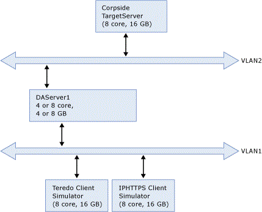
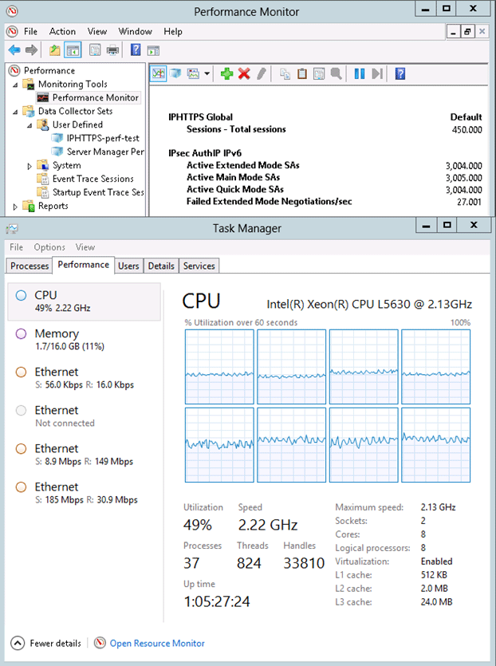

# DirectAccess Capacity Planning

>Applies To: Windows Server (Semi-Annual Channel), Windows Server 2016

This document is a report on Windows Server 2012 DirectAccess server performance. Testing was performed to determine throughput capacity using high-end computer hardware and low-end computer hardware. High and low-end CPU performance was dependent on the network traffic throughput and the types of clients used. A typical DirectAccess deployment (and the basis for these tests) consists of 1/3 (30%) IPHTTPS clients, and 2/3 (70%) Teredo clients. Teredo clients outperform IPHTTPS clients in part because Windows Server 2012 utilizes Receive Side Scaling (RSS) which allows use of all CPU cores. In these tests, since RSS is enabled, Hyper threading is disabled. In addition, TCP/IP in Windows Server 2012 supports UDP traffic allowing Teredo clients to load balance across CPUs.  
  
Data was collected from both a low-end (4 core, 4 Gig) server, and from hardware which is expected to be a more typical in a high-end (8 core, 8 Gig) server.  Below is a screen shot of the new Windows 8 task manager on low-end hardware with 750 clients (562 Teredo, 188 IPHTTPS) running ~77 Mbits/sec. This is to simulate users who do not present smart card credentials.  
  
These test results indicate that Teredo performs better than IPHTTPS in Windows 8, but that both Teredo and IPHTTPS bandwidth usage has improved when compared to Windows 7.  
  
  
  
## High-end hardware test environment  
The following chart shows the results of the high-end hardware performance test environment. All test results and analysis are detailed in this document.  
  
||||  
|-|-|-|  
|Configuration - Hardware|Low-end  Hardware (4GB ram, 4 core)|High-end Hardware (8 GB, 8 core)|  
|Double Tunnel  -   PKI  -   Including DNS64/NAT64|750 concurrent connections at 50% CPU, 50 % Memory with Corpnet NIC throughput 75 Mbps. Stretch target is 1000 users @ 50% CPU.|1500 concurrent connections at 50% CPU, 50 % Memory with Corpnet NIC throughput 150 Mbps.|  
## Test Environment

**Perf Bench Topology**  
  
  
  
The performance test environment is a 5 machine bench. For the low-end test, one 4-core 4 Gig DirectAccess server was used and for the high-end hardware test, one 8-core, 16 Gig DirectAccess server was used. For low-end and high-end test environments the following was used: one Back end Server (the sender), and two client computers (the receivers).  Receivers are split among the two client computers. Otherwise, the receivers would be CPU bound and limit the number of clients and bandwidth. On the receiving side a simulator to simulate hundreds of clients (either HTTPS or Teredo clients are simulated). IPsec, DOSp are both configured. RSS is enabled on the DirectAccess server. RSS queue size is set to 8.  Without configuring RSS, a single processor will get pegged at a high utilization while the other cores are underutilized. Also of note is that the DirectAccess server is a 4 core machine with hyper threading turned off.  Hyper threading is off because RSS only works on physical cores and use of hyper threading produces skewed results. (This means that not all the cores will be uniformly loaded).  
  
## Testing results for low-end hardware:

Testing was performed both with 1000 & with 750 clients.  In all cases traffic split was 70% Teredo and 30% IPHTTPS.  All tests involved TCP traffic over Nat64 using 2 IPsec tunnels per client.  In all tests, memory utilization was light and CPU utilization was acceptable.  
  
**Individual Test Results:**  
  
The following sections describe individual tests. Each section title highlights the key elements of each test followed by a summary description of the results and then a chart showing the detailed results data.  
  
**Low-end Perf:  750 clients, 70/30 split, 84.17 Mbits/sec throughput:**  
  
The following three tests represent low-end hardware.  In the below test runs, there were 750 clients with a throughput of 84.17 Mbits/sec and a traffic split of 562 Teredo and 188 IPHTTPS. Teredo MTU was set to 1472, and Teredo Shunt was enabled. CPU utilization averaged 46.42% across the three tests, and average memory utilization, expressed as a percentage of committed bytes of the total available memory of 4Gb, was 25.95%.  
  
||||||||  
|-|-|-|-|-|-|-|  
|**Scenario**|**CPUAvg (from counter)**|**Mbit/s (Corp Side)**|**Mbit/s (internet Side)**|**Active QMSA**|**Active MMSA**|**Mem Utilization (4 Gig system)**|  
|**Low-end HW.  562 Teredo clients.  188  IPHTTPS clients.**|47.7472542|84.3|119.13|1502.05|1502.1|26.27%|  
|**Low-end HW.  562 Teredo clients.  188  IPHTTPS clients.**|46.3889778|84.146|118.73|1501.25|1501.2|25.90%|  
|**Low-end HW.  562 Teredo clients.  188  IPHTTPS clients.**|45.113082|84.0494|118.43|1546.14|1546.1|25.68%|  
  
**1000 clients, 70/30 split, 78 Mbits/sec throughput:**  
  
The following three tests represent performance on low-end hardware. In the test runs below, there were 1000 clients with an average throughput of ~78.64 Mbits/sec and a traffic split of 700 Teredo and 300 IPHTTPS.  Teredo MTU was set to 1472 and Teredo Shunt was enabled.  CPU utilization averaged ~50.7%, and average memory utilization, expressed as a percentage of committed bytes of the total available memory of 4Gb, was ~28.7%.  
  
||||||||  
|-|-|-|-|-|-|-|  
|**Scenario**|**CPUAvg (from counter)**|**Mbit/s (Corp Side)**|**Mbit/s (internet Side)**|**Active QMSA**|**Active MMSA**|**Mem Utilization (4 Gig system)**|  
|**Low-end HW.  700 Teredo clients.  300 IPHTTPS clients.**|51.28406247|78.6432|113.19|2002.42|1502.1|25.59%|  
|**Low-end HW.  700 Teredo clients.  300 IPHTTPS clients.**|51.06993128|78.6402|113.22|2001.4|1501.2|30.87%|  
|**Low-end HW.  700 Teredo clients.  300 IPHTTPS clients.**|49.75235617|78.6387|113.2|2002.6|1546.1|30.66%|  
  
**1000 clients, 70/30 split, 109 Mbits/sec throughput:**  
  
In the following three test runs there were 1000 clients with an average throughput of ~109.2 Mbits/sec and a traffic split of 700 Teredo and 300 IPHTTPS. Teredo MTU was set to 1472 and Teredo Shunt was enabled. CPU utilization averaged ~59.06% across the three tests, and average memory utilization, expressed as a percentage of committed bytes of the total available memory of 4Gb, was ~27.34%.  
  
||||||||  
|-|-|-|-|-|-|-|  
|**Scenario**|**CPUAvg (from counter)**|**Mbit/s (Corp Side)**|**Mbit/s (internet Side)**|**Active QMSA**|**Active MMSA**|**Mem Utilization (4 Gig system)**|  
|**Low-end HW.  700 Teredo clients.  300 IPHTTPS clients.**|59.81640675|108.305|153.14|2001.64|2001.6|24.38%|  
|**Low-end HW.  700 Teredo clients.  300 IPHTTPS clients.**|59.46473798|110.969|157.53|2005.22|2005.2|28.72%|  
|**Low-end HW.  700 Teredo clients.  300 IPHTTPS clients.**|57.89089768|108.305|153.14|1999.53|2018.3|24.38%|  
  
## Testing results for high-end hardware:  
Testing was performed with 1500 clients. Traffic split was 70% Teredo and 30% IPHTTPS. All tests involved TCP traffic over Nat64 using 2 IPsec tunnels per client. In all tests, memory utilization was light and CPU utilization was acceptable.  
  
**Individual Test Results:**  
  
The following sections describe individual tests. Each section title highlights the key elements of each test followed by a summary description of the results and then a chart containing the detailed results data.  
  
**1500 clients, 70/30 split, 153.2 Mbits/sec throughput**  
  
The following five tests represent high-end hardware. In the below test runs there were 1500 clients with an average throughput of 153.2 Mbits/sec and a traffic split of 1050 Teredo and 450 IPHTTPS. CPU utilization averaged 50.68% across the five tests, and average memory utilization, expressed as a percentage of committed bytes of the total available memory of 8Gb, was 22.25%.  
  
||||||||  
|-|-|-|-|-|-|-|  
|**Scenario**|**CPUAvg (from counter)**|**Mbit/s (Corp Side)**|**Mbit/s (internet Side)**|**Active QMSA**|**Active MMSA**|**Mem Utilization (4 Gig system)**|  
|**High-end HW.  1050 Teredo clients.  450  IPHTTPS clients.**|51.712437|157.029|216.29|3000.31|3046|21.58%|  
|**High-end HW.  1050 Teredo clients.  450  IPHTTPS clients.**|48.86020205|151.012|206.53|3002.86|3045.3|21.15%|  
|**High-end HW.  1050 Teredo clients.  450  IPHTTPS clients.**|52.23979519|155.511|213.45|3001.15|3002.9|22.90%|  
|**High-end HW.  1050 Teredo clients.  450  IPHTTPS clients.**|51.26269767|155.09|212.92|3000.74|3002.4|22.91%|  
|**High-end HW.  1050 Teredo clients.  450  IPHTTPS clients.**|50.15751307|154.772|211.92|3000.9|3002.1|22.93%|  
|**High-end HW.  1050 Teredo clients.  450  IPHTTPS clients.**|49.83665607|145.994|201.92|3000.51|3006|22.03%|  
  
  
  

