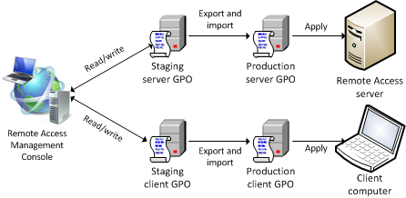

# Step 1 Plan the Advanced DirectAccess Infrastructure

>Applies to: Windows Server (Semi-Annual Channel), Windows Server 2016

The first step of planning for an advanced DirectAccess deployment on a single server is to plan the infrastructure that is required for the deployment. This topic describes the infrastructure planning steps. These planning tasks do not need to be completed in a specific order.  
  
|Task|Description|
|----|--------|  
|[1.1 Plan network topology and settings](#11-plan-network-topology-and-settings)|Decide where to place the DirectAccess server (at the edge, or behind a Network Address Translation (NAT) device or firewall), and plan IP addressing, routing, and force tunneling.|  
|[1.2 Plan firewall requirements](#12-plan-firewall-requirements)|Plan for allowing DirectAccess traffic through edge firewalls.|  
|[1.3 Plan certificate requirements](#13-plan-certificate-requirements)|Decide whether you want to use Kerberos or certificates for client authentication, and plan your website certificates. IP-HTTPS is a transition protocol that is used by DirectAccess clients to tunnel IPv6 traffic over IPv4 networks. Decide whether to authenticate to the IP-HTTPS server by using a certificate that is issued by a certification authority (CA), or by using a self-signed certificate that is issued automatically by the DirectAccess server.|  
|[1.4 Plan DNS requirements](#14-plan-dns-requirements)|Plan Domain Name System (DNS) settings for the DirectAccess server, infrastructure servers, local name resolution options, and client connectivity.|  
|[1.5 Plan the network location server](#15-plan-the-network-location-server)|The network location server is used by DirectAccess clients to determine whether they are located on the internal network. Decide where to place the network location server website in your organization (on the DirectAccess server or an alternate server), and plan the certificate requirements if the network location server is located on the DirectAccess server.|  
|[1.6 Plan management servers](#16-plan-management-servers)|You can remotely manage DirectAccess client computers that are located outside the corporate network on the Internet. Plan for management servers (such as update servers) that are used during remote client management.|  
|[1.7 Plan Active Directory Domain Services](#17-plan-active-directory-domain-services)|Plan for your domain controllers, your Active Directory requirements, client authentication, and multiple domains.|  
|[1.8 Plan Group Policy Objects](#18-plan-group-policy-objects)|Decide what GPOs are required in your organization and how to create or edit the GPOs.|  
  
## 1.1 Plan network topology and settings

This section explains how to plan for your network, including:  
  
- [1.1.1 Plan network adapters and IP addressing](#111-plan-network-adapters-and-ip-addressing)  
  
- [1.1.2 Plan IPv6 intranet connectivity](#112-plan-ipv6-intranet-connectivity)  
  
- [1.1.3 Plan for force tunneling](#113-plan-for-force-tunneling)  
  
### 1.1.1 Plan network adapters and IP addressing  
  
1. Identify the network adapter topology you want to use. DirectAccess can be set up by using either of the following topologies:  
  
    - **Two network adapters**. The DirectAccess server can be installed at the edge with one network adapter that is connected to the Internet and the other to the internal network, or it can be installed behind a NAT, firewall, or router device, with one network adapter connected to a perimeter network and the other to the internal network.  
  
    - **One network adapter**. The DirectAccess server is installed behind a NAT device, and the single network adapter is connected to the internal network.  
  
2. Identify your IP addressing requirements:  
  
    DirectAccess uses IPv6 with IPsec to create a secure connection between DirectAccess client computers and the internal corporate network. However, DirectAccess does not necessarily require connectivity to the IPv6 Internet or native IPv6 support on internal networks. Instead, it automatically configures and uses IPv6 transition technologies to tunnel IPv6 traffic across the IPv4 Internet (by using 6to4, Teredo, or IP-HTTPS) and across your IPv4-only intranet (by using NAT64 or ISATAP). For an overview of these transition technologies, see the following resources:  
  
    - [IPv6 Transition Technologies](https://technet.microsoft.com/library/bb726951.aspx)  
  
    - [IP-HTTPS Tunneling Protocol Specification](https://msdn.microsoft.com/library/dd358571(PROT.10).aspx)  
  
3. Configure required adapters and addresses according to the following table. For deployments that use a single network adapter and are set up behind a NAT device, configure your IP addresses by using only the **Internal network adapter** column.  
  
    ||External network adapter|Internal network adapter|Routing requirements|  
    |-|--------------|--------------|------------|  
    |IPv4 Internet and IPv4 intranet|Configure two static consecutive public IPv4 addresses with the appropriate subnet masks (required for Teredo only).<br/><br/>Also configure the default gateway IPv4 address of your Internet firewall or local Internet service provider (ISP) router. **Note:** The DirectAccess server requires two consecutive public IPv4 addresses so that it can act as a Teredo server and Windows-based clients can use the DirectAccess server to detect the type of NAT device that they are behind.|Configure the following:<br/><br/>-   An IPv4 intranet address with the appropriate subnet mask.<br/>-   The connection-specific DNS suffix of your intranet namespace. A DNS server should also be configured on the internal interface. **Caution:** Do not configure a default gateway on any intranet interfaces.|To configure the DirectAccess server to reach all subnets on the internal IPv4 network, do the following:<br/><br/>-   List the IPv4 address spaces for all the locations on your intranet.<br/>-   Use the **route add -p** or the**netsh interface ipv4 add route** command to add the IPv4 address spaces as static routes in the IPv4 routing table of the DirectAccess server.|  
    |IPv6 Internet and IPv6 intranet|Configure the following:<br/><br/>-   Use the address configuration that is provided by your ISP.<br/>-   Use the **Route Print** command to ensure that a default IPv6 route exists, and it is pointing to the ISP router in the IPv6 routing table.<br/>-   Determine whether the ISP and intranet routers are using the default router preferences described in RFC 4191, and using a higher default preference than your local intranet routers.<br/>    If both of these are true, no other configuration for the default route is required. The higher preference for the ISP router ensures that the active default IPv6 route of the DirectAccess server points to the IPv6 Internet.<br/><br/>Because the DirectAccess server is an IPv6 router, if you have a native IPv6 infrastructure, the Internet interface can also reach the domain controllers on the intranet. In this case, add packet filters to the domain controller in the perimeter network that prevent connectivity to the IPv6 address of the Internet-facing interface of the DirectAccess server.|Configure the following:<br/><br/>-   If you are not using the default preference levels, you can configure your intranet interfaces by using the following command**netsh interface ipv6 set InterfaceIndex ignoredefaultroutes=enabled**.<br/>    This command ensures that additional default routes that point to intranet routers will not be added to the IPv6 routing table. You can obtain the interface index of your intranet interfaces by using the following command: **netsh interface ipv6 show interface**.|If you have an IPv6 intranet, to configure the DirectAccess server to reach all of the IPv6 locations, do the following:<br/><br/>-   List the IPv6 address spaces for all the locations on your intranet.<br/>-   Use the **netsh interface ipv6 add route** command to add the IPv6 address spaces as static routes in the IPv6 routing table of the DirectAccess server.|  
    |IPv4 Internet and IPv6 intranet|The DirectAccess server forwards default IPv6 route traffic through the Microsoft 6to4 adapter to a 6to4 relay on the IPv4 Internet. You can configure a DirectAccess server for the IPv4 address of the Microsoft 6to4 adapter by using the following command:  `netsh interface ipv6 6to4 set relay name=<ipaddress> state=enabled`.|||  
  
    > [!NOTE]  
    > - If the DirectAccess client has been assigned a public IPv4 address, it will use the 6to4 transition technology to connect to the intranet. If it is assigned a private IPv4 address, it will use Teredo. If the DirectAccess client cannot connect to the DirectAccess server with 6to4 or Teredo, it will use IP-HTTPS.  
    > - To use Teredo, you must configure two consecutive IP addresses on the external facing network adapter.  
    > - You cannot use Teredo if the DirectAccess server has only one network adapter.  
    > - Native IPv6 client computers can connect to the DirectAccess server over native IPv6, and no transition technology is required.  
  
### 1.1.2 Plan IPv6 intranet connectivity

To manage remote DirectAccess clients, IPv6 is required. IPv6 allows DirectAccess management servers to connect to DirectAccess clients that are located on the Internet for the purpose of remote management.  
  
> [!NOTE]  
> - Using IPv6 on your network is not required to support connections that are initiated by DirectAccess client computers to IPv4 resources on your organization network. NAT64/DNS64 is used for this purpose.  
> - If you are not managing remote DirectAccess clients, you do not need to deploy IPv6.  
> - Intra-Site Automatic Tunnel Addressing Protocol (ISATAP) is not supported in DirectAccess deployments.  
> - When you use IPv6, you can enable IPv6 host (AAAA) resource record queries for DNS64 by using the following Windows PowerShell command:   **Set-NetDnsTransitionConfiguration -OnlySendAQuery $false**.  
  
### 1.1.3 Plan for force tunneling

With IPv6 and the Name Resolution Policy Table (NRPT), by default, DirectAccess clients separate their intranet and Internet traffic as follows:  
  
- DNS name queries for intranet fully qualified domain names (FQDNs) and all intranet traffic is exchanged over the tunnels that are created with the DirectAccess server or directly with intranet servers. Intranet traffic from DirectAccess clients is IPv6 traffic.  
  
- DNS name queries for FQDNs that correspond to exemption rules or do not match the intranet namespace, and all traffic to Internet servers, is exchanged over the physical interface that is connected to the Internet. Internet traffic from DirectAccess clients is typically IPv4 traffic.  
  
In contrast, by default, some remote access virtual private network (VPN) implementations, including the VPN client, send all intranet and Internet traffic over the remote access VPN connection. Internet-bound traffic is routed by the VPN server to intranet IPv4 web proxy servers for access to IPv4 Internet resources. It is possible to separate the intranet and Internet traffic for remote access VPN clients by using split tunneling. This involves configuring the Internet Protocol (IP) routing table on VPN clients so that traffic to intranet locations is sent over the VPN connection, and traffic to all other locations is sent by using the physical interface that is connected to the Internet.  
  
You can configure DirectAccess clients to send all of their traffic through the tunnels to the DirectAccess server with force tunneling. When force tunneling is configured, DirectAccess clients detect that they are on the Internet, and they remove their IPv4 default route. With the exception of local subnet traffic, all traffic sent by the DirectAccess client is IPv6 traffic that goes through tunnels to the DirectAccess server.  
  
> [!IMPORTANT]  
> If you plan to use force tunneling, or you might add it in the future, you should deploy a two tunnel configuration. Because of security considerations, force tunneling in a single tunnel configuration is not supported.  
  
Enabling force tunneling has the following consequences:  
  
- DirectAccess clients use only Internet Protocol over Secure Hypertext Transfer Protocol (IP-HTTPS) to obtain IPv6 connectivity to the DirectAccess server over the IPv4 Internet.  
  
- The only locations that a DirectAccess client can reach by default with IPv4 traffic are those on its local subnet. All other traffic that is sent by applications and services running on the DirectAccess client is IPv6 traffic, which is sent over the DirectAccess connection. Therefore, IPv4-only applications on the DirectAccess client cannot be used to reach Internet resources, except those on the local subnet.  
  
> [!IMPORTANT]  
> For force tunneling through DNS64 and NAT64, IPv6 Internet connectivity must be implemented. One way to achieve this is by making the IP-HTTPS prefix globally routable, so that ipv6.msftncsi.com will be reachable over IPv6, and the response from the Internet server to the IP-HTTPS clients is able to return through the DirectAccess server.  
>
> Because this is not feasible in most cases, the best option is to create virtual NCSI servers inside the corporate network as follows:  
>
> 1. Add an NRPT entry for ipv6.msftncsi.com and resolve it against DNS64 to an internal website (this can be IPv4 website).  
> 2. Add an NRPT entry for dns.msftncsi.com and resolve it against a corporate DNS server to return the IPv6 host (AAAA) resource record fd3e:4f5a:5b81::1. (Using DNS64 to only send host (A) resource record queries for this FQDN may not work because it is configured in IPv4 only deployments, so you should configure it to resolve against corporate DNS directly.)  
  
## 1.2 Plan firewall requirements

If the DirectAccess server is behind an edge firewall, the following exceptions are required for Remote Access traffic when the DirectAccess server is on the IPv4 Internet:  
  
- Teredo traffic-User Datagram Protocol (UDP) destination port 3544 inbound, and UDP source port 3544 outbound.  
  
- 6to4 traffic-IP Protocol 41 inbound and outbound.  
  
- IP-HTTPS-Transmission Control Protocol (TCP) destination port 443, and TCP source port 443 outbound.  
  
- If you are deploying Remote Access with a single network adapter, and installing the network location server on the DirectAccess server, TCP port 62000 should also be exempted.  
  
    > [!NOTE]  
    > This exemption is on the DirectAccess server, and all other exemptions are on the edge firewall.  
  
For Teredo and 6to4 traffic, these exceptions should be applied for both of the Internet-facing consecutive public IPv4 addresses on the DirectAccess server. For IP-HTTPS, the exceptions need to be applied on the address that is registered on the public DNS server.  
  
The following exceptions are required for Remote Access traffic when the DirectAccess server is on the IPv6 Internet:  
  
- IP Protocol ID 50  
  
- UDP destination port 500 inbound, and UDP source port 500 outbound  
  
- ICMPv6 traffic inbound and outbound (when using Teredo only)  
  
When you use additional firewalls, apply the following internal network firewall exceptions for Remote Access traffic:  
  
- ISATAP-Protocol 41 inbound and outbound  
  
- TCP/UDP for all IPv4 and IPv6 traffic  
  
- ICMP for all IPv4 and IPv6 traffic (when using Teredo only)  
  
## 1.3 Plan certificate requirements

There are three scenarios that require certificates when you deploy a single DirectAccess server:  
  
- [1.3.1 Plan computer certificates for IPsec authentication](#131-plan-computer-certificates-for-ipsec-authentication)  
  
    Certificate requirements for IPsec include a computer certificate that is used by DirectAccess client computers when they establish the IPsec connection between the client and the DirectAccess server, and a computer certificate that is used by DirectAccess servers to establish IPsec connections with DirectAccess clients.  
  
    For DirectAccess in  Windows Server 2012  the use of these IPsec certificates is not mandatory. As an alternative the DirectAccess server can act as a Kerberos proxy to perform IPsec authentication without requiring certificates. If Kerberos protocol is used, it works over SSL, and the Kerberos proxy uses the certificate that is configured for IP-HTTPS for this purpose. Some enterprise scenarios (including multisite deployment and one-time password (OTP) client authentication) require the use of certificate authentication, and not the Kerberos protocol.  
  
-   [1.3.2 Plan certificates for IP-HTTPS](#132-plan-certificates-for-ip-https)  
  
    When you configure Remote Access, the DirectAccess server is automatically configured to act as the IP-HTTPS listener. The IP-HTTPS site requires a website certificate, and client computers must be able to contact the certificate revocation list (CRL) site for the certificate.  
  
-   [1.3.3 Plan website certificates for the network location server](#133-plan-website-certificates-for-the-network-location-server)  
  
    The network location server is a website that is used to detect whether client computers are located in the corporate network. The network location server requires a website certificate. DirectAccess clients must be able to contact the CRL site for the certificate.  
  
The certification authority (CA) requirements for each scenario are summarized in the following table.  
  
|IPsec authentication|IP-HTTPS server|Network location server|  
|------------|----------|--------------|  
|An internal CA is required to issue computer certificates to the DirectAccess server and clients for IPsec authentication when you don't use the Kerberos proxy for authentication|Internal CA:<br/><br/>You can use an internal CA to issue the IP-HTTPS certificate; however, you must make sure that the CRL distribution point is available externally.|Internal CA:<br/><br/>You can use an internal CA to issue the network location server website certificate. Make sure that the CRL distribution point has high availability from the internal network.|  
||Self-signed certificate:<br/><br/>You can use a self-signed certificate for the IP-HTTPS server; however, you must make sure that the CRL distribution point is available externally.<br/><br/>A self-signed certificate cannot be used in multisite deployments.|Self-signed certificate:<br/><br/>You can use a self-signed certificate for the network location server website.<br/><br/>A self-signed certificate cannot be used in multisite deployments.|  
||**Recommended**<br/><br/>Public CA:<br/><br/>It is recommended to use a public CA to issue the IP-HTTPS certificate. This ensures that the CRL distribution point is available externally.|  
  
### 1.3.1 Plan computer certificates for IPsec authentication  
If you are using certificate-based IPsec authentication, the DirectAccess server and clients are required to obtain a computer certificate. The simplest way to install the certificates is to configure Group Policy-based automatic enrollment for computer certificates. This ensures that all domain members obtain a certificate from an enterprise CA. If you do not have an enterprise CA set up in your organization, see [Active Directory Certificate Services](https://technet.microsoft.com/library/cc770357.aspx).  
  
This certificate has the following requirements:  
  
-   The certificate should have a Client Authentication extended key usage (EKU).  
  
-   The client certificate and the server certificate should chain to the same root certificate. This root certificate must be selected in the DirectAccess configuration settings.  
  
### 1.3.2 Plan certificates for IP-HTTPS  
The   DirectAccess server acts as an IP-HTTPS listener, and you must manually install an HTTPS website certificate on the server. Consider the following when you are planning:  
  
-   Using a public CA is recommended, so that certificate revocation lists (CRLs) are readily available.  
  
-   In the **Subject** field, specify the IPv4 address of the Internet adapter of DirectAccess server or the FQDN of the IP-HTTPS URL (the ConnectTo address). If the DirectAccess server is located behind a NAT device, the public name or address of the NAT device should be specified.  
  
-   The common name of the certificate should match the name of the IP-HTTPS site.  
  
-   For the **Enhanced Key Usage** field, use the server authentication object identifier (OID).  
  
-   For the **CRL Distribution Points** field, specify a CRL distribution point that is accessible by DirectAccess clients that are connected to the Internet.  
  
-   The IP-HTTPS certificate must have a private key.  
  
-   The IP-HTTPS certificate must be imported directly into the personal store.  
  
-   IP-HTTPS certificates can have wildcard characters in the name.  
  
If you plan to use IP-HTTPS on a non-standard port, perform the following steps on the DirectAccess server:  
  
1.  Remove the existing certificate binding for 0.0.0.0:443, and replace it with a certificate binding for your chosen port. For purposes of this example, port 44500 is used. Prior to deleting the certificate binding, show and copy the **appid**.  
  
    1.  To delete the certificate binding, enter:  
  
        ```  
        netsh http delete ssl ipport=0.0.0.0:443  
        ```  
  
    2.  To add the new certificate binding, enter:  
  
        ```  
        netsh http add ssl ipport=0.0.0.0:44500 certhash=<use the thumbprint from the DirectAccess server SSL cert> appid=<use the appid from the binding that was deleted>  
        ```  
  
2.  To modify the IP-HTTPS URL on the server, enter:  
  
    ```  
    Netsh int http set int url=https://<DirectAccess server name (for example server.contoso.com)>:44500/IPHTTPS  
    ```  
  
    ```  
    Net stop iphlpsvc & net start iphlpsvc  
    ```  
  
3.  Change the URL reservation for kdcproxy.  
  
    1.  To delete the existing URL reservation, enter:  
  
        ```  
        netsh http del urlacl url=https://+:443/KdcProxy/  
        ```  
  
    2.  To add a new URL reservation, enter:  
  
        ```  
        netsh http add urlacl url=https://+:44500/KdcProxy/ sddl=D:(A;;GX;;;NS)  
        ```  
  
4.  Add the setting to make kppsvc listen on the non-standard port. To add the registry entry, enter:  
  
    ```  
    HKEY_LOCAL_MACHINE\SYSTEM\CurrentControlSet\Services\KPSSVC\Settings /v HttpsUrlGroup /t REG_MULTI_SZ /d +:44500 /f  
    ```  
  
5.  To restart the kdcproxy service on the domain controller, enter:  
  
    ```  
    net stop kpssvc & net start kpssvc  
    ```  
  
To use IP-HTTPS on a non-standard port, perform the following steps on the domain controller:  
  
1.  Modify the IP-HTTPS setting in the client GPO.  
  
    1.  Open the Group Policy editor.  
  
    2.  Navigate to Computer configuration=>Policies=>Administrative Templates=> Network=>TCPIP settings =>IPv6 transition technologies.  
  
    3.  Open the IP-HTTPS state setting and change the URL to **https://<DirectAccess server name (for example server.contoso.com)>:44500/IPHTTPS**.  
  
    4.  Click **Apply**.  
  
2.  Modify the Kerberos proxy client settings in the client GPO.  
  
    1.  In the Group Policy editor, navigate to Computer configuration=>Policies=>Administrative Templates=> System=>Kerberos => Specify the KDC proxy servers for Kerberos clients.  
  
    2.  Open the IPHTTPS state setting and change the URL to **https://<DirectAccess server name (for example server.contoso.com)>:44500/IPHTTPS**.  
  
    3.  Click **Apply**.  
  
3.  Modify the client IPsec policy settings to use ComputerKerb and UserKerb.  
  
    1.  In the Group Policy editor, navigate to Computer configuration=>Policies=> Windows Settings=> Security Settings=> Windows Firewall with Advanced security.  
  
    2.  Click **Connection security rules**, and then double-click **IPsec rule**.  
  
    3.  On the **Authentication** tab, click **Advanced**.  
  
    4.  For Auth1: rRmove the existing authentication method, and replace it with ComputerKerb. For Auth2: Remove the existing authentication method, and replace it with UserKerb.  
  
    5.  Click **Apply**, and then **OK**.  
  
To complete the manual process for using an IP-HTTPS non-standard port, run **gpupdate /force** on the client computers and the DirectAccess server.  
  
### 1.3.3 Plan website certificates for the network location server  
When you plan for the network location server website, consider the following:  
  
-   In the **Subject** field, specify the IP address of the intranet interface of the network location server or the FQDN of the network location URL.  
  
-   In the **Enhanced Key Usage** field, use the Server Authentication OID.  
  
-   In the **CRL Distribution Points** field, use a CRL distribution point that is accessible by DirectAccess clients that are connected to the intranet. This CRL distribution point should not be accessible from outside the internal network.  
  
-   If you are later planning to configure a multisite or cluster deployment, the name of the certificate should not match the internal name of any DirectAccess server that will be added to the deployment.  
  
    > [!NOTE]  
    > Ensure that the certificates for IP-HTTPS and the network location server have a **Subject Name**. If the certificate does not have a **Subject Name**, but it has an **Alternative Name**, it will not be accepted by the Remote Access Wizard.  
  
## 1.4 Plan DNS requirements  
This section explains  the DNS requirements for DirectAccess client requests and infrastructure servers in a Remote Access deployment. It includes the following subsections:  
  
-   [1.4.1 Plan for DNS server requirements](#141-plan-for-dns-server-requirements)  
  
-   [1.4.2 Plan for local name resolution](#142-plan-for-local-name-resolution)  
  
**DirectAccess client requests**  
  
DNS is used to resolve requests from DirectAccess client computers that are not located on the internal (or corporate) network. DirectAccess clients attempt to connect to the DirectAccess network location server to determine whether they are located on the Internet, or on the internal network.  
  
-   If the connection is successful, clients are identified as being located on the internal network, DirectAccess is not used, and client requests are resolved by using the DNS server that is configured on the network adapter of the client computer.  
  
-   If the connection does not succeed, clients are assumed to be located on the Internet, and DirectAccess clients will use the name resolution policy table (NRPT) to determine which DNS server to use when resolving name requests.  
  
You can specify that clients use DirectAccess DNS64 to resolve names, or an alternative internal DNS server. When performing name resolution, the NRPT is used by DirectAccess clients to identify how to handle a request. Clients request an FQDN or single-label name such as <https://internal>. If a single-label name is requested, a DNS suffix is appended to make an FQDN. If the DNS query matches an entry in the NRPT, and DNS64 or a DNS server on the internal network is specified for the entry, the query is sent for name resolution using the specified server. If a match exists, but no DNS server is specified, this indicates an exemption rule, and normal name resolution is applied.  
  
> [!NOTE]  
> Note that when a new suffix is added to the NRPT in the Remote Access Management Console, the default DNS servers for the suffix can be automatically discovered by clicking **Detect**.  
  
Auto detection works as follows:  
  
-   If the corporate network is IPv4-based, or it uses IPv4 and IPv6, the default address is the DNS64 address of the internal adapter on the DirectAccess server.  
  
-   If the corporate network is IPv6-based, the default address is the IPv6 address of DNS servers in the corporate network.  
  
**Infrastructure servers**  
  
-   **Network location server**  
  
    DirectAccess clients attempt to reach the network location server to determine if they are on the internal network. Clients on the internal network must be able to resolve the name of the network location server, but they must be prevented from resolving the name when they are located on the Internet. To ensure that this occurs, by default, the FQDN of the network location server is added as an exemption rule to the NRPT. In addition, when you configure Remote Access, the following rules are created automatically:  
  
    -   A DNS suffix rule for the root domain or the domain name of the DirectAccess server, and the IPv6 addresses that correspond to the DNS64 address. In IPv6-only corporate networks, the intranet DNS servers are configured on the DirectAccess server. For example, if the DirectAccess server is a member of the corp.contoso.com domain, a rule is created for the corp.contoso.com DNS suffix.  
  
    -   An exemption rule for the FQDN of the network location server. For example, if the network location server URL is <https://nls.corp.contoso.com>, an exemption rule is created for the FQDN nls.corp.contoso.com.  
  
-   **IP-HTTPS server**  
  
    The DirectAccess server acts as an IP-HTTPS listener, and it uses its server certificate to authenticate to IP-HTTPS clients. The IP-HTTPS name must be resolvable by DirectAccess clients that are using public DNS servers.  
  
-   **CRL revocation checking**  
  
    DirectAccess uses certificate revocation checking for the IP-HTTPS connection between DirectAccess clients and the DirectAccess server, and for the HTTPS-based connection between the DirectAccess client and the network location server. In both cases, DirectAccess clients must be able to resolve and access the CRL distribution point location.  
  
-   **ISATAP**  
  
    ISATAP enables corporate computers to acquire an IPv6 address, and it encapsulates IPv6 packets within an IPv4 header. It is used by the DirectAccess server to provide IPv6 connectivity to ISATAP hosts across an intranet. In a non-native IPv6 network environment, the DirectAccess server configures itself automatically as an ISATAP router.  
  
    Because ISATAP is no longer supported in DirectAccess, you must ensure that your DNS servers are configured not to respond to ISATAP queries. By default, the DNS Server service blocks name resolution for the ISATAP name through the DNS Global Query Block List. Do not remove the ISATAP name from the Global Query Block List.  
  
-   **Connectivity verifiers**  
  
    Remote Access creates a default web probe that is used by DirectAccess client computers to verify connectivity to the internal network. To ensure that the probe works as expected, the following names must be registered manually in DNS:  
  
    -   **directaccess-webprobehost**-Should resolve to the internal IPv4 address of the DirectAccess server, or to the IPv6 address in an IPv6-only environment.  
  
    -   **directaccess-corpconnectivityhost**-Should resolve to the local host (loopback) address. The following host (A) and (AAAA) resource records should be created: a host (A) resource record with value 127.0.0.1, and a host (AAAA) resource record with value constructed out of NAT64 prefix with the last 32 bits as 127.0.0.1. The NAT64 prefix can be retrieved by running the Windows PowerShell command **get-netnattransitionconfiguration**.  
  
        > [!NOTE]  
        > This is valid only in an IPv4-only environment. In an IPv4 plus IPv6, or an IPv6-only environment, only a host (AAAA) resource record should be created with the loopback IP address ::1.  
  
    You can create additional connectivity verifiers by using other web addresses over HTTP or by using **ping**. For each connectivity verifier, a DNS entry must exist.  
  
### 1.4.1 Plan for DNS server requirements  
Following are the requirements for DNS when you deploy DirectAccess.  
  
-   For DirectAccess clients, you must use a DNS server that is running  Windows Server 2012 R2 ,  Windows Server 2012 ,  Windows Server 2008 R2 ,  Windows Server 2008 , or any other DNS server that supports IPv6.  
  
    > [!NOTE]  
    > It is not recommended that you use DNS servers that are running Windows Server 2003 when you are deploying DirectAccess. Although Windows Server 2003 DNS servers do support IPv6 records, Windows Server 2003 is no longer supported by Microsoft. In addition, you should not deploy DirectAccess if your domain controllers are running Windows Server 2003 due to an issue with the File Replication Service. For more information, see [DirectAccess Unsupported Configurations](https://technet.microsoft.com/library/dn464274.aspx).  
  
-   Use a DNS server that supports dynamic updates. You can use DNS servers that do not support dynamic updates, but you must manually update entries on these servers.  
  
-   The FQDN for your Internet-accessible CRL distribution points must be resolvable by using Internet DNS servers. For example, if URL <https://crl.contoso.com/crld/corp-DC1-CA.crl> is in the **CRL Distribution Points** field of the IP-HTTPS certificate of the DirectAccess server, you must ensure that the FQDN crld.contoso.com is resolvable by using Internet DNS servers.  
  
### 1.4.2 Plan for local name resolution  
When you plan for local name resolution, consider the following issues:  
  
**NRPT**  
  
You may need to create additional NRPT rules in the following cases:  
  
-   If you need to add more DNS suffixes for your intranet namespace.  
  
-   If the fully qualified domain name (FQDN) of your CRL distribution points are based on your intranet namespace, you must add exemption rules for the FQDNs of the CRL distribution points.  
  
-   If you have a split-brain DNS environment, you must add exemption rules for the names of resources for which you want DirectAccess clients located on the Internet to access the Internet version, rather than the intranet version.  
  
-   If you are redirecting traffic to an external website through your intranet web proxy servers, the external website is available only from the intranet, and it uses the addresses of your web proxy servers to permit the inbound requests. In this case, add an exemption rule for the FQDN of the external website, and specify that the rule use your intranet web proxy server rather than the IPv6 addresses of intranet DNS servers.  
  
    For example, if you are testing an external website named test.contoso.com, this name is not resolvable through Internet DNS servers, but the Contoso web proxy server knows how to resolve the name and to direct requests for the website to the external web server. To prevent users who are not on the Contoso intranet from accessing the site, the external website allows requests only from the IPv4 Internet address of the Contoso web proxy. Thus, intranet users can access the website because they are using the Contoso web proxy, but DirectAccess users cannot access it because they are not using the Contoso web proxy. By configuring an NRPT exemption rule for test.contoso.com that uses the Contoso web proxy, webpage requests for test.contoso.com are routed to the intranet web proxy server over the IPv4 Internet.  
  
**Single label names**  
  
Single label names, such as <https://paycheck>, are sometimes used for intranet servers. If a single label name is requested, and a DNS suffix search list is configured, the DNS suffixes in the list will be appended to the single label name. For example, when a user on a computer that is a member of the corp.contoso.com domain types <https://paycheck> in the web browser, the FQDN that is constructed as the name is paycheck.corp.contoso.com. By default the appended suffix is based on the primary DNS suffix of the client computer.  
  
> [!NOTE]  
> In a disjoint name space scenario (where one or more domain computers has a DNS suffix that does not match the Active Directory domain to which the computers belong), you should ensure that the search list is customized to include all the required suffixes. By default, the Remote Access Wizard will configure the Active Directory DNS name as the primary DNS suffix on the client. Make sure to add the DNS suffix that is used by clients for name resolution.  
  
If multiple domains and Windows Internet Name Service (WINS) are deployed in your organization and you are connecting remotely, single-names can be resolved as follows:  
  
-   Deploy a WINS forward lookup zone in the DNS. When trying to resolve computername.dns.zone1.corp.contoso.com, the request is directed to the WINS server that is using only computername. The client thinks it is issuing a regular DNS host (A) resource record, but it is actually a NetBIOS request. For more information, see Managing a Forward Lookup Zone.  
  
-   Add a DNS suffix, for example dns.zone1.corp.contoso.com, to the default domain policy GPO.  
  
**Split-brain DNS**  
  
Split-brain DNS is the use of the same DNS domain for Internet and intranet name resolution.  
  
For split-brain DNS deployments, you must list the FQDNs that are duplicated on the Internet and intranet, and decide which resources the DirectAccess client should reach-the intranet or the Internet version. For each name that corresponds to a resource for which you want DirectAccess clients to reach the Internet version, you must add the corresponding FQDN as an exemption rule to the NRPT for your DirectAccess clients.  
  
In a split-brain DNS environment, if you want both versions of the resource to be available, configure your intranet resources with alternate names, that are not duplicates of the names used on the Internet, and instruct your users to use the alternate name when on the Intranet. For example, configure the alternate name www.internal.contoso.com for the internal name www.contoso.com.  
  
In a non-split-brain DNS environment, the Internet namespace is different from the intranet namespace. For example, the Contoso Corporation uses contoso.com on the Internet and corp.contoso.com on the intranet. Because all intranet resources use the corp.contoso.com DNS suffix, the NRPT rule for corp.contoso.com routes all DNS name queries for intranet resources to intranet DNS servers. DNS name queries for names with the contoso.com suffix do not match the corp.contoso.com intranet namespace rule in the NRPT, and are sent to Internet DNS servers. With a non-split-brain DNS deployment, because there is no duplication of FQDNs for intranet and Internet resources, there is no additional configuration needed for the NRPT. DirectAccess clients can access both Internet and intranet resources for the organization.  
  
**Local name resolution behavior for DirectAccess clients**  
  
If a name cannot be resolved with DNS, to resolve the name on the local subnet, the DNS Client service in  Windows Server 2012 R2 ,  Windows Server 2012 ,  Windows Server 2008 R2 , Windows 8, and  Windows 7  can use local name resolution, with the Link-Local Multicast Name Resolution (LLMNR) and NetBIOS over TCP/IP protocols.  
  
Local name resolution is typically needed for peer-to-peer connectivity when the computer is located on private networks, such as single subnet home networks. When the DNS Client service performs local name resolution for intranet server names and the computer is connected to a shared subnet on the Internet, malicious users can capture LLMNR and NetBIOS over TCP/IP messages to determine intranet server names. On the DNS page of the Infrastructure Server Setup Wizard, you configure the local name resolution behavior based on the types of responses received from intranet DNS servers. The following options are available:  
  
-   **Use local name resolution if the name does not exist in DNS**. This option is the most secure because the DirectAccess client performs local name resolution only for server names that cannot be resolved by intranet DNS servers. If the intranet DNS servers can be reached, the names of intranet servers are resolved. If the intranet DNS servers cannot be reached, or if there are other types of DNS errors, the intranet server names are not leaked to the subnet through local name resolution.  
  
-   **Use local name resolution if the name does not exist in DNS or DNS servers are unreachable when the client computer is on a private network (recommended)**. This option is recommended because it allows the use of local name resolution on a private network only when the intranet DNS servers are unreachable.  
  
-   **Use local name resolution for any kind of DNS resolution error (least secure)**. This is the least secure option because the names of intranet network servers can be leaked to the local subnet through local name resolution.  
  
## 1.5 Plan the network location server  
The network location server is a website that is used to detect whether DirectAccess clients are located in the corporate network. Clients in the corporate network do not use DirectAccess to reach internal resources, but instead, they connect directly.  
  
The network location server website can be hosted on the DirectAccess server or on another server in your organization. If you host the network location server on the DirectAccess server, the website is created automatically when you install the Remote Access server role. If you host the network location server on another server in your organization running a Windows operating system, you must make sure that Internet Information Services (IIS) is installed on that server, and that the website is created. DirectAccess does not configure settings on a remote network location server.  
  
Ensure that the network location server website meets the following requirements:  
  
-   It is a website with an HTTPS server certificate.  
  
-   DirectAccess client computers must trust the CA that issued the server certificate to the network location server website.  
  
-   DirectAccess client computers on the internal network must be able to resolve the name of the network location server site.  
  
-   The network location server site must have high availability to computers on the internal network.  
  
-   The network location server must not be accessible to DirectAccess client computers on the Internet.  
  
-   The server certificate must be checked against a CRL.  
  
### 1.5.1 Plan certificates for the network location server  
When you are obtaining the website certificate to use for the network location server, consider the following:  
  
1.  In the **Subject** field, specify an IP address of the intranet interface of the network location server or the FQDN of the network location URL.  
  
2.  In the **Enhanced Key Usage** field, use the Server Authentication OID.  
  
3.  In the **CRL Distribution Points** field, use a CRL distribution point that is accessible by DirectAccess clients that are connected to the intranet. This CRL distribution point should not be accessible from outside the internal network.  
  
### 1.5.2 Plan DNS for the network location server  
DirectAccess clients attempt to reach the network location server to determine if they are on the internal network. Clients on the internal network must be able to resolve the name of the network location server, but they must be prevented from resolving the name when they are located on the Internet. To ensure that this occurs, by default, the FQDN of the network location server is added as an exemption rule to the NRPT.  
  
## 1.6 Plan management servers  
DirectAccess clients initiate communications with management servers that provide services such as Windows Update and antivirus updates. DirectAccess clients also use the Kerberos protocol to contact domain controllers to authenticate before they access the internal network. During remote management of DirectAccess clients, management servers communicate with client computers to perform management functions such as software or hardware inventory assessments. Remote Access can automatically discover some management servers, including:  
  
-   Domain controllers-Auto-discovery of domain controllers is performed for all domains in the same forest as the DirectAccess server and client computers.  
  
-   System Center Configuration Manager servers-Auto-discovery of System Center Configuration Manager servers is performed for all domains in the same forest as the DirectAccess server and client computers.  
  
Domain controllers and System Center Configuration Manager servers are automatically detected the first time that DirectAccess is configured. Detected domain controllers are not displayed in the console, but settings can be retrieved by using the Windows PowerShell cmdlet **Get-DAMgmtServer -Type All**. If domain controller or System Center Configuration Manager servers are modified, clicking **Refresh Management Servers** in the Remote Access Management console refreshes the management server list.  
  
**Management server requirements**  
  
-   Management servers must be accessible over the first (infrastructure) tunnel. When you configure Remote Access, adding servers to the management servers list automatically makes them accessible over this tunnel.  
  
-   Management servers that initiate connections to DirectAccess clients must fully support IPv6, by means of a native IPv6 address or by using one that is assigned by ISATAP.  
  
## 1.7 Plan Active Directory Domain Services  
This section explains how DirectAccess uses Active Directory Domain Services (AD DS), and it includes the following subsections:  
  
-   [1.7.1 Plan client authentication](#171-plan-client-authentication)  
  
-   [1.7.2 Plan multiple domains](#172-plan-multiple-domains)  
  
DirectAccess uses AD DS and Active Directory Group policy objects (GPOs) as follows:  
  
-   **Authentication**  
  
    AD DS is used for authentication. The infrastructure tunnel uses NTLMv2 authentication for the computer account that is connecting to the DirectAccess server, and the account must be listed in an Active Directory domain. The intranet tunnel uses Kerberos authentication for the user to create the second tunnel.  
  
-   **Group Policy Objects**  
  
    DirectAccess gathers configuration settings into GPOs that are applied to DirectAccess servers, clients, and internal application servers.  
  
-   **Security groups**  
  
    DirectAccess uses security groups to gather and identify DirectAccess client computers. The GPOs are applied to the required security group.  
  
-   **Extended IPsec policies**  
  
    DirectAccess can use IPsec authentication and encryption between clients and the DirectAccess server. You can extend IPsec authentication and encryption from the client to the specified internal application servers. To do this, add the required application servers into a security group.  
  
**AD DS requirements**  
  
When you plan AD DS for a DirectAccess deployment, consider the following requirements:  
  
-   At least one domain controller must be installed with the  Windows Server 2016,  Windows Server 2012 R2 ,  Windows Server 2012 ,  Windows Server 2008 R2 , or  Windows Server 2008  operating system.  
  
    If the domain controller is on a perimeter network (and therefore reachable from the Internet-facing network adapter of the DirectAccess server), you must prevent the DirectAccess server from reaching it by adding packet filters on the domain controller to prevent connectivity to the IP address of the Internet adapter.  
  
-   The DirectAccess server must be a domain member.  
  
-   DirectAccess clients must be domain members. Clients can belong to:  
  
    -   Any domain in the same forest as the DirectAccess server.  
  
    -   Any domain that has a two-way trust with the DirectAccess server domain.  
  
    -   Any domain in a forest that has a two-way trust with the forest to which the DirectAccess domain belongs.  
  
> [!NOTE]  
> -   The DirectAccess server cannot be a domain controller.  
> -   The AD DS domain controller that is used for DirectAccess must not be reachable from the external Internet adapter of the DirectAccess server (that is, the adapter must not be in the domain profile of Windows Firewall).  
  
### 1.7.1 Plan client authentication  
DirectAccess allows you to choose between using certificates for IPsec computer authentication or using a built-in Kerberos proxy that authenticates by using user names and passwords.  
  
When choosing to use Ad DS credentials for authentication, DirectAccess uses one security tunnel that uses Computer Kerberos for the first authentication and User Kerberos for the second authentication. When using this mode for authentication, DirectAccess uses a single security tunnel that provides access to the DNS server, the domain controller, and to other servers on the internal network.  
  
When choosing to use two-factor authentication or Network Access Protection, DirectAccess uses two security tunnels. The Remote Access Setup Wizard configures Windows Firewall with Advanced Security connection security rules that specify the use of the following types of credentials when negotiating the IPsec security associations for the tunnels to the DirectAccess server:  
  
-   The infrastructure tunnel uses Computer Kerberos credentials for the first authentication and User Kerberos for the second authentication.  
  
-   The intranet tunnel uses computer certificate credentials for the first authentication and User Kerberos for the second authentication.  
  
When DirectAccess is choosing to allow access to clients running  Windows 7  or in a multisite deployment, it uses two security tunnels. The Remote Access Setup Wizard configures Windows Firewall with Advanced Security connection security rules that specify the use of the following types of credentials when negotiating the IPsec security associations for the tunnels to the DirectAccess server:  
  
-   The infrastructure tunnel uses computer certificate credentials for the first authentication and NTLMv2 for the second authentication. NTLMv2 credentials force the use of Authenticated Internet Protocol (AuthIP), and they provide access to a DNS server and domain controller before the DirectAccess client can use Kerberos credentials for the intranet tunnel.  
  
-   The intranet tunnel uses computer certificate credentials for the first authentication and User Kerberos for the second authentication.  
  
### 1.7.2 Plan multiple domains  
The management servers list should include domain controllers from all domains that contain security groups that include DirectAccess client computers. It should contain all domains that contain user accounts that might use computers that are configured as DirectAccess clients. This ensures that users who are not located in the same domain as the client computer they are using are authenticated with a domain controller in the user domain. This is done automatically if domains are in the same forest.  
  
> [!NOTE]  
> If there are computers in the security groups that are used for client computers or application servers in different forests, the domain controllers of those forests are not detected automatically. You can run the task **Refresh Management Servers** in the Remote Access Management console to detect these domain controllers.  
  
Where possible, common domain name suffixes should be added to the Name Resolution Policy Table (NRPT) during the Remote Access deployment. For example, if you have two domains, domain1.corp.contoso.com and domain2.corp.contoso.com, instead of adding two entries into the NRPT, you can add a common DNS suffix entry, where the domain name suffix is corp.contoso.com. This happens automatically for domains in the same root, but domains that are not in the same root must be added manually.  
  
If Windows Internet Name Service (WINS) is deployed in a multiple domain environment, you must deploy a WINS forward lookup zone in DNS. For more information, see **Single label names** in the [1.4.2 Plan for local name resolution](#142-plan-for-local-name-resolution) section earlier in this document.  
  
## 1.8 Plan Group Policy Objects  
This section explains the role of Group Policy Objects (GPOs) in your Remote Access infrastructure, and it includes the following subsections:  
  
-   [1.8.1 Configure automatically created GPOs](#181-configure-automatically-created-gpos)  
  
-   [1.8.2 Configure manually created GPOs](#182-configure-manually-created-gpos)  
  
-   [1.8.3 Manage GPOs in a multi-domain controller environment](#183-manage-gpos-in-a-multi-domain-controller-environment)  
  
-   [1.8.4 Manage Remote Access GPOs with limited permissions](#184-manage-remote-access-gpos-with-limited-permissions)  
  
-   [1.8.5 Recover from a deleted GPO](#185-recover-from-a-deleted-gpo)  
  
DirectAccess settings that are configured when you configure Remote Access are collected into GPOs. The following types of GPOs are populated with DirectAccess settings, and they are distributed as follows:  
  
-   **DirectAccess client GPO**  
  
    This GPO contains client settings, including IPv6 transition technology settings, NRPT entries, and Windows Firewall with Advanced Security connection security rules. The GPO is applied to the security groups that are specified for the client computers.  
  
-   **DirectAccess server GPO**  
  
    This GPO contains the DirectAccess configuration settings that are applied to any server that is configured as a DirectAccess server in your deployment. It also contains Windows Firewall with Advanced Security connection security rules.  
  
-   **Application servers GPO**  
  
    This GPO contains settings for selected application servers to which you optionally extend authentication and encryption from DirectAccess clients. If authentication and encryption are not extended, this GPO is not used.  
  
GPOs can be configured in two ways:  
  
-   **Automatically**-You can specify that they are created automatically. A default name is specified for each GPO.  
  
-   **Manually**-You can use GPOs that have been predefined by the Active Directory administrator.  
  
> [!NOTE]  
> After DirectAccess is configured to use specific GPOs, it cannot be configured to use different GPOs.  
  
Whether you are using automatically or manually configured GPOs, you need to add a policy for slow link detection if your clients will use 3G networks. The path for **Policy: Configure Group Policy slow link detection** is: **Computer configuration/Polices/Administrative Templates/System/Group Policy**.  
  
> [!CAUTION]  
> Use the following procedure to back up all Remote Access GPOs before you run DirectAccess cmdlets: [Back up and Restore Remote Access Configuration](https://go.microsoft.com/fwlink/?LinkID=257928).  
  
If the correct permissions (which are listed in the following sections) for linking GPOs do not exist, a warning is issued. The Remote Access operation will continue but linking will not occur. If this warning is issued, links will not be created automatically, even when the permissions are added later. Instead the administrator needs to create the links manually.  
  
### 1.8.1 Configure automatically created GPOs  
Consider the following when you use automatically-created GPOs.  
  
Automatically created GPOs are applied according to the location and link target parameter, as follows:  
  
-   For the DirectAccess server GPO, the location parameter and the link parameter point to the domain that contains the DirectAccess server.  
  
-   When client and application server GPOs are created, the location is set to a single domain in which the GPO will be created. The GPO name is looked up in each domain, and it is filled with DirectAccess settings if it exists. The link target is set to the root of the domain in which the GPO was created. A GPO is created for each domain that contains client computers or application servers, and the GPO is linked to the root of its respective domain.  
  
When you use automatically created GPOs to apply DirectAccess settings, the Remote Access administrator requires the following permissions:  
  
-   GPO create permissions for each domain  
  
-   Link permissions for all the selected client domain roots  
  
-   Link permissions for the server GPO domain roots  
  
In addition, the following permissions are needed:  
  
-   Create, Edit, Delete, and Modify security permissions are required for the GPOs.  
  
-   We recommend that the Remote Access administrator has GPO Read permissions for each required domain. This enables Remote Access to verify that GPOs with duplicate names do not exist when creating GPOs.  
  
### 1.8.2 Configure manually created GPOs  
Consider the following when using manually created GPOs:  
  
-   The GPOs should exist before running the Remote Access Setup Wizard.  
  
-   To apply DirectAccess settings, the Remote Access administrator requires full GPO permissions (Edit, Delete, Modify security permissions) on the manually created GPOs.  
  
-   A search is made in the entire domain for a link to the GPO. If the GPO is not linked in the domain, a link is automatically created in the domain root. If the required permissions to create the link are not available, a warning is issued.  
  
### 1.8.3 Manage GPOs in a multi-domain controller environment  
Each GPO is managed by a specific domain controller, as follows:  
  
-   The server GPO is managed by one of the domain controllers in the Active Directory site that is associated with the server. If domain controllers in that site are Read-only, the server GPO is managed by the Write-enabled domain controller that is closest to the DirectAccess server.  
  
-   Client and application server GPOs are managed by the domain controller that is running as the primary domain controller (PDC).  
  
If you want to manually modify GPO settings, consider the following:  
  
-   For the server GPO, to identify which domain controller is associated with the DirectAccess server, from an elevated command prompt on the DirectAccess server, run **nltest /dsgetdc: /writable**.  
  
-   By default, when you make changes with networking Windows PowerShell cmdlets or you make changes from the Group Policy Management console, the domain controller that is acting as the PDC is used.  
  
In addition, if you modify settings on a domain controller that is not the domain controller associated with the DirectAccess server (for the server GPO) or the PDC (for client and application server GPOs), consider the following:  
  
-   Before you modify the settings, ensure that the domain controller is replicated with an up-to-date GPO, and back up your GPO settings. For more information, see [Back up and Restore Remote Access Configuration](https://go.microsoft.com/fwlink/?LinkID=257928). If the GPO is not updated, merge conflicts during replication might occur, which can result in a corrupt Remote Access configuration.  
  
-   After you modify the settings, you must wait for changes to replicate to the domain controllers that are associated with the GPOs. Do not make additional changes by using the Remote Access Management console or Remote Access PowerShell cmdlets until replication is complete. If a GPO is edited on two domain controllers before replication is complete, merge conflicts might occur, which can result in a corrupt Remote Access configuration.  
  
Alternatively, you can change the default setting by using the **Change Domain Controller** dialog box in the Group Policy Management console, or by using the Windows PowerShell cmdlet **Open-NetGPO**, so that the changes use the domain controller you specify.  
  
-   To do this in the Group Policy Management console, right-click the domain or sites container, and click **Change Domain Controller**.  
  
-   To do this in Windows PowerShell, specify the **DomainController** parameter for the **Open-NetGPO** cmdlet. For example, to enable the private and public profiles in Windows Firewall on a GPO named domain1\DA_Server_GPO _Europe by using a domain controller named europe-dc.corp.contoso.com, enter the following:  
  
    ```powershell
    $gpoSession = Open-NetGPO -PolicyStore "domain1\DA_Server_GPO _Europe" -DomainController "europe-dc.corp.contoso.com"  
    Set-NetFirewallProfile -GpoSession $gpoSession -Name @("Private","Public") -Enabled True  
    Save-NetGPO -GpoSession $gpoSession  
    ```  
  
### 1.8.4 Manage Remote Access GPOs with limited permissions  
To manage a Remote Access deployment, the Remote Access administrator requires full GPO permissions (Read, Edit, Delete, and Modify security permissions) on the GPOs that are used in the deployment. This is because the Remote Access Management console and the Remote Access PowerShell modules read the configuration from and write it to the Remote Access GPOs (that is, client, server, and application server GPOs).  
  
In many organizations, the domain administrator who is in charge of GPO operations is not the same person as the Remote Access administrator who is in charge of the Remote Access configuration. These organizations may have policies that restrict the Remote Access administrator from having full permissions on GPOs in the domain. The domain administrator may be also required to review the policy configuration before applying it to any computer in the domain.  
  
To accommodate these requirements, the domain administrator should create two copies of each GPO: staging and production. The Remote Access administrator is given full permissions on the staging GPOs. The Remote Access administrator specifies the staging GPOs in the Remote Access Management console and in Windows PowerShell cmdlets as the GPOs used for the Remote Access deployment. This enables the Remote Access administrator to read and modify the Remote Access configuration as and when required.  
  
The domain administrator must make sure that the staging GPOs are not linked to any scope-of-management in the domain and that the Remote Access administrator does not have GPO link permissions in the domain. This ensures that changes made by the Remote Access administrator to the staging GPOs do not have any effect on computers in the domain.  
  
The domain administrator links the production GPOs to the required scope-of-management and applies the appropriate security filtering. This ensures that changes to these GPOs are applied to the computers in the domain (client computers, DirectAccess servers, and application servers). The Remote Access administrator has no permissions on the production GPOs.  
  
When changes are made to the staging GPOs, the domain administrator can review the policy configuration in these GPOs to make sure that it satisfies the security requirements in the organization. The domain administrator then exports the settings from the staging GPOs by using the backup feature, and imports the settings to the corresponding production GPOs, which will be applied to the computers in the domain.  
  
The following diagram shows this configuration.  
  
  
  
### 1.8.5 Recover from a deleted GPO  
If a client, DirectAccess server, or application server GPO has been deleted accidentally and there is no backup available, you must remove the configuration settings and reconfigure them. If a backup is available, you can restore the GPO from the backup.  
  
The Remote Access Management console will display the following error message: **GPO (GPO name) cannot be found**. To remove the configuration settings, take the following steps:  
  
1.  Run the Windows PowerShell cmdlet **Uninstall-remoteaccess**.  
  
2.  Open the Remote Access Management console.  
  
3.  You will see an error message that the GPO is not found. Click **Remove configuration settings**. After completion, the server will be restored to an unconfigured state.  
  
## Next steps  
  
-   [Step 2: Plan DirectAccess Deployments](da-adv-plan-s2-deployments.md)  
  


