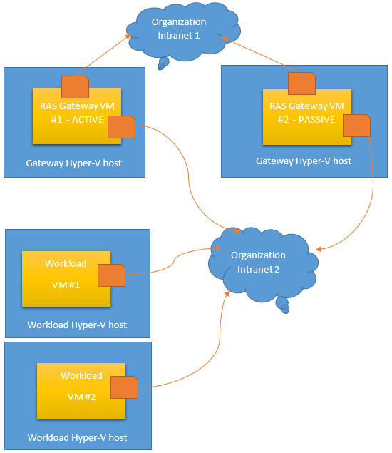
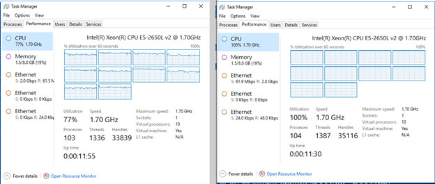
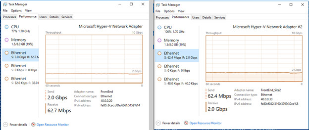
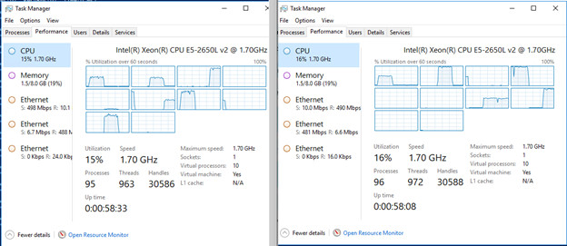
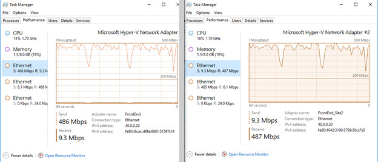

# RAS Gateway GRE Tunnel Throughput and Performance

>Applies to: Windows Server \(Semi-Annual Channel\)

You can use this topic to learn about Remote Access Server \(RAS\) Gateway Generic Routing Encaptulation \(GRE\) Tunnel performance on Windows Server, version 1709, in a non-Software Defined Networking \(SDN\) based test environment.

RAS Gateway is a software router and gateway that you can use in either single tenant mode or multitenant mode. This topic discusses a single tenant mode, high availability configuration with Failover Clustering.

>[!NOTE]
>Failover Clustering is a Windows Server feature that enables you to group multiple servers together into a fault-tolerant cluster. For more information, see [Failover Clustering](https://docs.microsoft.com/windows-server/failover-clustering/failover-clustering-overview).

Single tenant mode allows organizations of any size to deploy the gateway as an exterior, or Internet\-facing edge virtual private network \(VPN\) server. In single tenant mode, you can deploy RAS Gateway on a physical server or virtual machine \(VM\). This topic describes RAS Gateway deployment on two Virtual Machines \(VMs\) that are configured in a failover cluster.

GRE is a lightweight tunneling protocol that can encapsulate a wide variety of network layer protocols inside virtual point\-to\-point links over an Internet Protocol internetwork. The Microsoft GRE implementation encapsulates both IPv4 and IPv6.

For more information, see the section **RAS Gateway Deployment Scenarios** in the topic [RAS Gateway](https://docs.microsoft.com/windows-server/remote/remote-access/ras-gateway/ras-gateway#bkmk_deploy).

In this test scenario, which is depicted in the following illustration, the traffic flow that is measured moves from the Organization Intranet out to the Internet. Tenant Workload VMs send network traffic from the Organization Intranet to the Internet by using RAS Gateway.

## Test Environment Configuration

This section provides information about the test environment and RAS Gateway configuration.

In the test environment, RAS Gateway VMs are deployed on Hyper\-V hosts in a failover cluster for high availability.

### Hyper\-V Host Configuration

Two Hyper\-V hosts are configured to support the test scenario in the following manner. 

- Two dual\-homed physical computers are configured with Windows Server, version 1709
- The two physical network adapters in each of the two servers are connected to different subnetworks - one network that represents an organization Intranet, and another network that represents the Internet. Both networks and supporting hardware have a capacity of 10 GBps.
- Hyperthreading on the physical servers is disabled. This provides the maximum throughput from the physical NICs.
- The Hyper\-V server role is installed on both servers and configured with two External Hyper\-V Virtual Switches, one for each physical network adapter.
- Because both servers are connected to the same intranet, the servers can communicate with each other.
- The Hyper\-V hosts are configured in a failover cluster over the intranet network. 

>[!NOTE]
>For more information, see [Hyper-V Virtual Switch](https://docs.microsoft.com/windows-server/virtualization/hyper-v-virtual-switch/hyper-v-virtual-switch).

### VM Configuration

Two VMs are configured to support the test scenario in the following manner.

- On each server a VM is installed that is running Windows Server, version 1709. Each VM is configured with 10 Cores and 8 GB RAM.
- Each VM is also configured with two virtual network adapters. One virtual network adapter is connected to the intranet virtual switch, and the other virtual network adapter is connected to the Internet virtual switch.
- Each VM has RAS Gateway installed and configured as a GRE\-based VPN server.
- The gateway VMs are configured in a failover cluster. When clustered, one VM is active and the other VM is passive.

### Workload Hyper\-V Hosts and VMs

For this test, two Workload Hyper\-V hosts are installed on the intranet, and each host has one VM installed. If you are duplicating this test in your own test environment, you can install as many workload servers and VMs as is appropriate for your purposes.

- Workload Hyper\-V hosts have one physical network adapter installed that is connected to the Organization Intranet.
- In Hyper\-V Virtual Switch, one virtual switch is created on each host. The switch is External and is bound to the one network adapter connected to the intranet.
- - The workload VMs are configured with 2 GB RAM and 2 Cores.
- The Workload VMs each have one virtual network adapter that is connected to the intranet virtual switch.

### Traffic Generator Tool

The traffic generator tool that is used in this test is the ctsTraffic tool. The Git repository for this tool is located at [https://github.com/Microsoft/ctsTraffic](https://github.com/Microsoft/ctsTraffic).

## RAS Gateway Performance

The illustrations in this section depict Task Manager displays of GRE tunnel throughput with multiple TCP connections.

You can achieve up to 2.0 Gbps throughput on multi\-core VMs that are configured as GRE RAS Gateways.

### GRE Tunnel Performance with Multiple TCP Sessions

With multiple TCP sessions, the CPU utilization reaches 100% and the maximum throughput on the GRE tunnel is 2.0 Gbps.

The following illustration depicts CPU Utilization on both of the RAS Gateway VMs. The active VM, RAS Gateway VM #1, is on the left, while the passive VM, RAS Gateway VM #2, is on the right.

The following illustration depicts Ethernet network throughput on the RAS Gateway VMs. The active VM, RAS Gateway VM #1, is on the left, while the passive VM, RAS Gateway VM #2, is on the right.

### GRE Tunnel Performance with One TCP Connection

With the test configuration changed from multiple TCP sessions to a single TCP session, only one CPU core reaches maximum capacity on the RAS Gateway VMs.

The maximum throughput on the GRE tunnel is between 400-500 Mbps.

The following illustration depicts CPU Utilization on both of the RAS Gateway VMs. The active VM, RAS Gateway VM #1, is on the left, while the passive VM, RAS Gateway VM #2, is on the right.

The following illustration depicts Ethernet network throughput on the RAS Gateway VMs. The active VM, RAS Gateway VM #1, is on the left, while the passive VM, RAS Gateway VM #2, is on the right.

