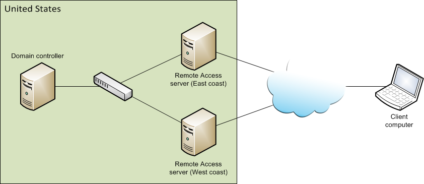

# Step 2 Plan the Multisite Infrastructure

>Applies To: Windows Server (Semi-Annual Channel), Windows Server 2016

The next step in deploying Remote Access in a multisite topology is to complete the multisite infrastructure planning; including, Active Directory, security groups, and Group Policy Objects.  
## <a name="bkmk_2_1_AD"></a>2.1 Plan Active Directory  
A Remote Access multisite deployment can be configured in a number of topologies:  
  
-   **Single Active Directory site, multiple entry points**-In this topology, you have a single Active Directory site for your entire organization with fast intranet links throughout the site, but you have multiple Remote Access servers deployed throughout your organization, each acting as an entry point. A geographical example of this topology is to have a single Active Directory site for the United States with entry points on the East coast and the West coast.  
  
      
  
-   **Multiple Active Directory sites, multiple entry points**-In this topology, you have two or more Active Directory sites with a Remote Access server deployed as an entry point for each site. Each Remote Access server is associated with the Active Directory domain controller for the site. A geographical example of this topology is to have an Active Directory site for the United States and one for Europe with a single entry point for each site. Note that if you have multiple Active Directory sites you do not need to have an entry point associated with each site. In addition, some Active Directory sites can have more than one entry point associated with it.  
  
      
  
In a multisite entry point, you can configure a single Remote Access server, multiple Remote Access servers, or a Remote Access server clusters.   
  
### Active Directory best practices and recommendations  
Note the following recommendations and constraints for Active Directory deployment in a multisite scenario:  
  
1.  Each Active Directory site can contain one or more Remote Access servers, or a server cluster, functioning as multisite entry points for client computers. However an Active Directory site is not required to have an entry point.  
  
2.  A multisite entry point can only be associated with a single Active Directory site. When client computers running Windows 8 connect to a specific entry point, they are considered as belonging to the Active Directory site associated with that entry point.  
  
3.  It is recommended that each Active Directory site has a domain controller. The domain controller can be read-only.  
  
4.  If each Active Directory site contains a domain controller, The GPO for a server in the entry point is managed by one of the domain controllers in the Active Directory site associated with the endpoint. If there are no write-enabled domain controllers in that site, then the GPO for a server is managed on a write-enabled domain controller that is found closest to the first Remote Access server that is configured in the entry point. Closest is determined by a link cost calculation. Note that in this scenario, after making configuration changes there might be a delay when replicating between the domain controller managing the GPO and the read-only domain controller in the server's Active Directory site.  
  
5.  Client GPOs and optional application server GPOs are managed on the domain controller running as the Primary Domain Controller (PDC) emulator. This means that client GPOs are not necessarily managed in the Active Directory site containing the entry point to which clients connect.  
  
6.  If the domain controller for an Active Directory site is unreachable, the Remote Access server will connect to an alternate domain controller in the site (if available). If not, it connects to the domain controller for another site to retrieve an updated GPO and to authenticate clients. In both cases, the Remote Access Management console and PowerShell cmdlets cannot be used to retrieve or modify configuration settings until the domain controller is available. Note the following:  
  
    1.  If the server running as the PDC emulator is unavailable, you must designate an available domain controller that has updated GPOs as the PDC emulator.  
  
    2.  If the domain controller that manages a server GPO is unavailable, use the Set-DAEntryPointDC PowerShell cmdlet to associate a new domain controller with the entry point. The new domain controller should have up-to-date GPOs before running the cmdlet.  
  
## <a name="bkmk_2_2_SG"></a>2.2 Plan security groups  
During deployment of a single server with advanced settings, all client computers accessing the internal network via DirectAccess were gathered into a security group. In a multisite deployment, this security group is used for Windows 8 client computers only. For a multisite deployment,  Windows 7  client computers will be gathered into separate security groups for each entry point in the multisite deployment. For example, if you previously grouped all client computers in the group DA_Clients, you must now remove any  Windows 7  computers from that group and put them in a different security group. For example, in the multiple Active Directory sites, multiple entry points topology, you create a security group for the United States entry point (DA_Clients_US) and one for the Europe entry point (DA_Clients_Europe). Place any Windows 7 client computers located in the United States in the DA_Clients_US group and any located in Europe in the DA_Clients_Europe group. If you do not have any  Windows 7  client computers, you do not need to plan security groups for  Windows 7  computers.  
  
Required security groups are as follows:  
  
-   One security group for all Windows 8 client computers. It is recommended to create a unique security group for these clients for each domain.  
  
-   A unique security group containing  Windows 7  client computers for each entry point. It is recommended to create a unique group for each domain. For example: Domain1\DA_Clients_Europe; Domain2\DA_Clients_Europe; Domain1\DA_Clients_US; Domain2\DA_Clients_US.  
  
## <a name="bkmk_2_3_GPO"></a>2.3 Plan Group Policy Objects  
DirectAccess settings configured during Remote Access deployment are collected into GPOs. Your single server deployment already uses GPOs for DirectAccess clients, the Remote Access server, and optionally for application servers. A multisite deployment requires the following GPOs:  
  
-   A server GPO for each entry point.  
  
-   A GPO for each domain containing client computers running Windows 8.  
  
-   A GPO for each entry point and each domain containing  Windows 7  client computers.  
  
GPOs can be configured as follows:  
  
-   **Automatically**-You can specify that GPOs are created automatically by Remote Access. A default name is specified for each GPO, and can be modified.  
  
-   **Manually**-You can use GPOs that have been created manually by the Active Directory administrator.  
  
> [!NOTE]  
> Once DirectAccess is configured to use specific GPOs, it cannot be configured to use different GPOs.  
  
### 2.3.1 Automatically-created GPOs  
Note the following when using automatically-created GPOs:  
  
-   Automatically created GPOs are applied according to the location and link target parameter, as follows:  
  
    -   For the server GPO, both the location and link parameters point to the domain containing the Remote Access server.  
  
    -   For client GPOs, the link target is set to the root of the domain in which the GPO was created. A GPO is created for each domain that contains client computers, and the GPO will be linked to the root of each domain. .  
  
-   For automatically-created GPOs, to apply DirectAccess settings the Remote Access server administrator requires the following permissions:  
  
    -   GPO create permissions for required domains.  
  
    -   Link permissions for all the selected client domain roots.  
  
    -   Permission to create the WMI filter for GPOs is required if DirectAccess was configured to work on mobile computers only.  
  
    -   Link permissions for the roots of domains associated with the entry points (the server GPO domains)  
  
    -   It is recommended that the Remote Access administrator has GPO read permissions for each required domain. This enables Remote Access to verify that GPOs with duplicate names do not exist when creating GPOs for the multisite deployment.  
  
    -   Active Directory replication permissions on domains associated with entry points. This is because when initially adding entry points, the server GPO for the entry point is created on the domain controller closest to that entry point. However, since link creation is supported on the PDC emulator only, the GPO must be replicated from the domain controller on which it was created to the domain controller running as the PDC emulator before creating the link.  
  
Note that if the correct permissions for replication and linking GPOs do not exist, a warning is issued. The Remote Access operation will continue but replication and linking will not occur. If a link warning is issued links will not be created automatically, even after the permissions are in place. Instead the administrator will need to create the links manually.  
  
### 2.3.2 Manually created GPOs  
Note the following when using manually-created GPOs:  
  
-   The following GPOs should be created manually for the multisite deployment:  
  
    -   **Server GPO**-A server GPO for each entry point (in the domain in which the entry point is located). This GPO will be applied on each Remote Access server in the entry point.  
  
    -   **Client GPO (Windows 7)**-A GPO for each entry point and each domain containing  Windows 7  client computers that will connect to entry points in the multisite deployment. For example Domain1\DA_W7_Clients_GPO_Europe; Domain2\DA_W7_Clients_GPO_Europe; Domain1\DA_W7_Clients_GPO_US; Domain2\DA_W7_Clients_GPO_US. If no  Windows 7  client computers will connect to entry points, GPOs are not required.  
  
-   There is no requirement to create additional GPOs for Windows 8 client computers. A GPO for each domain containing client computers was already created when the single Remote Access server was deployed. In a multisite deployment these client GPOs will function as the GPOs for Windows 8 clients.  
  
-   The GPOs should exist before clicking the Commit button in the multisite deployment wizards.  
  
-   When using manually created GPOs a search is made for a link to the GPO in the entire domain. If the GPO is not linked in the domain then a link is automatically created in the domain root. If the required permissions to create the link are not available a warning is issued.  
  
-   When using manually-created GPOs, to apply DirectAccess settings the Remote Access server administrator requires full GPO permissions (Edit, Delete, Modify security) on the manually-created GPOs.  
  
Note that if the correct permissions for replication and linking GPOs do not exist, a warning is issued. The Remote Access operation will continue but replication and linking will not occur. If a link warning is issued links will not be created automatically, even after the permissions are in place. Instead the administrator will need to create the links manually.  
  
### 2.3.3 Managing GPOs in a multi-domain controller environment  
Each GPO will be managed by a specific domain controller, as follows:  
  
-   The server GPO is managed by one of the domain controllers in the Active Directory site associated with the server, or if domain controllers in that site are read-only, by a write-enabled domain controller closest to the first server in the entry point.  
  
-   Client GPOs will be managed by the domain controller running as the PDC emulator.  
  
If you want to manually modify GPO settings note the following:  
  
-   For server GPOs, in order to identify which domain controller is associated with a specific entry point, run the PowerShell cmdlet `Get-DAEntryPointDC -EntryPointName <name of entry point>`.  
  
-   By default, when you make changes with networking PowerShell cmdlets or the Group Policy Management console, the domain controller acting as the PDC emulator is used.  
  
-   If you modify settings on a domain controller that is not the domain controller associated with the entry point (for server GPOs) or the PDC emulator (for client GPOs), note the following:  
  
    1.  Before modifying the settings, ensure that the domain controller is replicated with an up-to-date GPO, and [back up GPO settings](https://go.microsoft.com/fwlink/?LinkID=257928), before making changes. If the GPO is not updated, merge conflicts during replication might occur, resulting in a corrupt Remote Access configuration.  
  
    2.  After modifying the settings, you must wait for changes to replicate to the domain controller that is associated with the GPOs. Do not make additional changes using the Remote Access Management console or Remote Access PowerShell cmdlets until replication is complete. If a GPO is edited on two different domain controllers before replication is complete, merge conflicts might occur, resulting in a corrupt configuration  
  
-   Alternatively you can change the default setting using the **Change Domain Controller** dialog box in the Group Policy Management console, or using the **Open-NetGPO** PowerShell cmdlet, so that changes made using the console or the networking cmdlets use the domain controller you specify.  
  
    1.  To do this in the Group Policy Management console, right-click the domain or sites container and click **Change Domain Controller**.  
  
    2.  To do this in PowerShell, specify the DomainController parameter for the Open-NetGPO cmdlet. For example, to enable the private and public profiles in Windows Firewall on a GPO named domain1\DA_Server_GPO _Europe using a domain controller named europe-dc.corp.contoso.com, do the following:  
  
        ```  
        $gpoSession = Open-NetGPO -PolicyStore "domain1\DA_Server_GPO _Europe" -DomainController "europe-dc.corp.contoso.com"  
        Set-NetFirewallProfile -GpoSession $gpoSession -Name @("Private","Public") -Enabled True  
        Save-NetGPO -GpoSession $gpoSession  
        ```  
  
#### Modifying domain controller association  
To maintain the configuration consistency in a multisite deployment, it is important to make sure that each GPO is managed by a single domain controller. In some scenarios, it may be required to assign a different domain controller for a GPO:  
  
-   **Domain controller maintenance and downtime**-When the domain controller that manages a GPO is not available, it may be required to manage the GPO on a different domain controller.  
  
-   **Optimization of configuration distribution**-After network infrastructure changes, it may be required to manage the server GPO of an entry point on a domain controller in the same Active Directory site as the entry point.   
  
## <a name="bkmk_2_4_DNS"></a>2.4 Plan DNS  
Note the following when planning DNS for a multisite deployment:  
  
1.  Client computers use the ConnectTo address in order to connect to the Remote Access server. Each entry point in your deployment requires a different ConnectTo address. Each entry point ConnectTo address must be available in the public DNS and the address that you choose must match the subject name of the IP-HTTPS certificate that you deploy for the IP-HTTPS connection.   
  
2.  In addition, Remote Access enforces symmetric routing; therefore, only Teredo and IP-HTTPS clients can connect when a multisite deployment is enabled. To allow native IPv6 clients to connect, the ConnectTo address (the IP-HTTPS URL) must resolve to both the external (Internet-facing) IPv6 and IPv4 addresses on the Remote Access server.  
  
3.  Remote Access creates a default web probe that is used by DirectAccess client computers to verify connectivity to the internal network. During configuration of the single server the following names should have been registered in DNS:  
  
    1.  directaccess-WebProbeHost-should resolve to the internal IPv4 address of the Remote Access server, or to the IPv6 address in an IPv6-only environment.  
  
    2.  directaccess-CorpConnectivityHost-should resolve to a localhost (loopback) address (either ::1 or 127.0.0.1, depending on whether IPv6 is deployed in the corporate network).  
  
    In a multisite deployment an additional DNS entry for directaccess-WebProbeHost must be created for each entry point. When adding an entry point, Remote Access tries to automatically create this additional directaccess-WebProbeHost entry. However, if it fails a warning will be shown and you must create the entry manually.  
  
    > [!NOTE]  
    > When DNS scavenging is enabled in your DNS infrastructure, it is recommended to disable scavenging on the DNS entries created automatically by Remote Access.  
  

  


