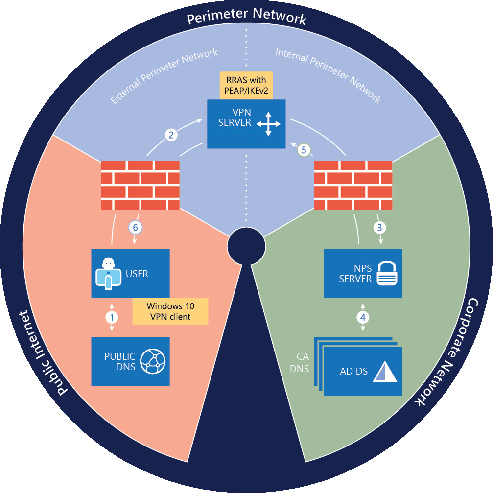
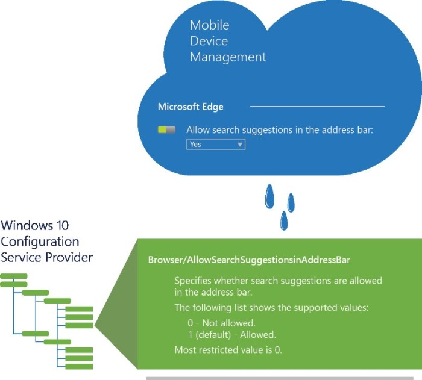

# Always On VPN technology overview

>Applies to: Windows Server (Semi-Annual Channel), Windows Server 2016, Windows Server 2012 R2, Windows 10

- [**Previous:** Learn about the Always On VPN enhancements](always-on-vpn-enhancements.md)
- [**Next:** Learn about the advanced features of Always On VPN](deploy/always-on-vpn-adv-options.md)

For this deployment, you must install a new Remote Access server that is running Windows Server 2016, as well as modify some of your existing infrastructure for the deployment.

The following illustration shows the infrastructure that is required to deploy Always On VPN.

The connection process depicted in this illustration is comprised of the following steps:

1. Using public DNS servers, the Windows 10 VPN client performs a name resolution query for the IP address of the VPN gateway.

2. Using the IP address returned by DNS, the VPN client sends a connection request to the VPN gateway.

3. The VPN gateway is also configured as a Remote Authentication Dial-In User Service (RADIUS) Client; the VPN RADIUS Client sends the connection request to the organization/corporate NPS server for connection request processing.

4. The NPS server processes the connection request, including performing authorization and authentication, and determines whether to allow or deny the connection request.

5. The NPS server forwards an Access-Accept or Access-Deny response to the VPN gateway.

6. The connection is initiated or terminated based on the response that the VPN server received from the NPS server.

For more information on each infrastructure component depicted in the illustration above, see the following sections.

>[!NOTE]
>If you already have some of these technologies deployed on your network, you can use the instructions in this deployment guidance to perform additional configuration of the technologies for this deployment purpose.

## Domain Name System (DNS)

Both internal and external Domain Name System (DNS) zones are required, which assumes that the internal zone is a delegated subdomain of the external zone (for example, corp.contoso.com and contoso.com).

Learn more about [Domain Name System (DNS)](../../../../networking/dns/dns-top.md) or [Core Network Guide](../../../../networking/core-network-guide/core-network-guide.md).

>[!NOTE]
>Other DNS designs, such as split-brain DNS (using the same domain name internally and externally in separate DNS zones) or unrelated internal and external domains (e.g., contoso.local and contoso.com) are also possible. For more information about deploying split-brain DNS, see [Use DNS Policy for Split-Brain DNS Deployment](../../../../networking/dns/deploy/split-brain-DNS-deployment.md).

## Firewalls

Make sure that your firewalls allow the traffic that is necessary for both VPN and RADIUS communications to function correctly.

For more information, see [Configure Firewalls for RADIUS Traffic](../../../../networking/technologies/nps/nps-firewalls-configure.md).

## Remote Access as a RAS Gateway VPN Server

In Windows Server 2016, the Remote Access server role is designed to perform well as both a router and a remote access server; therefore, it supports a wide array of features. For this deployment guidance, you require only a small subset of these features: support for IKEv2 VPN connections and LAN routing.

IKEv2 is a VPN tunneling protocol described in Internet Engineering Task Force Request for Comments 7296. The primary advantage of IKEv2 is that it tolerates interruptions in the underlying network connection. For example, if the connection is temporarily lost or if a user moves a client computer from one network to another, IKEv2 automatically restores the VPN connection when the network connection is reestablished—all without user intervention.

By using RAS Gateway, you can deploy VPN connections to provide end users with remote access to your organization's network and resources. Deploying Always On VPN maintains a persistent connection between clients and your organization network whenever remote computers are connected to the Internet. With RAS Gateway, you can also create a site-to-site VPN connection between two servers at different locations, such as between your primary office and a branch office, and use Network Address Translation (NAT) so that users inside the network can access external resources, such as the Internet. Also, RAS Gateway supports Border Gateway Protocol (BGP), which provides dynamic routing services when your remote office locations also have edge gateways that support BGP.

You can manage Remote Access Service (RAS) Gateways by using Windows PowerShell commands and the Remote Access Microsoft Management Console (MMC).

## Network Policy Server (NPS)

NPS allows you to create and enforce organization-wide network access policies for connection request authentication and authorization. When you use NPS as a Remote Authentication Dial-In User Service (RADIUS) server, you configure network access servers, such as VPN servers, as RADIUS clients in NPS.

You also configure network policies that NPS uses to authorize connection requests, and you can configure RADIUS accounting so that NPS logs accounting information to log files on the local hard disk or in a Microsoft SQL Server database.

For more information, see [Network Policy Server (NPS)](../../../../networking/technologies/nps/nps-top.md).

## Active Directory Certificate Services

The Certification Authority (CA) Server is a certification authority that is running Active Directory Certificate Services. The VPN configuration requires an Active Directory-based public key infrastructure (PKI).

Organizations can use AD CS to enhance security by binding the identity of a person, device, or service to a corresponding public key. AD CS also includes features that allow you to manage certificate enrollment and revocation in a variety of scalable environments. For more information, see [Active Directory Certificate Services Overview](https://technet.microsoft.com/library/hh831740.aspx) and [Public Key Infrastructure Design Guidance](https://social.technet.microsoft.com/wiki/contents/articles/2901.public-key-infrastructure-design-guidance.aspx).

During completion of the deployment, you will configure the following certificate templates on the CA.

- The User Authentication certificate template

- The VPN Server Authentication certificate template

- The NPS Server Authentication certificate template

### Certificate Templates

Certificate templates can greatly simplify the task of administering a certification authority (CA) by allowing you to issue certificates that are preconfigured for selected tasks. The Certificate Templates MMC snap-in allows you to perform the following tasks.

- View properties for each certificate template.

- Copy and modify certificate templates.

- Control which users and computers can read templates and enroll for certificates.

- Perform other administrative tasks relating to certificate templates.

Certificate templates are an integral part of an enterprise certification authority (CA). They are an important element of the certificate policy for an environment, which is the set of rules and formats for certificate enrollment, use, and management.

For more information, see [Certificate Templates](https://technet.microsoft.com/library/cc730705.aspx).

### Digital Server Certificates

This deployment guidance provides instructions for using Active Directory Certificate Services (AD CS) to both enroll and automatically enroll certificates to Remote Access and NPS infrastructure servers. AD CS allows you to build a public key infrastructure (PKI) and provide public key cryptography, digital certificates, and digital signature capabilities for your organization.

When you use digital server certificates for authentication between computers on your network, the certificates provide:

1. Confidentiality through encryption.

2. Integrity through digital signatures.

3. Authentication by associating certificate keys with a computer, user, or device accounts on a computer network.

For more information, see [AD CS Step by Step Guide: Two Tier PKI Hierarchy Deployment](https://social.technet.microsoft.com/wiki/contents/articles/15037.ad-cs-step-by-step-guide-two-tier-pki-hierarchy-deployment.aspx).

## Active Directory Domain Services (AD DS)

AD DS provides a distributed database that stores and manages information about network resources and application-specific data from directory-enabled applications. Administrators can use AD DS to organize elements of a network, such as users, computers, and other devices, into a hierarchical containment structure. The hierarchical containment structure includes the Active Directory forest, domains in the forest, and organizational units (OUs) in each domain. A server that is running AD DS is called a domain controller.

AD DS contains the user accounts, computer accounts, and account properties that are required by Protected Extensible Authentication Protocol (PEAP) to authenticate user credentials and to evaluate authorization for VPN connection requests. For information about deploying AD DS, see the Windows Server 2016 [Core Network Guide](../../../../networking/core-network-guide/Core-Network-Guide.md).

During completion of the steps in this deployment, you will configure the following items on the domain controller.

- Enable certificate autoenrollment in Group Policy for computers and users

- Create the VPN Users Group

- Create the VPN Servers Group

- Create the NPS Servers Group

### Active Directory Users and Computers

Active Directory Users and Computers is a component of AD DS that contains accounts that represent physical entities, such as a computer, a person, or a security group. A security group is a collection of user or computer accounts that administrators can manage as a single unit. User and computer accounts that belong to a particular group are referred to as group members.

User accounts in Active Directory Users and Computers have dial-in properties that NPS evaluates during the authorization process - unless the **Network Access Permission** property of the user account is set to **Control access through NPS Network Policy**. This is the default setting for all user accounts. In some cases, however, this setting might have a different configuration that blocks the user from connecting using VPN. To protect against this possibility, you can configure the NPS server to ignore user account dial-in properties.

For more information, see [Configure NPS to Ignore User Account Dial-in Properties](../../../../networking/technologies/nps/nps-np-configure.md#configure-nps-to-ignore-user-account-dial-in-properties).

### Group Policy Management

Group Policy Management enables directory-based change and configuration management of user and computer settings, including security and user information. You use Group Policy to define configurations for groups of users and computers.

With Group Policy, you can specify settings for registry entries, security, software installation, scripts, folder redirection, remote installation services, and Internet Explorer maintenance. The Group Policy settings that you create are contained in a Group Policy object (GPO). By associating a GPO with selected Active Directory system containers — sites, domains, and OUs — you can apply the GPO's settings to the users and computers in those Active Directory containers. To manage Group Policy objects across an enterprise, you can use the
Group Policy Management Editor Microsoft Management Console (MMC).

## Windows 10 VPN Clients

In addition to the server components, ensure that the client computers you configure to use VPN are running Windows 10 Anniversary Update (version 1607). The Windows 10 VPN clients must be domain-joined to your Active Directory domain.

The Windows 10 VPN client is highly configurable and offers many options. To better illustrate the specific features this scenario uses, Table 1 identifies the VPN feature categories and specific configurations that this deployment references. You’ll configure the individual settings for these features by using the VPNv2 configuration service provider (CSP) discussed later in this deployment. 

Table 1. VPN Features and Configurations Discussed in this Deployment

| VPN feature     |     Deployment scenario configuration         |
|-----------------|-----------------------------------------------|
| Connection type |                 Native IKEv2                  |
|     Routing     |                Split tunneling                |
| Name resolution |  Domain Name Information List and DNS suffix  |
|   Triggering    |    Always On and Trusted Network Detection    |
| Authentication  | PEAP-TLS with TPM–protected user certificates |

>[!NOTE]
>PEAP-TLS and TPM are "Protected Extensible Authentication Protocol with Transport Layer Security" and "Trusted Platform Module," respectively.

### VPNv2 CSP Nodes

In this deployment, you use the ProfileXML VPNv2 CSP node to create the VPN profile that is delivered to Windows 10 client computers. Configuration Service Providers (CSPs) are interfaces that expose various management capabilities within the Windows client; conceptually, CSPs work similar to how Group Policy works. Each CSP has configuration nodes that represent individual settings. Also like Group Policy settings, you can tie CSP settings to registry keys, files, permissions, and so on. Similar to how you use the Group Policy Management Editor to configure Group Policy objects (GPOs), you configure CSP nodes by using a mobile device management (MDM) solution such as Microsoft Intune. MDM products like Intune offer a user-friendly configuration option that configures the CSP in the operating system.

However, you can’t configure some CSP nodes directly through a user interface (UI) like the Intune Admin Console. In these cases, you must configure the Open Mobile Alliance Uniform Resource Identifier (OMA-URI) settings manually. You configure OMA-URIs by using the OMA Device Management protocol (OMA-DM), a universal device management specification that most modern Apple, Android, and Windows devices support. As long as they adhere to the OMA-DM specification, all MDM products should interact with these operating systems in the same way.

Windows 10 offers many CSPs, but this deployment focuses on using the VPNv2 CSP to configure the VPN client. The VPNv2 CSP allows configuration of each VPN profile setting in Windows 10 through a unique CSP node. Also contained in the VPNv2 CSP is a node called *ProfileXML*, which allows you to configure all the settings in one node rather than individually. For more information about ProfileXML, see the section “ProfileXML overview” later in this deployment. For details about each VPNv2 CSP node, see the [VPNv2 CSP](https://msdn.microsoft.com/windows/hardware/commercialize/customize/mdm/vpnv2-csp).

## Next steps

- [Learn about some of the advanced Always On VPN features](deploy/always-on-vpn-adv-options.md)

- [Start planning your Always On VPN deployment](deploy/always-on-vpn-deploy-deployment.md)

## Related topics

- [Microsoft server software support for Microsoft Azure virtual machines](https://support.microsoft.com/help/2721672/microsoft-server-software-support-for-microsoft-azure-virtual-machines): This article discusses the support policy for running Microsoft server software in the Microsoft Azure virtual machine environment (infrastructure-as-a-service).

- [Remote Access](../../Remote-Access.md): This topic provides an overview of the Remote Access server role in Windows Server 2016.

- [Windows 10 VPN Technical Guide](https://docs.microsoft.com/windows/access-protection/vpn/vpn-guide): This guide walks you through the decisions you will make for Windows 10 clients in your enterprise VPN solution and how to configure your deployment. This guide references the VPNv2 Configuration Service Provider (CSP) and provides mobile device management (MDM) configuration instructions using Microsoft Intune and the VPN Profile template for Windows 10.

- [Core Network Guide](../../../../networking/core-network-guide/Core-Network-Guide.md): This guide provides instructions on how to plan and deploy the core components required for a fully functioning network and a new Active Directory domain in a new forest.

- [Domain Name System (DNS)](../../../../networking/dns/dns-top.md): This topic provides an overview of Domain Name Systems (DNS). In Windows Server 2016, DNS is a server role that you can install by using Server Manager or Windows PowerShell commands. If you are installing a new Active Directory forest and domain, DNS is automatically installed with Active Directory as the Global Catalogue server for the forest and domain.

- [Active Directory Certificate Services Overview](https://technet.microsoft.com/library/hh831740.aspx): This document provides an overview of Active Directory Certificate Services (AD CS) in Windows Server® 2012. AD CS is the Server Role that allows you to build a public key infrastructure (PKI) and provide public key cryptography, digital certificates, and digital signature capabilities for your organization.

- [Public Key Infrastructure Design Guidance](https://social.technet.microsoft.com/wiki/contents/articles/2901.public-key-infrastructure-design-guidance.aspx):  This wiki provides guidance on designing Public Key Infrastructures (PKIs). Before you configure a PKI and certification authority (CA) hierarchy, you should be aware of your organization's security policy and certificate practice statement (CPS).

- [AD CS Step by Step Guide: Two Tier PKI Hierarchy Deployment](https://social.technet.microsoft.com/wiki/contents/articles/15037.ad-cs-step-by-step-guide-two-tier-pki-hierarchy-deployment.aspx): This step-by-step guide describes the steps needed to set up a basic configuration of Active Directory® Certificate Services (AD CS) in a lab environment. AD CS in Windows Server® 2008 R2 provides customizable services for creating and managing public key certificates used in software security systems employing public key technologies.

- [Network Policy Server (NPS)](../../../../networking/technologies/nps/nps-top.md): This topic provides an overview of Network Policy Server in Windows Server 2016. Network Policy Server (NPS) allows you to create and enforce organization-wide network access policies for connection request authentication and authorization.
