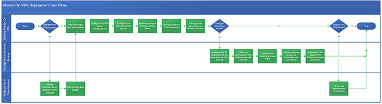

# Deploy Always On VPN

>Applies to: Windows Server (Semi-Annual Channel), Windows Server 2016, Windows Server 2012 R2, Windows 10

- [**Previous:** Learn about the Always On VPN advanced features](always-on-vpn-adv-options.md)
- [**Next:** Step 1. Start planning the Always On VPN deployment](always-on-vpn-deploy-planning.md)

In this section, you learn about the workflow for deploying Always On VPN connections for remote domain-joined Windows 10 client computers. If you want to **configure conditional access** to fine-tune how VPN users access your resources, see [Conditional access for VPN connectivity using Azure AD](../../ad-ca-vpn-connectivity-windows10.md). To learn more about conditional access for VPN connectivity using Azure AD, see [Conditional access in Azure Active Directory](https://docs.microsoft.com/azure/active-directory/active-directory-conditional-access-azure-portal). 

The following diagram illustrates the workflow process for the different scenarios when deploying Always On VPN:

>[!IMPORTANT]
>For this deployment, it is not a requirement that your infrastructure servers, such as computers running Active Directory Domain Services, Active Directory Certificate Services, and Network Policy Server, are running Windows Server 2016. You can use earlier versions of Windows Server, such as Windows Server 2012 R2, for the infrastructure servers and for the server that is running Remote Access.

## [Step 1. Plan the Always On VPN Deployment](always-on-vpn-deploy-planning.md)

In this step, you start to plan and prepare your Always On VPN deployment. Before you install the Remote Access server role on the computer you're planning on using as a VPN server. After proper planning, you can deploy Always On VPN, and optionally configure conditional access for VPN connectivity using Azure AD.

## [Step 2. Configure the Always On VPN Server Infrastructure](vpn-deploy-server-infrastructure.md)

In this step, you install and configure the server-side components necessary to support the VPN. The server-side components include configuring PKI to distribute the certificates used by users, the VPN server, and the NPS server.  You also configure RRAS to support IKEv2 connections and the NPS server to perform authorization for the VPN connections.

To configure the server infrastructure, you must perform the following tasks:

- **On a server configured with Active Directory Domain Services:** Enable certificate autoenrollment in Group Policy for both computers and users, create the VPN Users Group, the VPN Servers Group, and the NPS Servers Group, and add members to each group.
- **On an Active Directory Certificate Server CA:** Create the User Authentication, VPN Server Authentication, and NPS Server Authentication certificate templates.
- **On domain-joined Windows 10 clients:** Enroll and validate user certificates.

## [Step 3. Configure the Remote Access Server for Always On VPN](vpn-deploy-ras.md)

In this step, you configure Remote Access VPN to allow IKEv2 VPN connections, deny connections from other VPN protocols, and assign a static IP address pool for the issuance of IP addresses to connecting authorized VPN clients.

To configure RAS, you must perform the following tasks:

- Enroll and validate the VPN server certificate
- Install and configure Remote Access VPN

## [Step 4. Install and Configure the NPS Server](vpn-deploy-nps.md)

In this step, you install Network Policy Server (NPS) by using either Windows PowerShell or the Server Manager Add Roles and Features Wizard. You also configure NPS to handle all authentication, authorization, and accounting duties for connection request that it receives from the VPN server.

To configure NPS, you must perform the following tasks:

- Register the NPS Server in Active Directory
- Configure RADIUS Accounting for your NPS Server
- Add the VPN Server as a RADIUS Client in NPS
- Configure Network Policy in NPS
- Autoenroll the NPS Server certificate

## [Step 5. Configure DNS and Firewall Settings for Always On VPN](vpn-deploy-dns-firewall.md)

In this step, you configure DNS and Firewall settings. When remote VPN clients connect, they use the same DNS servers that your internal clients use, which allows them to resolve names in the same manner as the rest of your internal workstations. 

## [Step 6. Configure Windows 10 Client Always On VPN Connections](vpn-deploy-client-vpn-connections.md)

In this step, you configure the Windows 10 client computers to communicate with that infrastructure with a VPN connection. You can use several technologies to configure Windows 10 VPN clients, including Windows PowerShell, System Center Configuration Manager, and Intune. All three require an XML VPN profile to configure the appropriate VPN settings.

## [Step 7. (Optional) Configure conditional access for VPN connectivity](../../ad-ca-vpn-connectivity-windows10.md)

In this optional step, you can fine-tune how authorized VPN users access your resources. With Azure AD conditional access for VPN connectivity, you can help protect the VPN connections. Conditional Access is a policy-based evaluation engine that lets you create access rules for any Azure AD connected application. For more information, see [Azure Active Directory (Azure AD) conditional access](https://docs.microsoft.com/azure/active-directory/active-directory-conditional-access-azure-portal).

## Next step

[Step 1. Plan the Always On VPN deployment](always-on-vpn-deploy-planning.md): Before you install the Remote Access server role on the computer you're planning on using as a VPN server. After proper planning, you can deploy Always On VPN, and optionally configure conditional access for VPN connectivity using Azure AD.  
