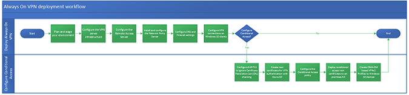

# Deploy Always On VPN

>Applies to: Windows Server 2022, Windows Server 2019, Windows Server 2016, Windows 10, Windows 11

In this tutorial, you'll learn how to deploy Always On VPN connections for remote domain-joined Windows client computers.

If you want to **configure conditional access** to fine-tune how VPN users access your resources, see [Conditional access for VPN connectivity using Azure AD](../../ad-ca-vpn-connectivity-windows10.md). To learn more about conditional access for VPN connectivity using Azure AD, see [Conditional access in Azure Active Directory](/azure/active-directory/active-directory-conditional-access-azure-portal).

The following diagram illustrates the workflow process for the different scenarios when deploying Always On VPN:

## Prerequisites

You most likely have the technologies deployed that you can use to deploy Always On VPN. Other than your DC/DNS servers, the Always On VPN deployment requires an NPS (RADIUS) server, a Certification Authority (CA) server, and a Remote Access (Routing/VPN) server. Once the infrastructure is set up, you must enroll clients and then connect the clients to your on-premises securely through several network changes.

- Active Directory domain infrastructure, including one or more Domain Name System (DNS) servers. Both internal and external Domain Name System (DNS) zones are required, which assumes that the internal zone is a delegated subdomain of the external zone (for example, corp.contoso.com and contoso.com).
- Active Directory-based public key infrastructure (PKI) and Active Directory Certificate Services (AD CS).
- Server, either virtual or physical, existing or new, to install Network Policy Server (NPS). If you already have NPS servers on your network, you can modify an existing NPS server configuration rather than add a new server.
- Remote Access as a RAS Gateway VPN server with a small subset of features supporting IKEv2 VPN connections and LAN routing.
- Perimeter network that includes two firewalls.  Ensure that your firewalls allow the traffic that is necessary for both VPN and RADIUS communications to function properly. For more information, see [Always On VPN Technology Overview](../always-on-vpn-technology-overview.md).
- Physical server or virtual machine (VM) on your perimeter network with two physical Ethernet network adapters to install Remote Access as a RAS Gateway VPN server. VMs require virtual LAN (VLAN) for the host.
- Membership in Administrators, or equivalent, is the minimum required.
- Read the planning section of this guide to ensure that you are prepared for this deployment before you perform the deployment.
- Review the design and deployment guides for each of the technologies used. These guides can help you determine whether the deployment scenarios provide the services and configuration that you need for your organization's network. For more information, see [Always On VPN Technology Overview](../always-on-vpn-technology-overview.md).
- Management platform of your choice for deploying the Always On VPN configuration because the CSP is not vendor-specific.

>[!IMPORTANT]
>For this deployment, you can use all versions of Windows Server for the infrastructure servers and for the server that is running Remote Access.
>
>Don't attempt to deploy Remote Access on a virtual machine (VM) in Microsoft Azure. Using Remote Access in Microsoft Azure is not supported, including both Remote Access VPN and DirectAccess. For more information, see [Microsoft server software support for Microsoft Azure virtual machines](https://support.microsoft.com/help/2721672/microsoft-server-software-support-for-microsoft-azure-virtual-machines).

## About this deployment

The instructions provided walk you through deploying Remote Access as a single tenant VPN RAS Gateway for point-to-site VPN connections, using any of the scenarios mentioned below, for remote client computers that are running Windows. You also find instructions for modifying some of your existing infrastructure for the deployment. Also throughout this deployment, you find links to help you learn more about the VPN connection process, servers to configure, ProfileXML VPNv2 CSP node, and other technologies to deploy Always On VPN.

**Always On VPN deployment scenarios:**

- Deploy Always On VPN only.
- Deploy Always On VPN with conditional access for VPN connectivity using Azure AD.

## What isn't provided in this deployment

This deployment does not provide instructions for:

- Active Directory Domain Services (AD DS).
- Active Directory Certificate Services (AD CS) and a Public Key Infrastructure (PKI).
- Dynamic Host Configuration Protocol (DHCP).
- Network hardware, such as Ethernet cabling, firewalls, switches, and hubs.
- Additional network resources, such as application and file servers, that remote users can access over an Always On VPN connection.
- Internet connectivity or Conditional Access for Internet connectivity using Azure AD. For details, see [Conditional access in Azure Active Directory](/azure/active-directory/active-directory-conditional-access-azure-portal).

## [Step 1. Plan the Always On VPN Deployment](always-on-vpn-deploy-planning.md)

In this step, you'll plan and prepare your Always On VPN deployment. Before you begin, you'll need to install the Remote Access server role on the computer you're planning on using as the VPN server. After proper planning, you can deploy Always On VPN, and optionally configure conditional access for VPN connectivity using Azure AD.

## [Step 2. Configure the Always On VPN Server Infrastructure](vpn-deploy-server-infrastructure.md)

In this step, you install and configure the server-side components necessary to support the VPN. The server-side components include configuring PKI to distribute the certificates used by users, the VPN server, and the NPS server.  You also configure RRAS to support IKEv2 connections and the NPS server to perform authorization for the VPN connections.

To configure the server infrastructure, you must perform the following tasks:

- **On a server configured with Active Directory Domain Services:** Enable certificate autoenrollment in Group Policy for both computers and users, create the VPN Users Group, the VPN Servers Group, and the NPS Servers Group, and add members to each group.
- **On an Active Directory Certificate Server CA:** Create the User Authentication, VPN Server Authentication, and NPS Server Authentication certificate templates.
- **On domain-joined Windows clients:** Enroll and validate user certificates.

## [Step 3. Configure the Remote Access Server for Always On VPN](vpn-deploy-ras.md)

In this step, you configure Remote Access VPN to allow IKEv2 VPN connections, deny connections from other VPN protocols, and assign a static IP address pool for the issuance of IP addresses to connecting authorized VPN clients.

To configure RAS, you must perform the following tasks:

- Enroll and validate the VPN server certificate
- Install and configure Remote Access VPN

## [Step 4. Install and Configure the NPS Server](vpn-deploy-nps.md)

In this step, you install Network Policy Server (NPS) by using either Windows PowerShell or the Server Manager Add Roles and Features Wizard. You also configure NPS to handle all authentication, authorization, and accounting duties for connection request that it receives from the VPN server.

To configure NPS, you must perform the following tasks:

- Register the NPS Server in Active Directory
- Configure RADIUS Accounting for your NPS Server
- Add the VPN Server as a RADIUS Client in NPS
- Configure Network Policy in NPS
- Autoenroll the NPS Server certificate

## [Step 5. Configure DNS and Firewall Settings for Always On VPN](vpn-deploy-dns-firewall.md)

In this step, you configure DNS and Firewall settings. When remote VPN clients connect, they use the same DNS servers that your internal clients use which allows them to resolve names in the same manner as the rest of your internal workstations.

## [Step 6. Configure Windows Client Always On VPN Connections](vpn-deploy-client-vpn-connections.md)

In this step, you configure the Windows client computers to communicate with that infrastructure with a VPN connection. You can use several technologies to configure Windows VPN clients, including Windows PowerShell, Microsoft Endpoint Configuration Manager, and Intune. All three require an XML VPN profile to configure the appropriate VPN settings.

## [Step 7. (Optional) Configure conditional access for VPN connectivity](../../ad-ca-vpn-connectivity-windows10.md)

In this optional step, you can fine-tune how authorized VPN users access your resources. With Azure AD conditional access for VPN connectivity, you can help protect the VPN connections. Conditional Access is a policy-based evaluation engine that lets you create access rules for any Azure AD connected application. For more information, see [Azure Active Directory (Azure AD) conditional access](/azure/active-directory/active-directory-conditional-access-azure-portal).

## Next step

[Plan the Always On VPN deployment](always-on-vpn-deploy-planning.md): This section will guide you on the next steps to take in preparing your Remote Access Server.
