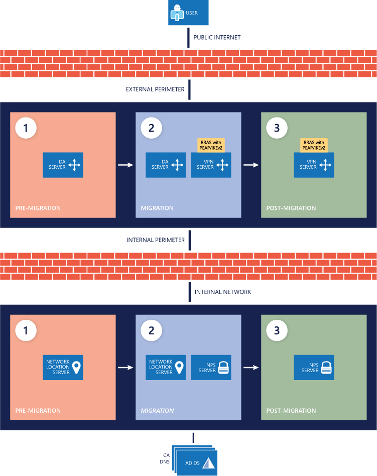

# Remote Access Always On VPN migration deployment
Before starting the migration process from DirectAccess to Always On VPN, be sure you have done the following for migration phase creation, feature information, and considerations.

This topic describes deploying the VPN infrastructure side by side with the existing DirectAccess infrastructure, deploying certificates, and the VPN configuration script.

1. **[Deploy a side-by-side VPN infrastructure](#deploy-vpn-infra).** After you have determined your migration phases and the features you want to include in your deployment, you will deploy the VPN infrastructure side by side with the existing DirectAccess infrastructure.

2. **[Deploy certificates and VPN configuration script](#win-client-migration).** After the VPN infrastructure is ready, you will create and publish the required certificates. When the clients have received the certificates, deploy the VPN configuration script.

3. **[Remove DirectAccess from clients when they show a successful deployment status](#remove-devices-from-da).** Monitor Microsoft System Center Configuration Manager or Microsoft Intune for successful VPN configuration deployments. Then, use reporting to determine device-assignment information and discover which device belongs to each user. As users are successfully migrated, remove their devices from the DirectAccess group so that you can remove DirectAccess.

4. **[Decommission the DirectAccess infrastructure](#decommission-da-infra).** When you have successfully migrated all clients to Always On VPN, you will remove DirectAccess from your environment.

> [!IMPORTANT]
> This section is NOT a step-by-step deployment guide for Always On VPN but rather is intended to complement the [Remote Access Always On VPN Deployment Guide for Windows Server and Windows 10](https://docs.microsoft.com/windows-server/remote/remote-access/vpn/always-on-vpn/deploy/always-on-vpn-deploy) and provide migration-specific deployment guidance.

## <a name="deploy-vpn-infra"></a>Deploy a side-by-side VPN infrastructure

You will be deploying the VPN infrastructure side by side with the existing DirectAccess infrastructure, so follow the instructions in [Remote Access Always On VPN Deployment Guide for Windows Server and Windows 10](https://docs.microsoft.com/windows-server/remote/remote-access/vpn/always-on-vpn/deploy/always-on-vpn-deploy) to install and configure the Windows 10 VPN infrastructure. Side-by-side deployment consists of the following high-level tasks:

1. Create the VPN Users, VPN Servers, and NPS Servers groups.
2. Create and publish the necessary certificate templates.
3. Enroll the server certificates.
4. Install and configure Remote Access Service for Always On VPN.
5. Install and configure NPS.
6. Configure DNS and firewall rules for Windows 10 VPN.

The following image provides a visual reference for the infrastructure changes throughout the DirectAccess-to–Always On VPN migration.



## <a name="win-client-migration"></a>Deploy certificates and VPN configuration script

You must ensure that the configuration script comes _after_ the certificate has been issued so that the VPN client doesn't attempt to connect without it. To do that, you execute a script that adds only those users who have enrolled in the certificate to your VPN Deployment Ready group, which you use to deploy the Always On VPN configuration. For more information about how the Windows client migration process works, see [Windows client migration](#win-client-migration).

You can find the bulk of the VPN client configuration documentation in the [Remote Access Always On VPN Deployment Guide for Windows Server and Windows 10](https://docs.microsoft.com/windows-server/remote/remote-access/vpn/always-on-vpn/deploy/always-on-vpn-deploy). Most steps in this section reference the deployment guide, but a few steps discuss specific additions when migrating Windows clients from DirectAccess to Always On VPN.

> [!NOTE] 
> Microsoft recommends that you test this process before performing it on any of your user migration rings.

1. **Create and publish the VPN certificate, and enable the auto-enrollment Group Policy object (GPO).** For traditional, certificate-based Windows 10 VPN deployments, a certificate is issued to either the device or the user so that it can authenticate the connection. When the new authentication certificate is created and published for auto-enrollment, you must create and deploy a GPO with the auto-enrollment setting configured to the VPN Users group. For the steps to configure certificates and auto-enrolment, see the [Remote Access Always On VPN Deployment Guide for Windows Server and Windows 10](https://docs.microsoft.com/windows-server/remote/remote-access/vpn/always-on-vpn/deploy/always-on-vpn-deploy).
2. **Add users to the VPN Users group.** Add whichever users you migrate to the VPN Users group. Those users stay in that security group after you have migrated them so that they can receive any certificate updates in the future. Continue to add users to this group until you have moved every user from DirectAccess to Windows 10 VPN.
3. **Identify users who have received a VPN authentication certificate.** You're migrating from DirectAccess, so you'll need to add a method for identifying when a client has received the required certificate and is ready to receive the VPN configuration information. Without this step, you could deploy the VPN configuration before the certificate has been issued to the user, causing the VPN connection to fail. To avoid this situation, run the script in Listing 1 manually on the certification authority or on a schedule to synchronize users who have received the certificate to the VPN Deployment Ready group. You will then use that security group to target your VPN configuration deployment in System Center Configuration Manager or Intune, which ensures that the managed client doesn't receive the VPN configuration before it has received the certificate.

> [!NOTE]
> The **GetUsersWithCert.ps1** script adds the users who are currently issued nonrevoked certificates originating from the specified template name to a specified AD DS security group. For example, after running this script, any user issued a valid certificate from the VPN Authentication Certificate template is added to the VPN Deployment Ready group.

**GetUsersWithCert.ps1**

```powershell
Import-module ActiveDirectory

Import-Module AdcsAdministration

$TemplateName=&#39;VPNUserAuthentication&#39;##Certificate Template Name (not the friendly name)

$GroupName=&#39;VPN Deployment Ready&#39;##Group you add the users to

$CSServerName=&#39;localhost\corp-dc-ca&#39;##CA Server Information

$users= @()

$TemplateID= (get-CATemplate|Where-Object {$\_.Name -like$TemplateName} |Select-Object oid).oid

$View=New-Object-ComObject CertificateAuthority.View

$NULL=$View.OpenConnection($CSServerName)

$View.SetResultColumnCount(3)

$i1=$View.GetColumnIndex($false,&quot;User Principal Name&quot;)

$i2=$View.GetColumnIndex($false,&quot;Certificate Template&quot;)

$i3=$View.GetColumnIndex($false,&quot;Revocation Date&quot;)

$i1,$i2,$i3|%{$View.SetResultColumn($\_) }

$Row=$View.OpenView()

while ($Row.Next() -ne-1){

$Cert=New-Object PsObject

$Col=$Row.EnumCertViewColumn()

[void]$Col.Next()

do {

$Cert|Add-Member-MemberType NoteProperty $($Col.GetDisplayName()) -Value $($Col.GetValue(1)) -Force

      }

until ($Col.Next() -eq-1)

$col=&#39;&#39;

if($cert.&quot;Certificate Template&quot;-eq$TemplateID-and$cert.&quot;Revocation Date&quot;-eq$NULL){

   $users=$users+=$cert.&quot;User Principal Name&quot;

$temp=$cert.&quot;User Principal Name&quot;

$user=get-aduser-Filter {UserPrincipalName-eq$temp} –Property UserPrincipalName

Add-ADGroupMember$GroupName$user

   }

  }
```

1. **Deploy the Windows 10 VPN configuration.** As the VPN authentication certificates are issued and you run the script in Listing 1, the users are added to the VPN Deployment Ready security group. If you're using System Center Configuration Manager to deploy the Windows 10 VPN configuration script, create a user collection based on that security group's membership, as shown in the image below.

> image here
 
> [!NOTE] 
> Each time you run the script in Listing 1, you must also run an AD DS discovery rule to update the security group membership in System Center Configuration Manager. Also, ensure that the membership update for the deployment collection occurs frequently enough (aligned with the script and discovery rule).

If you're using Intune, simply target the security group directly once it's synchronized. For additional information about using System Center Configuration Manager or Intune to deploy Windows 10 VPN to Windows clients, see [Remote Access Always On VPN Deployment Guide for Windows Server and Windows 10](https://docs.microsoft.com/windows-server/remote/remote-access/vpn/always-on-vpn/deploy/always-on-vpn-deploy). Be sure, however, to incorporate these migration-specific tasks.

> [!NOTE] 
> This is a critical difference between a simple Windows 10 VPN deployment and a migration from DirectAccess to Always On VPN. Be sure to properly define the collection to target the security group rather than using the method in the deployment guide.

## <a name="remove-devices-from-da"></a>Remove devices from the DirectAccess security group
As users receive the authentication certificate and VPN configuration script, you will see corresponding successful VPN configuration script deployments in either System Center Configuration Manager or Intune. Following each deployment, remove that user's device from the DirectAccess group so that you can later remove DirectAccess. Both Intune and System Center Configuration Manager contain user device assignment information to help you determine each user's device.

> [!NOTE] 
> If you are applying DirectAccess GPOs through organizational units (OUs) rather than computer groups, simply move the user's computer object out of the OU.

## <a name="decommission-da-infra"></a>Decommission the DirectAccess infrastructure

When you have finished migrating all your DirectAccess clients to Windows 10 VPN, you can decommission the DirectAccess infrastructure and remove the DirectAccess settings from Group Policy. Microsoft recommends performing the following steps to gracefully remove DirectAccess from your environment:

3. **Remove the configuration settings.** When you have removed the DirectAccess security group, remove the GPOs and the Remote Access Group policy settings Remote Access created by opening the Remote Access Management console and selecting Remove Configuration Settings, as shown in the image below.

    > image here

4. **Remove the DirectAccess group.** When you have completed the process in this guide, the DirectAccess security group should be empty. As the deployment of Windows 10 VPN continues, people should be removed from this group (as mentioned in the Migration process overview and Windows client migration sections). **Do not** remove the security group if still contains members. If you do, you risk leaving employees without remote access from their device.
5. **Clean up DNS.** Be sure to remove any records from your internal DNS server and public DNS server related to DirectAccess (e.g., DA.contoso.com, DAGateway.contoso.com).
6. **Decommission the DirectAccess server.** When you have successfully removed the configuration settings and DNS records, you're ready to tear down the DirectAccess server. To do so, either remove the role in Server Manager or decommission the server and remove it from AD DS.
7. **Remove any DirectAccess certificates from Active Directory Certificate Services.** If you used computer certificates for your DirectAccess implementation, remove the published templates from the Certificate Templates folder in the Certification Authority console.