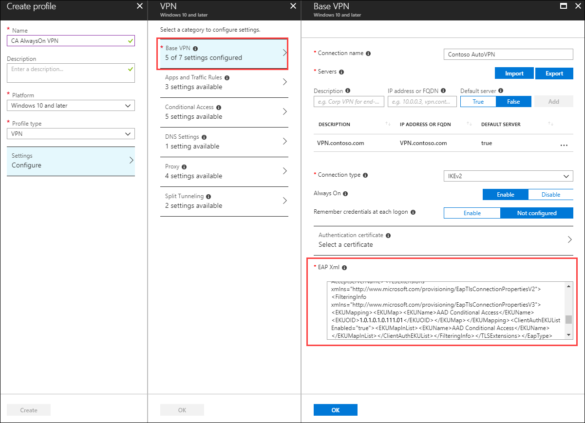
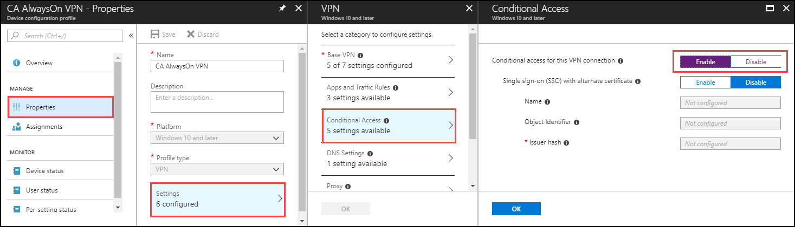
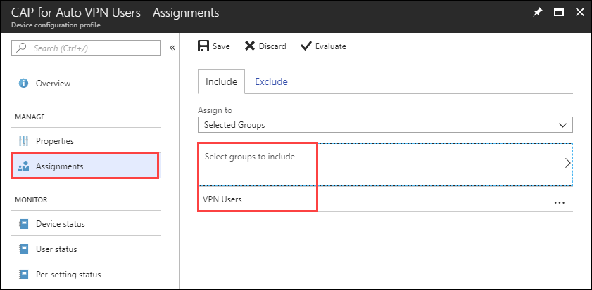

# Step 7.5. Create OMA-DM based VPNv2 profiles to Windows 10 devices

>Applies To: Windows Server (Semi-Annual Channel), Windows Server 2016, Windows Server 2012 R2, Windows 10

- [**Previous:** Step 7.4. Deploy conditional access root certificates to on-premises AD](vpn-deploy-cond-access-root-cert-to-on-premise-ad.md)
- [**Next:** Learn how conditional access for VPN works](https://docs.microsoft.com/windows/access-protection/vpn/vpn-conditional-access)

In this step, you can create OMA-DM based VPNv2 profiles using Intune to deploy a VPN Device Configuration policy. If you want to use SCCM or PowerShell script to create VPNv2 profiles, see [VPNv2 CSP settings](https://docs.microsoft.com/windows/client-management/mdm/vpnv2-csp) for more details. 

## Managed Deployment using Intune

Everything discussed in this section is the minimum needed to make VPN work with Conditional Access. It does not cover Split Tunneling, Using WIP, creating custom Intune device configuration profiles to get AutoVPN working, or SSO. Integrate the settings below into the VPN profile you created earlier under [Step 5. Configure Windows 10 Client Always On VPN Connections](always-on-vpn/deploy/vpn-deploy-client-vpn-connections.md).  In this example, we are integrating them into the [Configure the VPN client by using Intune](always-on-vpn/deploy/vpn-deploy-client-vpn-connections.md#configure-the-vpn-client-by-using-intune) policy. 

**Prerequisite:**

Windows 10 client computer has already been configured with a VPN connection using Intune.   


**Procedure:**

1. In the Azure portal, select **Intune** > **Device Configuration** > **Profiles** and select the VPN profile you created earlier in [Configure the VPN client by using Intune](always-on-vpn/deploy/vpn-deploy-client-vpn-connections.md#configure-the-vpn-client-by-using-intune).
    
2. In the policy editor, select **Properties** > **Settings** > **Base VPN**. Extend the existing **EAP Xml** to include a filter that gives the VPN client the logic it needs to retrieve the AAD Conditional Access certificate from the user's certificate store instead of leaving it to chance allowing it to use the first certificate discovered.

    >[!NOTE]
    >Without this, the VPN client could retrieve the user certificate issued from the on-premises certificate authority, resulting in a failed VPN connection.

    

3. Locate the section that ends with **\</AcceptServerName>\</EapType>** and insert the following string between these two values to provide the VPN client with the logic to select the AAD Conditional Access Certificate:

    ```XML
    <TLSExtensions xmlns="http://www.microsoft.com/provisioning/EapTlsConnectionPropertiesV2"><FilteringInfo xmlns="http://www.microsoft.com/provisioning/EapTlsConnectionPropertiesV3"><EKUMapping><EKUMap><EKUName>AAD Conditional Access</EKUName><EKUOID>1.3.6.1.4.1.311.87</EKUOID></EKUMap></EKUMapping><ClientAuthEKUList Enabled="true"><EKUMapInList><EKUName>AAD Conditional Access</EKUName></EKUMapInList></ClientAuthEKUList></FilteringInfo></TLSExtensions>
    ```

4. Select the **Conditional Access** blade and toogle **Conditional access for this VPN connection** to **Enabled**.
   
   Enabling this setting changes the **\<DeviceCompliance>\<Enabled>true\</Enabled>** setting in the VPNv2 Profile XML.

    

5. Select **OK**.

6. Select **Assignments**, under Include, select **Select groups to include**.

7. Select the **VPN Users** group that receives this policy and select **Save**.

    

## Force MDM Policy Sync on the Client

If the VPN profile does not show up on the client device, under Settings\\Network & Internet\\VPN, you can force MDM policy to sync.

1. Sign in to a domain-joined client computer as a member of the **VPN Users** group.

2. On the Start menu, enter **account**, and press Enter.

3. In the left navigation pane, select **Access work or school**.

4. Under Access work or school, select **Connected to <\domain> MDM**, then select **Info**.

5. Select **Sync** and verify the VPN profile appears under Settings\\Network & Internet\\VPN.


## Next steps

You are done configuring the VPN profile to use Azure AD conditional access. 

|If you want to...  |Then see...  |
|---------|---------|
|Learn more about how conditional access works with VPNs  |[VPN and conditional access](https://docs.microsoft.com/windows/access-protection/vpn/vpn-conditional-access): This page provides more information about how conditional access works with VPNs.      |
|Learn more about the advanced VPN features  |[Advanced VPN Features](always-on-vpn/deploy/always-on-vpn-adv-options.md#advanced-vpn-features): This page provides guidance on how to enable VPN Traffic Filters, how to configure Automatic VPN connections using App-Triggers, and how to configure NPS to only allow VPN Connections from clients using certificates issued by Azure AD.        |


## Related topics

- [VPNv2 CSP](https://msdn.microsoft.com/windows/hardware/commercialize/customize/mdm/vpnv2-csp):  This topic provides you with an overview of VPNv2 CSP. The VPNv2 configuration service provider allows the mobile device management (MDM) server to configure the VPN profile of the device.

- [Configure Windows 10 Client Always On VPN Connections](https://docs.microsoft.com/windows-server/remote/remote-access/vpn/always-on-vpn/deploy/vpn-deploy-client-vpn-connections): This topic provides information about the ProfileXML options and schema, and how to create the ProfileXML VPN. After setting up the server infrastructure, you must configure the Windows 10 client computers to communicate with that infrastructure with a VPN connection. 

- [Configure the VPN client by using Intune](https://docs.microsoft.com/windows-server/remote/remote-access/vpn/always-on-vpn/deploy/vpn-deploy-client-vpn-connections#configure-the-vpn-client-by-using-intune): This topic provides information on how to deploy Windows 10 Remote Access Always On VPN profiles. Intune now uses Azure AD groups. If Azure AD Connect synced the VPN Users group from on-premises to Azure AD, then there is no need for configuring the VPN client using Intune.
