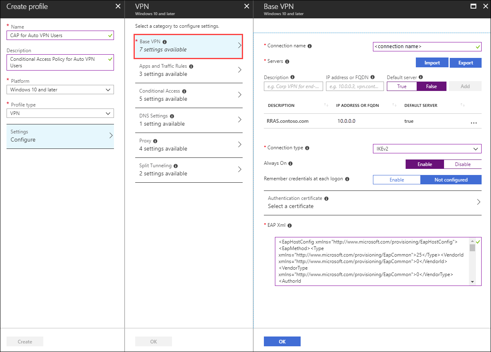
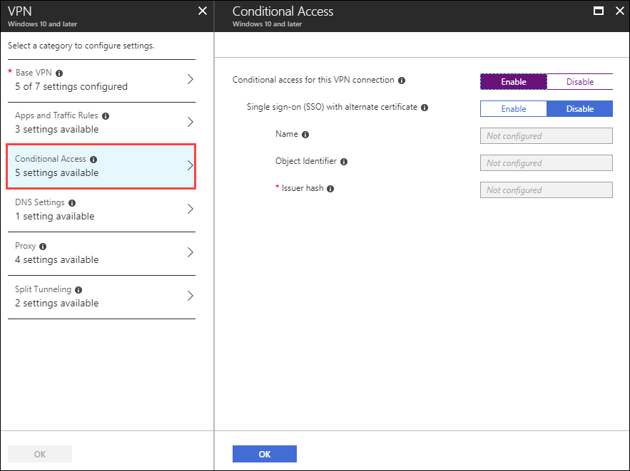

# Create OMA-DM based VPNv2 Profiles to Windows 10 devices

>Applies To: Windows Server (Semi-Annual Channel), Windows Server 2016, Windows Server 2012 R2, Windows 10

You can use one of two methods to create OMA-DM based VPNv2 profiles. The first method is a managed deployment using Intune to deploy a VPN Device Configuration policy. The second method can be used for unmanaged environments using a PowerShell script that leverages the Common Information Model, which creates a WMI session in the user’s context. From this context, it then creates a new instance of the MDM_VPNv2_01 WMI class. 

VPNv2 profiles can also be created via SCCM, Intune or with a PowerShell Script using [VPNv2 CSP settings](https://docs.microsoft.com/en-us/windows/client-management/mdm/vpnv2-csp). 

## Managed Deployment using Intune
If you want to use AutoVPN with Intune, you can configure Custom Device Configuration Profiles in Microsoft Intune. 

Everything discussed in this section is the minimum needed to make this work with Conditional Access. It does not cover Split Tunneling, Using WIP, creating custom Intune device configuration profiles to get AutoVPN working, or SSO. 

Everything discussed in this section is the minimum needed to make this work with Conditional Access. It does not cover Split Tunneling, Using WIP, creating custom Intune device configuration profiles to get AutoVPN working, or SSO.  Integrate the settings below into the VPN profile you created earlier under [Configure Windows 10 Client Always On VPN Connections](https://docs.microsoft.com/en-us/windows-server/remote/remote-access/vpn/always-on-vpn/deploy/vpn-deploy-client-vpn-connections).  In this example, we are integrating them into the [Configure the VPN client by using Intune](https://docs.microsoft.com/en-us/windows-server/remote/remote-access/vpn/always-on-vpn/deploy/vpn-deploy-client-vpn-connections#configure-the-vpn-client-by-using-intune) policy.


1.  In the Azure portal, navigate to **Intune**.

2.  Click **Device configuration** and select **Profiles**.

3.  Click **Create Profile**.

4.  In Name, enter a name for the VPN profile.

5.  In Platform, select **Windows 10 or later**.

6.  In Profile type, select **VPN**.

7. Under Settings, for **Base VPN**, verify or set the following settings:

    

    - **Connection name**: Enter a name for this connection. End users see this name when they browse their device for the list of available VPN connections.

    - **Servers**: Add one or more VPN servers by clicking **Add**.

    - **Description** and **IP Address or FQDN** values must align with the Subject Name in the VPN server's authentication certificate.

    - **Default server**: Set to **true** on one of the VPN servers listed. Doing this enables this server as the default server that devices use to establish the connection. Set only one server as the default.

    - **Connection type**: Set to **IKEv2**. If you set it to **Automatic**, the VPN client attempts all connection types.
    
    - **Always On**: An optional flag to enable Always On mode. This will automatically connect the VPN at sign-in and will stay connected until the user manually disconnects.
    
    - **Remember credentials at each logon**:  Boolean value (true or false) for caching credentials. If set to true, credentials are cached whenever possible

    - **EAP XML\\TrustedRootCA**: Set the **\<TrustedRootCA>5a 89 fe cb 5b 49 a7 0b 1a 52 63 b7 35 ee d7 1c c2 68 be 4b<\/TrustedRootCA>** with the thumbprint of the root certificate authority at the top of the chain of the Server Authentication certificate. Additional root certificates can be added by adding additional **\<TrustedRootCA> <\/TrustedRootCA>** entries. If the CA that issued the Server Authentication certificate was an International authority, this is not the certificate thumbprint to use. It must be the root CA. **Do NOT** use the thumbprint of the cloud root certificate. 

    - **EAP XML\\TLSExtension**: Must be present and contain **\<EKUName>AAD Conditional Access<\/EKUName>** and **\<EKUOID>1.3.6.1.4.1.311.87<\/EKUOID>**. These values tell the VPN client which certificate in the user's store should be used to perform VPN authentication. This is required when more than one certificate is in the user's store.  

8.  Under Settings, for Conditional Access, select the **Conditional access for this VPN connection** to **Enabled**. Doing this sets `<DevideCompliance><Enabled>true</Enabled>` in the VPNv2 profile, which tells the VPN clients to request an Azure AD Certificate. 


    


    **Example EAP XML**<br>
    The EAP XML sample below contains the minimum settings need to make this work with IKEv2. 

    ```
    <EapHostConfig xmlns="http://www.microsoft.com/provisioning/EapHostConfig"><EapMethod><Type  xmlns="http://www.microsoft.com/provisioning/EapCommon">25</Type><VendorId xmlns="http://www.microsoft.com/provisioning/EapCommon">0</VendorId><VendorType xmlns="http://www.microsoft.com/provisioning/EapCommon">0</VendorType><AuthorId xmlns="http://www.microsoft.com/provisioning/EapCommon">0</AuthorId></EapMethod><Config xmlns="http://www.microsoft.com/provisioning/EapHostConfig"><Eap xmlns="http://www.microsoft.com/provisioning/BaseEapConnectionPropertiesV1"><Type>25</Type><EapType xmlns="http://www.microsoft.com/provisioning/MsPeapConnectionPropertiesV1"><ServerValidation><DisableUserPromptForServerValidation>true</DisableUserPromptForServerValidation><ServerNames></ServerNames></ServerValidation><FastReconnect>true</FastReconnect><InnerEapOptional>false</InnerEapOptional><Eap xmlns="http://www.microsoft.com/provisioning/BaseEapConnectionPropertiesV1"><Type>13</Type><EapType xmlns="http://www.microsoft.com/provisioning/EapTlsConnectionPropertiesV1"><CredentialsSource><CertificateStore><SimpleCertSelection>true</SimpleCertSelection></CertificateStore></CredentialsSource><ServerValidation><DisableUserPromptForServerValidation>true</DisableUserPromptForServerValidation><ServerNames></ServerNames><TrustedRootCA>5a 89 fe cb 5b 49 a7 0b 1a 52 63 b7 35 ee d7 1c c2 68 be 4b </TrustedRootCA></ServerValidation><DifferentUsername>false</DifferentUsername><PerformServerValidation xmlns="http://www.microsoft.com/provisioning/EapTlsConnectionPropertiesV2">true</PerformServerValidation><AcceptServerName xmlns="http://www.microsoft.com/provisioning/EapTlsConnectionPropertiesV2">false</AcceptServerName><TLSExtensions xmlns="http://www.microsoft.com/provisioning/EapTlsConnectionPropertiesV2"><FilteringInfo xmlns="http://www.microsoft.com/provisioning/EapTlsConnectionPropertiesV3"><EKUMapping><EKUMap><EKUName>AAD Conditional Access</EKUName><EKUOID>1.3.6.1.4.1.311.87</EKUOID></EKUMap></EKUMapping><ClientAuthEKUList Enabled="true"><EKUMapInList><EKUName>AAD Conditional Access</EKUName></EKUMapInList></ClientAuthEKUList></FilteringInfo></TLSExtensions></EapType></Eap><EnableQuarantineChecks>false</EnableQuarantineChecks><RequireCryptoBinding>false</RequireCryptoBinding><PeapExtensions><PerformServerValidation xmlns="http://www.microsoft.com/provisioning/MsPeapConnectionPropertiesV2">false</PerformServerValidation><AcceptServerName xmlns="http://www.microsoft.com/provisioning/MsPeapConnectionPropertiesV2">false</AcceptServerName></PeapExtensions></EapType></Eap></Config></EapHostConfig>
    ```
    

9.  Click **Create**. 

10. In Intune, under Device configuration, select the newly created device configuration profile.  

11. Select **Assignments**, under Include, click **Select groups to include**.

    >[!IMPORTANT]
    >Ensure that you have added the users to the Azure AD group that receives this policy on all Windows 10 devices.

12. Select the **VPN Users** group that receives this policy and click **Save**.

    

## Force MDM Policy Sync on the Client
If the VPN profile does not show up on the client device, under Settings\\Network & Internet\\VPN, you can force MDM policy to sync.

1. Sign in to a domain-joined client computer as a member of the **VPN Users** group.

2. On the Start menu, type **account**, and press Enter.

3.  In the left navigation pane, click **Access work or school**.

5.  Under Access work or school, click **Connected to <\domain> MDM** and click **Info**.

6.  Click **Sync** and verify the VPN profile appears under Settings\\Network & Internet\\VPN.

## Next step
[Configure VPNv2 Profiles on your Clients](https://docs.microsoft.com/windows/access-protection/vpn/vpn-conditional-access)