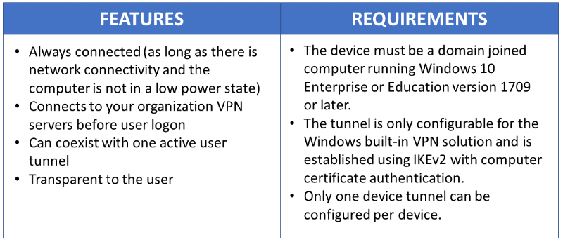

# Configure VPN device tunnels in Windows 10

>Applies to: Windows 10 version 1709

Always On VPN gives you the ability to create a dedicated VPN profile for device or machine. Always On VPN connections include two types of tunnels: 

- _Device tunnel_ connects to specified VPN servers before users log on to the device. Pre-login connectivity scenarios and device management purposes use device tunnel.

- _User tunnel_ connects only after a user logs on to the device. User tunnel allows users to access organization resources through VPN servers.

Unlike _user tunnel_, which only connects after a user logs on to the device or machine, _device tunnel_ allows the VPN to establish connectivity before the user logs on. Both _device tunnel_ and _user tunnel_ operate independently with their VPN profiles, can be connected at the same time, and can use different authentication methods and other VPN configuration settings as appropriate. User tunnel supports SSTP and IKEv2, and device tunnel supports IKEv2 only with no support for SSTP fallback.

User tunnel is supported on domain-joined, nondomain-joined (workgroup), or Azure AD–joined devices to allow for both enterprise and BYOD scenarios. It is available in all Windows editions, and the platform features are available to third parties by way of UWP VPN plug-in support.

Device tunnel can only be configured on domain-joined devices running Windows 10 Enterprise or Education version 1709 or later. There is no support for third-party control of the device tunnel.


## Device Tunnel Requirements and Features
You must enable machine certificate authentication for VPN connections and define a root certification authority for authenticating incoming VPN connections. 

```PowerShell
$VPNRootCertAuthority = “Common Name of trusted root certification authority”
$RootCACert = (Get-ChildItem -Path cert:LocalMachine\root | Where-Object {$_.Subject -Like “*$VPNRootCertAuthority*” })
Set-VpnAuthProtocol -UserAuthProtocolAccepted Certificate, EAP -RootCertificateNameToAccept $RootCACert -PassThru
```



## VPN Device Tunnel Configuration

The sample profile XML below provides good guidance for scenarios where only client initiated pulls are required over the device tunnel.  Traffic filters are leveraged to restrict the device tunnel to management traffic only.  This configuration works well for Windows Update, typical Group Policy (GP) and Microsoft Endpoint Configuration Manager update scenarios, as well as VPN connectivity for first logon without cached credentials, or password reset scenarios. 

For server-initiated push cases, like Windows Remote Management (WinRM), Remote GPUpdate, and remote Configuration Manager update scenarios – you must allow inbound traffic on the device tunnel, so traffic filters cannot be used.  If in the device tunnel profile you turn on traffic filters, then the Device Tunnel denies inbound traffic.  This limitation is going to be removed in future releases.


### Sample VPN profileXML

Following is the sample VPN profileXML.

``` xml
<VPNProfile>  
  <NativeProfile>  
<Servers>vpn.contoso.com</Servers>  
<NativeProtocolType>IKEv2</NativeProtocolType>  
<Authentication>  
  <MachineMethod>Certificate</MachineMethod>  
</Authentication>  
<RoutingPolicyType>SplitTunnel</RoutingPolicyType>  
 <!-- disable the addition of a class based route for the assigned IP address on the VPN interface -->
<DisableClassBasedDefaultRoute>true</DisableClassBasedDefaultRoute>  
  </NativeProfile> 
  <!-- use host routes(/32) to prevent routing conflicts -->  
  <Route>  
<Address>10.10.0.2</Address>  
<PrefixSize>32</PrefixSize>  
  </Route>  
  <Route>  
<Address>10.10.0.3</Address>  
<PrefixSize>32</PrefixSize>  
  </Route>  
<!-- traffic filters for the routes specified above so that only this traffic can go over the device tunnel --> 
  <TrafficFilter>  
<RemoteAddressRanges>10.10.0.2, 10.10.0.3</RemoteAddressRanges>  
  </TrafficFilter>
<!-- need to specify always on = true --> 
  <AlwaysOn>true</AlwaysOn> 
<!-- new node to specify that this is a device tunnel -->  
 <DeviceTunnel>true</DeviceTunnel>
<!--new node to register client IP address in DNS to enable manage out -->
<RegisterDNS>true</RegisterDNS>
</VPNProfile>
```

Depending on the needs of each particular deployment scenario, another VPN feature that can be configured with the device tunnel is [Trusted Network Detection](https://social.technet.microsoft.com/wiki/contents/articles/38546.new-features-for-vpn-in-windows-10-and-windows-server-2016.aspx#Trusted_Network_Detection).

```
 <!-- inside/outside detection -->
  <TrustedNetworkDetection>corp.contoso.com</TrustedNetworkDetection>
```

## Deployment and Testing

You can configure device tunnels by using a Windows PowerShell script and using the Windows Management Instrumentation (WMI) bridge. The Always On VPN device tunnel must be configured in the context of the **LOCAL SYSTEM** account. To accomplish this, it will be necessary to use [PsExec](https://docs.microsoft.com/sysinternals/downloads/psexec), one of the [PsTools](https://docs.microsoft.com/sysinternals/downloads/pstools) included in the [Sysinternals](https://docs.microsoft.com/sysinternals/) suite of utilities.

For guidelines on how to deploy a per device `(.\Device)` vs. a per user `(.\User)` profile, see [Using PowerShell scripting with the WMI Bridge Provider](https://docs.microsoft.com/windows/client-management/mdm/using-powershell-scripting-with-the-wmi-bridge-provider).

Run the following Windows PowerShell command to verify that you have successfully deployed a device profile:

  ```powershell
  Get-VpnConnection -AllUserConnection
  ```

The output displays a list of the device\-wide VPN profiles that are deployed on the device.

### Example Windows PowerShell Script

You can use the following Windows PowerShell script to assist in creating your own script for profile creation.

```PowerShell
Param(
[string]$xmlFilePath,
[string]$ProfileName
)

$a = Test-Path $xmlFilePath
echo $a

$ProfileXML = Get-Content $xmlFilePath

echo $XML

$ProfileNameEscaped = $ProfileName -replace ' ', '%20'

$Version = 201606090004

$ProfileXML = $ProfileXML -replace '<', '&lt;'
$ProfileXML = $ProfileXML -replace '>', '&gt;'
$ProfileXML = $ProfileXML -replace '"', '&quot;'

$nodeCSPURI = './Vendor/MSFT/VPNv2'
$namespaceName = "root\cimv2\mdm\dmmap"
$className = "MDM_VPNv2_01"

$session = New-CimSession

try
{
$newInstance = New-Object Microsoft.Management.Infrastructure.CimInstance $className, $namespaceName
$property = [Microsoft.Management.Infrastructure.CimProperty]::Create("ParentID", "$nodeCSPURI", 'String', 'Key')
$newInstance.CimInstanceProperties.Add($property)
$property = [Microsoft.Management.Infrastructure.CimProperty]::Create("InstanceID", "$ProfileNameEscaped", 'String', 'Key')
$newInstance.CimInstanceProperties.Add($property)
$property = [Microsoft.Management.Infrastructure.CimProperty]::Create("ProfileXML", "$ProfileXML", 'String', 'Property')
$newInstance.CimInstanceProperties.Add($property)

$session.CreateInstance($namespaceName, $newInstance)
$Message = "Created $ProfileName profile."
Write-Host "$Message"
}
catch [Exception]
{
$Message = "Unable to create $ProfileName profile: $_"
Write-Host "$Message"
exit
}
$Message = "Complete."
Write-Host "$Message"
```

## Additional Resources

The following are additional resources to assist with your VPN deployment.

### VPN client configuration resources

The following are VPN client configuration resources.

- [How to Create VPN profiles in Configuration Manager](https://docs.microsoft.com/configmgr/protect/deploy-use/create-vpn-profiles)
- [Configure Windows 10 Client Always On VPN Connections](always-on-vpn/deploy/vpn-deploy-client-vpn-connections.md)
- [VPN profile options](https://docs.microsoft.com/windows/access-protection/vpn/vpn-profile-options)

### Remote Access Server Gateway resources

The following are Remote Access Server (RAS) Gateway resources.

- [Configure RRAS with a Computer Authentication Certificate](https://technet.microsoft.com/library/dd458982.aspx)
- [Troubleshooting IKEv2 VPN Connections](https://technet.microsoft.com/library/dd941612.aspx)
- [Configure IKEv2-based Remote Access](https://technet.microsoft.com/library/ff687731.aspx)

>[!IMPORTANT]
>When using Device Tunnel with a Microsoft RAS gateway, you will need to configure the RRAS server to support IKEv2 machine certificate authentication by enabling the **Allow machine certificate authentication for IKEv2** authentication method as described [here](https://docs.microsoft.com/previous-versions/windows/it-pro/windows-server-2008-R2-and-2008/ee922682%28v=ws.10%29). Once this setting is enabled, it is strongly recommended that the **Set-VpnAuthProtocol** PowerShell cmdlet, along with the **RootCertificateNameToAccept** optional parameter, is used to ensure that RRAS IKEv2 connections are only permitted for VPN client certificates that chain to an explicitly defined internal/private Root Certification Authority. Alternatively, the **Trusted Root Certification Authorities** store on the RRAS server should be amended to ensure that it does not contain public certification authorities as discussed [here](https://blogs.technet.microsoft.com/rrasblog/2009/06/10/what-type-of-certificate-to-install-on-the-vpn-server/). Similar methods may also need to be considered for other VPN gateways.

