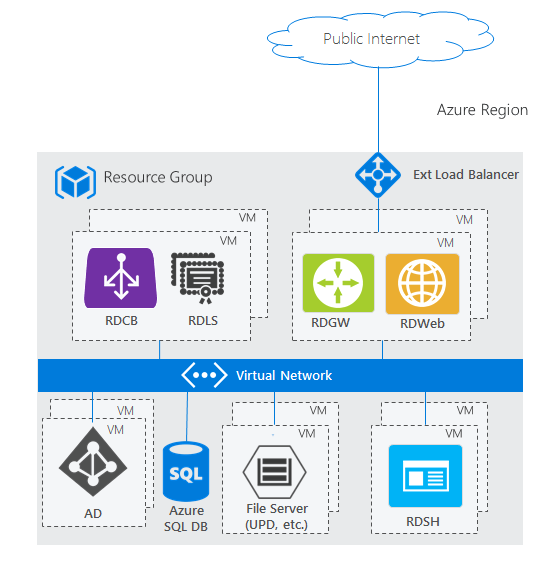
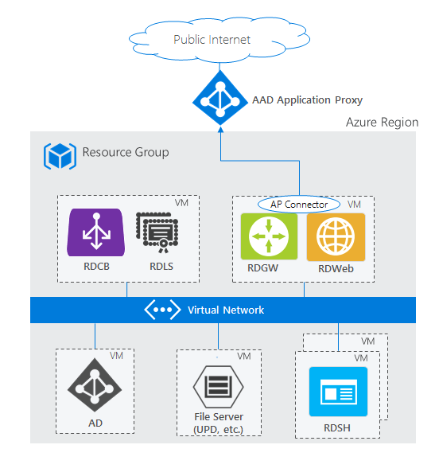

# Remote Desktop Services architecture

>Applies to: Windows Server 2022, Windows Server 2019, Windows Server 2016

Below are various configurations for deploying Remote Desktop Services to host Windows apps and desktops for end-users.

>[!NOTE]
> The architecture diagrams below show using RDS in Azure. However, you can deploy Remote Desktop Services on-premises and on other clouds. These diagrams are primarily intended to illustrate how the RDS roles are colocated and use other services.

## Standard RDS deployment architectures

Remote Desktop Services has two standard architectures:
-    Basic deployment – This contains the minimum number of servers to create a fully effective RDS environment
-    Highly available deployment – This contains all necessary components to have the highest guaranteed uptime for your RDS environment

### Basic deployment

### Highly available deployment

## RDS architectures with unique Azure PaaS roles

Though the standard RDS deployment architectures fit most scenarios, Azure continues to invest in first-party PaaS solutions that drive customer value. Below are some architectures showing how they incorporate with RDS.

### RDS deployment with Microsoft Entra Domain Services

The two standard architecture diagrams above are based on a traditional Active Directory (AD) deployed on a Windows Server VM. However, if you don't have a traditional AD and only have a Microsoft Entra tenant—through services like Office365—but still want to leverage RDS, you can use [Microsoft Entra Domain Services](/azure/active-directory-domain-services/active-directory-ds-overview) to create a fully managed domain in your Azure IaaS environment that uses the same users that exist in your Microsoft Entra tenant. This removes the complexity of manually syncing users and managing more virtual machines. Microsoft Entra Domain Services can work in either deployment: basic or highly available.

### RDS deployment with Microsoft Entra application proxy

The two standard architecture diagrams above use the RD Web/Gateway servers as the Internet-facing entry point into the RDS system. For some environments, administrators would prefer to remove their own servers from the perimeter and instead use technologies that also provide additional security through reverse proxy technologies. The [Microsoft Entra application proxy](/azure/active-directory/active-directory-application-proxy-get-started) PaaS role fits nicely with this scenario.

For supported configurations and how to create this setup, see how to [publish Remote Desktop with Microsoft Entra application proxy](/azure/active-directory/application-proxy-publish-remote-desktop).

