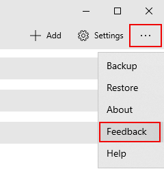

# Get started with the Remote Desktop app for Windows

>Applies to: Windows Server 2022, Windows Server 2019, Windows 11, and Windows 10

You can use the Remote Desktop app for Windows to work with Windows apps and PCs remotely from a different Windows device.

Use the following information to get started. Be sure to check out the [FAQ](remote-desktop-client-faq.yml) if you have any questions.

> [!TIP]
> If you want to connect to Azure Virtual Desktop instead of Remote Desktop Services or a remote PC, see [Connect to Azure Virtual Desktop with the Remote Desktop app for Windows](/azure/virtual-desktop/users/connect-microsoft-store).

> [!IMPORTANT]
> We're no longer updating the Remote Desktop app for Windows with new features and support for Azure Virtual Desktop will be removed in the future.
>
> For the best Azure Virtual Desktop experience that includes the latest features and updates, we recommend you download the [Windows Desktop client](/azure/virtual-desktop/users/connect-windows) instead.

## Get the Remote Desktop app and start using it

Follow these steps to get started with Remote Desktop on your Windows 10 device:

1. Download the Remote Desktop app from the [Microsoft Store](https://www.microsoft.com/store/p/microsoft-remote-desktop/9wzdncrfj3ps).
2. [Set up your PC to accept remote connections](remote-desktop-allow-access.md).
3. Add a Remote PC connection or a workspace. You use a connection to connect directly to a Windows PC and a workspace to use a RemoteApp program, session-based desktop, or virtual desktop published by your admin.
4. Pin items so you can get to Remote Desktop quickly.

### Add a Remote PC connection

To create a Remote PC connection:

1. In the Connection Center, tap **+ Add**, and then tap **PCs**.
2. Enter the following information for the computer you want to connect to:
   - **PC name** – the name of the computer. The PC name can be a Windows computer name, an Internet domain name, or an IP address. You can also append port information to the PC name (for example, **MyDesktop:3389** or **10.0.0.1:3389**).
   - **User account** – The user account to use to access the remote PC. Tap **+** to add a new account or select an existing account. You can use the following formats for the username: *user_name*, *domain\user_name*, or <em>user_name@domain.com</em>. You can also specify whether to prompt for credentials during the connection by selecting **Ask me every time**.
3. You can also set additional options by tapping on **Show more**:
   - **Display name** – An easy-to-remember name for the PC you're connecting to. You can use any string, but if you don't specify a friendly name, the PC name is displayed.
   - **Group** – Specify a group to make it easier to find your connections later. You can add a new group by tapping **+** or select one from the list.
   - **Gateway** – The Remote PC gateway that you want to use to connect to virtual PCs, RemoteApp programs, and session-based PCs on an internal corporate network. Get the information about the gateway from your system administrator.
   - **Connect to admin session** - Use this option to connect to a console session to administrate a Windows server.
   - **Swap mouse buttons** – Use this option to swap the left mouse button functions for the right mouse button. Swapping mouse buttons is necessary when you use a PC configured for a left-handed user but you only have a right-handed mouse.
   - **Set my remote session resolution to:** – Select the resolution you want to use in the session. **Choose for me** will set the resolution based on the size of the client.
   - **Change the size of the display:** – When selecting a high static resolution for the session, you can use this setting to make items on the screen appear larger to improve readability. This setting only applies when connecting to Windows 8.1 or later.
   - **Update the remote session resolution on resize** – When enabled, the client will dynamically update the session resolution based on the size of the client. This setting only applies when connecting to Windows 8.1 or later.
   - **Clipboard** – When enabled, allows you to copy text and images to/from the remote PC.
   - **Audio Playback** – Select the device to use for audio during your remote session. You can choose to play sound on the local devices, the remote PC, or not at all.
   - **Audio Recording** – When enabled, allows you to use a local microphone with applications on the remote PC.
4. Tap **Save**.

Need to edit these settings? Tap the overflow menu (**...**) next to the name of the PC, and then tap **Edit**.

Want to delete the connection? Again, tap the overflow menu (**...**), and then tap **Remove**.

### Add a workspace

Workspaces are RemoteApp programs, session-based desktops, and virtual desktops published by your admin using Remote Desktop Services.

To add a workspace:

1. On the Connection Center screen, tap **+ Add**, and then tap **Workspaces**.
2. Enter the **Feed URL** provided by your admin and tap **Find feeds**.
3. When prompted, provide the credentials to subscribe to the feed.

The workspaces will be displayed in the Connection Center.

To delete workspaces:

1. In the Connection Center, tap the overflow menu (**...**) next to the workspace.
2. Tap **Remove**.

### Pin a saved PC to your Start menu

To pin a connection to your Start menu, tap the overflow menu (**...**) next to the name of the PC, and then tap **Pin to Start**.

Now you can start the PC connection directly from your Start menu by tapping it.

## Connect to an RD Gateway to access internal assets

A Remote Desktop Gateway (RD Gateway) lets you connect to a remote computer on a corporate network from anywhere on the Internet. You can create and manage your connections to gateways using the Remote Desktop app.

To set up a new Remote Desktop Gateway:

1. In the Connection Center, tap **Settings**.
2. Next to Gateway, tap **+** to add a new Gateway.

      >[!NOTE]
      >You can also add a gateway when you add a new connection.

3. Enter the following information:
   - **Server name** – The name of the computer you want to use as a gateway. The server name can be a Windows computer name, an Internet domain name, or an IP address. You can also add port information to the server name (for example: **RDGateway:443** or **10.0.0.1:443**).
   - **User account** - Select or add a user account to use with the Remote PC Gateway you're connecting to. You can also select **Use desktop user account** to use the same credentials that you used for the remote PC connection.
4. Tap **Save**.

## Global app settings

You can set the following global settings in your client by tapping **Settings**:

### Managed items

- **User account** - Allows you to add, edit, and delete user accounts saved in the client. You can also update the password for an account after it's changed.
- **Gateway** - Allows you to add, edit, and delete gateway servers saved in the client.
- **Group** - Allows you to add, edit, and delete groups saved in the client. You can also group connections here.

### Session settings

- **Start connections in full screen** - When enabled, anytime a connection is launched, the client will use the entire screen of the current monitor.
- **Start each connection in a new window** - When enabled, each connection is launched in a separate window, allowing you to place them on different monitors and switch between them using the taskbar.
- **When resizing the app:** - Allows you control over what happens when the client window is resized. Defaults to **Stretch the content, preserving aspect ratio**.
- **Use keyboard commands with:** - Lets you specify where keyboard commands like *WIN* or *ALT+TAB* are used. The default is to only send them to the session when the connection is in full screen.
- **Prevent the screen from timing out** - Allows you to keep the screen from timing out when a session is active. Preventing timeout is helpful when the connection doesn't need interaction for long periods of time.

### App settings

- **Show PC Previews** - Lets you see a preview of a PC in the Connection Center before you connect to it. This setting is on by default.
- **Help improve Remote Desktop** - Sends anonymous data to Microsoft. We use this data to improve the client. To learn more about how we treat this anonymous and private data, see the [Microsoft Privacy Statement](https://privacy.microsoft.com/privacystatement). This setting is on by default.

### Manage your user accounts

When you connect to a PC or workspace, you can save the account's information to connect to it later. You can also define user accounts within the client instead of saving the user data when you connect to a PC.

To create a new user account:

1. In the Connection Center, tap **Settings**.
2. Next to User account, tap **+** to add a new user account.
3. Enter the following information:
   - **Username** - The name of the user to save for use with a remote connection. You can enter the user name in any of the following formats: user_name, domain\user_name, or user_name@domain.com.
   - **Password** - The password for the user you specified. This field can be left blank to be prompted for a password during the connection.
4. Tap **Save**.

To delete a user account:

1. In the Connection Center, tap **Settings**.
2. Select the account to delete from the list under User account.
3. Next to User account, tap the edit icon.
4. Tap **Remove this account** at the bottom to delete the user account.
5. You can also edit the user account and tap **Save**.

## Navigate your remote session

This section describes the tools available to help you navigate your remote session once you've connected to the service.

### Start a remote session

1. Tap the name of the connection you want to use to start the session.
2. If you haven't saved credentials for the connection, you'll be prompted to provide a **Username** and **Password**.
3. If you're asked to verify the certificate for your workspace or PC, review the information and ensure you trust this PC before tapping **Connect**. You can also select **Don't ask about this certificate again** to always accept this certificate.

### Connection bar

The connection bar gives you access to additional navigation controls. By default, the connection bar is placed in the middle of the top of the screen. Tap and drag the bar to the left or right to move it.

- **Pan Control** - The pan control enables the screen to be enlarged and moved around. Pan control is only available on touch-enabled devices and using the direct touch mode.
   - To enable or disable the pan control, tap the pan icon in the connection bar to display the pan control. The screen will zoom in while the pan control is active. Tap the pan icon in the connection bar again to hide the control and return the screen to its original resolution.
   - To use the pan control, tap and hold the pan control and then drag in the direction you want to move the screen.
   - To move the pan control, double-tap and hold the pan control to move the control on the screen.
- **Additional options** - Tap the additional options icon to display the session selection bar and command bar.
- **Keyboard** - Tap the keyboard icon to display or hide the on-screen keyboard. The pan control is displayed automatically when the keyboard is displayed.

### Command bar

Tap the **...** on the connection bar to display the command bar on the right side of the screen.

- **Home** - Use the Home button to return to the connection center from the command bar.
  - You can also use the back button for the same action. If you use the back button, your active session won't be disconnected, allowing you to launch additional connections.
- **Disconnect** - Use the Disconnect button to disconnect from the session. Your apps will remain active as long as the session is still active on the remote PC.
- **Full-screen** - Enters or exits full screen mode.
- **Touch or Mouse** - You can switch between the mouse modes (Direct Touch and Mouse Pointer).

### Use direct touch gestures and mouse modes

You can interact with your session with two available mouse modes:

- **Direct touch**: Passes all of the touch contacts to the session to be interpreted remotely.
  - Used in the same way you would use Windows with a touch screen.
- **Mouse pointer**: Transforms your local touch screen into a large touchpad, letting you move a mouse pointer in the session.
  - Used in the same way you would use Windows with a touchpad.

> [!NOTE]
> In Windows 8 or later, the native touch gestures are supported in Direct Touch mode.

| Mouse mode    | Mouse operation      | Gesture                                                               |
|---------------|----------------------|-----------------------------------------------------------------------|
| Direct touch  | Left-click           | Tap with one finger                                                          |
| Direct touch  | Right-click          | Tap and hold with one finger                                                |
| Mouse pointer | Left-click           | Tap with one finger                                                          |
| Mouse pointer | Left-click and drag  | Double-tap and hold with one finger, then drag                               |
| Mouse pointer | Right-click          | Tap with two fingers                                                          |
| Mouse pointer | Right-click and drag | Double-tap and hold with two fingers, then drag                              |
| Mouse pointer | Mouse wheel          | Tap and hold with two fingers, then drag up or down                          |
| Mouse pointer | Zoom                 | With two fingers, pinch to zoom out and move fingers apart to zoom in |

## Give us feedback

Have a feature suggestion or want to report a problem? Tell us with the [Feedback Hub](https://aka.ms/rdstorefeedback).

You can also give us feedback by selecting the ellipsis button (**...**) in the client app, then selecting **Feedback**, as shown in the following image.

> [!div class="mx-imgBorder"]
> 

>[!NOTE]
>To best help you, we need you to give us as detailed information about the issue as possible. For example, you can include screenshots or a recording of the actions you took leading up to the issue. For more tips about how to provide helpful feedback, see [Feedback](/windows-insider/feedback).
