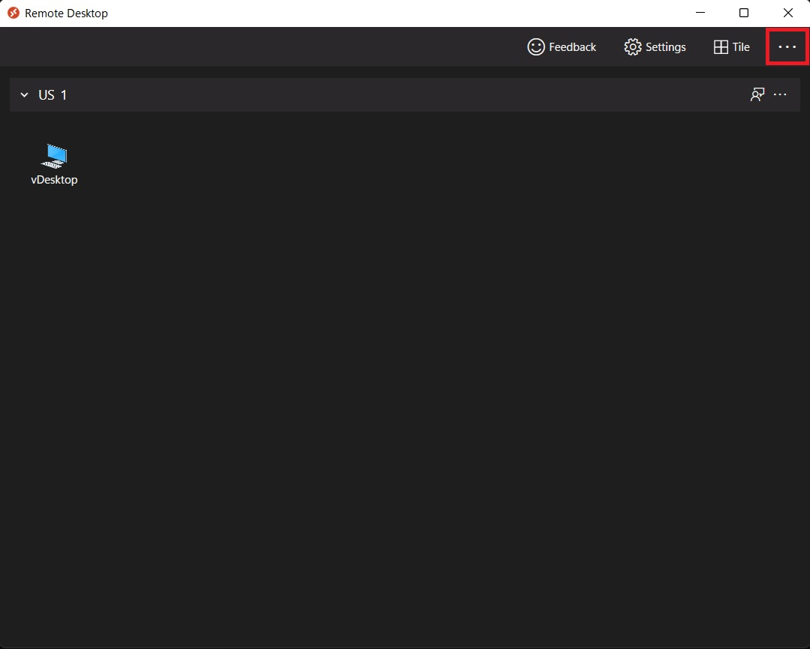
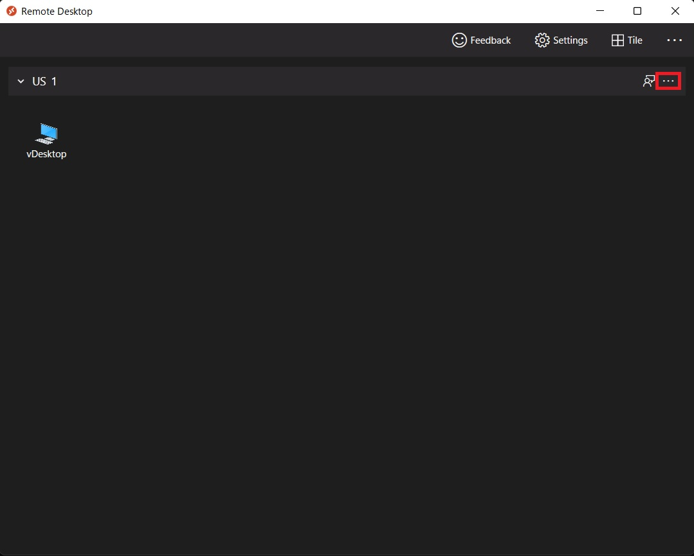
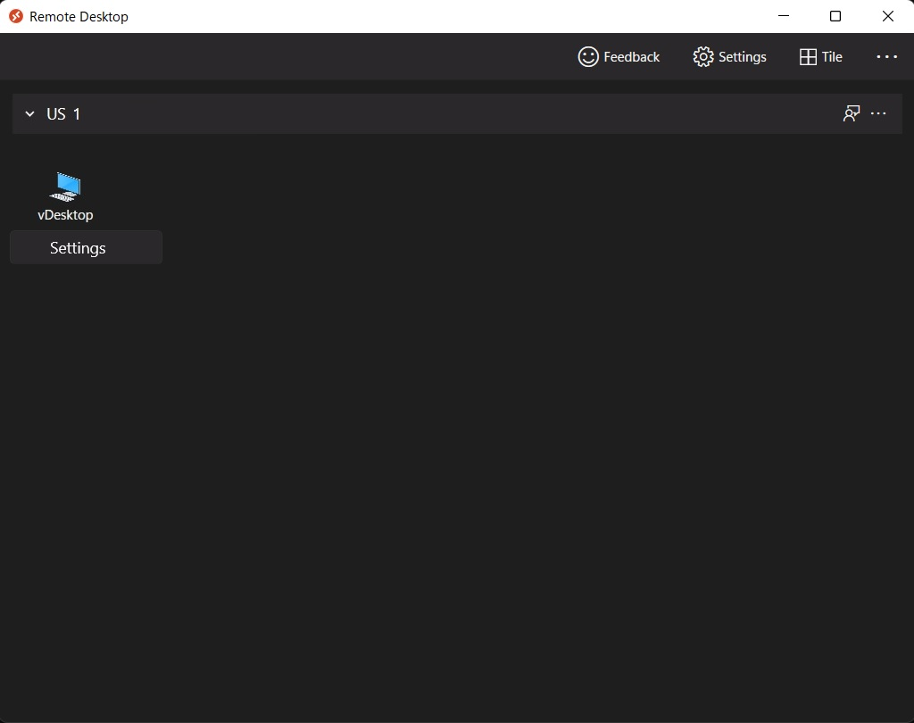
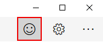

# Get started with the Windows Desktop client

>Applies to: Windows Server 2022, Windows Server 2019, Windows 11, Windows 10, Windows 10 IoT Enterprise, and Windows 7

You can use the Remote Desktop client for Windows Desktop to access Windows apps and desktops remotely from a different Windows device.

> [!NOTE]
> - This documentation is not for the Remote Desktop Connection (MSTSC) client that ships with Windows. It's for the new Remote Desktop (MSRDC) client.
> - This client currently only supports accessing remote apps and desktops from [Azure Virtual Desktop](https://aka.ms/wvd) and Windows 365.
> - Curious about the new releases for the Windows Desktop client? Check out [What's new in the Windows Desktop client](windowsdesktop-whatsnew.md)
> - Extended support for using Windows 7 to connect to Azure Virtual Desktop ends on January 10, 2023.

## Install the client

Choose the client that matches the version of Windows. The new Remote Desktop client (MSRDC) supports Windows 11, Windows 10, Windows 10 IoT Enterprise, and Windows 7 client devices.

- [Windows 64-bit](https://go.microsoft.com/fwlink/?linkid=2068602)
- [Windows 32-bit](https://go.microsoft.com/fwlink/?linkid=2098960)
- [Windows ARM64](https://go.microsoft.com/fwlink/?linkid=2098961)

You can install the client for the current user, which doesn't require admin rights, or your admin can install and configure the client so that all users on the device can access it.

Once you've installed the client, you can launch it from the Start menu by searching for **Remote Desktop**.

## Update the client

You'll be notified whenever a new version of the client is available as long as your admin hasn't disabled notifications. The notification will appear in either the Connection Center or the Windows Action Center. To update your client, just select the notification.

You can also manually search for new updates for the client:

1. From the Connection Center, tap the overflow menu (**...**) on the command bar at the top of the client.



1. Select **About** from the drop-down menu.
1. The client automatically searches for updates.
1. If there's an update available, tap **Install update** to update the client.

## Workspaces

Get the list of managed resources you can access, such as apps and desktops, by subscribing to the Workspace your admin provided you. When you subscribe, the resources become available on your local PC. The Windows Desktop client currently supports resources published from Azure Virtual Desktop and Windows 365.

### Subscribe to a Workspace

There are two ways you can subscribe to a Workspace. The client can try to discover the resources available to you from your work or school account or you can directly specify the URL where your resources are for cases where the client is unable to find them. Once you've subscribed to a Workspace, you can launch resources with one of the following methods:

- Go to the Connection Center and double-click a resource to launch it.
- You can also go to the Start menu and look for a folder with the Workspace name or enter the resource name in the search bar.

#### Subscribe with a user account

1. From the main page of the client, tap **Subscribe**.
1. Sign in with your user account when prompted.
1. The resources will appear in the Connection Center grouped by Workspace.

#### Subscribe with URL

1. From the main page of the client, tap **Subscribe with URL**.
1. Enter the Workspace URL or your email address:
   - If you use the **Workspace URL**, use the one your admin gave you. If you're accessing resources from Azure Virtual Desktop or Windows 365, you can use one of the following URLs:
     - Azure Virtual Desktop (classic): `https://rdweb.wvd.microsoft.com/api/feeddiscovery/webfeeddiscovery.aspx`
     - Azure Virtual Desktop: `https://rdweb.wvd.microsoft.com/api/arm/feeddiscovery`
     - If you're using Windows 365, use: `https://rdweb.wvd.microsoft.com/api/arm/feeddiscovery`.
   - To use **email**, enter your email address. This tells the client to search for a URL associated with your email address if your admin has setup [email discovery](../rds-email-discovery.md).
1. Tap **Next**.
1. Sign in with your user account when prompted.
1. The resources will appear in the Connection Center grouped by Workspace.

### Workspace details

After subscribing, you can view additional information about a Workspace on the Details panel:

- The name of the Workspace
- The URL and username used to subscribe
- The number of apps and desktops
- The date/time of the last refresh
- The status of the last refresh

Accessing the Details panel:

1. From the Connection Center, tap the overflow menu (**...**) next to the Workspace.



1. Select **Details** from the drop-down menu.
1. The Details panel appears on the right side of the client.

After you've subscribed, the Workspace will refresh automatically on a regular basis. Resources may be added, changed, or removed based on changes made by your admin.

You can also manually look for updates to the resources when needed by selecting **Refresh** from the Details panel.

### Refreshing a Workspace

You can manually refresh a Workspace by selecting **Refresh** from the overflow menu (**...**) next to the Workspace.

### Unsubscribe from a Workspace

This section will teach you how to unsubscribe from a Workspace. You can unsubscribe to either subscribe again with a different account or remove your resources from the system.

1. From the Connection Center, tap the overflow menu (**...**) next to the Workspace.
1. Select **Unsubscribe** from the drop-down menu.
1. Review the dialog box and select **Continue**.

## Managed desktops

Workspaces can contain multiple managed resources, including desktops. When accessing a managed desktop, you have access to all the apps installed by your admin.

### Desktop settings

You can configure some of the settings for desktop resources to ensure the experience meets your needs. To access the list of available settings right-click on the desktop resource in your workspace and select **Settings**.



The client will use the settings configured by your admin unless you turn off the **Use default settings** option. Doing so allows you to configure the following options:

- **Display configuration** selects which displays to use for the desktop session and impacts which additional settings are available.
  - **All displays** ensures the session always uses all your local displays even when some of them are added or removed later.
  - **Single display** ensures the session always uses a single display and allows you to configure its properties.
  - **Select displays** allows you to choose which displays to use for the session and provides an option to dynamically change the list of displays during the session.
- **Select the displays to use for the session** specifies which local displays to use for the session. All selected displays must be adjacent to each other. This setting is only available in **Select display** mode.
- **Maximize to current displays** determines which displays the sessions will use when going full screen. When enabled, the session goes full screen on the displays touched by the session window. This allows you to change displays during the session. When disabled, the session goes full screen on the same displays it was on the last time it was full screen. This setting is only available in **Select display** mode and is disabled otherwise.
- **Single display when windowed** determines which displays are available in the session when exiting full screen. When enabled, the session switches to a single display in windowed mode. When disabled, the session retains the same displays in windowed mode as in full screen. This setting is only available in **All displays** and **Select display** modes and is disabled otherwise.
- **Start in full screen** determines whether the session will launch in full-screen or windowed mode. This setting is only available in **Single display** mode and is enabled otherwise.
- **Fit session to window** determines how the session is displayed when the resolution of the remote desktop differs from the size of the local window. When enabled, the session content will be resized to fit inside the window while preserving the aspect ratio of the session. When disabled, scrollbars or black areas will be shown when the resolution and window size don't match. This setting is available in all modes.
- **Update the resolution on resize** makes the remote desktop resolution automatically update when you resize the session in windowed mode. When disabled, the session always remains at whichever resolution you specify in **Resolution**. This setting is only available in **Single display** mode and is enabled otherwise.
- **Resolution** lets you specify the resolution of the remote desktop. The session will retain this resolution for its entire duration. This setting is only available in **Single display** mode and when **Update the resolution on resize** is disabled.
- **Change the size of the text and apps** specifies the size of the content of the session. This setting only applies when connecting to Windows 8.1 and later or Windows Server 2012 R2 and later. This setting is only available in **Single display** mode and when **Update the resolution on resize** is disabled.

## Give us feedback

Have a feature suggestion or want to report a problem? Tell us with the [Feedback Hub](https://aka.ms/rddesktopfeedback).

You can also give us feedback by selecting the button that looks like a smiley face emoticon in the client app, as shown in the following image:

> [!div class="mx-imgBorder"]
> 

>[!NOTE]
>To best help you, we need you to give us as detailed information about the issue as possible. For example, you can include screenshots or a recording of the actions you took leading up to the issue. For more tips about how to provide helpful feedback, see [Feedback](/windows-insider/feedback#add-new-feedback).

### Access client logs

You might need the client logs when investigating a problem.

To retrieve the client logs:

1. Ensure no sessions are active and the client process isn't running in the background by right-clicking on the **Remote Desktop** icon in the system tray and selecting **Disconnect all sessions**.
1. Open **File Explorer**.
1. Navigate to the **%temp%\DiagOutputDir\RdClientAutoTrace** folder.

Below you will find different methods used to read the client logs.

#### Event Viewer

1. Navigate to the Start menu, Control Panel, System and Security, and select **view event logs** under "Windows Tools".
1. Once the **Event Viewer** is open, click the Action tab at the top and select **Open Saved Log...**.
1. Navigate to the **%temp%\DiagOutputDir\RdClientAutoTrace** folder and select the log file you want to view.
1. The **Event Viewer** dialog box will open requesting a response to which it will convert etl format to evtx format. Select **Yes**.
1. In the **Open Saved Log** dialog box, you have the options to rename the log file and add a description. Select **Ok**.
1. The **Event Viewer** dialog box will open asking to overwrite the log file. Select **Yes**. This will not overwrite your original etl log file but create a copy in evtx format.

#### Command-line

This method will enable you to convert the log file from etl format to either _csv_ or _xml_ format using the `tracerpt` command. Open the Command Prompt or PowerShell and run the following:

```
tracerpt "<FilePath>.etl" -o "<OutputFilePath>.extension"
```

**CSV example:**

```
tracerpt "C:\Users\admin\AppData\Local\Temp\DiagOutputDir\RdClientAutoTrace\msrdcw_09-07-2022-15-48-44.etl" -o "C:\Users\admin\Desktop\LogFile.csv" -of csv
```

If the `-of csv` parameter is omitted from the command above, it won't properly convert the file.

**XML example:**

```
tracerpt "C:\Users\admin\AppData\Local\Temp\DiagOutputDir\RdClientAutoTrace\msrdcw_09-07-2022-15-48-44.etl" -o "C:\Users\admin\Desktop\LogFile.xml"
```

The `-of xml` parameter is not necessary in this instance as the default output for the conversion is in _xml_ format.
