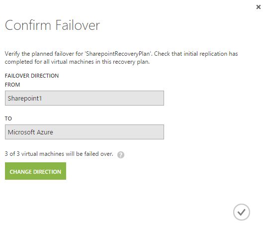
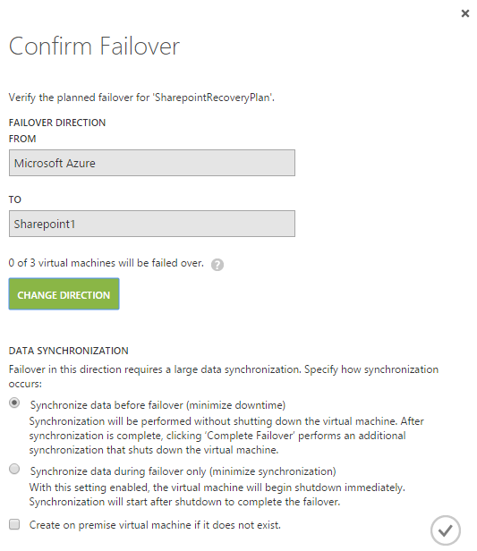

# Run your disaster recovery plan 

>Applies To: Windows Server 2016

Now that you've created your disaster recovery plan, you need to test it to ensure the components work together the way you intended. The way you validate your plan is by forcing failovers and failbacks. You also will want to run disaster recovery drills by forcing failovers and failbacks. Use the following information to run your disaster recovery plan.

## Perform a test failover

The following steps cover the RDS component failover. For [AD](/azure/site-recovery/site-recovery-active-directory#test-failover-considerations) and [SQL Server](/azure/site-recovery/site-recovery-sql), see the disaster recovery information for each for considerations specific to how they will behave during test failover. 

1. In the Azure portal, open your Site Recovery vault.
2. Click the recovery plan you've created for RDS>
3. Click **Test Failover**.
4. Select the virtual network to start the test failover process.
5. When the secondary environment is created, you can confirm your components.
6. When you've finished, click **Validations complete**, and the test failover environment will be cleaned.

## Perform an unplanned failover

1. In your Site Recovery vault in the Azure portal, click your RDS recovery plan.
2. Click **Failover**, and then click **Unplanned Failover**.
3. Select the target network, and then click **OK** to start the failover process.
 
   

## Perform a planned failover

1. In your Site Recovery vault in the Azure portal, click your RDS recovery plan.
2. Click **Failover**, and then click **Planned Failover**.
3. Select the target network, and then click **OK** to start the failover process.

## Perform a failback

See [Protect SQL Server](/azure/site-recovery/site-recovery-sql) for considerations about SQL Server during failback.

1. In your Site Recovery vault in the Azure portal, click your RDS recovery plan.
2. Click **Failover**, and then click either **Unplanned Failover** or **Planned Failover**.
3. Click **Change Direction** to perform a failback instead of failover.
4. Choose the appropriate options (data syncrhonization and VM creation options), and then click **OK** to start the failback process.

   