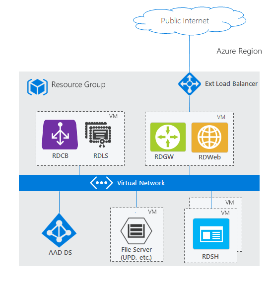
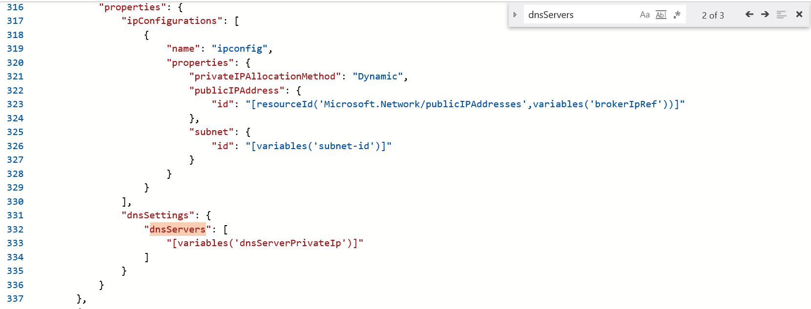
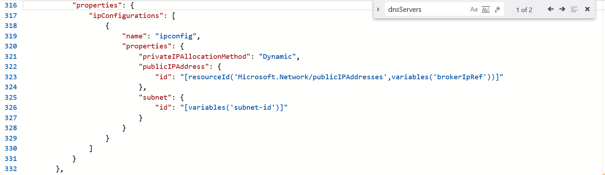

# Integrate Microsoft Entra Domain Services with your RDS deployment

You can use [Microsoft Entra Domain Services](/azure/active-directory-domain-services/active-directory-ds-overview) in your Remote Desktop Services deployment in the place of Windows Server Active Directory. Microsoft Entra Domain Services lets you use your existing Microsoft Entra identities in with classic Windows workloads.

With Microsoft Entra Domain Services you can:
- Create an Azure environment with a local domain for born-in-the-cloud organizations.
- Create an isolated Azure environment with the same identities used for your on-premises and online environment, without needing to create a site-to-site VPN or ExpressRoute.

When you finish integrating Microsoft Entra Domain Services into your Remote Desktop deployment, your architecture will look something like this:

To see how this architecture compares with other RDS deployment scenarios, check out [Remote Desktop Services architectures](desktop-hosting-logical-architecture.md).

To get a better understanding of Microsoft Entra Domain Services, check out the [Microsoft Entra Domain Services overview](/azure/active-directory-domain-services/active-directory-ds-overview) and [How to decide if Microsoft Entra Domain Services is right for your use-case](/azure/active-directory-domain-services/active-directory-ds-comparison).

Use the following information to deploy Microsoft Entra Domain Services with RDS.

## Prerequisites

Before you can bring your identities from Microsoft Entra ID to use in an RDS deployment, [configure Microsoft Entra ID to save the hashed passwords for your users' identities](/azure/active-directory-domain-services/active-directory-ds-getting-started-password-sync). Born-in-the-cloud organizations don't need to make any additional changes in their directory; however, on-premises organizations need to allow password hashes to be synchronized and stored in Microsoft Entra ID, which may not be permissible to some organizations. Users will have to reset their passwords after making this configuration change.

## Deploy Microsoft Entra Domain Services and RDS
Use the following steps to deploy Microsoft Entra Domain Services and RDS.

1. Enable [Microsoft Entra Domain Services](/azure/active-directory-domain-services/active-directory-ds-getting-started). Note that the linked article does the following:
   - Walk through creating the appropriate Microsoft Entra groups for domain administration.
   - Highlight when you might have to force users to change their password so their accounts can work with Microsoft Entra Domain Services.

2. Set up RDS. You can either use an Azure template or deploy RDS manually.
   - Use the [Existing AD template](https://azure.microsoft.com/resources/templates/rds-deployment-existing-ad/). Make sure to customize the following:

     - **Settings**
       - **Resource group**: Use the resource group where you want to create the RDS resources.
         > [!NOTE]
         > Right now this has to be the same resource group where the Azure resource manager virtual network exists.

       - **Dns Label Prefix**: Enter the URL that you want users to use to access RD Web.
       - **Ad Domain Name**: Enter the full name of your Microsoft Entra instance, for example, "contoso.onmicrosoft.com" or "contoso.com".
       - **Ad Vnet Name** and **Ad Subnet Name**: Enter the same values that you used when you created the Azure resource manager virtual network. This is the subnet to which the RDS resources will connect.
       - **Admin Username** and **Admin Password**: Enter the credentials for an admin user that's a member of the **AAD DC Administrators** group in Microsoft Entra ID.

     - **Template**
        - Remove all properties of **dnsServers**: after selecting **Edit template** from the Azure quickstart template page, search for "dnsServers" and remove the property.

           For example, before removing the **dnsServers** property:

           

           And here's the same file after removing the property:

           

   - [Deploy RDS manually](rds-deploy-infrastructure.md).
