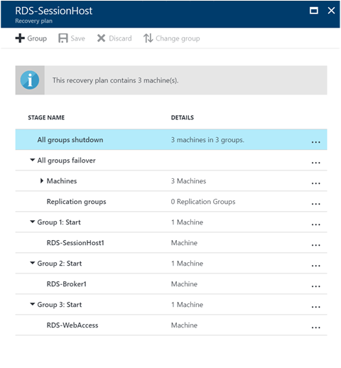
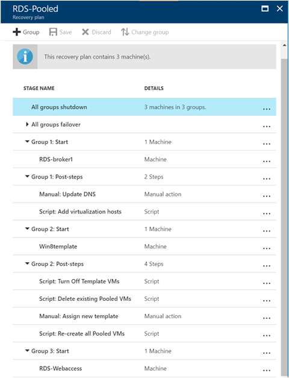
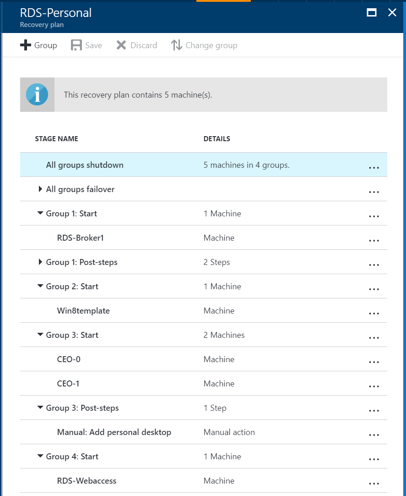

# Create your disaster recovery plan for RDS

>Applies to: Windows Server (Semi-Annual Channel), Windows Server 2019, Windows Server 2016

You can create a disaster recovery plan in Azure Site Recovery to automate the failover process. Add all RDS component VMs to the recovery plan.

Use the following steps in Azure to create your recovery plan:

1. Open Azure Site Recovery Vault in the Azure portal, and then click **Recovery Plans**.
2. Click **Create** and enter a name for the plan.
3. Select your **Source** and **Target**. The target is either a secondary RDS site or Azure.
4. Select the VMs that host your RDS components, and then click **OK**.

The following sections provide additional information about creating recovery plans for the different types of RDS deployment.

## Sessions-based RDS deployment

For an RDS sessions-based deployment, group the VMs so they come up in sequence:

1. Failover group 1 - Session Host VM
2. Failover group 2 - Connection Broker VM
3. Failover group 3 - Web Access VM

Your plan will look something like this: 



## Pooled desktops RDS deployment

For an RDS deployment with pooled desktops, group the VMs so they come up in sequence, adding manual steps and scripts.

1. Failover group 1 - RDS Connection Broker VM
2. Group 1 manual action - Update DNS

   Run PowerShell in an elevated mode on the Connection Broker VM. Run the following command and wait for a couple of minutes to ensure the DNS is updated with the new value:

   ```
   ipconfig /registerdns
   ```
3. Group 1 script - add Virtualization hosts

   Modify the script below to run for each virtualization host in the cloud. Typically after you add a virtualization host to a Connection Broker, you need to restart the host. Ensure that the host doesn't have a reboot pending before the script runs, or else it will fail.

   ```
   Broker - broker.contoso.com
   Virtualization host - VH1.contoso.com

   ipmo RemoteDesktop; 
   add-rdserver –ConnectionBroker broker.contoso.com –Role RDS-VIRTUALIZATION –Server VH1.contoso.com 
   ```
4. Failover group 2 - Template VM
5. Group 2 script 1 - Turn off Template VM
   
   The template VM when recovered to the secondary site will start, but it is a sysprepped VM and cannot start completely. Also RDS requires that the VM be shutdown to create a pooled VM configuration from it. So, we need to turn it off. If you have a single VMM server, the template VM name is the same on the primary and the secondary. Because of that, we use the VM ID as specified by the *Context* variable in the script below. If you have multiple templates, turn them all off.

   ```powershell
   ipmo virtualmachinemanager; 
   Foreach($vm in $VMsAsTemplate)
   {
      Get-SCVirtualMachine -ID $vm | Stop-SCVirtualMachine –Force
   } 
   ```
6. Group 2 script 2 - Remove existing pooled VMs

   You need to remove the pooled VMs on the primary site from the Connection Broker so new VMs can be created on the secondary site. In this case you need to specify the exact host on which to create the pooled VM. Note that this will delete the VMs from only the collection.

   ```powershell
   ipmo RemoteDesktop
   $desktops = Get-RDVirtualDesktop -CollectionName Win8Desktops; 
   Foreach($vm in $desktops){
      Remove-RDVirtualDesktopFromCollection -CollectionName Win8Desktops -VirtualDesktopName $vm.VirtualDesktopName –Force
   }
   ```
7. Group 2 manual action - Assign new template

   You need to assign the new template to the Connection Broker for the collection so you can create new pooled VMs on the recovery site. Go to the RDS Connection Broker and identify the collection. Edit the properties and specify a new VM image as its template.
8. Group 2 script 3 - Recreate all pooled VMs

   Recreate the pooled VMs on the recovery site through the Connection Broker. In this case, you need to specify the exact host on which to create the pooled VM.

   The pooled VM name needs to be unique, using the prefix and suffix. If the VM name already exists, the script will fail. Also, if the primary side VMs are numbered from 1-5, the recovery site numbering will continue from 6.

   ```powershell
   ipmo RemoteDesktop; 
   Add-RDVirtualDesktopToCollection -CollectionName Win8Desktops -VirtualDesktopAllocation @{"RDVH1.contoso.com" = 1} 
   ```
9. Failover group 3 - Web Access and Gateway server VM

The recovery plan will look like this:



## Personal desktops RDS deployment

For an RDS deployment with personal desktops, group the VMs so they come up in sequence, adding manual steps and scripts.

1. Failover group 1 - RDS Connection Broker VM
2. Group 1 manual action - Update DNS

   Run PowerShell in an elevated mode on the Connection Broker VM. Run the following command and wait for a couple of minutes to ensure the DNS is updated with the new value:

   ```
   ipconfig /registerdns
   ```
3. Group 1 script - Add Virtualization hosts
      
   Modify the script below to run for each virtualization host in the cloud. Typically after you add a virtualization host to a Connection Broker, you need to restart the host. Ensure that the host doesn't have a reboot pending before the script runs, or else it will fail.

   ```powershell
   Broker - broker.contoso.com
   Virtualization host - VH1.contoso.com

   ipmo RemoteDesktop; 
   add-rdserver –ConnectionBroker broker.contoso.com –Role RDS-VIRTUALIZATION –Server VH1.contoso.com 
   ```
4. Failover group 2 - Template VM
5. Group 2 script 1 - Turn off template VM
   
   The template VM when recovered to the secondary site will start, but it is a sysprepped VM and cannot start completely. Also RDS requires that the VM be shutdown to create a pooled VM configuration from it. So, we need to turn it off. If you have a single VMM server, the template VM name is the same on the primary and the secondary. Because of that, we use the VM ID as specified by the *Context* variable in the script below. If you have multiple templates, turn them all off.

   ```powershell
   ipmo virtualmachinemanager; 
   Foreach($vm in $VMsAsTemplate)
   {
      Get-SCVirtualMachine -ID $vm | Stop-SCVirtualMachine –Force
   } 
   ```
6. Failover group 3 - Personal VMs
7. Group 3 script 1 - Remove existing personal VMs and add them

   Remove the personal VMs on the primary site from the Connection Broker so new VMs can be created on the secondary site. You need to extract the VMs' assignments and re-add the virtual machines to the Connection Broker with the hash of assignments. This will only remove the personal VMs from the collection and re-add them. The personal desktop allocation will be exported and imported back into the collection.

   ```powershell
   ipmo RemoteDesktop
   $desktops = Get-RDVirtualDesktop -CollectionName CEODesktops; 
   Export-RDPersonalVirtualDesktopAssignment -CollectionName CEODesktops -Path ./Desktopallocations.txt -ConnectionBroker broker.contoso.com 

   Foreach($vm in $desktops){
     Remove-RDVirtualDesktopFromCollection -CollectionName CEODesktops -VirtualDesktopName $vm.VirtualDesktopName –Force
   }
   
   Import-RDPersonalVirtualDesktopAssignment -CollectionName CEODesktops -Path ./Desktopallocations.txt -ConnectionBroker broker.contoso.com 
   ```
8. Failover group 3 - Web Access and Gateway server VM

Your plan will look something like this: 


