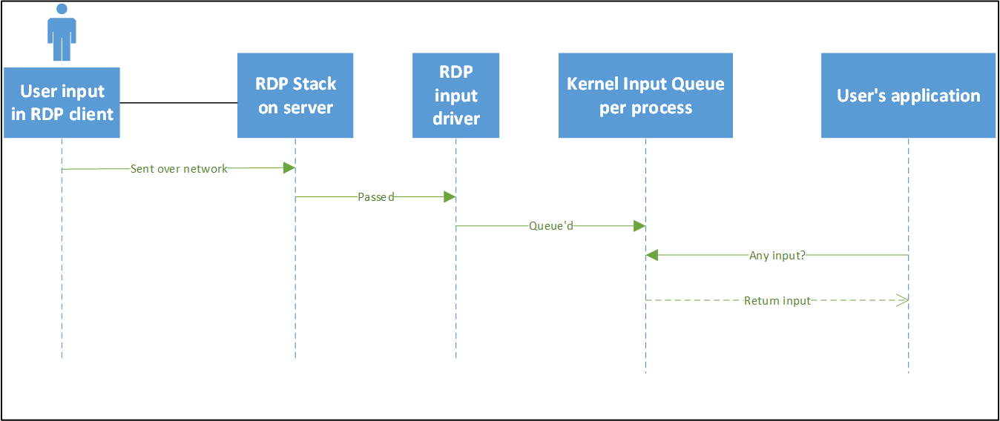
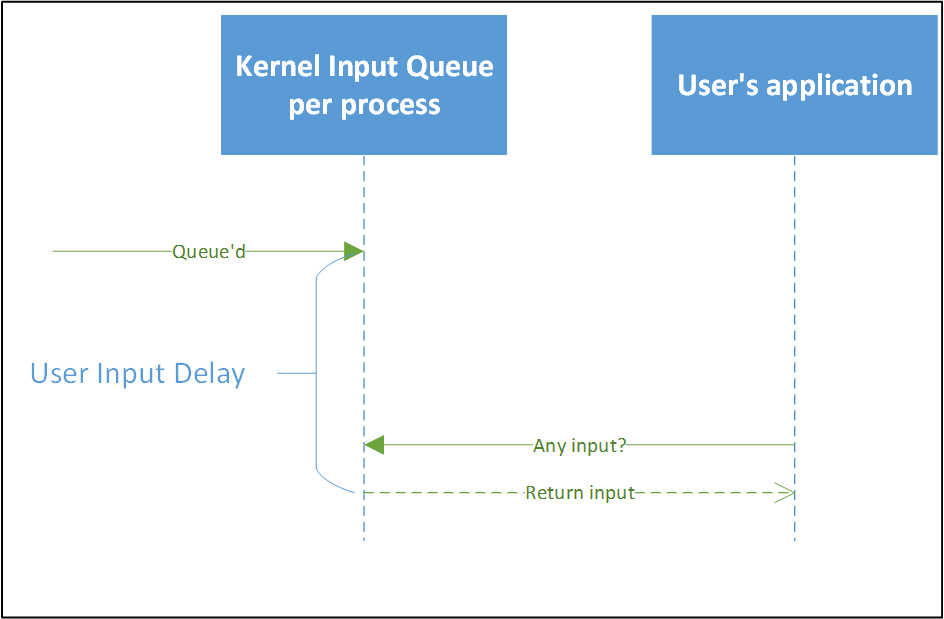
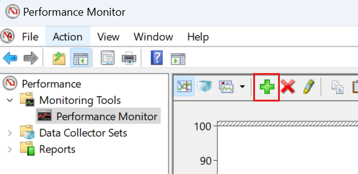
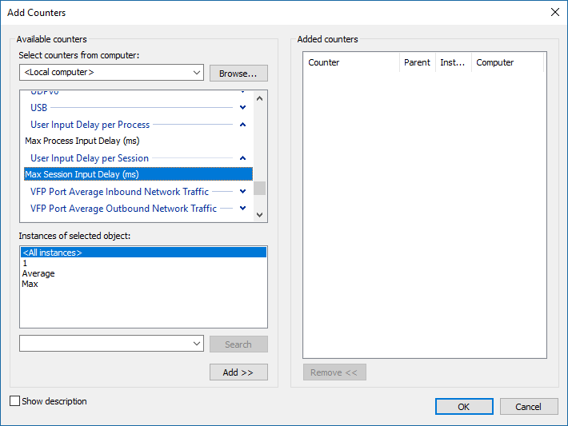
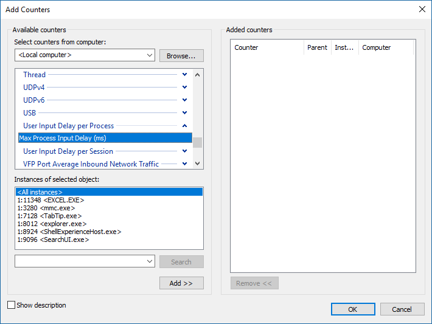
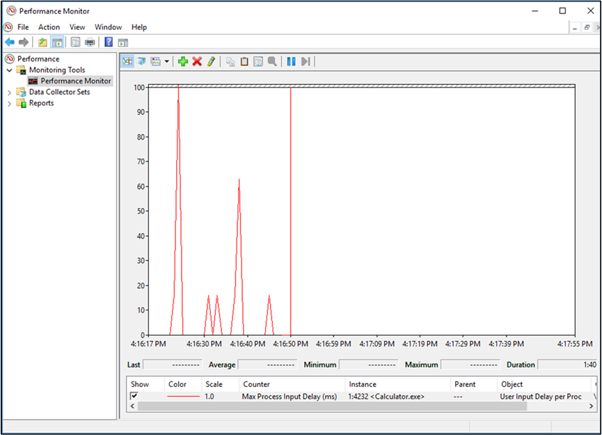
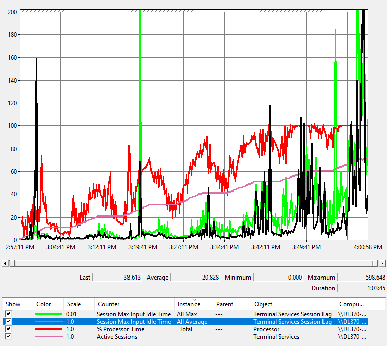
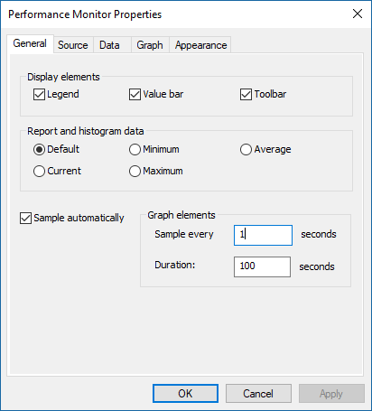
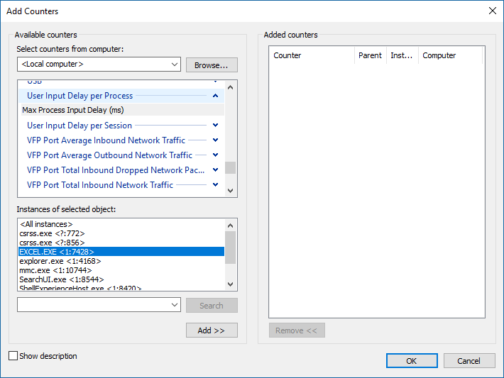

# Use performance counters to diagnose app performance problems on Remote Desktop Session Hosts

> Applies to: Windows Server 2019, Windows 10

One of the most difficult problems to diagnose is poor application performance—the applications are running slow or don't respond. Traditionally, you start your diagnosis by collecting CPU, memory, disk input/output, and other metrics and then use tools like Windows Performance Analyzer to try to figure out what's causing the problem. Unfortunately, in most situations this data doesn't help you identify the root cause because resource consumption counters have frequent and large variations. This makes it hard to read the data and correlate it with the reported issue. To help you solve your app performance issues quickly, we've added some new performance counters (available [to download](#download-windows-server-insider-software) through the [Windows Insider Program](https://insider.windows.com)) that measure user input flows.

>[!NOTE]
>The User Input Delay counter is only compatible with:
> - Windows Server 2019 or later
> - Windows 10, version 1809 or later

The User Input Delay counter can help you quickly identify the root cause for bad end user RDP experiences. This counter measures how long any user input (such as mouse or keyboard usage) stays in the queue before it is picked up by a process, and the counter works in both local and remote sessions.

The following image shows a rough representation of user input flow from client to application.



The User Input Delay counter measures the max delta (within an interval of time) between the input being queued and when it’s picked up by the app in a [traditional message loop](https://msdn.microsoft.com/library/windows/desktop/ms644927.aspx#loop), as shown in the following flow chart:



One important detail of this counter is that it reports the maximum user input delay within a configurable interval. This is the longest time it takes for an input to reach the application, which can impact the speed of important and visible actions like typing.

For example, in the following table, the user input delay would be reported as 1,000 ms within this interval. The counter reports the slowest user input delay in the interval because the user’s perception of "slow" is determined by the slowest input time (the maximum) they experience, not the average speed of all total inputs.

|Number| 0 | 1 | 2 |
|------|---|---|---|
|Delay |16 ms| 20 ms| 1,000 ms|

## Enable and use the new performance counters

To use these new performance counters, you must first enable a registry key by running this command:

```
reg add "HKLM\System\CurrentControlSet\Control\Terminal Server" /v "EnableLagCounter" /t REG_DWORD /d 0x1 /f
```

>[!NOTE]
> If you're using Windows 10, version 1809 or later or Windows Server 2019 or later, you won't need to enable the registry key.

Next, restart the server. Then, open the Performance Monitor, and select the plus sign (+), as shown in the following screen shot.



After doing that, you should see the Add Counters dialog, where you can select **User Input Delay per Process** or **User Input Delay per Session**.





If you select **User Input Delay per Process**, you'll see the **Instances of the selected object** (in other words, the processes) in ```SessionID:ProcessID <Process Image>``` format.

For example, if the Calculator app is running in a [Session ID 1](https://msdn.microsoft.com/library/ms524326.aspx), you'll see ```1:4232 <Calculator.exe>```.

> [!NOTE]
> Not all processes are included. You won't see any processes that are running as SYSTEM.

The counter starts reporting user input delay as soon as you add it. Note that the maximum scale is set to 100 (ms) by default. 



Next, let’s look at the **User Input Delay per Session**. There are instances for each session ID, and their counters show the user input delay of any process within the specified session. In addition, there are two instances called "Max" (the maximum user input delay across all sessions) and "Average" (the average acorss all sessions).

This table shows a visual example of these instances. (You can get the same information in Perfmon by switching to the Report graph type.)

|Type of counter|Instance name|Reported delay (ms)|
|---------------|-------------|-------------------|
|User Input Delay per process|1:4232 <Calculator.exe>|	200|
|User Input Delay per process|2:1000 <Calculator.exe>|	16|
|User Input Delay per process|1:2000 <Calculator.exe>|	32|
|User Input Delay per session|1|	200|
|User Input Delay per session|2|	16|
|User Input Delay per session|Average| 	108|
|User Input Delay per session|Max| 	200|

## Counters used in an overloaded system

Now let's look at what you'll see in the report if performance for an app is degraded. The following graph shows readings for users working remotely in Microsoft Word. In this case, the RDSH server performance degrades over time as more users log in.



Here's how to read the graph's lines:

- The pink line shows the number of sessions signed in on the server.
- The red line is the CPU usage.
- The green line is the maximum user input delay across all sessions.
- The blue line (displayed as black in this graph) represents average user input delay across all sessions.

You’ll notice that there's a correlation between CPU spikes and user input delay—as the CPU gets more usage, the user input delay increases. Also, as more users get added to the system, CPU usage gets closer to 100%, leading to more frequent user input delay spikes. While this counter is very useful in cases where the server runs out of resources, you can also use it to track user input delay related to a specific application.

## Configuration Options

An important thing to remember when using this performance counter is that it reports user input delay on an interval of 1,000 ms by default. If you set the performance counter sample interval property (as shown in the following screenshot) to anything different, the reported value will be incorrect.



To fix this, you can set the following registry key to match the interval (in milliseconds) that you want to use. For example, if we change Sample every x seconds to 5 seconds, we need to set this key to 5000 ms.

```
[HKEY_LOCAL_MACHINE\SYSTEM\CurrentControlSet\Control\Terminal Server]

"LagCounterInterval"=dword:00005000
```

>[!NOTE]
>If you're using Windows 10, version 1809 or later or Windows Server 2019 or later, you don't need to set LagCounterInterval to fix the performance counter.

We’ve also added a couple of keys you might find helpful under the same registry key:

**LagCounterImageNameFirst** — set this key to `DWORD 1` (default value 0 or key does not exist). This changes the counter names to "Image Name <SessionID:ProcessId>." For example, "explorer <1:7964>." This is useful if you want to sort by image name.

**LagCounterShowUnknown** — set this key to `DWORD 1` (default value 0 or key does not exist). This shows any processes that are running as services or SYSTEM. Some processes will show up with their session set as "?."

This is what it looks like if you turn both keys on:



## Using the new counters with non-Microsoft tools

Monitoring tools can consume this counter by using the [Perfmon API](https://msdn.microsoft.com/library/windows/desktop/aa371903.aspx).

## Download Windows Server Insider software

Registered Insiders can navigate directly to the [Windows Server Insider Preview download page](https://www.microsoft.com/en-us/software-download/windowsinsiderpreviewserver) to get the latest Insider software downloads.  To learn how to register as an Insider, see [Getting started with Server](https://insider.windows.com/en-us/for-business-getting-started-server/).

## Share your feedback

You can submit feedback for this feature through the Feedback Hub. Select **Apps > All other apps** and include "RDS performance counters—performance monitor" in your post's title.

For general feature ideas, visit the [RDS UserVoice page](https://aka.ms/uservoice-rds).
