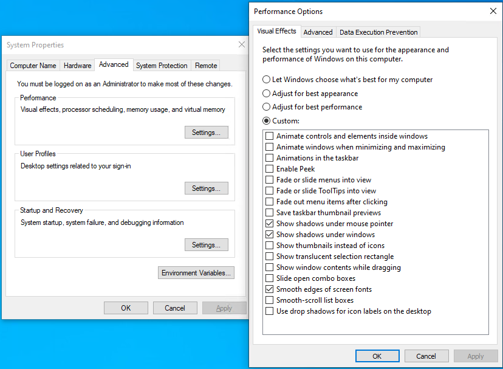
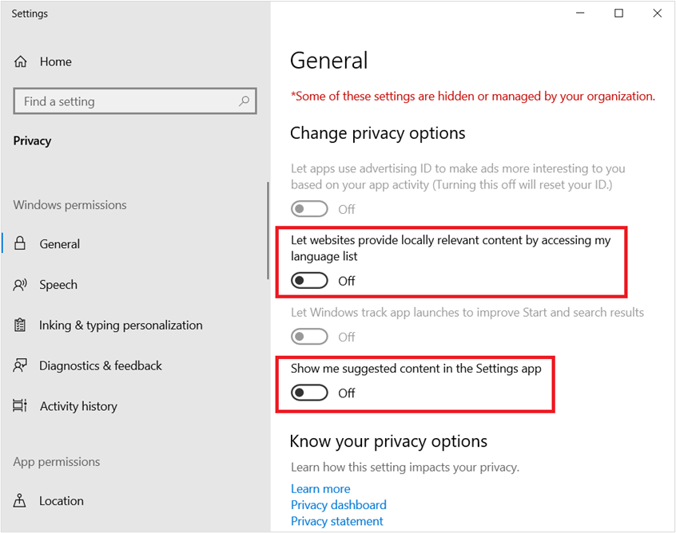

---
title: Optimizing Windows 10, Build 2004, for a Virtual Desktop role
description: Recommended settings and configuration to minimize overhead for Windows 10, version 2004 desktops used as VDI images.
ms.prod: windows-server
ms.reviewer: robsmi, timuessi
ms.technology: remote-desktop-services
ms.author: robsmi
ms.topic: article
author: robsmi, timuessi
manager: 
ms.date: 07/10/2020
---

# Optimizing Windows 10, version 2004, for a Virtual Desktop Infrastructure (VDI) role

This article is intended to provide suggestions for configurations for Windows 10, build 2004, for optimal performance in Virtualized Desktop environments, including Virtual Desktop Infrastructure (VDI) and Windows Virtual Desktop (WVD). All settings in this guide are suggested optimization settings only and are in no way requirements.

The information in this guide is pertinent to Windows 10, version 2004, operating system (OS) build 19041.

The guiding principles to optimize performance of Windows 10 in a virtual desktop environment are to minimize graphic redraws and “effects”, background activities that have no major benefit to the virtual desktop environment, and generally reduce running processes to the bare minimum. A secondary goal is to reduce disk space usage in the base image to the bare minimum.  With virtual desktop implementations, the smallest possible base, or “gold” image size, can slightly reduce memory utilization on the host system, as well as a small reduction in overall network operations required to deliver the desktop environment to the consumer.

No optimizations should reduce the user experience.  Each optimization setting has been carefully reviewed to ensure that there is no appreciable degradation to the user experience.

> [!NOTE]
> The settings in this article can be applied to other Windows 10 installations, such as version 1909, physical devices, or other virtual machines. There are no recommendations in this article that should affect supportability of Windows 10 in a virtual desktop environment.

## VDI Optimization Principles

A “full” virtual desktop environment can present a complete desktop session, including applications, to a computer user over a network. The network delivery vehicle can be an on-premises network, the Internet, or both. Some implementations of virtual desktop environments use a “base” operating system image, which then becomes the basis for the desktops subsequently presented to the users for work. There are variations of virtual desktop implementations such as “persistent”, “non-persistent”, and “desktop session”. The persistent type preserves changes to the virtual desktop operating system from one session to the next. The non-persistent type does not preserve changes to the virtual desktop operating system from one session to the next. To the user this desktop is little different than other virtual or physical device, other than it is accessed over a network.

The optimization settings could take place on a reference machine.  A virtual machine (VM) would be an ideal place to build the VM, because state can be saved, checkpoints can be made, backups can be made, etc. A default OS installation is performed to the base VM. That base VM is then optimized by removing unneeded apps, installing Windows updates, installing other updates, deleting temporary files, applying settings, etc.

There are other types of virtual desktop technology such as Remote Desktop Session (RDS) and the recently released Microsoft Azure [Windows Virtual Desktop](https://azure.microsoft.com/en-us/services/virtual-desktop/). An in-depth discussion regarding these technologies is outside the scope of this article. This article focuses on the Windows base image settings, without reference to other factors in the environment such as host hardware optimization.

Security and stability are among the highest priorities for Microsoft when it comes to products and services. In the virtual desktop realm, security is not handled much differently than physical devices. Enterprise customers may choose to utilize the built-in to Windows services of Windows Security, which comprises a suite of services that work well connected or not connected to the Internet. For those virtual desktop environments not connected to the Internet, security signatures can be downloaded proactively several times per day, because Microsoft may release more than one signature update per day. Those signatures can then be provided to the virtual desktop devices and scheduled to be installed during production, regardless of persistent or non-persistent. That way the VM protection is as current as possible.

There are some security settings that are not applicable to virtual desktop environments that are not connected to the Internet, and thus not able to participate in cloud-enabled security. There are other settings that “normal” Windows devices may utilize such as Cloud Experience, The Windows Store, etc. Removing access to unused features reduces footprint, network bandwidth, and attack surface.

Regarding updates, Windows 10 utilizes a monthly update rhythm. In some cases virtual desktop administrators control the process of updating through a process of shutting down VMs based on a “master” or “gold” image, unseal that image which is read-only, patch the image, then reseal it and bring it back into production. Therefore, there is no need to have virtual desktop devices checking Windows Update. There are cases however, as in the case of persistent “personal” virtual desktop devices, where normal patching procedures take place. In some cases, Windows Update can be utilized. In some cases, Intune could be utilized.  In some cases Microsoft Endpoint Configuration Manager (formerly SCCM) is utilized to handle update and other package delivery.  It is up to each organization to determine the best approach to updating virtual desktop devices, while reducing overhead cycles.

The local policy settings, as well as many other settings in this guide can be overridden with domain-based policy.  It is recommended to go through the policy settings thoroughly and remove or not use any that are not desired or applicable to your environment.  The settings listed in this document try to achieve the best balance of performance optimization in virtual desktop environments, while maintaining a quality user experience.

> [!NOTE]
> There is a set of scripts available at GitHub.com, that will do all the work items documented in this paper. The Internet URL for the optimization scripts can be found at [https://github.com/The-Virtual-Desktop-Team/Virtual-Desktop-Optimization-Tool](https://github.com/The-Virtual-Desktop-Team/Virtual-Desktop-Optimization-Tool).  This script was designed to be easily customizable for your environment and requirements. The main code is PowerShell, and the work is done by calling input files, which are plain text (now .JSON), with also Local Group Policy Object (LGPO) tool export files. These text files contain lists of the apps to be removed, services to be disabled, and so on. If you do not wish to remove a particular app or disable a particular service, you can edit the corresponding text file and remove the item you do not want acted upon.  Finally, there is an export of local policy settings that can be imported into your environment machines. It is better to have some of the settings within the base image, than to have the settings applied through group policy, as some of the settings take effect on the next restart or when a component is first used.


### Persistent Virtual Desktop Environments

Persistent virtual desktop is at the basic level, a device that saves operating system state in between reboots. Other software layers of the virtual desktop solution provide the users easy and seamless access to their assigned VMs, often with a single sign-on solution.  

There are several different implementations of persistent virtual desktop.

- Traditional virtual machine (VM), where the VM has its own virtual disk file, starts up normally, and saves changes from one session to the next. The difference is how the user accesses this VM. There may be a web portal the user logs into that automatically directs the user to their one or more assigned virtual desktop devices (VMs).
- Image-based persistent VM, optionally with personal virtual disks (PVD). In this type of implementation there is a base/gold image on one or more host servers. A VM is created, and one or more virtual disks are created and assigned to this disk for persistent storage.
    - When the VM is started, a copy of the base image is read into the memory space of that VM. At the same time, a persistent virtual disk assigned to that VM, with any previous OS deltas is merged through a complex process.
    - Changes such as event log writes, log writes, etc. are redirected to the read/write virtual disk assigned to that VM.
    - In this circumstance, OS and app servicing may operate normally, using traditional servicing software such as Windows Server Update Services, or other management technologies.
- The difference between a persistent virtual desktop device and a “normal” virtual desktop device” is the relationship to the master/gold image. At some point updates must be applied to the master. It is at this point where organizations decide how the user persistent changes are handled. In some cases, the disk with the user changes is discarded and/or reset.  It may also be that the changes the user makes to the machine are kept through monthly Quality Updates, and the base is reset following a Feature Update.

### Non-Persistent Virtual Desktop Environments

When a non-persistent virtual desktop implementation is based on a base or “gold” image, the optimizations are mostly performed in the base image, and then through local settings and local policies.

With image-based non-persistent (NP) virtual desktop environments, the base image is read-only. When a NP virtual desktop device (VM) is started, a copy of the base image is streamed to the VM.  Activity that occurs during startup and thereafter until the next reboot is redirected to a temporary location. Usually the users are provided network locations to store their data.  In some cases, the user’s profile is merged with the standard VM to provide the user their settings.

One important aspect of NP virtual desktop that is based on a single image, is servicing.  Updates to the operating system (OS) and components of the OS are delivered usually once per month.  With image based virtual desktop environment, there are a set of processes that must be performed to get updates to the image:

- On a given host, all the VMs on that host, based from the base image must be shut down / turned off. This means the users are redirected to other VMs.
	-In some implementations, this is referred to as “draining”.  The virtual machine or session host, when set to draining mode, stops accepting new requests, but continues servicing users currently connected to the device.
	-In draining mode, when the last user logs off the device, that device is then ready for servicing operations.
-The base image is then opened and started up.  All maintenance activities are then performed, such as OS updates, .NET updates, app updates, etc.
-Any new settings that need to be applied are applied at this time.
-Any other maintenance is performed at this time.
-The base image is then shut down.
-The base image is sealed and set to go back into production.
-Users are allowed to log back on.

> [!NOTE]
> Windows 10 performs a set of maintenance tasks, automatically, on a periodic basis. There is a scheduled task that is set to run at 3:00 AM every day by default. This scheduled task performs a list of tasks, including Windows Update cleanup. You can view all the categories of maintenance that take place automatically with this PowerShell command:
>
```PowerShell
Get-ScheduledTask | Where-Object {$_.Settings.MaintenanceSettings}
```
>

One of the challenges with non-persistent virtual desktop is that when a user logs off, nearly all the operating system (OS) activity is discarded.  The user’s profile and/or state may be saved to a centralized location, but the virtual machine itself discards nearly all changes that were made since last boot. Therefore, optimizations intended for a Windows computer that saves state from one session to the next are not applicable.

Depending on the architecture of virtual desktop device, things like PreFetch and SuperFetch are not going to help from one session to the next, as all the optimizations are discarded on VM restart. Indexing may be a partial waste of resources, as would be any disk optimizations such as a traditional defragmentation.

> [!NOTE]
> If preparing an image using virtualization, and if connected to the Internet during image creation process, on first logon you should postpone Feature Updates by going to ‘**Settings**’, ‘**Windows Update**’.

### To Sysprep or not Sysprep

Windows 10 has a built-in capability called the ‘[System Preparation Tool](https://docs.microsoft.com/en-us/windows-hardware/manufacture/desktop/sysprep--system-preparation--overview)’, (AKA Sysprep).  The Sysprep tool is used to prepare a customized Windows 10 image for duplication. The Sysprep process assures the resulting OS is properly unique to run in production.

There are reasons for and against running Sysprep. In the case of virtual desktop environments, you may want the ability to customize the default user profile which would be used as the profile template for subsequent users that log on using this image. You may have apps that you want installed, but also able to control per-app settings.

The alternative is to use a standard .ISO to install from, possibly using an unattended installation answer file, and a task sequence to install applications or remove applications.  You can also use a task sequence to set local policy settings in the image, perhaps using the [Local Group Policy Object Utility (LGPO)](https://blogs.technet.microsoft.com/secguide/2016/01/21/lgpo-exe-local-group-policy-object-utility-v1-0/) tool.

For information about image preparation for Azure, see the following article:
[Prepare a Windows VHD or VHDX to upload to Azure](https://docs.microsoft.com/en-us/azure/virtual-machines/windows/prepare-for-upload-vhd-image)

### Supportability

Anytime that Windows defaults are changed, questions arise regarding supportability. Once a virtual desktop image (VM or session) is customized, every change made to the image needs to be tracked in a change log. If a time comes to troubleshoot, often an image can be isolated in a pool and configured for problem analysis. Once a problem has been tracked to root cause, that change can then be rolled out to the test environment first, and ultimately to the production workload.

This document intentionally avoids touching system services, policies, or tasks that affect security. After that comes Windows servicing. The ability to service virtual desktop images outside of maintenance windows is removed, as maintenance windows are when most servicing events take place in virtual desktop environments, except for security software updates. Microsoft has published guidance for Windows Security in virtual desktop environments, here:

**Microsoft**: [Deployment guide for Windows Defender Antivirus in a virtual desktop infrastructure (VDI) environment](https://docs.microsoft.com/en-us/windows/security/threat-protection/windows-defender-antivirus/deployment-vdi-windows-defender-antivirus)

Please consider supportability when altering default Windows settings. Occasionally difficult to solve problems arise when altering system services, policies, or scheduled tasks, in the name of hardening, “lightening”, etc. Please consult the Microsoft Knowledge Base for current known issues regarding altered default settings. The guidance in this document, and the associated script on GitHub will be maintained with respect to known issues, if any arise. In addition you can report issues in a number of ways to Microsoft.

You can use your favorite search engine with the terms ""start value" site:support.microsoft.com" to bring up known issues regarding default start values for services and so on.

You may note that this document and the associated scripts on GitHub do not modify any default permissions. If you are interested in increasing your security settings in a supported and robust manner, start with the project known as “**AaronLocker**”, which can be found at this Internet location:

**Microsoft**: [ANNOUNCING: Application whitelisting with “AaronLocker”](https://blogs.msdn.microsoft.com/aaron_margosis/2018/06/26/announcing-application-whitelisting-with-aaronlocker/)


### Virtual Desktop Optimization Categories
- Universal Windows Platform (UWP) app cleanup
- Optional Features cleanup
- Local policy settings
- System services
- Scheduled tasks
- Apply Windows (and other) updates
- Automatic Windows traces
- Windows Defender optimization with VDI
- Client network performance tuning by registry settings
- Additional settings from the “Windows Restricted Traffic Limited Functionality Baseline” guidance.
- Disk cleanup

### Universal Windows Platform (UWP) application cleanup

One of the goals of a virtual desktop image is to be as light as possible with respect to persistent storage. One way to reduce the size of the image is to remove UWP applications (apps) that will not be used in the environment. With UWP apps, there are the main application files, also known as the payload. There is a small amount of data stored in each user’s profile for application specific settings. There is also a small amount of data in the ‘All User’s’ profile.

In addition, all UWP apps are registered at either the user or machine level at some point after startup for the device, and login for the user. The UWP apps, which include the Start Menu and the Windows Shell, perform various tasks at or after installation, and again when a user logs in for the first time, and to a lesser extent at subsequent logins.  For all UWP apps, there are occasional evaluations that take place, such as:

- Is the app current...does it need an update?
- The app, if pinned to the Start Menu, might have live tile data to download
- Does the app have a cache of data that needs to be updated, such as maps or weather?
- Does the app have persistent data from the user's profile that needs to be presented at login (ex. Sticky Notes)
 
With a default installation of Windows 10, not all UWP apps may be used by an organization. Therefore, if those apps are removed, there are less evaluations to take place…less caching, etc.  The second method here is to direct Windows to disable “consumer experiences”.  This reduces Store activity by having to check for every user what apps are installed, what apps are available, and then to start downloading some UWP apps.  The performance savings can be significant when there are hundreds or thousands of users, all start work at approximately the same time, or even starting work at rolling times across time zones.

Connectivity and timing are important factors when it comes to UWP app cleanup. If you deploy your base image to a device with no network connectivity, Windows 10 cannot connect to the Microsoft Store and download apps and try to install them while you are trying to uninstall them. This might be a good strategy to allow you time to customize your image, and then update what remains at a later stage of the image creation process.

If you modify your base .WIM that you use to install Windows 10 and remove unneeded UWP apps from the .WIM before you install, the apps will not be installed from the beginning and your subsequent profile creation times will be shorter.  There is a link later in this section with information on how to remove UWP apps from your installation .WIM file.

A good strategy for the virtual desktop environment is to provision the apps you want in the base image, then limit or block access to the Microsoft Store afterward. Store apps are updated periodically in the background on normal computers. The UWP apps can be updated during the maintenance window when other updates are applied. There is a great paper on this topic, recently published, and available here:

Microsoft: [Universal Windows Platform Apps](https://docs.citrix.com/en-us/xenapp-and-xendesktop/current-release/manage-deployment/applications-manage/universal-apps.html)

#### Delete the payload of UWP apps

UWP apps that are not needed are still in the file system consuming a small amount of disk space. For apps that will never be needed, the payload of unwanted UWP apps can be removed from the base image using PowerShell commands.  If you delete UWP app payloads out of the installation .WIM file using the links provided later in this section, you can start from the beginning with a very slim list of UWP apps.
 
Run the following command to enumerate provisioned UWP apps from a running OS, as in this truncated example output from PowerShell:

```powershell
    Get-AppxProvisionedPackage -Online

    DisplayName  : Microsoft.3DBuilder
    Version      : 13.0.10349.0  
    Architecture : neutral
    ResourceId   : \~ 
    PackageName  : Microsoft.3DBuilder_13.0.10349.0_neutral_\~_8wekyb3d8bbwe
    Regions      :

    DisplayName  : Microsoft.Appconnector
    Version      : 2015.707.550  
    Architecture : neutral
    ResourceId   : \~ 
    PackageName  : Microsoft.Appconnector_2015.707.550.0_neutral_\~_8wekyb3d8bbwe
    Regions      :
    ...
```
UWP apps that are provisioned to a system can be removed during OS installation as part of a task sequence, or later after the OS is installed. This may be the preferred method because it makes the overall process of creating and/or maintaining an image modular. Once you develop the scripts, if something changes in a subsequent build you edit an existing script rather than repeat the process from scratch. Here are some links to information on this topic:

- Microsoft: [Removing Windows 10 in-box apps during a task sequence](https://blogs.technet.microsoft.com/mniehaus/2015/11/11/removing-windows-10-in-box-apps-during-a-task-sequence/)
- Microsoft: [Removing Built-in apps from Windows 10 WIM-File with PowerShell - Version 1.3](https://gallery.technet.microsoft.com/Removing-Built-in-apps-65dc387b)
- Microsoft: [Windows 10 1607: Keeping apps from coming back when deploying the feature update](https://blogs.technet.microsoft.com/mniehaus/2016/08/23/windows-10-1607-keeping-apps-from-coming-back-when-deploying-the-feature-update/)
- Microsoft: [Removing Windows 10 in-box apps during a task sequence](https://blogs.technet.microsoft.com/mniehaus/2015/11/11/removing-windows-10-in-box-apps-during-a-task-sequence/)

Then run the Remove-AppxProvisionedPackage PowerShell command to remove UWP app payloads is as follows:

```powershell
Remove-AppxProvisionedPackage -Online - PackageName MyAppxPackage 
```

As a final note on this topic, each UWP app should be evaluated for applicability in each unique environment. You will want to install a default installation of Windows 10 2004, then note which apps are running and consuming memory. For example, you may want to consider removing apps that start automatically, or apps that automatically display information on the Start Menu, such as Weather and News, and that may not be of use in your environment.

> [!NOTE] 
> If utilizing the scripts from GitHub, you can easily control which apps are removed before running the script. After downloading the script files, locate the file ‘AppxPackage.json’, edit that file, and remove entries for apps that you want to keep, such as Calculator, Sticky Notes, etc.


## Windows Optional Features cleanup

### Managing Optional Features with PowerShell

Microsoft: [https://social.technet.microsoft.com/wiki/contents/articles/39386.windows-10-managing-optional-features-with-powershell.aspx](https://social.technet.microsoft.com/wiki/contents/articles/39386.windows-10-managing-optional-features-with-powershell.aspx)

You can manage Windows Optional Features using PowerShell. To enumerate currently installed Windows Features, run the following PowerShell command:

```powershell
Get-WindowsOptionalFeature -Online
```

Using PowerShell, an enumerated Windows ZOptional Feature can be configured as enabled or disabled, as in the following example:

```powershell
Enabled-WindowsOptionalFeature -Online -FeatureName "DirectPlay" -All
```

Examples of disabling features in the virtual desktop image:

```powershell
Disable-WindowsOptionalFeature -Online -FeatureName "WindowsMediaPlayer"
```

Next, you may want to remove teh WIndows Media Player package.

```powershell

PS C:\> Get-WindowsPackage -Online -PackageName *media*

PS C:\Windows\system32> Get-WindowsPackage -Online -PackageName *media*       
                                                                                                                                                                 
PackageName              : Microsoft-Windows-MediaPlayer-Package~31bf3856ad364e35~amd64~~10.0.19041.153
Applicable               : True
Copyright                : Copyright (c) Microsoft Corporation. All Rights Reserved
Company                  :
CreationTime             :
Description              : Play audio and video files on your local machine and on the Internet.
InstallClient            : DISM Package Manager Provider
InstallPackageName       : Microsoft-Windows-MediaPlayer-Package~31bf3856ad364e35~amd64~~10.0.19041.153.mum
InstallTime              : 5/11/2020 5:43:37 AM
LastUpdateTime           :
DisplayName              : Windows Media Player
ProductName              : Microsoft-Windows-MediaPlayer-Package
ProductVersion           :
ReleaseType              : OnDemandPack
RestartRequired          : Possible
SupportInformation       : http://support.microsoft.com/?kbid=777777
PackageState             : Installed
CompletelyOfflineCapable : Undetermined
CapabilityId             : Media.WindowsMediaPlayer~~~~0.0.12.0
Custom Properties        :

Features                 : {}
```

If you want to remove the Windows Media Player package (to free up about 60 MB disk space), you can run this command:

```powershell
PS C:\Windows\system32> Remove-WindowsPackage -PackageName Microsoft-Windows-MediaPlayer-Package~31bf3856ad364e35~amd64~~10.0.19041.153 -Online

Path          :
Online        : True
RestartNeeded : False
```

### Enable of Disable Windows Features Using DISM

You can use the built-in Dism.exe tool to enumerate and control Windows Optional Features. A Dism.exe script could be developed and run during an operating system installation task sequence. The Windows technology involved is called Features on Demand. See the following article for more about Features on Demand in Windows:

Microsoft: [Features on Demand](https://docs.microsoft.com/en-us/windows-hardware/manufacture/desktop/features-on-demand-v2--capabilities)

### Default User Settings

There are customizations that can be made to a Windows registry file called ‘C:\Users\Default\NTUSER.DAT’. Any settings made to this file will be applied to any subsequent user profiles created from a machine running this image. You can control which settings you wish to apply to the default user profile, by editing the file ‘**DefaultUserSettings.txt**’.

To reduce the transmitting of graphical data over the virtual desktop infrastructure, you can set the default background to a solid color instead of the default Windows 10 image. You can also set the logon screen to be a solid color, as well as turn off the opaque blurring effect on logon.

The following settings are applied to the default user profile registry hive, mainly to reduce animations. If some or all of these settings are not desired, delete out the settings that you do not wish to have applied to new user profiles based on this image. The goal with these settings is to enable the following equivalent settings:



And, new to this version of settings is a method to disable the following two privacy settings for any user profile created after this optimization has been run:



The following are the optimization settings applied to the default user profile registry hive to optimize performance.  Note that this operation is performed by first loading the default user profile registry hive ‘**NTUser.dat**’, as the ephemeral key name ‘**Temp**’, and then making the below listed modifications:

```
Load HKLM\Temp C:\Users\Default\NTUSER.DAT
add "HKLM\Temp\Software\Microsoft\Windows\CurrentVersion\Explorer" /v ShellState /t REG_BINARY /d 240000003C2800000000000000000000 /f
add "HKLM\Temp\Software\Microsoft\Windows\CurrentVersion\Explorer\Advanced" /v IconsOnly /t REG_DWORD /d 1 /f
add "HKLM\Temp\Software\Microsoft\Windows\CurrentVersion\Explorer\Advanced" /v ListviewAlphaSelect /t REG_DWORD /d 0 /f
add "HKLM\Temp\Software\Microsoft\Windows\CurrentVersion\Explorer\Advanced" /v ListviewShadow /t REG_DWORD /d 0 /f
add "HKLM\Temp\Software\Microsoft\Windows\CurrentVersion\Explorer\Advanced" /v ShowCompColor /t REG_DWORD /d 1 /f
add "HKLM\Temp\Software\Microsoft\Windows\CurrentVersion\Explorer\Advanced" /v ShowInfoTip /t REG_DWORD /d 1 /f
add "HKLM\Temp\Software\Microsoft\Windows\CurrentVersion\Explorer\Advanced" /v TaskbarAnimations /t REG_DWORD /d 0 /f
add "HKLM\Temp\Software\Microsoft\Windows\CurrentVersion\Explorer\VisualEffects" /v VisualFXSetting /t REG_DWORD /d 3 /f
add "HKLM\Temp\Software\Microsoft\Windows\DWM" /v EnableAeroPeek /t REG_DWORD /d 0 /f
add "HKLM\Temp\Software\Microsoft\Windows\DWM" /v AlwaysHiberNateThumbnails /t REG_DWORD /d 0 /f
add "HKLM\Temp\Control Panel\Desktop" /v DragFullWindows /t REG_SZ /d 0 /f
add "HKLM\Temp\Control Panel\Desktop" /v FontSmoothing /t REG_SZ /d 2 /f
add "HKLM\Temp\Control Panel\Desktop" /v UserPreferencesMask /t REG_BINARY /d 9032078010000000 /f
add "HKLM\Temp\Control Panel\Desktop\WindowMetrics" /v MinAnimate /t REG_SZ /d 0 /f
add "HKLM\Temp\Software\Microsoft\Windows\CurrentVersion\StorageSense\Parameters\StoragePolicy" /v 01 /t REG_DWORD /d 0 /f
add "HKLM\Temp\Software\Microsoft\Windows\CurrentVersion\ContentDeliveryManager" /v SubscribedContent-338393Enabled /t REG_DWORD /d 0 /f
add "HKLM\Temp\Software\Microsoft\Windows\CurrentVersion\ContentDeliveryManager" /v SubscribedContent-353694Enabled /t REG_DWORD /d 0 /f
add "HKLM\Temp\Software\Microsoft\Windows\CurrentVersion\ContentDeliveryManager" /v SubscribedContent-353696Enabled /t REG_DWORD /d 0 /f
add "HKLM\Temp\Software\Microsoft\Windows\CurrentVersion\ContentDeliveryManager" /v SubscribedContent-338388Enabled /t REG_DWORD /d 0 /f
add "HKLM\Temp\Software\Microsoft\Windows\CurrentVersion\ContentDeliveryManager" /v SubscribedContent-338389Enabled /t REG_DWORD /d 0 /f
add "HKLM\Temp\Software\Microsoft\Windows\CurrentVersion\ContentDeliveryManager" /v SystemPaneSuggestionsEnabled /t REG_DWORD /d 0 /f
add "HKLM\Temp\Control Panel\International\User Profile" /v HttpAcceptLanguageOptOut /t REG_DWORD /d 1 /f
add "HKLM\Temp\Software\Microsoft\Windows\CurrentVersion\BackgroundAccessApplications\Microsoft.Windows.Photos_8wekyb3d8bbwe" /v Disabled /t REG_DWORD /d 1 /f
add "HKLM\Temp\Software\Microsoft\Windows\CurrentVersion\BackgroundAccessApplications\Microsoft.Windows.Photos_8wekyb3d8bbwe" /v DisabledByUser /t REG_DWORD /d 1 /f
add "HKLM\Temp\Software\Microsoft\Windows\CurrentVersion\BackgroundAccessApplications\Microsoft.SkypeApp_kzf8qxf38zg5c" /v Disabled /t REG_DWORD /d 1 /f
add "HKLM\Temp\Software\Microsoft\Windows\CurrentVersion\BackgroundAccessApplications\Microsoft.SkypeApp_kzf8qxf38zg5c" /v DisabledByUser /t REG_DWORD /d 1 /f
add "HKLM\Temp\Software\Microsoft\Windows\CurrentVersion\BackgroundAccessApplications\Microsoft.YourPhone_8wekyb3d8bbwe" /v Disabled /t REG_DWORD /d 1 /f
add "HKLM\Temp\Software\Microsoft\Windows\CurrentVersion\BackgroundAccessApplications\Microsoft.YourPhone_8wekyb3d8bbwe" /v DisabledByUser /t REG_DWORD /d 1 /f
add "HKLM\Temp\Software\Microsoft\Windows\CurrentVersion\BackgroundAccessApplications\Microsoft.MicrosoftEdge_8wekyb3d8bbwe" /v Disabled /t REG_DWORD /d 1 /f
add "HKLM\Temp\Software\Microsoft\Windows\CurrentVersion\BackgroundAccessApplications\Microsoft.MicrosoftEdge_8wekyb3d8bbwe" /v DisabledByUser /t REG_DWORD /d 1 /f
add "HKLM\Temp\Software\Microsoft\InputPersonalization" /v RestrictImplicitInkCollection /t REG_DWORD /d 1 /f
add "HKLM\Temp\Software\Microsoft\InputPersonalization" /v RestrictImplicitTextCollection /t REG_DWORD /d 1 /f
add "HKLM\Temp\Software\Microsoft\Personalization\Settings" /v AcceptedPrivacyPolicy /t REG_DWORD /d 0 /f
add "HKLM\Temp\Software\Microsoft\InputPersonalization\TrainedDataStore" /v HarvestContacts /t REG_DWORD /d 0 /f
add "HKLM\Temp\Software\Microsoft\Windows\CurrentVersion\UserProfileEngagement" /v ScoobeSystemSettingEnabled /t REG_DWORD /d 0 /f
add "HKLM\Temp\Software\Microsoft\Windows\CurrentVersion\UserProfileEngagement" /v ScoobeSystemSettingEnabled /t REG_DWORD /d 0 /f
add "HKLM\Temp\Software\Microsoft\Windows\CurrentVersion\UserProfileEngagement" /v ScoobeSystemSettingEnabled /t REG_DWORD /d 0 /f
Unload HKLM\Temp
```

Another series of default user settings recently added is to disable several Windows apps from starting and running in the background.  While not significant on a single device, Windows 10 starts up a number of processes for each user session on a given device (host).  The Skype app is one example, and Microsoft Edge is another.  The settings included turn off several apps from being able to run in the background.  If this functionality is desired as it is, just delete out the lines in the ‘DefaultUserSettings.txt’ that include the app names ‘**Windows.Photos**’, ‘**SkypeApp**’, ‘**YourPhone**’, and/or ‘**MicrosoftEdge**’.

### Local Policy Settings

Many optimizations for Windows 10 in a virtual desktop environment can be made using Windows policy. The settings listed in the table in this section can be applied locally to the base/gold image. Then if the equivalent settings are not specified in any other way, such as group policy, the settings would still apply.

Note that some decisions may be based on the specifics of the environment.

- Is the virtual desktop environment allowed to access the Internet?
- Is the virtual desktop solution persistent or non-persistent?

The following settings were chosen to not counter or conflict with any setting that has anything to do with security. These settings were chosen to remove settings or disable functionality that may not be applicable to virtual desktop environments.

| Policy Setting | Item | Sub-item | Possible setting and comments|
| -------------- | ---- | -------- | ---------------------------- |
| Local Computer Policy \\ Computer Configuration \\ Windows Settings \\ Security Settings | | | |
| Network List Manager policies | All networks properties | Network location | **User cannot change location** (This is set to prevent the right-hand side pop-up when a new network is detected) |
| Local Computer Policy \\ Computer Configuration \\ Administrative Templates \\ Control Panel | | |
| Control Panel | Allow Online Tips |  | **Disabled** (Settings will not contact Microsoft content services to retrieve tips and help content) |
| Control Panel \ Personalization | Force a specific default lock screen and logon image | [](media/lock-screen-image-settings.png) | Enabled (This setting allows you to force a specific default lock screen and logon image by entering the path (location) of the image file. The same image will be used for both the lock and logon screens. <p>NOTE: The reason for this recommendation is to reduce bytes transmitted over the network for virtual desktop environments. This setting can be removed or customized for each environment.)|
|Control Panel\ Regional and Language Options\Handwriting personalization|Turn off automatic learning||**Enabled** (With this policy setting enabled, automatic learning stops, and any stored data is deleted. Users cannot configure this setting in Control Panel)|
|Local Computer Policy \ Computer Configuration \ Administrative Templates \ Network||||
|Background Intelligent Transfer Service (BITS)|Allow BITS Peercaching||**Disabled** (This policy setting determines if the Background Intelligent Transfer Service (BITS) peer caching feature is enabled on a specific computer.)|
|Background Intelligent Transfer Service (BITS)|Do not allow the BITS client to use Windows Branch Cache||**Enabled** (With this policy setting enabled, the BITS client does not use Windows Branch Cache.)<p>**NOTE**:  The reason for this recommendation is so that virtual desktop devices are not used for content caching, and the devices will not be allowed to use the network bandwidth to do so.|
|Background Intelligent Transfer Service (BITS)|Do not allow the computer to act as a BITS Peercaching client||**Enabled** (With this policy setting enabled, the computer will no longer use the BITS peer caching feature to download files; files will be downloaded only from the origin server.)|
Background Intelligent Transfer Service (BITS)|Do not allow the computer to act as a BITS Peercaching server||**Enabled** (With this policy setting enabled, the computer will no longer cache |downloaded files and offer them to its peers.)|
|BranchCache|Turn on BranchCache||**Disabled** (With this selection disabled, BranchCache is turned off for all client computers where the policy is applied.)|
|*Fonts|Enabled Font Providers||**Disabled** (With this setting disabled, Windows does not connect to an online font provider and only enumerates locally installed fonts)|
|Hotspot Authentication|Enable hotspot Authentication||**Disabled** (This policy setting defines whether WLAN hotspots are probed for Wireless Internet Service Provider roaming (WISPr) protocol support.With this policy setting disabled, WLAN hotspots are not probed for WISPr protocol support, and users can only authenticate with WLAN hotspots using a web browser.)|
|Microsoft Peer-to-Peer Networking Services|Turn off Microsoft Peer-to-Peer Networking Services||**Enabled** (This setting turns off Microsoft Peer-to-Peer Networking Services in its entirety and will cause all dependent applications to stop working.If you enable this setting, peer-to-peer protocols will be turned off.)|
|Network Connectivity Status Indicator<p>(**NOTE**: There are other settings in this section that can be used in isolated networks)|Specify passive polling|Disable passive poling (**checkbox**)|**Enabled** (This Policy setting enables you to specify passive polling behavior. NCSI polls various measurements throughout the network stack on a frequent interval to determine if network connectivity has been lost.  Use the options to control the passive polling behavior.)<P>**NOTE**: Disabling NCIS passive polling can improve CPU workload on servers or other machines whose network connectivity is static.|
|Offline Files|Allow or Disallow use of the Offline Files feature||**Disabled** (This policy setting determines whether the Offline Files feature is enabled. Offline Files saves a copy of network files on the user's computer for use when the computer is not connected to the network.With this policy setting disabled, Offline Files feature is disabled and users cannot enable it.)|
|*TCPIP Settings\ IPv6 Transition Technologies|	Set Teredo State|Disabled State|**Enabled** (With this setting enabled, and set to "Disabled State", no Teredo interfaces are present on the host)|
*WLAN Service\ WLAN Settings|Allow Windows to automatically connect to suggested open hotspots, to networks shared by contacts, and to hotspots offering paid services||**Disabled** (This policy setting determines whether users can enable the following WLAN settings: "Connect to suggested open hotspots," "Connect to networks shared by my contacts," and "Enable paid services". With this policy setting disabled, "Connect to suggested open hotspots," "Connect to networks shared by my contacts," and "Enable paid services" will be turned off and users on this device will be prevented from enabling them.)|
|WWAN Service\ Cellular Data Access|Let Windows apps access cellular data|Default for all apps: **Force Deny**|**Enabled** (If you choose the "Force Deny" option, Windows apps are not allowed to access cellular data and users cannot change it.)|
|Local Computer Policy \ Computer Configuration \ Administrative Templates \ Start Menu and Taskbar|||
