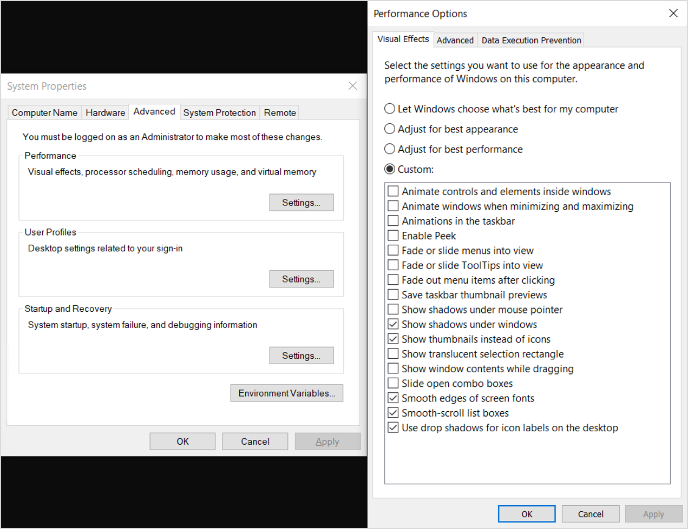
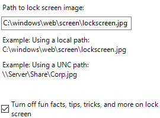
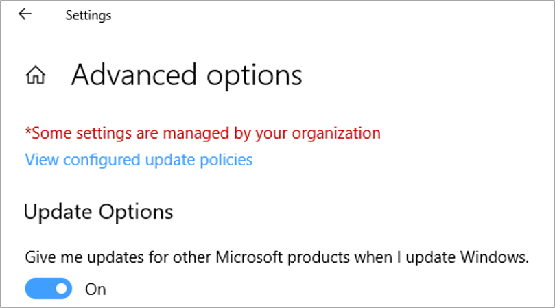
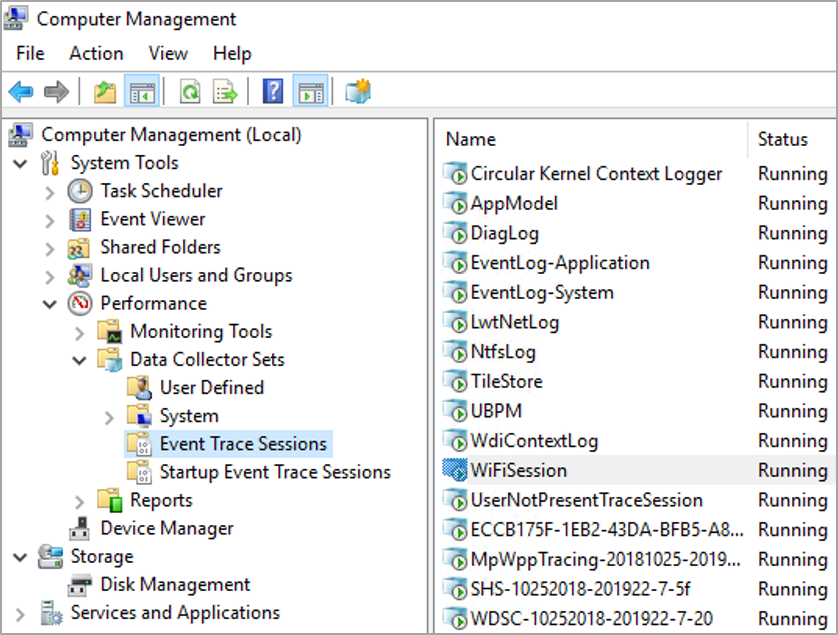

# Optimizing Windows 10, version 1909, for a Virtual Desktop Infrastructure (VDI) role

This article helps you choose settings for Windows 10, version 1909 (build 18363) that should result in the best performance in a Virtualized Desktop Infrastructure (VDI) environment. All settings in this guide are recommendations to be considered and are in no way requirements.

The key ways to optimize Windows 10 performance in a VDI environment are to minimize app graphic redraws, background activities that have no major benefit to the VDI environment, and generally reduce running processes to the bare minimum. A secondary goal is to reduce disk space usage in the base image to the bare minimum. With VDI implementations, the smallest possible base, or “gold” image size, can slightly reduce memory usage on the hypervisor, as well as a small reduction in overall network operations required to deliver the desktop image to the consumer.

> [!NOTE]
> These recommended settings can be applied to other Windows 10 1909 installations, including those on physical or other virtual machines. No recommendations in this article should affect supportability of Windows 10 1909.

## VDI Optimization Principles

A VDI environment presents a full desktop session, including applications, to a computer user over a network. The network delivery vehicle can be an on-premises network or could be the Internet. VDI environments are a “base” operating system image, which then becomes the basis for the desktops subsequently presented to the users. There are variations of VDI implementations such as “persistent”, “non-persistent”, and “desktop session”. The persistent type preserves changes to the VDI desktop OS from one session to the next. The non-persistent type does not preserve changes to the VDI desktop OS from one session to the next. To the user, this desktop isn't much different to any other virtual or physical device, other than being accessed over a network.

The optimization settings would take place on a reference device. A VM would be an ideal place to build the image, because the state can be saved, checkpoints can be made, and backups can be done. A default OS installation is performed on the base VM. That base VM is then optimized by removing unnecessary apps, installing Windows updates, installing other updates, deleting temporary files, and applying settings.

There are other types of VDI such as Remote Desktop Session (RDS) and the recently released [Windows Virtual Desktop](https://azure.microsoft.com/services/virtual-desktop/). An in-depth discussion regarding these technologies is outside the scope of this article. This article focuses on the Windows base image settings, without reference to other factors in the environment such as host optimization.

Security and stability are top priorities for Microsoft when it comes to products and services. Enterprise customers might choose to utilize the built-in Windows Security, a suite of services that work well with or without Internet. For those VDI environments not connected to the Internet, security signatures can be downloaded several times per day, as Microsoft might release more than one signature update per day. Those signatures can then be provided to the VDI VMs and scheduled to be installed during production, regardless of persistent or non-persistent. That way the VM protection is as current as possible.

There are some security settings that are not applicable to VDI environments that are not connected to the Internet, and thus not able to participate in cloud-enabled security. There are other settings that “normal” Windows devices might utilize such as Cloud Experience, The Windows Store, and so on. Removing access to unused features reduces footprint, network bandwidth, and attack surface.

Regarding updates, Windows 10 utilizes a monthly update algorithm, so there is no need for clients to attempt to update. In most cases VDI administrators control the process of updating through a process of shutting down VMs based on a “master”, or “gold” image, unseal that image which is read-only, patch the image, then reseal it and bring it back into production. Therefore, there is no need to have VDI VMs checking Windows Update. In certain instances, for example, persistent VDI VMs, normal patching procedures do take place. Windows Update or Microsoft Intune can also be used. System Center Configuration Manager can be used to handle update and other package delivery. It's up to each organization to determine the best approach to updating VDI.

> [!TIP]  
> A script that implements the optimizations discussed in this topic--as well as a GPO export file that you can import with **LGPO.exe**--is available at [TheVDIGuys](https://github.com/TheVDIGuys) on GitHub.

This script was designed to suit your environment and requirements. The main code is PowerShell, and the work is done by using input files (plain text), with Local Group Policy Object (LGPO) tool export files. These files contain lists of apps to be removed, and services to be disabled. If you do not wish to remove a particular app or disable a particular service, edit the corresponding text file and remove the item. Finally, there are local policy settings that can be imported into your device. It is better to have some settings within the base image, than to have the settings applied through the group policy, as some of the settings are effective on the next restart, or when a component is first used.

### Persistent VDI

Persistent VDI is, at the basic level, a VM that saves operating system states in between reboots. Other software layers of the VDI solution provide the users easy and seamless access to their assigned VMs, often with a single sign-on solution.

There are several different implementations of persistent VDI:

- Traditional virtual machine, where the VM has its own virtual disk file, starts up normally, saves changes from one session to the next. The difference is how the user accesses this VM. There might be a web portal the user logs into that automatically directs the user to their one or more assigned VDI VMs.

- Image-based persistent virtual machine, optionally with personal virtual disks. In this type of implementation there is a base/gold image on one or more host servers. A VM is created, and one or more virtual disks are created and assigned to this disk for persistent storage.

    - When the VM is started, a copy of the base image is read into the memory of that VM. At the same time, a persistent virtual disk is assigned to that VM, with any previous operating system changes merged through a complex process.

    - Changes such as event log writes, log writes, etc. are redirected to the read/write virtual disk assigned to that VM.

    - In this circumstance, operating system and app servicing might operate normally, using traditional servicing software such as Windows Server Update Services, or other management technologies.

    - The difference between a persistent VDI machine, and a “normal” virtual machine is the relationship to the master/gold image. At some point updates must be applied to the master. This is where implementations decide how the user persistent changes are handled. In some cases, the disk with the changes are discarded and/or reset, thus setting a new checkpoint. It might also be that the changes the user makes are kept through monthly quality updates, and the base is reset following a Feature Update.

### Non-Persistent VDI

When a non-persistent VDI implementation is based on a base or “gold” image, the optimizations are mostly performed in the base image, and then through local settings and local policies.

With image-based non-persistent VDI, the base image is read-only. When a non-persistent VM is started, a copy of the base image is streamed to the VM. Activity that occurs during startup and thereafter until the next reboot is redirected to a temporary location. Users are usually provided network locations to store their data. In some cases, the user’s profile is merged with the standard VM to provide the user with their settings.

One important aspect of non-persistent VDI that is based on a single image is servicing. Updates to the operating system and components are delivered usually once per month. With image-based VDI, there is a set of processes that must be performed to get updates to the image:

- On a given host, all the VMs on that host, that are derived from the base image must be shut down / turned off. This means the users are redirected to other VMs.

- The base image is then opened and started up. All maintenance activities are then performed, such as operating system updates, .NET updates, app updates, etc.

- Any new settings that need to be applied are applied at this time.

- Any other maintenance is performed at this time.

- The base image is then shut down.

- The base image is sealed and set to go back into production.

- Users can log back on.

> [!NOTE]
> Windows 10 performs a set of maintenance tasks, automatically, on a periodic basis. There is a scheduled task that is set to run at 3:00 AM every day by default. This scheduled task performs a list of tasks, including Windows Update cleanup. You can view all the categories of maintenance that take place automatically with this PowerShell command:
>
>```powershell
>Get-ScheduledTask | ? {$_.Settings.MaintenanceSettings}
>```
>

One of the challenges with non-persistent VDI is that when a user logs off, nearly all the operating system activity is discarded. The user’s profile and/or state might be saved to a centralized location, but the virtual machine itself discards nearly all changes that were made since the last boot. Therefore, optimizations intended for a Windows computer that saves state from one session to the next are not applicable.

Depending on the architecture of VDI VM, things like PreFetch and SuperFetch are not going to help from one session to the next, as all the optimizations are discarded on VM restart. Indexing might be a partial waste of resources, as would be any disk optimizations such as a traditional defragmentation.

> [!NOTE]
> If preparing an image using virtualization, and if connected to the Internet during image creation process, on first logon you should postpone Feature Updates by going to **Settings**, **Windows Update**.

### To Sysprep or not Sysprep

Windows 10 has a built-in capability called the [System Preparation Tool](https://docs.microsoft.com/windows-hardware/manufacture/desktop/sysprep--system-preparation--overview), (often abbreviated to "Sysprep"). The Sysprep tool is used to prepare a customized Windows 10 image for duplication. The Sysprep process assures the resulting operating system is properly unique to run in production.

There are reasons for and against running Sysprep. In the case of VDI, you might want the ability to customize the default user profile which would be used as the profile template for subsequent users that log on using this image. You might have apps that you want installed, but also able to control per-app settings.

The alternative is to use a standard .ISO to install from, possibly using an unattended installation answer file, and a task sequence to install applications or remove applications. You can also use a task sequence to set local policy settings in the image, perhaps using the [Local Group Policy Object Utility (LGPO) tool](https://docs.microsoft.com/archive/blogs/secguide/lgpo-exe-local-group-policy-object-utility-v1-0).

### Supportability

Anytime that Windows defaults are changed, questions arise regarding supportability. Once a VDI image (VM or session) is customized, every change made to the image needs to be tracked in a change log. At troubleshooting, often an image can be isolated in a pool and configured for problem analysis. Once a problem has been tracked to the root cause, that change can then be rolled out to the test environment first, and ultimately to the production workload.

This document intentionally avoids touching system services, policies, or tasks that affect security. After that comes Windows servicing. The ability to service VDI images outside of maintenance windows is removed, as maintenance windows are when most servicing events take place in VDI environments, *except for security software updates*. Microsoft has published guidance for Windows Security in VDI environments. For more information, see [Deployment guide for Windows Defender Antivirus in a virtual desktop infrastructure (VDI) environment](https://docs.microsoft.com/windows/security/threat-protection/windows-defender-antivirus/deployment-vdi-windows-defender-antivirus).

Consider supportability when altering default Windows settings. Difficult problems can arise when altering system services, policies, or scheduled tasks, in the name of hardening, “lightening”, etc. Consult the Microsoft Knowledge Base for current known issues regarding altered default settings. The guidance in this document, and the associated script on GitHub will be maintained with regards to known issues, if any arise. In addition, you can report issues in several ways to Microsoft.

You can use your favorite search engine with the terms “"start value" site:support.microsoft.com” to bring up known issues regarding default start values for services.

You might note that this document and the associated scripts on GitHub do not modify any default permissions. If you are interested in increasing your security settings, start with the project known as **AaronLocker**. For more information, see [ANNOUNCING: Application whitelisting with “AaronLocker”](https://docs.microsoft.com/archive/blogs/aaron_margosis/announcing-application-whitelisting-with-aaronlocker).

#### VDI Optimization Categories

- Global operating system setting categories:

    - UWP app cleanup

    - Optional Features cleanup

    - Local policy settings

    - System services

    - Scheduled tasks

    - Apply Windows (and other) updates

    - Automatic Windows traces

    - Disk cleanup prior to finalizing (sealing) image

    - User settings

    - Hypervisor / Host settings

### Universal Windows Platform (UWP) application cleanup

One of the goals of a VDI image is to be as light as possible. One way to reduce the size of the image is to remove UWP applications that won't be used in the environment. With UWP apps, there are the main application files, also known as the payload. There is a small amount of data stored in each user’s profile for application specific settings. There is also a small amount of data in the ‘All User’s’ profile.

Connectivity and timing are important factors when it comes to UWP app cleanup. If you deploy your base image to a device with no network connectivity, Windows 10 can't connect to the Microsoft Store and download apps and try to install them while you are trying to uninstall them. This might be a good strategy to allow you time to customize your image, and then update what remains at a later stage of the image creation process.

If you modify your base .WIM that you use to install Windows 10 and remove unneeded UWP apps from the .WIM before you install, the apps won't be installed to begin with and your profile creation times will be shorter. Later in this section there is information on how to remove UWP apps from your installation .WIM file.

A good strategy for VDI is to provision the apps you want in the base image, then limit or block access to the Microsoft Store afterward. Store apps are updated periodically in the background on normal computers. The UWP apps can be updated during the maintenance window when other updates are applied. For more information see [Universal Windows Platform Apps](https://docs.citrix.com/citrix-virtual-apps-desktops/manage-deployment/applications-manage/universal-apps.html)

#### Delete the payload of UWP apps

UWP apps that are not needed are still in the file system consuming a small amount of disk space. For apps that will never be needed, the payload of unwanted UWP apps can be removed from the base image using PowerShell commands.

In fact, if you remove those from the installation .WIM file using the links provided later in this section, you should be able to start from the beginning with a very slim list of UWP apps.

Run the following command to enumerate provisioned UWP apps from a running operating system, as in this truncated example output from PowerShell:

```powershell

    Get-AppxProvisionedPackage -Online

    DisplayName  : Microsoft.3DBuilder
    Version      : 13.0.10349.0  
    Architecture : neutral
    ResourceId   : \~ 
    PackageName  : Microsoft.3DBuilder_13.0.10349.0_neutral_\~_8wekyb3d8bbwe
    Regions      :
    ...
```

UWP apps that are provisioned to a system can be removed during operating system installation as part of a task sequence, or later after the operating system is installed. This might be the preferred method because it makes the overall process of creating or maintaining an image modular. Once you develop the scripts, if something changes in a subsequent build, you edit an existing script rather than repeat the process from scratch. Here are some links to information on this topic:

[Removing Windows 10 in-box apps during a task sequence](https://blogs.technet.microsoft.com/mniehaus/2015/11/11/removing-windows-10-in-box-apps-during-a-task-sequence/)

[Removing Built-in apps from Windows 10 WIM-File with Powershell - Version 1.3](https://gallery.technet.microsoft.com/Removing-Built-in-apps-65dc387b)

[Windows 10 1607: Keeping apps from coming back when deploying the feature update](https://blogs.technet.microsoft.com/mniehaus/2016/08/23/windows-10-1607-keeping-apps-from-coming-back-when-deploying-the-feature-update/)

Then run the [Remove-AppxProvisionedPackage](https://docs.microsoft.com/powershell/module/dism/remove-appxprovisionedpackage?view=win10-ps) PowerShell command to remove UWP app payloads:

```powershell
Remove-AppxProvisionedPackage -Online -PackageName
```

Each UWP app should be evaluated for applicability in each unique environment. You'll want to install a default installation of Windows 10 1909, then note which apps are running and consuming memory. For example, you might want to consider removing apps that start automatically, or apps that automatically display information on the Start Menu, such as Weather and News that might not be of use in your environment.

>[!NOTE]
>If utilizing the scripts from GitHub, you can easily control which apps are removed before running the script. After downloading the script files, locate the file ‘Win10_1909_AppxPackages.txt’, edit that file, and remove entries for apps that you want to keep, such as Calculator, Sticky Notes, etc.

### Manage Windows Optional Features using PowerShell

You can manage Windows Optional Features using PowerShell. For more information, see [Windows 10: Managing Optional Features with PowerShell](https://social.technet.microsoft.com/wiki/contents/articles/39386.windows-10-managing-optional-features-with-powershell.aspx). To enumerate currently installed Windows Features, run the following PowerShell command:

```powershell
Get-WindowsOptionalFeature -Online
```

You can enable or disable a specific Windows optional feature, as shown in this example:

```powershell
Enable-WindowsOptionalFeature -Online -FeatureName "DirectPlay" -All
```

You can disable features in the VDI image, as shown in this example:

```powershell
Disable-WindowsOptionalFeature -Online -FeatureName “WindowsMediaPlayer”
```

Next, you might want to remove the Windows Media Player package. There are two Windows Media Player packages in Windows 10 1909:

```powershell
Get-WindowsPackage -Online -PackageName *media*

PackageName       : Microsoft-Windows-MediaPlayer-Package~31bf3856ad364e35~amd64~~10.0.18362.1
Applicable        : True
Copyright        : Copyright (c) Microsoft Corporation. All Rights Reserved
Company         :
CreationTime       :
Description       : Play audio and video files on your local device and on the Internet.
InstallClient      : DISM Package Manager Provider
InstallPackageName    : Microsoft-Windows-MediaPlayer-Package~31bf3856ad364e35~amd64~~10.0.18362.1.mum
InstallTime       : 3/19/2019 6:20:22 AM
...

Features         : {}

PackageName       : Microsoft-Windows-MediaPlayer-Package~31bf3856ad364e35~amd64~~10.0.18362.449
Applicable        : True
Copyright        : Copyright (c) Microsoft Corporation. All Rights Reserved
Company         :
CreationTime       :
Description       : Play audio and video files on your local device and on the Internet.
InstallClient      : UpdateAgentLCU
InstallPackageName    : Microsoft-Windows-MediaPlayer-Package~31bf3856ad364e35~amd64~~10.0.18362.449.mum
InstallTime       : 10/29/2019 5:15:17 AM
...
```

If you want to remove the Windows Media Player package (to free up about 60 MB disk space):

```powershell
 Remove-WindowsPackage -PackageName Microsoft-Windows-MediaPlayer-Package~31bf3856ad364e35~amd64~~10.0.18362.1 -Online

 Remove-WindowsPackage -PackageName Microsoft-Windows-MediaPlayer-Package~31bf3856ad364e35~amd64~~10.0.18362.1 -Online
```

#### Enable or disable Windows Features using DISM

You can use the built-in Dism.exe tool to enumerate and control Windows Optional Features. A Dism.exe script could be developed and run during an operating system installation task sequence. The Windows technology involved is called [Features on Demand](https://docs.microsoft.com/windows-hardware/manufacture/desktop/features-on-demand-v2--capabilities).

#### Default user settings

There are customizations that can be made to a Windows registry file called ‘C:\Users\Default\NTUSER.DAT’. Any settings made to this file will be applied to any subsequent user profiles created from a device running this image. You can control which settings to apply to the default user profile, by editing the file ‘Win10_1909_DefaultUserSettings.txt’. One setting that you might want to consider carefully, new to this iteration of settings recommendations, is a setting called **TaskbarSmallIcons**. You might want to check with your user base before implementing this setting. **TaskbarSmallIcons** makes the Windows Task Bar smaller and consumes less screen space, makes the icons more compact, minimizes the Search interface, and is depicted before and after in the following illustrations:

Figure 1: Normal Windows 10, version 1909 taskbar


Figure 2: Taskbar using the small icons setting


Also, to reduce the transmitting of images over the VDI infrastructure, you can set the default background to a solid color instead of the default Windows 10 image. You can also set the logon screen to be a solid color, as well as turn off the opaque blurring effect on logon.

The following settings are applied to the default user profile registry hive, mainly in order to reduce animations. If some or all of these settings are not desired, delete the settings not to be applied to the new user profiles based on this image. The goal with these settings is to enable the following equivalent settings:

Figure 3: Optimized System Properties, Performance Options



The following are the optimization settings applied to the default user profile registry hive to optimize performance:

```
Delete HKLM\Temp\SOFTWARE\Microsoft\Windows\CurrentVersion\Run /v OneDriveSetup /f
add "HKLM\Temp\Control Panel\Desktop" /v DragFullWindows /t REG_SZ /d 0 /f
add "HKLM\Temp\Control Panel\Desktop" /v WallPaper /t REG_SZ /d "" /f
add "HKLM\Temp\Control Panel\Desktop\WindowMetrics" /v MinAnimate /t REG_DWORD /d 0 /f
add HKLM\Temp\Software\Microsoft\Windows\DWM /v AccentColor /t REG_DWORD /d 4292311040 /f
add HKLM\Temp\Software\Microsoft\Windows\DWM /v ColorizationColor /t REG_DWORD /d 4292311040 /f
add HKLM\Temp\Software\Microsoft\Windows\DWM /v AlwaysHibernateThumbnails /t REG_DWORD /d 0 /f
add HKLM\Temp\Software\Microsoft\Windows\DWM /v EnableAeroPeek /t REG_DWORD /d 0 /f
add HKLM\Temp\Software\Microsoft\Windows\DWM /v AlwaysHibernateThumbnails /t REG_DWORD /d 0 /f
add HKLM\Temp\Software\Microsoft\Windows\CurrentVersion\Explorer\Advanced /v AutoCheckSelect /t REG_DWORD /d 0 /f
add HKLM\Temp\Software\Microsoft\Windows\CurrentVersion\Explorer\Advanced /v HideIcons /t REG_DWORD /d 0 /f
add HKLM\Temp\Software\Microsoft\Windows\CurrentVersion\Explorer\Advanced /v ListviewAlphaSelect /t REG_DWORD /d 0 /f
add HKLM\Temp\Software\Microsoft\Windows\CurrentVersion\Explorer\Advanced /v ListViewShadow /t REG_DWORD /d 0 /f
add HKLM\Temp\Software\Microsoft\Windows\CurrentVersion\Explorer\Advanced /v ShowInfoTip /t REG_DWORD /d 0 /f
add HKLM\Temp\Software\Microsoft\Windows\CurrentVersion\Explorer\Advanced /v TaskbarAnimations /t REG_DWORD /d 0 /f
add HKLM\Temp\Software\Microsoft\Windows\CurrentVersion\Explorer\Advanced /v TaskbarSmallIcons /t REG_DWORD /d 1 /f
add HKLM\Temp\Software\Microsoft\Windows\CurrentVersion\Explorer\Advanced\People /v PeopleBand /t REG_DWORD /d 0 /f
add HKLM\Temp\Software\Microsoft\Windows\CurrentVersion\Explorer\VisualEffects\AnimateMinMax /v DefaultApplied /t REG_DWORD /d 0 /f
add HKLM\Temp\Software\Microsoft\Windows\CurrentVersion\Explorer\VisualEffects\ComboBoxAnimation /v DefaultApplied /t REG_DWORD /d 0 /f
add HKLM\Temp\Software\Microsoft\Windows\CurrentVersion\Explorer\VisualEffects\ControlAnimations /v DefaultApplied /t REG_DWORD /d 0 /f
add HKLM\Temp\Software\Microsoft\Windows\CurrentVersion\Explorer\VisualEffects\DWMAeroPeekEnabled /v DefaultApplied /t REG_DWORD /d 0 /f
add HKLM\Temp\Software\Microsoft\Windows\CurrentVersion\Explorer\VisualEffects\DWMSaveThumbnailEnabled /v DefaultApplied /t REG_DWORD /d 0 /f
add HKLM\Temp\Software\Microsoft\Windows\CurrentVersion\Explorer\VisualEffects\MenuAnimation /v DefaultApplied /t REG_DWORD /d 0 /f
add HKLM\Temp\Software\Microsoft\Windows\CurrentVersion\Explorer\VisualEffects\SelectionFade /v DefaultApplied /t REG_DWORD /d 0 /f
add HKLM\Temp\Software\Microsoft\Windows\CurrentVersion\Explorer\VisualEffects\TaskbarAnimations /v DefaultApplied /t REG_DWORD /d 0 /f
add HKLM\Temp\Software\Microsoft\Windows\CurrentVersion\Explorer\VisualEffects\TooltipAnimation /v DefaultApplied /t REG_DWORD /d 0 /f
add HKLM\Temp\Software\Microsoft\Windows\CurrentVersion\ContentDeliveryManager /v SubscribedContent-338388Enabled /t REG_DWORD /d 0 /f
add HKLM\Temp\Software\Microsoft\Windows\CurrentVersion\ContentDeliveryManager /v SubscribedContent-338389Enabled /t REG_DWORD /d 0 /f
add HKLM\Temp\Software\Microsoft\Windows\CurrentVersion\ContentDeliveryManager /v SystemPaneSuggestionsEnabled /t REG_DWORD /d 0 /f
```

In the local policy settings, you might want to disable images for backgrounds in VDI.  If you do want images, you might want to create custom background images at a reduced color depth to limit network bandwidth used for transmitting image information. If you decide to specify no background image in local policy, you might want to set the background color before setting local policy, because once the policy is set, the user has no way to change the background color. It might be better to specify “(null)” as the background image. There is another policy setting in the next section on not using background over Remote Desktop Protocol sessions.

### Local policy settings

Many optimizations for Windows 10 in a VDI environment can be made using Windows policy. The settings listed in the table in this section can be applied locally to the base/gold image. If the equivalent settings are not specified in any other way, such as group policy, the settings would still apply.

Some decisions might be based on the specifics of the environment for example:

- Is the VDI environment allowed to access the Internet?

- Is the VDI solution persistent or non-persistent?

The following settings were chosen to not counter or conflict with any setting that has anything to do with security. These settings were chosen to remove settings or disable functionality that might not be applicable to VDI environments.

| Policy Setting | Item | Sub-item | Possible setting and comments|
| -------------- | ---- | -------- | ---------------------------- |
| Local Computer Policy \\ Computer Configuration \\ Windows Settings \\ Security Settings | | | |
| Network List Manager policies | All networks properties | Network location | User can't change location |
| Local Computer Policy \\ Computer Configuration \\ Administrative Templates \\ Control Panel | | | |
| *Control Panel | Allow online tips | | Disabled. Settings won't contact Microsoft content services to retrieve tips and help content. |
| *Control Panel\Personalization | Won't show the Lock screen | Enabled. This setting controls whether the lock screen appears for users. If you enable this policy setting, users that are not required to press CTRL + ALT + DEL before signing in will see their selected tile after locking their PC. |
| *Control Panel\Personalization | Force a specific default lock screen and logon image | [](media/lock-screen-image-settings.png) | Enabled. This setting lets you specify the default lock screen and logon image shown when no user is signed in, and also sets the specified image as the default for all users--it replaces the default image.<p>We recommend using a low resolution, non-complex image so less data is transmitted over the network each time the image is rendered. |
| *Control Panel\Regional and Language Options\Handwriting personalization | Turn off automatic learning | | Enabled. If you enable this policy setting, automatic learning stops, and any stored data is deleted. Users can't configure this setting in Control Panel. |
| Local Computer Policy \\ Computer Configuration \\ Administrative Templates \\ Network | | | |
| Background Intelligent Transfer Service (BITS) | Do not allow the BITS client to use Windows Branch Cache |  | Enabled |
| Background Intelligent Transfer Service (BITS) | Do not allow the computer to act as a BITS Peercaching client |  | Enabled |
| Background Intelligent Transfer Service (BITS) | Do not allow the computer to act as a BITS Peercaching server |  | Enabled |
| Background Intelligent Transfer Service (BITS) | Allow BITS Peercaching |  | Disabled |
| BranchCache | Turn on BranchCache |  | Disabled |
| *Fonts | Enable font providers |  | Disabled. Windows doesn't connect to an online font provider and only enumerates locally-installed fonts. |
| Hotspot authentication | Enable hotspot authentication |  | Disabled |
| Microsoft Peer-to-Peer Networking Services | Turn off Microsoft Peer-to-Peer Networking Services |  | Enabled |
| Network connectivity status indicator | Specify passive polling. | Disable passive polling (check box) | Enabled. Use this setting if you're on an isolated network or using a static IP address. |
| Offline files | Allow or disallow use of Offline Files. |  | Disabled |
| TCPIP Settings \\ IPv6 Transition Technologies | Set Teredo state | Disabled state | Enabled. In the disabled state, no Teredo interfaces are present on the host. |
| WLAN Service \\ WLAN Settings | Allow Windows to automatically connect to suggested open hotspots, to networks shared by contacts, and to hotspots offering paid services. |  | Disabled. The **Connect to suggested open hotspots**, **Connect to networks shared by my contacts**, and **Enable paid services** are turned off, but users on this device can enable them. |
| Local Computer Policy \\ Computer Configuration \\ Administrative Templates \\ Start Menu and Taskbar |  |  |  |
| *Notifications | Turn off notifications network usage |  | Enabled. If you enable this setting, apps and system features won't be able to receive notifications from the network from WNS or by using notification-polling APIs. |
| Local Computer Policy \\ Computer Configuration \\ Administrative Templates \\ System |  |  |  |
| Device installation | Do not send a Windows error report when a generic driver is installed on a device |  | Enabled |
| Device installation | Prevent creation of a system restore point during device activity that would normally prompt creation of a restore point. |  | Enabled |
| Device installation | Prevent device metadata retrieval from the Internet |  | Enabled |
| Device installation | Prevent Windows from sending an error report when a device driver requests additional software during installation |  | Enabled |
| Device installation | Turn off **Found New Hardware balloons** during device installation. |  | Enabled |
| Filesystem \\ NTFS | Short name creation options | Disabled on all volumes | Enabled |
| *Group policy | Configure web-to-app linking with app URL handlers |  | Disabled. Turns off web-to-app linking and http(s) URIs are opened in the default browser instead of starting the associated app. |
| *Group policy | Continue experiences on this device. |  | Disabled. The Windows device is not discoverable by other devices, and can't participage in cross-device experiences. |
| Internet Communication Management \\ Internet Communication settings | Turn off access to all Windows Update features |  |Enabled. If you enable this policy setting, all Windows Update features are removed. This includes blocking access to the Windows Update website at https://windowsupdate.microsoft.com, from the Windows Update hyperlink on the Start menu, and also on the Tools menu in Internet Explorer. Windows automatic updating is also disabled; you'll neither be notified about nor will you receive critical updates from Windows Update. This policy setting also prevents Device Manager from automatically installing driver updates from the Windows Update website. |
| Internet Communication Management \\ Internet Communication settings | Turn off Automatic Root Certificates Update |  |Enabled. If you enable this policy setting, when you are presented with a certificate issued by an untrusted root authority, your computer won't contact the Windows Update website to see if Microsoft has added the CA to its list of trusted authorities. NOTE: Only use this policy if you have an alternate means to the latest certificate revocation list. |
| Internet Communication Management \\ Internet Communication settings | Turn off Event Viewer "Events.asp" links |  | Enabled |
| Internet Communication Management \\ Internet Communication settings | Turn off handwriting personalization data sharing |  | Enabled |
| Internet Communication Management \\ Internet Communication settings | Turn off handwriting recognition error reporting |  | Enabled |
| Internet Communication Management \\ Internet Communication settings | Turn off Help and Support Center "Did you know?" content |  | Enabled |
| Internet Communication Management \\ Internet Communication settings | Turn off Help and Support Center Microsoft Knowledge Base search |  | Enabled |
| Internet Communication Management \\ Internet Communication settings | Turn off Internet Connection wizard if URL connection is referring to Microsoft.com |  | Enabled |
| Internet Communication Management \\ Internet Communication settings | Turn off Internet download for Web publishing and online ordering wizards |  | Enabled |
| Internet Communication Management \\ Internet Communication settings | Turn off Internet File Association service |  | Enabled |
| Internet Communication Management \\ Internet Communication settings | Turn off Registration if URL connection is referring to Microsoft.com |  | Enabled |
| Internet Communication Management \\ Internet Communication settings | Turn off the "Order Prints" picture task |  | Enabled |
| Internet Communication Management \\ Internet Communication settings | Turn off the "Publish to Web" task for files and folders |  | Enabled |
| Internet Communication Management \\ Internet Communication settings | Turn off the Windows Messenger Customer Experience Improvement Program	|  | Enabled |
| Internet Communication Management \\ Internet Communication settings | Turn off Windows Customer Experience Improvement Program |  | Enabled |
| Internet Communication Management \\ Internet Communication settings | Turn off Windows Network Connectivity Status indicator active tests |  | Enabled. This policy setting turns off the active tests performed by the Windows Network Connectivity Status Indicator (NCSI) to determine whether your computer is connected to the Internet or to a more limited network As part of determining the connectivity level, NCSI performs one of two active tests: downloading a page from a dedicated Web server or making a DNS request for a dedicated address. If you enable this policy setting, NCSI does not run either of the two active tests. This might reduce the ability of NCSI, and of other components that use NCSI, to determine Internet access) NOTE: There are other policies that allow you to redirect NCSI tests to internal resources, if this functionality is desired. |
| Internet Communication Management \\ Internet Communication settings | Turn off Windows Error Reporting |  | Enabled |
| Internet Communication Management \\ Internet Communication settings | Turn off Windows Update device driver searching |  | Enabled |
| Logon | Show first sign-in animation |  | Disabled |
| Logon | Turn off app notifications on the lock screen |  | Enabled |
| Logon | Turn  off Windows Startup sound |  | Enabled |
| Power Management | Select an active power plan | High Performance | Enabled |
| Recovery | Allow restore of system to default state |  | Disabled |
| *Storage Health | Allow downloading updates to the Disk Failure Prediction Model |  | Disabled. Updates aren't downloaded for the Disk Failure Prediction Failure Model. |
| *Windows Time Services \\ Time Providers | Enable Windows NTP Client |  | Disabled. If you disable or do not configure this policy setting, the local computer clock doesn't synchronize time with NTP servers. NOTE: Consider this setting very carefully. Windows devices that are joined to a domain should use **NT5DS**. DC to parent domain DC might use NTP. PDCe role might use NTP. Virtual machines sometimes use “enhancements” or “integration services”. |
| Troubleshooting and Diagnostics \\ Scheduled Maintenance | Configure scheduled maintenance behavior |   | Disabled |
| Troubleshooting and Diagnostics \\ Windows Boot Performance Diagnostics | Configure Scenario Execution Level |   | Disabled |
| Troubleshooting and Diagnostics \\ Windows Memory Leak Diagnostics | Configure Scenario Execution Level |   | Disabled |
| Troubleshooting and Diagnostics \\ Windows Resource Exhaustion Detection and Resolution | Configure Scenario Execution Level |   | Disabled |
| Troubleshooting and Diagnostics \\ Windows Shutdown Performance Diagnostics | Configure Scenario Execution Level |   | Disabled |
| Troubleshooting and Diagnostics \\ Windows Standby/Resume Performance Diagnostics | Configure Scenario Execution Level |   | Disabled |
| Troubleshooting and Diagnostics \\ Windows System Responsiveness Performance Diagnostics | Configure Scenario Execution Level |   | Disabled |
| *User Profiles | Turn off the advertising ID |   | Enabled. If you enable this policy setting, the advertising ID is turned off. Apps can't use the ID for experiences across apps. |
| Local Computer Policy \\ Computer Configuration \\ Administrative Templates \\ Windows Components |  |  |  |
| Add features to Windows 10 | Prevent the wizard from running |  | Enabled |
| *App privacy | Prevent the wizard from running |  | Enabled |
| *App privacy | Let Windows apps access account information | Default for all apps: Force Deny | Enabled. If you choose the **Force Deny** option, Windows apps are not allowed to access account information and employees in your organization cannot change it. |
| *App privacy | Let Windows apps access call history | Default for all apps: Force Deny | Enabled. If you choose the **Force Deny** option, Windows apps are not allowed to access the call history and employees in your organization cannot change it. |
| *App privacy | Let Windows apps access contacts | Default for all apps: Force Deny | Enabled. If you choose the **Force Deny** option, Windows apps are not allowed to access contacts and employees in your organization cannot change it. |
| *App privacy | Let Windows apps access diagnostic information about other apps | Default for all apps: Force Deny | Enabled. If you disable or do not configure this policy setting, employees in your organization can decide whether Windows apps can get diagnostic information about other apps by using Settings > Privacy on the device. |
| *App privacy | Let Windows apps access email | Default for all apps: Force Deny | Enabled. If you choose the **Force Allow** option, Windows apps are allowed to access email and employees in your organization cannot change it. |
| *App privacy | Let Windows apps access location | Default for all apps: Force Deny | Enabled. If you choose the **Force Deny** option, Windows apps are not allowed to access location and employees in your organization cannot change it. |
| *App privacy | Let Windows apps access messaging | Default for all apps: Force Deny | Enabled. If you choose the **Force Deny** option, Windows apps are not allowed to access messaging and employees in your organization cannot change it. |
| *App privacy | Let Windows apps access motion | Default for all apps: Force Deny | Enabled. If you choose the **Force Deny** option, Windows apps are not allowed to access motion data and employees in your organization cannot change it. |
| *App privacy | Let Windows apps access notifications | Default for all apps: Force Deny | Enabled. If you choose the **Force Deny** option, Windows apps are not allowed to access notifications and employees in your organization cannot change it. |
| *App privacy | Let Windows apps access Tasks | Default for all apps: Force Deny | Enabled. If you choose the **Force Deny** option, Windows apps are not allowed to access tasks and employees in your organization cannot change it. |
| *App privacy | Let Windows apps access the calendar | Default for all apps: Force Deny | Enabled. If you choose the **Force Deny** option, Windows apps are not allowed to access the calendar and employees in your organization can't change it. |
| *App privacy | Let Windows apps access the camera | Default for all apps: Force Deny | Enabled. If you choose the **Force Deny** option, Windows apps are not allowed to access the camera and employees in your organization can't change it. |
| *App privacy | Let Windows apps access the microphone | Default for all apps: Force Deny | Enabled. If you choose the **Force Deny** option, Windows apps are not allowed to access the microphone and employees in your organization can't change it. |
| *App privacy | Let Windows apps access trusted devices | Default for all apps: Force Deny | Enabled. If you choose the **Force Deny** option, Windows apps are not allowed to access trusted devices and employees in your organization can't change it. |
| *App privacy | Let Windows apps communicate with unpaired devices | Default for all apps: Force Deny | Enabled. If you choose the **Force Deny** option, Windows apps are not allowed to communicate with unpaired wireless devices and employees in your organization can't change it. |
| *App privacy | Let Windows apps access radios | Default for all apps: Force Deny | Enabled. If you choose the **Force Deny** option, Windows apps won't have access to control radios and employees in your organization can't change it. |
| *App privacy | Let Windows apps make phone calls | Default for all apps: Force Deny | Enabled. If you choose the **Force Deny** option, Windows apps are not allowed to make phone calls and employees in your organization can't change it. |
| *App privacy | Let Windows apps run in the background | Default for all apps: Force Deny | Enabled. If you choose the **Force Deny** option, Windows apps are not allowed to run in the background and employees in your organization can't change it. |
| AutoPlay policies | Set the default behavior for AutoRun | Do not execute any autorun commands | Enabled |
| *AutoPlay policies | Turn off AutoPlay |   | Enabled. If you enable this policy setting, Autoplay is disabled on CD-ROM and removable media drives, or disabled on all drives. |
| *Cloud content | Do not show Windows tips | Enabled. This policy setting prevents Windows tips from being shown to users. |
| *Cloud content | Turn off Microsoft consumer experiences | Enabled. If you enable this policy setting, users will no longer see personalized recommendations from Microsoft and notifications about their Microsoft account. |
| *Data Collection and Preview Builds | Allow telemetry | 0 - Security [Enterprise Only] | Enabled. Setting a value of 0 applies to devices running Enterprise, Education, IoT, or Windows Server editions only. |
| *Data Collection and Preview Builds | Do not show feedback notifications |  | Enabled |
| *Data Collection and Preview Builds | Toggle user control over Insider builds	 |  | Disabled |
| Delivery Optimization | Download Mode | Download mode: Simple (99) | 99 = Simple download mode with no peering. Delivery Optimization downloads using HTTP only and does not attempt to contact the Delivery Optimization cloud services. |
| Desktop Window Manager |  Do not allow Flip3D invocation |  | Enabled |
| Desktop Window Manager |  Do not allow window animations |  | Enabled |
| Desktop Window Manager |  Use solid color for Start background |  | Enabled |
| Edge UI |  Allow Edge swipe |  | Disabled |
| Edge UI |  Disable Help tips |  | Enabled |
| Edge UI | Turn off tracking of app usage |  | Enabled |
| *File Explorer |  Configure Windows Defender SmartScreen |  | Disabled. SmartScreen will be turned off for all users. Users will not be warned if they try to run suspicious apps from the Internet. NOTE: If not connected to the internet, this will prevent the computers from trying to contact Microsoft for SmartScreen information. |
| File Explorer |  Do not show the **new application installed** notification |  | Enabled |
| *Find my device |  Turn On/Off Find My Device |  | Disabled. When Find My Device is off, the device and its location are not registered and the Find My Device feature will not work. The user will also not be able to view the location of the last use of their active digitizer on their device. |
| File Explorer | Turn off caching of thumbnail pictures |  | Enabled |
| File Explorer | Turn off display of recent search entries in the File Explorer search box |  | Enabled |
| File Explorer | Turn off the caching of thumbnails in hidden thumbs.db file |  | Enabled |
| Game Explorer | Turn off downloading of game information |  | Enabled |
| Game Explorer | Turn off game updates |  | Enabled |
| Game Explorer | Turn off tracking of last play time of games in the Games folder |  | Enabled |
| Homegroup | Prevent the computer from joining a homegroup |  | Enabled |
| *Internet Explorer | Allow Microsoft services to provide enhanced suggestions as the user types in the Address bar |  | Disabled. Users won't receive enhanced suggestions while typing in the Address bar. In addition, users won't be able to change the Suggestions setting. |
| Internet Explorer | Disable Periodic Check for Internet Explorer software updates |  | Enabled |
| Internet Explorer | Disable showing the splash screen |  | Enabled |
| Internet Explorer | Install new versions of Internet Explorer automatically |  | Disabled |
| Internet Explorer | Prevent participation in the Customer Experience Improvement Program |  | Enabled |
| Internet Explorer | Prevent running First Run wizard | Go directly to home page | Enabled |
| Internet Explorer | Set tab process growth | Low | Enabled |
| Internet Explorer | Specify default behavior for a new tab | New tab page | Enabled |
| Internet Explorer | Turn off add-on performance notifications |  | Enabled |
| *Internet Explorer | Turn off the auto-complete feature for web addresses |  | Enabled. If you enable this policy setting, user won't be suggested matches when entering Web addresses. The user can't change the auto-complete for setting web addresses. |
| *Internet Explorer | Turn off browser geolocation |  | Enabled. If you enable this policy setting, browser geolocation support is turned off. |
| *Internet Explorer | Turn off Reopen Last Browsing Session |  | Enabled |
| Internet Explorer | Turn off Reopen Last Browsing Session |  | Enabled |
| *Internet Explorer | Turn on Suggested Sites |  | Disabled. If you disable this policy setting, the entry points and functionality associated with this feature are turned off. |
| *Internet Explorer \\ Compatibility View | Turn off Compatibility View |  | Enabled. If you enable this policy setting, the user cannot use the Compatibility View button or manage the Compatibility View sites list. |
| *Internet Explorer \\ Internet Control Panel \\ Advanced Page | Play animations in web pages |  | Disabled |
| *Internet Explorer \\ Internet Control Panel \\ Advanced Page | Play videos in web pages |  | Disabled |
| *Internet Explorer \\ Internet Control Panel \\ Advanced Page | Turn off the flip ahead with page prediction features |  | Enabled. Microsoft collects your browsing history to improve how flip ahead with page prediction works. This feature isn't available for Internet Explorer for the desktop. If you enable this policy setting, flip ahead with page prediction is turned off and the next webpage isn't loaded into the background. |
| Internet Explorer \\ Internet Settings \\ Advanced Settings \\ Browsing | Turn off phone number detection |  | Enabled |
| *Location and sensors | Turn off location |  | Enabled. If you enable this policy setting, the location feature is turned off, and all programs on this computer are prevented from using location information from the location feature. |
| Location and sensors | Turn off sensors |  | Enabled |
| Location and sensors \\ Windows Location Provider | Turn off Windows Location Provider |  | Enabled |
| *Maps | Turn off Automatic Download and Update of Map Data |  | Enabled. If you enable this setting the automatic download and update of map data is turned off. |
| *Maps | Turn off unsolicited network traffic on the Offline Maps settings page |  | Enabled. If you enable this policy setting, features that generate network traffic on the Offline Maps settings page are turned off. Note: This might turn off the entire settings page. |
| *Messaging | Allow Message Service Cloud Sync |  | Disabled. This policy setting allows backup and restore of cellular text messages to Microsoft's cloud services. |
| *Microsoft Edge | Allow Address bar drop-down list suggestions |  | Disabled |
| *Microsoft Edge | Allow configuration updates for the Books Library |  | Disabled. Turns off compatibility lists in Microsoft Edge. |
| *Microsoft Edge | Allow Microsoft Compatibility List |  | Disabled. If you disable this setting, the Microsoft Compatibility List isn't used during browser navigation. |
| *Microsoft Edge | Allow web content on New Tab page |  | Disabled. Directs Edge to open with blank content when a new tab is opened. |
| *Microsoft Edge | Configure Autofill |  | Disabled. Disables autofill on address bar. |
| *Microsoft Edge | Configure Do Not Track |  | Enabled. If you enable this setting, Do Not Track requests are always sent to websites asking for tracking info. |
| *Microsoft Edge | Configure Password Manager |  | Disabled. If you disable this setting, employees can't use Password Manager to save their passwords locally. |
| *Microsoft Edge | Configure search suggestions in Address bar |  | Disabled. Users can't see search suggestions in the Address bar of Microsoft Edge. |
| *Microsoft Edge | Configure Start pages |  | Enabled. If you enable this setting, you can configure one or more Start pages. If this setting is enabled, you must also include URLs to the pages, separating multiple pages by using angle brackets in this format: <support.contoso.com><support.microsoft.com> Windows 10, version 1703 or later: If you don't want to send traffic to Microsoft, you can use the <about:blank> value, which is honored for devices whether joined to a domain or not, when it's the only configured URL. |
| *Microsoft Edge | Configure Windows Defender SmartScreen |  | Disabled. Windows Defender SmartScreen is turned off and employees can't turn it on. NOTE: Consider this setting within the environment. If not connected to the Internet, this will prevent the computers from trying to contact Microsoft for SmartScreen information. |
| *Microsoft Edge | Prevent the First Run web page from opening on Microsoft Edge |  | Enabled. Users won't see the First Run page when opening Microsoft Edge for the first time. |
| OneDrive | Prevent OneDrive from generating network traffic until the user signs in to OneDrive |  | Enabled. Enable this setting to prevent the OneDrive sync client (OneDrive.exe) from generating network traffic (checking for updates, etc.) until the user signs in to OneDrive or starts syncing files to the local computer. |
| *OneDrive | Prevent the usage of OneDrive for file storage |  | Enabled. Unless OneDrive is used on- or off-premises. |
| OneDrive | Save documents to OneDrive by default |  | Disabled. Unless OneDrive is used on- or off-premises. |
| RSS Feeds | Prevent automatic discovery of feeds and Web Slices |  | Enabled |
|*RSS Feeds | Turn off background synchronization for feeds and Web Slices |  | Enabled. If you enable this policy setting, the ability to synchronize feeds and Web Slices in the background is turned off. |
|*Search | Allow Cortana |  | Disabled. When Cortana is off, users will still be able to use search to find things on the device. |
|Search | Allow Cortana above lock screen |   | Disabled |
|*Search | Allow search and Cortana to use location |  | Disabled |
|Search | Do not allow web search |   | Enabled |
|*Search | Do not search the web or display web results in Search |  | Enabled. If you enable this policy setting, queries won't be performed on the web and web results won't be displayed when a user performs a query in Search. |
|Search | Prevent adding UNC locations to index from Control Panel |  |	Enabled |
|Search | Prevent indexing files in offline files cache |  | Enabled |
|*Search | Set what information is shared in Search	Anonymous info |  | Enabled. Share usage information but don't share search history, Microsoft account info or specific location. |
|*Software Protection Platform | Turn off KMS Client Online AVC Validation | Enabled. Enabling this setting prevents this computer from sending data to Microsoft regarding its activation state. |
|*Speech | Allow Automatic Update of Speech Data |  | Disabled. Will not periodically check for updated speech models. |
|*Store | Turn off Automatic Download and Install of updates |  | Enabled. If you enable this setting, the automatic download and installation of app updates is turned off. |
|*Store | Turn off Automatic Download of updates on Win8 devices | Enabled. If you enable this setting, the automatic download of app updates is turned off. |
| Store | Turn off the offer to update to the latest version of Windows |  | Enabled |
|*Sync your settings | Do not sync | Allow users to turn syncing on (not selected) | Enabled. If you enable this policy setting, "sync your settings" will be turned off, and none of the "sync your setting" groups will be synced on this device. |
| Text Input | Improve inking and typing recognition |  | Disabled |
| Windows Defender Antivirus \\ MAPS | Join Microsoft MAPS |  | Disabled. If you disable or do not configure this setting, you will not join Microsoft MAPS. |
| Windows Defender Antivirus \\ MAPS | Send file samples when further analysis is required | Never send | Enabled. Only if not opted-in for MAPS diagnostic data. |
| Windows Defender Antivirus \\ Reporting | Turn off enhanced notifications |  | Enabled. If you enable this setting, Windows Defender Antivirus enhanced notifications will not display on clients. |
| Windows Defender Antivirus \\ Signature Updates | Define the order of sources for downloading definition updates | FileShares | Enabled. If you enable this setting, definition update sources will be contacted in the order specified. Once definition updates have been successfully downloaded from one specified source, the remaining sources in the list will not be contacted. |
| Windows Error Reporting | Automatically send memory dumps for operating system-generated error reports |  | Disabled |
| Windows Error Reporting | Disable Windows Error Reporting |  | Enabled |
| Windows Game Recording and Broadcasting | Enables or disables Windows Game Recording and Broadcasting | | Disabled |
| Windows Installer | Control maximum size of baseline file cache | 5 | Enabled |
| Windows Installer | Turn off creation of System Restore checkpoints |  | Enabled |
| Windows Mail | Turn off the communities feature |  | Enabled |
| Windows Media Player | Do Not Show First Use Dialog Boxes |  | Enabled |
| Windows Media Player | Prevent Media Sharing |  | Enabled |
| Windows Mobility Center | Turn off Windows Mobility Center |  | Enabled |
| Windows Reliability Analysis | Configure Reliability WMI Providers |  | Disabled |
| Windows Update | Allow Automatic Updates immediate installation |  | Enabled |
| Windows Update | Do not connect to any Windows Update Internet locations |  | Enabled. Enabling this policy will disable that functionality, and might cause connection to public services such as the Windows Store to stop working. NOTE: This policy applies only when this device is configured to connect to an intranet update service using the "Specify intranet Microsoft update service location" policy. |
| Windows Update | Remove access to all Windows Update features |   | Enabled |
| *Windows Update \\ Windows Update for Business | Manage preview builds | Set the behavior for receiving preview builds: | Enabled. Selecting Disable preview builds will prevent preview builds from installing on the device. This will prevent users from opting into the Windows Insider Program, through Settings -> Update and Security.<br>Disabled. Disables preview builds. |
| *Windows Update \\ Windows Update for Business | Select when Preview Builds and Feature Updates are received | Semi-Annual Channel<br>Deferment: 365 days<br>Pause start: yyy-mm-dd. | Enabled. Enable this policy to specify the level of Preview Build or feature updates to receive, and when. |
| Windows Update \\ Windows Update for Business | Select when Quality Updates are received | 1. 30 days<br>2. Pause quality updates starting yyyy-mm-dd | Enabled |
| Windows Restricted Traffic Custom Policy Settings | Prevent OneDrive from generating network traffic until the user signs in to OneDrive |  | Enabled. Enable this setting if you would like to prevent the OneDrive sync client (OneDrive.exe) from generating network traffic (checking for updates, etc.) until the user signs in to OneDrive or starts syncing files to the local computer. |
| Windows Restricted Traffic Custom Policy Settings | Turn off Windows Defender Notifications |	 | Enabled. If you enable this policy setting, Windows Defender will not send notifications with critical information about the health and security of your device. |
| Local Computer Policy \\ User Configuration \\ Administrative Templates  |  |  |
|Control Panel \\ Regional and Language Options | Turn off offer text predictions as I type |  | Enabled |
| Desktop | Do not add shares of recently opened documents to Network Locations |  | Enabled |
| Desktop | Turn off Aero Shake window minimizing mouse gesture |  | Enabled |
| Desktop \\ Active Directory | Maximum size of Active Directory searches | 2500 | Enabled |
| Start Menu and Taskbar | Do not allow pinning Store app to the Taskbar |  | Enabled |
| Start Menu and Taskbar | Do not display or track items in Jump Lists from remote locations |  | Enabled |
| Start Menu and Taskbar | Do not use the search-based method when resolving shell shortcuts |  | Enabled. The system does not conduct the final drive search. It just displays a message explaining that the file is not found. |
| Start Menu and Taskbar | Remove the People Bar from the taskbar |  | Enabled. The people icon will be removed from the taskbar, the corresponding settings toggle is removed from the taskbar settings page, and users will not be able to pin people to the taskbar. |
| Start Menu and Taskbar | Turn off feature advertisement balloon notifications |  | Enabled. Users cannot pin the Store app to the Taskbar. If the Store app is already pinned to the Taskbar, it will be removed from the Taskbar on next sign in. |
| Start Menu and Taskbar | Turn off user tracking |  | Enabled |
| Start Menu and Taskbar \\ Notifications | Turn off toast notifications |  | Enabled |
| Windows Components \\ Cloud Content | Turn off all Windows spotlight features |  | Enabled |

### Notes about Network Connectivity Status Indicator

The group policy settings above include settings to turn off checking to see if the system is connected to the Internet. If your environment does not connect to the Internet at all, or connects indirectly, you can set a group policy setting to remove the Network icon from the Taskbar. The reason you might want to remove the Network icon from the Taskbar is if you turn off Internet connectivity checks, there will be a yellow flag on the Network icon, even though the network might be functioning normally. If you would like to remove the network icon as a group policy setting, you can find that in this location:

| Policy Setting | Item | Sub-item | Possible setting and comments|
| -------------- | ---- | -------- | ---------------------------- |
| Windows Update or Windows Update for Business | Select when Quality Updates are received | 1. 30 days<br>2. Pause quality updates starting yyyy-mm-dd | Enabled |
| Local Computer Policy \\ User Configuration \\ Administrative Templates |  |  |  |
| Start Menu and Taskbar | Remove the networking icon |  | Enabled. The networking icon isn't displayed in the system notification area. |

For more information about the Network Connection Status Indicator (NCSI), see [Manage connection endpoints for Windows 10 Enterprise, version 1903](https://docs.microsoft.com/windows/privacy/manage-windows-1903-endpoints) and [Manage connections from Windows 10 operating system components to Microsoft services](https://docs.microsoft.com/windows/privacy/manage-connections-from-windows-operating-system-components-to-microsoft-services).

### System services

If you're considering disabling your system services to conserve resources, great care should be taken that the service being considered isn't in some way a component of some other service. available Note that some services are not in the list because they can't be disabled in a supported manner.

Most of these recommendations mirror recommendations for Windows Server 2016, installed with the Desktop Experience in [Guidance on disabling system services on Windows Server 2016 with Desktop Experience](https://docs.microsoft.com/windows-server/security/windows-services/security-guidelines-for-disabling-system-services-in-windows-server)

Many services that might seem like good candidates to disable are set to manual service start type. This means that the service won't automatically start and isn't started unless a process or event triggers a request to the service being considered for disabling. Services that are already set to start type manual are usually not listed here.

> [!NOTE]
> You can enumerate running services with this PowerShell sample code, outputting only the service short name:

```powershell
 Get-Service | Where-Object {$_.Status -eq "Running"} | select -ExpandProperty Name
 ```

| Windows Service | Item | Comments|
| -------------- | ---- | ---------------------------- |
| CDPUserService | This user service is used for Connected Devices Platform scenarios | This is a per-user service, and as such, the *template service* must be disabled. |
| Connected User Experiences and Telemetry | Enables features that support in-application and connected user experiences. Additionally, this service manages the event-driven collection and transmission of diagnostic and usage information (used to improve the experience and quality of the Windows Platform) when the diagnostics and usage privacy option settings are enabled under Feedback and Diagnostics. | Consider disabling if on disconnected network. |
| Contact Data | Indexes contact data for fast contact searching. If you stop or disable this service, contacts might be missing from your search results. | This is a per-user service, and as such, the *template service* must be disabled. |
| Diagnostic Policy Service | Enables problem detection, troubleshooting and resolution for Windows components. If this service is stopped, diagnostics will no longer function. | |
| Downloaded Maps Manager | Windows service for application access to downloaded maps. This service is started on-demand by application accessing downloaded maps. Disabling this service will prevent apps from accessing maps. | |
| Geolocation Service | Monitors the current location of the system and manages geofences | |
| GameDVR and Broadcast user service | This user service is used for Game Recordings and Live Broadcasts | This is a per-user service, and as such, the template service must be disabled. |
| MessagingService | Service supporting text messaging and related functionality. | This is a per-user service, and as such, the *template service* must be disabled. |
| Optimize drives | Helps the computer run more efficiently by optimizing files on storage drives. | VDI solutions do not normally benefit from disk optimization. These “drives” are not traditional drives and often just a temporary storage allocation. |
| Superfetch | Maintains and improves system performance over time. | Generally doesn't improve performance on VDI, especially non-persistent, given that the operating system state is discarded each reboot. |
| Touch Keyboard and Handwriting Panel Service | Enables Touch Keyboard and Handwriting Panel pen and ink functionality | |
| Windows Error Reporting | Allows errors to be reported when programs stop working or responding and allows existing solutions to be delivered. Also allows logs to be generated for diagnostic and repair services. If this service is stopped, error reporting might not work correctly, and results of diagnostic services and repairs might not be displayed. | With VDI, diagnostics are often performed in an offline scenario, and not in mainstream production. And in addition, some customers disable WER anyway. WER incurs a tiny amount of resources for many different things, including failure to install a device, or failure to install an update. |
| Windows Media Player Network Sharing Service | Shares Windows Media Player libraries to other networked players and media devices using Universal Plug and Play | Not needed unless customers are sharing WMP libraries on the network. |
| Windows Mobile Hotspot Service | Provides the ability to share a cellular data connection with another device. | |
| Windows Search | Provides content indexing, property caching, and search results for files, e-mail, and other content.                                                                    | Probably not needed especially with non-persistent VDI |

#### Per-user services in Windows

Per-user services are services that are created when a user signs into Windows or Windows Server and are stopped and deleted when that user signs out. These services run in the security context of the user account - this provides better resource management than the previous approach of running these kinds of services in Explorer, associated with a preconfigured account, or as tasks.

[Per-user services in Windows 10 and Windows Server](https://docs.microsoft.com/windows/application-management/per-user-services-in-windows)

If you intend to change a service start value, the preferred method is to open an elevated .cmd prompt and run the Service Control Manager tool ‘Sc.exe’. For more information on using ‘Sc.exe’ see [Sc](https://docs.microsoft.com/previous-versions/windows/it-pro/windows-server-2012-R2-and-2012/cc754599(v=ws.11))

### Scheduled tasks

Like other items in Windows, ensure an item isn't needed before you consider disabling it.

The following list of tasks are those that perform optimizations or data collections on computers that maintain their state across reboots. When a VDI VM task reboots and discards all changes since last boot, optimizations intended for physical computers are not helpful.

You can get all the current scheduled tasks, including descriptions, with the following PowerShell code:

```powershell
 Get-ScheduledTask | Select-Object -Property TaskPath,TaskName,State,Description
```

>[!NOTE]
> There are several tasks that can't be disabled via script, even if you're running elevated. We recommend that you don't disable tasks that can't be disabled using a script.

Scheduled Task Name:

- Cellular
- Consolidator
- Diagnostics
- FamilySafetyMonitor
- FamilySafetyRefreshTask
- MaintenanceTasks
- MapsToastTask
- Compatibility
- Microsoft-Windows-DiskDiagnosticDataCollector
- MNO
- NotificationTask
- PerformRemediation
- ProactiveScan
- ProcessMemoryDiagnosticEvents
- ProgramDataUpdater
- Proxy
- QueueReporting
- RecommendedTroubleshootingScanner
- ReconcileFeatures
- ReconcileLanguageResources
- RefreshCache
- RegIdleBackup
- ResPriStaticDbSync
- RunFullMemoryDiagnostic
- ScanForUpdates
- ScanForUpdatesAsUser
- Scheduled
- ScheduledDefrag
- sihpostreboot
- SilentCleanup
- SmartRetry
- SpaceAgentTask
- SpaceManagerTask
- SpeechModelDownloadTask
- Sqm-Tasks
- SR
- StartComponentCleanup
- StartupAppTask
- StorageSense
- SyspartRepair
- Sysprep
- UninstallDeviceTask
- UpdateLibrary
- UpdateModelTask
- UsbCeip
- Usb-Notifications
- USO_UxBroker
- WiFi
- WIM-Hash-Management
- WindowsActionDialog
- WinSAT
- Folders
- WsSwapAssessmentTask
- XblGameSaveTask

### Apply Windows (and other) updates

Whether from Microsoft Update, or from your internal resources, apply the available updates including Windows Defender signatures. This is a good time to apply other available updates including Microsoft Office if installed, and other software updates. If PowerShell will remain in the image you can download the latest available help for PowerShell by running the command [Update-Help](https://docs.microsoft.com/powershell/module/microsoft.powershell.core/update-help?view=powershell-7).

#### Servicing the operating system and apps

At some point during the image optimization process available Windows updates should be applied. There is a setting in Windows 10 Update Settings that can provide additional updates:



This would be a good setting in case you are going to install Microsoft applications such as Microsoft Office to the base image. That way Office is up to date when the image is put in service. There are also .NET updates and certain third-party components such as Adobe that have updates available through Windows Update.

One very important consideration for non-persistent VDI VMs are security updates, including security software definition files. These updates might be released once or more than once per day. There might be a way to retain these updates, including Windows Defender and third-party components.

For Windows Defender it might be best to allow the updates to occur, even on non-persistent VDI. The updates are going to apply nearly every logon session, but the updates are small and should not be a problem. Additionally, the VM won’t be behind on updates because only the latest available updates will apply. The same might be true for third-party definition files.

> [!NOTE]
> Store apps (UWP apps) update through the Windows Store. Modern versions of Office such as Office 365 update through their own mechanisms when directly connected to the Internet, or via management technologies when not.

### Windows system startup event traces

Windows is configured, by default, to collect and save limited diagnostic data. The purpose is to enable diagnostics, or to record data if further troubleshooting is necessary. Automatic system traces can be found at the location shown in the following illustration:



Some of the traces displayed under **Event Trace Sessions** and **Startup Event Trace Sessions** can't and should not be stopped. Others, such as the ‘WiFiSession’ trace can be stopped. To stop a running trace under **Event Trace Sessions** right-click the trace and then click ‘Stop’. Use the following procedure to prevent the traces from starting automatically on startup:

1. Click the **Startup Event Trace Sessions** folder.

2. Locate the trace of interest, and then double-click that trace.

3. Click the **Trace Session** tab.

4. Click the box labeled **Enabled** to remove the check mark.

5. Click **Ok**.

The following are some system traces to consider disabling for VDI use:

| Name                    | Comment                       |
| ----------------------- | ----------------------------- |
| AppModel | A collection of traces, one of which is phone |
| CloudExperienceHostOOBE | |
| DiagLog | |
| NtfsLog | |
| TileStore | |
| UBPM | |
| WiFiDriverIHVSession | If not using a WiFi device |
| WiFiSession | |
| WinPhoneCritical | |

### Windows Defender optimization with VDI

Microsoft has recently published documentation regarding Windows Defender in a VDI environment. See [Deployment guide for Windows Defender Antivirus in a virtual desktop infrastructure (VDI) environment](https://docs.microsoft.com/windows/security/threat-protection/windows-defender-antivirus/deployment-vdi-windows-defender-antivirus) for more information.

The above article contains procedures to service the ‘gold’ VDI image, and how to maintain the VDI clients as they are running. To reduce network bandwidth when VDI computers need to update their Windows Defender signatures, stagger reboots, and schedule reboots during off hours where possible. The Windows Defender signature updates can be contained internally on file shares, and where practical, have those files shares on the same or close networking segments as the VDI virtual machines.

### Client network performance tuning by registry settings

There are some registry settings that can increase network performance. This is especially important in environments where the VDI or computer has a workload that is primarily network-based. The settings in this section are recommended to bias performance toward networking, by setting up additional buffering and caching of things like directory entries.

>[!NOTE]
> Some settings in this section are registry-based only and should be incorporated in the base image before the image is deployed for production use.

The following settings are documented in the [Windows Server 2016 Performance Tuning Guideline](https://docs.microsoft.com/windows-server/administration/performance-tuning/), published on Microsoft.com by the Windows Product Group.

#### DisableBandwidthThrottling

`HKLM\System\CurrentControlSet\Services\LanmanWorkstation\Parameters\DisableBandwidthThrottling`

Applies to Windows 10. The default is **0**. By default, the SMB redirector throttles throughput across high-latency network connections, in some cases to avoid network-related timeouts. Setting this registry value to 1 disables this throttling, enabling higher file transfer throughput over high-latency network connections. Consider setting this value to **1**.

#### FileInfoCacheEntriesMax

`HKLM\System\CurrentControlSet\Services\LanmanWorkstation\Parameters\FileInfoCacheEntriesMax`
Applies to Windows 10. The default is **64**, with a valid range of 1 to 65536. This value is used to determine the amount of file metadata that can be cached by the client. Increasing the value can reduce network traffic and increase performance when many files are accessed. Try increasing this value to **1024**.

#### DirectoryCacheEntriesMax

`HKLM\System\CurrentControlSet\Services\LanmanWorkstation\Parameters\DirectoryCacheEntriesMax`

Applies to Windows 10. The default is **16**, with a valid range of 1 to 4096. This value is used to determine the amount of directory information that can be cached by the client. Increasing the value can reduce network traffic and increase performance when large directories are accessed. Consider increasing this value to **1024**.

#### FileNotFoundCacheEntriesMax

`HKLM\System\CurrentControlSet\Services\LanmanWorkstation\Parameters\FileNotFoundCacheEntriesMax`

Applies to Windows 10. The default is **128**, with a valid range of 1 to 65536. This value is used to determine the amount of file name information that can be cached by the client. Increasing the value can reduce network traffic and increase performance when many file names are accessed. Consider increasing this value to **2048**.

#### DormantFileLimit

`HKLM\System\CurrentControlSet\Services\LanmanWorkstation\Parameters\DormantFileLimit`

Applies to Windows 10. The default is **1023**. This parameter specifies the maximum number of files that should be left open on a shared resource after the application has closed the file. Where many thousands of clients are connecting to SMB servers, consider reducing this value to **256**.

You can configure many of these SMB settings by using the [Set-SmbClientConfiguration](https://docs.microsoft.com/powershell/module/smbshare/set-smbclientconfiguration?view=win10-ps) and [Set-SmbServerConfiguration](https://docs.microsoft.com/powershell/module/smbshare/set-smbserverconfiguration?view=win10-ps) Windows PowerShell cmdlets. Registry-only settings can be configured by using Windows PowerShell as well, as in the following example:

```powershell
Set-ItemProperty -Path "HKLM:\SYSTEM\CurrentControlSet\Services\LanmanWorkstation\Parameters" RequireSecuritySignature -Value 0 -Force
```

Additional settings from the Windows Restricted Traffic Limited Functionality Baseline guidance
Microsoft has released a baseline, created using the same procedures as the [Windows Security Baselines](https://docs.microsoft.com/powershell/module/smbshare/set-smbserverconfiguration?view=win10-ps), for environments that are either not connected directly to the Internet, or wish to reduce data sent to Microsoft and other services.

The [Windows Restricted Traffic Limited Functionality Baseline](https://docs.microsoft.com/windows/privacy/manage-connections-from-windows-operating-system-components-to-microsoft-services) settings are called out in the group policy table with an asterisk.

#### Disk cleanup (including using the Disk Cleanup Wizard)

Disk cleanup can be especially helpful with gold/master image VDI implementations. After the image is prepared, updated, and configured, one of the last tasks to perform is disk cleanup. There is a built-in tool called the “Disk Cleanup Wizard” that can help clean up most potential areas of disk space savings. On a VM that has very little installed, but was fully patched you can usually get about 4GB disk space freed up running Disk Cleanup.

Here are suggestions for various disk cleanup tasks. These should all be tested before implementing:

1. Run (elevated) Disk Cleanup Wizard after applying all updates. Include the categories ‘Delivery Optimization’ and ‘Windows Update Cleanup’. This process can be automated, using command line `Cleanmgr.exe` with the `/SAGESET:11` option. The `/SAGESET` option sets registry values that can be used later to automate disk cleanup, that uses every available option in the Disk Cleanup Wizard.

    1. On a test VM, from a clean installation, running `Cleanmgr.exe /SAGESET:11` reveals that there are only two automatic disk cleanup options enabled by default:
    
        - Downloaded Program Files

        - Temporary Internet Files

    2. If you set more options, or all options, those options are recorded in the registry, according to the **Index** value provided in the previous command (`Cleanmgr.exe /SAGESET:11`). In this case, we are going to use the value `11` as our index, for a subsequent automated disk cleanup procedure.

    3. After running `Cleanmgr.exe /SAGESET:11` you'll see several categories of disk cleanup options. You can check every option, and then click **OK**. The Disk Cleanup Wizard disappears and your settings are saved in the registry.

2. Cleanup your Volume Shadow Copy storage, if any is in use.

    - Open an elevated command prompt and run the `vssadmin list shadows` command and then the `vssadmin list shadowstorage` command.
    
        If output from these commands is **No items found that satisfy the query**, then there is no VSS storage in use.

3. Cleanup temporary files and logs. From an elevated command prompt, run the `Del C:\*.tmp /s` command, the `Del C:\Windows\Temp\.` command, and the `Del %temp%\.` command.

4. Delete any unused profiles on the system by running, `wmic path win32_UserProfile where LocalPath="c:\users\<user>" Delete`.

### Remove OneDrive Components

Removing OneDrive involves removing the package, uninstalling, and removing *.lnk files. The following sample PowerShell code can be used to assist in removing OneDrive from the image, and is included in the GitHub VDI optimization scripts:

```azurecli

Taskkill.exe /F /IM "OneDrive.exe"
Taskkill.exe /F /IM "Explorer.exe"` 
    if (Test-Path "C:\\Windows\\System32\\OneDriveSetup.exe")`
     { Start-Process "C:\\Windows\\System32\\OneDriveSetup.exe"`
         -ArgumentList "/uninstall"`
         -Wait }
    if (Test-Path "C:\\Windows\\SysWOW64\\OneDriveSetup.exe")`
     { Start-Process "C:\\Windows\\SysWOW64\\OneDriveSetup.exe"`
         -ArgumentList "/uninstall"`
         -Wait }
Remove-Item -Path
"C:\\Windows\\ServiceProfiles\\LocalService\\AppData\\Roaming\\Microsoft\\Windows\\Start Menu\\Programs\\OneDrive.lnk" -Force
Remove-Item -Path "C:\\Windows\\ServiceProfiles\\NetworkService\\AppData\\Roaming\\Microsoft\\Windows\\Start Menu\\Programs\\OneDrive.lnk" -Force \# Remove the automatic start item for OneDrive from the default user profile registry hive
Start-Process C:\\Windows\\System32\\Reg.exe -ArgumentList "Load HKLM\\Temp C:\\Users\\Default\\NTUSER.DAT" -Wait
Start-Process C:\\Windows\\System32\\Reg.exe -ArgumentList "Delete HKLM\\Temp\\SOFTWARE\\Microsoft\\Windows\\CurrentVersion\\Run /v OneDriveSetup /f" -Wait
Start-Process C:\\Windows\\System32\\Reg.exe -ArgumentList "Unload HKLM\\Temp" -Wait Start-Process -FilePath C:\\Windows\\Explorer.exe -Wait
```

For any questions or concerns about the information in this paper, contact your Microsoft account team, research the Microsoft VDI blog, post a message to Microsoft forums, or contact Microsoft for questions or concerns.

## Turn Windows Update back on

If you would like to turn Windows Update back on, as in the case of persistent VDI, follow these steps:

- Re-enable these group policy settings:

    - Local Computer Policy \\ Computer Configuration \\ Administrative Templates \\ System \\ Internet Communication Management \\ Internet Communication settings

        - Turn off access to all Windows Update features (change from **enabled** to **not configured**).

    - Local Computer Policy \\ Computer Configuration \\ Administrative Templates \\ Windows Components \\ Windows Update

        - Remove access to all Windows Update features (change from **enabled** to **not configured**)

        - Do not connect to any Windows Update Internet locations (change from **enabled** to **not configured**).

    - Local Computer Policy \\ Computer Configuration \\ Administrative Templates \\ Windows Components \\ Windows Update \\ Windows Update for Business

        - Select when Quality Updates are received (change from ‘enabled’ to ‘not configured’)

    -   Local Computer Policy \\ Computer Configuration \\ Administrative Templates \\ Windows Components \\ Windows Update \\ Windows Update for Business

        - Select when Preview Builds and Feature Updates are received (change from **enabled** to **not configured**)

-  Re-enable service(s)

    - Update the Orchestrator service (change from **disabled** to **Automatic (Delayed Start)**).

    - Edit the following Windows registry settings:

        - HKEY_LOCAL_MACHINE\SOFTWARE\Microsoft\WindowsUpdate\UpdatePolicy\PolicyState

            - DeferQualityUpdates (change from **1** to **0**)

        - HKEY_LOCAL_MACHINE\SOFTWARE\Microsoft\WindowsUpdate\UpdatePolicy\Settings

            - PausedQualityDate (delete any existing value)

        - HKEY_LOCAL_MACHINE\SOFTWARE\Microsoft\Windows\CurrentVersion\Policies\Explorer\WAU

            - Disabled

-  Re-enable scheduled tasks

    - Task Scheduler Library \\ Microsoft \\ Windows \\ InstallService\\ ScanForUpdates

    - Task Scheduler Library \\ Microsoft \\ Windows \\ InstallService \\ ScanForUpdatesAsUser

To make all these settings take effect, restart the device. If you don't want this device offered Feature Updates, go to Settings \\ Windows Update \\ Advanced options \\ Choose when updates are installed, and then manually set the option, **A feature update includes new capabilities and improvements. It can be deferred for this many days to some non-zero value, such as 180, 365, etc.**

### References

- [What is VDI (virtual desktop infrastructure)](https://www.citrix.com/glossary/vdi.html)

- [Sysprep fails after you remove or update Microsoft Store apps that include built-in Windows images](https://support.microsoft.com/help/2769827/sysprep-fails-after-you-remove-or-update-windows-store-apps-that-inclu).
