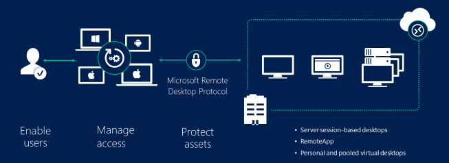

# Remote Desktop Services overview in Windows Server

Remote Desktop Services (RDS) is the platform of choice for building virtualization solutions for every end customer need, including delivering individual virtualized applications, providing secure mobile and remote desktop access, and providing end users the ability to run their applications and desktops from the cloud.

RDS offers deployment flexibility, cost efficiency, and extensibility—all delivered through a variety of deployment options, including Windows Server for on-premises deployments, Microsoft Azure for cloud deployments, and a robust array of partner solutions.

Depending on your environment and preferences, you can set up the RDS solution for session-based virtualization, as a virtual desktop infrastructure (VDI), or as a combination of the two:

- **Session-based virtualization**: Leverage the compute power of Windows Server to provide a cost-effective multi-session environment to drive your users' everyday workloads.
- **VDI**: Leverage Windows client to provide the high performance, app compatibility, and familiarity that your users have come to expect of their Windows desktop experience.

Within these virtualization environments, you have additional flexibility in what you publish to your users:

- **Desktops**: Give your users a full desktop experience with a variety of applications that you install and manage. Ideal for users that rely on these computers as their primary workstations.
- **RemoteApps**: Specify individual applications that are hosted/run on the virtualized machine but appear as if they're running on the user's desktop like local applications. The apps have their own taskbar entry and can be resized and moved across monitors. Ideal for deploying and managing key applications in the secure, remote environment while allowing users to work from and customize their own desktops.

With these options and configurations, you have the flexibility to deploy the desktops and applications your users need in a remote, secure, and cost-effective fashion.

## Next steps

Here are some next steps to help you get a better understanding of RDS and even start deploying your own environment:
- Understand the [supported configurations](rds-supported-config.md) for RDS with the various Windows and Windows Server versions
- [Plan and design](rds-plan-and-design.md) an RDS environment to accommodate various requirements, such as high availability and multifactor authentication.
- Review the [Remote Desktop Services architecture models](desktop-hosting-logical-architecture.md) that work best for your desired environment.
- Connect to your RDS environment using one of the [available clients](clients/remote-desktop-clients.md).
