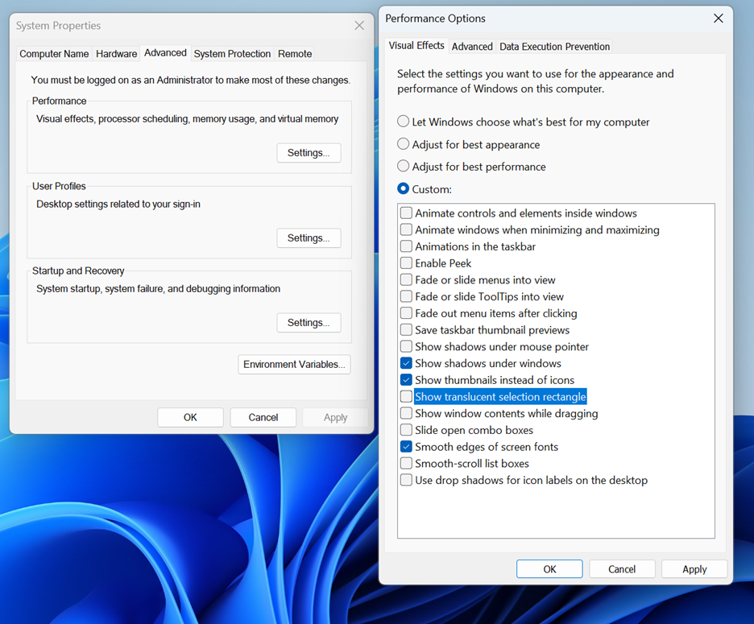
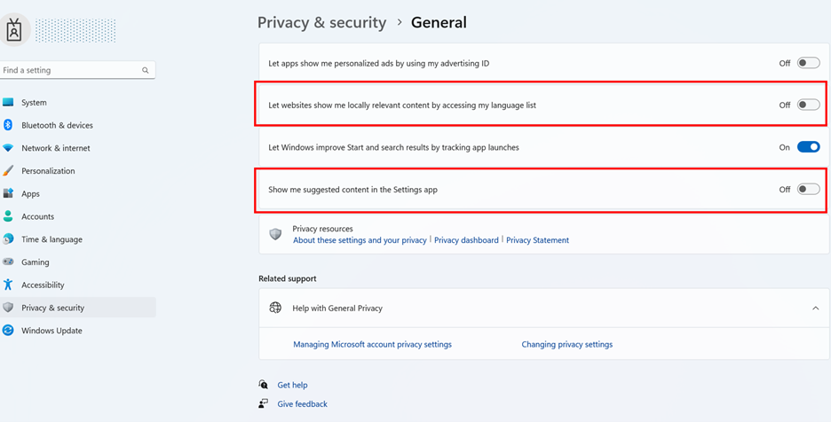

# Optimizing Windows configuration for VDI desktops

Windows is tuned out of the box, but you can refine it for your corporate Microsoft Virtual Desktop Infrastructure (VDI) environment. In VDI, many background services and tasks are disabled by default.

This article is a guide to help you optimize your configuration. Some recommendations disable features you might want to use, so weigh the cost and benefit before adjusting a setting for your scenario.

>[!NOTE]
> Settings not mentioned in this article can stay at their default values, or you can set them based on your requirements and policies. These changes don't affect VDI functionality.

## VDI optimization principles

A "full" virtual desktop environment presents a complete desktop session, including apps, to a user over a network. The network can be on-premises, the internet, or both. Some virtual desktop environments use a "base" operating system image, which is the basis for the desktops presented to users for work. There are types of virtual desktop implementations like **persistent**, **non-persistent**, and **desktop session**.

- The persistent type saves changes to the virtual desktop operating system from one session to the next.
- The non-persistent type doesn't save changes to the virtual desktop operating system from one session to the next.
- The desktop session works like sessions on other virtual or physical devices and is accessed over a network.

Set optimization settings on a reference machine. A virtual machine (VM) is ideal for building the VM because it saves state, lets you create checkpoints, and backs up data. Install the default OS to the base VM. Then optimize the base VM by removing unneeded apps, installing updates, deleting temporary files, and applying settings.

Security and stability are top priorities for Microsoft products and services. In virtual desktop environments, security works much like it does on physical devices. Enterprise customers can use the built-in Windows Security services, which work whether the device is connected to the internet or not. For virtual desktop environments not connected to the internet, download security signatures proactively several times a day, because Microsoft can release more than one signature update per day. Provide those signatures to virtual desktop devices and schedule installation during production, whether persistent or non-persistent. This keeps VM protection current.

Some security settings don't apply to virtual desktop environments that aren't connected to the internet or can't use cloud-enabled security. Other settings that standard Windows devices use, like Cloud Experience or the Windows Store, might not be needed. Removing access to unused features reduces footprint, network bandwidth, and attack surface.

Windows uses a monthly update rhythm. Sometimes, virtual desktop admins control the update process by shutting down VMs based on a "master" or "gold" image, unsealing the read-only image, patching it, then resealing and returning it to production. In these cases, virtual desktop devices don't need to check Windows Update. For persistent "personal" virtual desktop devices, standard patching procedures might apply. Organizations can use Windows Update, Intune, or Microsoft Endpoint Configuration Manager (formerly SCCM) to handle updates and package delivery. Each organization decides the best approach to updating virtual desktop devices while reducing overhead.

Local policy settings and many other settings in this guide can be overridden with domain-based policy. Review the policy settings and remove or skip any that aren't needed for your environment. The settings in this document aim to balance performance optimization in virtual desktop environments while maintaining a quality user experience.

>[!NOTE]
> You can use a set of [scripts available on GitHub](https://github.com/The-Virtual-Desktop-Team/Virtual-Desktop-Optimization-Tool) to automate all the work items in this article. The scripts are easy to customize for your environment and requirements. The main code is PowerShell, and it works by calling input files, which are plain text (now .JSON), along with Local Group Policy Object (LGPO) tool export files. These text files list the apps to remove, services to disable, and more. If you don't want to remove an app or disable a service, edit the corresponding text file and remove the item you don't want to change. There's also an export of local policy settings you can import into your environment machines. It's better to include some settings in the base image than to apply them through group policy, because some settings take effect on the next restart or when a component is first used.

## Non-persistent virtual desktop environments

When a non-persistent virtual desktop implementation is based on a base or "gold" image, the optimizations are mostly performed in the base image, and then through local settings and local policies.

With image-based non-persistent (NP) virtual desktop environments, the base image is read-only. When an NP virtual desktop device (VM) is started, a copy of the base image is streamed to the VM. Activity that occurs during startup and thereafter until the next reboot is redirected to a temporary location. Users are provided network locations to store their data. In some cases, the user’s profile is merged with the standard VM to provide the user with their settings.

One important aspect of NP virtual desktop that is based on a single image, is servicing. Updates to the operating system (OS) and components of the OS are delivered once per month. With image based virtual desktop environment, there's a set of processes that must be performed to get updates to the image:

- On a given host, all the VMs on that host, based on the base image must be shut down or turned off. This means the users are redirected to other VMs.
- In some implementations, this is referred to as "draining." The virtual machine or session host, when set to draining mode, stops accepting new requests, but continues servicing users currently connected to the device.
- In draining mode, when the last user logs off the device, that device is then ready for servicing operations.
- The base image is then opened and started up. All maintenance activities are then performed, such as OS updates, .NET updates, app updates, and so on.
- Any new settings that need to be applied are applied at this time.
- Any other maintenance is performed at this time.
- The base image is then shut down.
- The base image is sealed and set to go back into production.
- Users are allowed to log back on.

> [!NOTE]
> Windows performs a set of maintenance tasks, automatically, on a periodic basis. There's a scheduled task that is set to run at 3:00 AM every day by default. This scheduled task performs a list of tasks, including Windows Update cleanup. You can view all the categories of maintenance that take place automatically with this PowerShell command:
>
> ```powershell
> Get-ScheduledTask | Where-Object {$_.Settings.MaintenanceSettings}
> ```

One of the challenges with non-persistent virtual desktop is that when a user logs off, nearly all the OS activity is discarded. The user’s profile and/or state may be saved to a centralized location, but the virtual machine itself discards nearly all changes that were made since last boot. Therefore, optimizations intended for a Windows computer that saves state from one session to the next aren't applicable.

Depending on the architecture of virtual desktop device, things like PreFetch and SuperFetch aren't going to help from one session to the next, as all the optimizations are discarded on VM restart. Indexing may be a partial waste of resources, as would be any disk optimizations such as a traditional defragmentation.

> [!NOTE]
> If preparing an image using virtualization, and if connected to the Internet during image creation process, on first logon you should postpone Feature Updates by going to **Settings** > **Windows Update**.

## To sysprep or not sysprep

Windows has a built-in capability called the [System Preparation Tool](/windows-hardware/manufacture/desktop/sysprep--system-preparation--overview), also known as sysprep. Use sysprep to prepare a customized Windows 10 or Windows 11 image for duplication. The sysprep process makes sure the resulting OS is unique and ready for production.

There are reasons for and against running sysprep. In virtual desktop environments, you might want to customize the default user profile, which acts as the profile template for users who sign in using this image. You might want apps installed, but also want to control per-app settings.

The alternative is to use a standard .ISO to install, possibly with an unattended installation answer file, and a task sequence to install or remove applications. You can also use a task sequence to set local policy settings in the image, maybe using the [Local Group Policy Object Utility (LGPO)](/windows/security/operating-system-security/device-management/windows-security-configuration-framework/security-compliance-toolkit-10#what-is-the-local-group-policy-object-lgpo-tool) tool.

To learn more about image preparation for Azure, see [Prepare a Windows VHD or VHDX to upload to Azure](/azure/virtual-machines/windows/prepare-for-upload-vhd-image)

## Supportability

When you change Windows defaults, questions about supportability can come up. After you customize a virtual desktop image (VM or session), track every change in a change log. If you need to troubleshoot, you can isolate an image in a pool and set it up for problem analysis. After you find the root cause, roll out the change to the test environment first, and then to the production workload.

This document intentionally avoids changing system services, policies, or tasks that affect security. Windows servicing comes next. You can't service virtual desktop images outside of maintenance windows, because most servicing events happen during maintenance windows in virtual desktop environments, except for security software updates. Microsoft's guidance for Windows security in virtual desktop environments is in the [Deployment guide for Windows Defender Antivirus in a virtual desktop infrastructure (VDI) environment](/windows/security/threat-protection/windows-defender-antivirus/deployment-vdi-windows-defender-antivirus)

Think about supportability when you change default Windows settings. Sometimes, problems that are hard to fix can happen when you change system services, policies, or scheduled tasks to harden or lighten the system. Check the Microsoft Knowledge Base for current known issues about changed default settings. The guidance in this document and the associated script on GitHub are updated based on known issues, if any come up. You can report issues to Microsoft in several ways.

Use your favorite search engine with the terms `"start value" site:support.microsoft.com` to find known issues about default start values for services.

This document and the associated scripts on GitHub don't change any default permissions. If you want to increase your security settings, start with the AaronLocker project. For more information, see [AaronLocker overview](https://github.com/microsoft/AaronLocker).

## Virtual desktop optimization categories

The following categories are ways in which the virtual desktop can be optimized:

- Universal Windows Platform (UWP) app cleanup
- Optional features cleanup
- Local policy settings
- System services
- Scheduled tasks
- Apply Windows (and other) updates
- Automatic Windows traces
- Windows Defender optimization with VDI
- Client network performance tuning by registry settings
- Other settings from the "Windows Restricted Traffic Limited Functionality Baseline" guidance.
- Disk cleanup

The following sections explain each category in more detail.

### Universal Windows Platform (UWP) application cleanup

One of the goals of a virtual desktop image is to be as light as possible with respect to persistent storage. One way to reduce the size of the image is to remove unused UWP applications (apps). With UWP apps, there are the main application files, also known as the payload. There's a small amount of data stored in each user’s profile for application-specific settings. There's also a small amount of data in the "All Users" profile.

In addition, all UWP apps are registered at either the user or machine level at some point after startup for the device, and login for the user. The UWP apps, which include the Start Menu and the Windows Shell, perform various tasks at or after installation, and again when a user logs in for the first time, and to a lesser extent at subsequent logins. For all UWP apps, there are occasional evaluations that take place, such as:

- Do you need to update the app to the latest version?
- The app, if pinned to the Start Menu, might have live tile data to download
- Does the app have a cache of data that needs to be updated, such as maps or weather?
- Does the app have persistent data from the user's profile that needs to be presented at login (for example, Sticky Notes)

With a default installation of Windows, it's unlikely that all UWP apps are used by an organization. Therefore, if those apps are removed, there are fewer evaluations that need to take place, less caching, and so on. The second method here's to direct Windows to disable "consumer experiences." This reduces Store activity by having to check for every user what apps are installed, what apps are available, and then to start downloading some UWP apps. The performance savings can be significant when there are hundreds or thousands of users, all start work at approximately the same time, or even starting work at rolling times across time zones.

Connectivity and timing are important factors when it comes to UWP app cleanup. If you deploy your base image to a device with no network connectivity, Windows can't connect to the Microsoft Store and download apps and try to install them while you're trying to uninstall them. This might be a good strategy to allow you time to customize your image, and then update what remains at a later stage of the image creation process.

If you modify your base .WIM that you use to install Windows and remove unneeded UWP apps from the .WIM before you install, the apps don't install and your subsequent profile creation times are shorter. There's a link later in this section with information on how to remove UWP apps from your installation .WIM file.

A good strategy for the virtual desktop environment is to provision the apps you want in the base image, then limit or block access to the Microsoft Store afterward. Store apps are updated periodically in the background on normal computers. The UWP apps can be updated during the maintenance window when other updates are applied.

#### Delete the payload of UWP apps

UWP apps that aren't needed are still in the file system consuming a small amount of disk space. For apps that aren't needed, the payload of unwanted UWP apps can be removed from the base image using PowerShell commands. If you delete UWP app payloads out of the installation .WIM file using the links provided later in this section, you can start from the beginning with a slim list of UWP apps.

Run the following PowerShell command to enumerate provisioned UWP apps currently running on the local computer:

```powershell
Get-AppxProvisionedPackage -Online
```

UWP apps that are provisioned to a system can be removed during OS installation as part of a task sequence, or later after the OS is installed. This may be the preferred method because it makes the overall process of creating or maintaining an image modular. Once you develop the scripts, if something changes in a subsequent build you edit an existing script rather than repeat the process from scratch.

Then run the following PowerShell command to remove UWP app payloads:

```powershell
Remove-AppxProvisionedPackage -Online - PackageName MyAppxPackage
```

As a final note on this topic, each UWP app should be evaluated for applicability in each unique environment. Install a default installation of Windows 10 or Windows 11, and then note which apps are running and consuming memory. For example, you might remove apps that start automatically, or apps that automatically display information on the Start Menu, such as Weather and News.

> [!NOTE]
> If you're using the scripts from GitHub, you can easily control which apps are removed before running the script. After downloading the script files, locate the AppxPackage.json file, edit that file, and remove entries for apps that you want to keep, such as Calculator, Sticky Notes, and so on.

### Optional features cleanup

This section describes optional features that can be optimized.

#### Managing optional features with PowerShell

You can manage Windows Optional Features using PowerShell. To enumerate currently installed Windows Features, run the following PowerShell command:

```powershell
Get-WindowsOptionalFeature -Online
```

Using PowerShell, an enumerated Windows Optional Feature can be configured as enabled or disabled, as in the following example:

```powershell
Enabled-WindowsOptionalFeature -Online -FeatureName "DirectPlay" -All
```

Here's an example command that disables the Windows Media Player feature in the virtual desktop image:

```powershell
Disable-WindowsOptionalFeature -Online -FeatureName "WindowsMediaPlayer"
```

Next, you may want to remove the Windows Media Player package. This example command shows you how to find the package name:

```powershell
Get-WindowsPackage -Online -PackageName *media*
```

The output of that command shows something like the following information:

```code
PackageName              : Microsoft-Windows-MediaPlayer-Package~31bf3856ad364e35~amd64~~10.0.19041.153
Applicable               : True
Copyright                : Copyright (c) Microsoft Corporation. All Rights Reserved
...
```

If you want to remove the Windows Media Player package (to free up about 60 MB disk space), you can run this command:

```powershell
PS C:\Windows\system32> Remove-WindowsPackage -PackageName Microsoft-Windows-MediaPlayer-Package~31bf3856ad364e35~amd64~~10.0.19041.153 -Online
```

#### Enable or disabling Windows features using DISM

You can use the built-in `Dism.exe` tool to enumerate and control Windows Optional Features. A Dism.exe script could be developed and run during an operating system installation task sequence with [Features on Demand](/windows-hardware/manufacture/desktop/features-on-demand-v2--capabilities).

#### Default user settings

You can customize the Windows registry file at `C:\Users\Default\NTUSER.DAT`. Any setting changes you make to this file are applied to any subsequent user profiles created from a machine running this image. You can control which settings you wish to apply to the default user profile by editing the **DefaultUserSettings.txt** file.

To reduce transmission of graphical data over the virtual desktop infrastructure, you can set the default background to a solid color instead of the default Windows image. You can also set the sign-in screen to be a solid color, and turn off the opaque blurring effect on sign-in.

The following settings are applied to the default user profile registry hive, mainly to reduce animations. If some or all of these settings aren't desired, delete out the settings that you don't wish to apply to new user profiles based on this image. The goal with these settings is to enable the following equivalent settings:

- Show shadows under mouse pointer
- Show shadows under windows
- Smooth edges of screen fonts

[  ](media/remote-desktop-services-vdi-optimize-configuration/performance-options.png#lightbox)

And there's a method to disable the following two privacy settings for any user profile created after you run the optimization:

- Let websites provide locally relevant content by accessing my language list
- Show me suggested content in the Settings app

Optionally, disable the following two privacy settings for any user profile created after you run the optimization:

- Let websites provide locally relevant content by accessing my language list
- Show me suggested content in the Settings app

[  ](media/remote-desktop-services-vdi-optimize-configuration/privacy-settings.png#lightbox)

The following are the optimization settings applied to the default user profile registry hive to optimize performance. This operation is performed by first loading the default user profile registry hive **NTUser.dat**, as the ephemeral key name **Temp**, and then making the following modifications:

```regedit
Load HKLM\Temp C:\Users\Default\NTUSER.DAT
add "HKLM\Temp\Software\Microsoft\Windows\CurrentVersion\Explorer" /v ShellState /t REG_BINARY /d 240000003C2800000000000000000000 /f
add "HKLM\Temp\Software\Microsoft\Windows\CurrentVersion\Explorer\Advanced" /v IconsOnly /t REG_DWORD /d 1 /f
add "HKLM\Temp\Software\Microsoft\Windows\CurrentVersion\Explorer\Advanced" /v ListviewAlphaSelect /t REG_DWORD /d 0 /f
add "HKLM\Temp\Software\Microsoft\Windows\CurrentVersion\Explorer\Advanced" /v ListviewShadow /t REG_DWORD /d 0 /f
add "HKLM\Temp\Software\Microsoft\Windows\CurrentVersion\Explorer\Advanced" /v ShowCompColor /t REG_DWORD /d 1 /f
add "HKLM\Temp\Software\Microsoft\Windows\CurrentVersion\Explorer\Advanced" /v ShowInfoTip /t REG_DWORD /d 1 /f
add "HKLM\Temp\Software\Microsoft\Windows\CurrentVersion\Explorer\Advanced" /v TaskbarAnimations /t REG_DWORD /d 0 /f
add "HKLM\Temp\Software\Microsoft\Windows\CurrentVersion\Explorer\VisualEffects" /v VisualFXSetting /t REG_DWORD /d 3 /f
add "HKLM\Temp\Software\Microsoft\Windows\DWM" /v EnableAeroPeek /t REG_DWORD /d 0 /f
add "HKLM\Temp\Software\Microsoft\Windows\DWM" /v AlwaysHiberNateThumbnails /t REG_DWORD /d 0 /f
add "HKLM\Temp\Control Panel\Desktop" /v DragFullWindows /t REG_SZ /d 0 /f
add "HKLM\Temp\Control Panel\Desktop" /v FontSmoothing /t REG_SZ /d 2 /f
add "HKLM\Temp\Control Panel\Desktop" /v UserPreferencesMask /t REG_BINARY /d 9032078010000000 /f
add "HKLM\Temp\Control Panel\Desktop\WindowMetrics" /v MinAnimate /t REG_SZ /d 0 /f
add "HKLM\Temp\Software\Microsoft\Windows\CurrentVersion\StorageSense\Parameters\StoragePolicy" /v 01 /t REG_DWORD /d 0 /f
add "HKLM\Temp\Software\Microsoft\Windows\CurrentVersion\ContentDeliveryManager" /v SubscribedContent-338393Enabled /t REG_DWORD /d 0 /f
add "HKLM\Temp\Software\Microsoft\Windows\CurrentVersion\ContentDeliveryManager" /v SubscribedContent-353694Enabled /t REG_DWORD /d 0 /f
add "HKLM\Temp\Software\Microsoft\Windows\CurrentVersion\ContentDeliveryManager" /v SubscribedContent-353696Enabled /t REG_DWORD /d 0 /f
add "HKLM\Temp\Software\Microsoft\Windows\CurrentVersion\ContentDeliveryManager" /v SubscribedContent-338388Enabled /t REG_DWORD /d 0 /f
add "HKLM\Temp\Software\Microsoft\Windows\CurrentVersion\ContentDeliveryManager" /v SubscribedContent-338389Enabled /t REG_DWORD /d 0 /f
add "HKLM\Temp\Software\Microsoft\Windows\CurrentVersion\ContentDeliveryManager" /v SystemPaneSuggestionsEnabled /t REG_DWORD /d 0 /f
add "HKLM\Temp\Control Panel\International\User Profile" /v HttpAcceptLanguageOptOut /t REG_DWORD /d 1 /f
add "HKLM\Temp\Software\Microsoft\Windows\CurrentVersion\BackgroundAccessApplications\Microsoft.Windows.Photos_8wekyb3d8bbwe" /v Disabled /t REG_DWORD /d 1 /f
add "HKLM\Temp\Software\Microsoft\Windows\CurrentVersion\BackgroundAccessApplications\Microsoft.Windows.Photos_8wekyb3d8bbwe" /v DisabledByUser /t REG_DWORD /d 1 /f
add "HKLM\Temp\Software\Microsoft\Windows\CurrentVersion\BackgroundAccessApplications\Microsoft.YourPhone_8wekyb3d8bbwe" /v Disabled /t REG_DWORD /d 1 /f
add "HKLM\Temp\Software\Microsoft\Windows\CurrentVersion\BackgroundAccessApplications\Microsoft.YourPhone_8wekyb3d8bbwe" /v DisabledByUser /t REG_DWORD /d 1 /f
add "HKLM\Temp\Software\Microsoft\Windows\CurrentVersion\BackgroundAccessApplications\Microsoft.MicrosoftEdge_8wekyb3d8bbwe" /v Disabled /t REG_DWORD /d 1 /f
add "HKLM\Temp\Software\Microsoft\Windows\CurrentVersion\BackgroundAccessApplications\Microsoft.MicrosoftEdge_8wekyb3d8bbwe" /v DisabledByUser /t REG_DWORD /d 1 /f
add "HKLM\Temp\Software\Microsoft\InputPersonalization" /v RestrictImplicitInkCollection /t REG_DWORD /d 1 /f
add "HKLM\Temp\Software\Microsoft\InputPersonalization" /v RestrictImplicitTextCollection /t REG_DWORD /d 1 /f
add "HKLM\Temp\Software\Microsoft\Personalization\Settings" /v AcceptedPrivacyPolicy /t REG_DWORD /d 0 /f
add "HKLM\Temp\Software\Microsoft\InputPersonalization\TrainedDataStore" /v HarvestContacts /t REG_DWORD /d 0 /f
add "HKLM\Temp\Software\Microsoft\Windows\CurrentVersion\UserProfileEngagement" /v ScoobeSystemSettingEnabled /t REG_DWORD /d 0 /f
Unload HKLM\Temp
```

Disable settings for Windows apps from starting and running in the background. While not significant on a single device, Windows starts multiple processes for each user session on a given device, or session host. If this functionality is desired as-is, delete the lines in the `DefaultUserSettings.txt` file that include the app names like **Windows.Photos** and/or **MicrosoftEdge**.

### Local policy settings

Many optimizations for Windows in a virtual desktop environment can be made using Windows policy. The settings listed in the table in this section can be applied locally to the base/gold image. If the equivalent settings aren't specified in any other way, such as group policy, the settings still apply.

Some decisions may be based on the specifics of the environment.

- Is the virtual desktop environment allowed to access the Internet?
- Is the virtual desktop solution persistent or non-persistent?

The following settings were chosen to not counter or conflict with any setting that has anything to do with security. These settings were chosen to remove settings or disable functionality that may not be applicable to virtual desktop environments.

| Policy setting | Item | Sub-item | Possible setting and comments |
|--------------|----|--------|----------------------------|
| Local Computer Policy \\ Computer Configuration \\ Windows Settings \\ Security Settings | N/A | N/A | N/A |
| Network List Manager policies | All networks properties | Network location | **User can't change location** (This setting is set to prevent the right-hand side pop-up when a new network is detected) |
| Local Computer Policy \\ Computer Configuration \\ Administrative Templates \\ Control Panel | N/A | N/A |
| Control Panel | Allow Online Tips | N/A  | **Disabled** (Settings can't contact Microsoft content services to retrieve tips and help content) |
| Control Panel \ Personalization | Force a specific default lock screen and logon image | N/A | Enabled (This setting allows you to force a specific default lock screen and logon image by entering the path (location) of the image file. The same image is used for both the lock and logon screens. <p>The reason for this recommendation is to reduce bytes transmitted over the network for virtual desktop environments. This setting can be removed or customized for each environment.)|
|Control Panel\ Regional and Language Options\Handwriting personalization|Turn off automatic learning| N/A |**Enabled** (With this policy setting enabled, automatic learning stops, and any stored data is deleted. Users can't configure this setting in Control Panel)|
|Local Computer Policy \\ Computer Configuration \\ Administrative Templates \\ Network|N/A|N/A|N/A|
|Background Intelligent Transfer Service (BITS)|Allow BITS Peer caching| N/A |**Disabled** (This policy setting determines if the Background Intelligent Transfer Service (BITS) peer caching feature is enabled on a specific computer.)|
|Background Intelligent Transfer Service (BITS)|Don't allow the BITS client to use Windows Branch Cache|N/A|**Enabled** (With this policy setting enabled, the BITS client doesn't use Windows Branch Cache.)<p>The reason for this recommendation is so that virtual desktop devices aren't used for content caching, and the devices aren't allowed to use the network bandwidth.|
|Background Intelligent Transfer Service (BITS)|Don't allow the computer to act as a BITS Peer caching client|N/A|**Enabled** (With this policy setting enabled, the computer doesn't use the BITS peer caching feature to download files; files are downloaded only from the origin server.)|
Background Intelligent Transfer Service (BITS)|Don't allow the computer to act as a BITS Peer caching server|N/A|**Enabled** (With this policy setting enabled, the computer can't cache downloaded files and offer them to its peers.)|
|BranchCache|Turn on BranchCache|N/A|**Disabled** (With this selection disabled, BranchCache is turned off for all client computers where the policy is applied.)|
|*Fonts|Enabled Font Providers|N/A|**Disabled** (With this setting disabled, Windows doesn't connect to an online font provider and only enumerates locally installed fonts)|
|Hotspot Authentication|Enable hotspot Authentication| N/A |**Disabled** (This policy setting defines whether WLAN hotspots are probed for Wireless Internet Service Provider roaming (WISPr) protocol support. With this policy setting disabled, WLAN hotspots aren't probed for WISPr protocol support, and users can only authenticate with WLAN hotspots using a web browser.)|
|Microsoft Peer-to-Peer Networking Services|Turn off Microsoft Peer-to-Peer Networking Services|N/A|**Enabled** (This setting turns off Microsoft Peer-to-Peer Networking Services in its entirety and causes all dependent applications to stop working. If you enable this setting, peer-to-peer protocols are turned off.)|
|Network Connectivity Status Indicator<p>(There are other settings in this section that can be used in isolated networks)|Specify passive polling|Disable passive poling (**checkbox**)|**Enabled** (This Policy setting enables you to specify passive polling behavior. NCSI polls various measurements throughout the network stack on a frequent interval to determine if network connectivity is lost. Use the options to control the passive polling behavior.)<P>Disabling NCIS passive polling can improve CPU workload on servers or other machines whose network connectivity is static.<P>This setting may negatively affect Exchange connectivity in Outlook.|
|Offline Files|Allow or Disallow use of the Offline Files feature|N/A|**Disabled** (This policy setting determines whether the Offline Files feature is enabled. Offline Files saves a copy of network files on the user's computer for use when the computer isn't connected to the network. With this policy setting disabled, Offline Files feature is disabled and users can't enable it.)|
|*TCPIP Settings\ IPv6 Transition Technologies| Set Teredo State|Disabled State|**Enabled** (With this setting enabled, and set to "Disabled State", no Teredo interfaces are present on the host)|
*WLAN Service\ WLAN Settings|Allow Windows to automatically connect to suggested open hot spots, to networks shared by contacts, and to hot spots offering paid services|N/A|**Disabled** (This policy setting determines whether users can enable the following WLAN settings: "Connect to suggested open hotspots," "Connect to networks shared by my contacts," and "Enable paid services." With this policy setting disabled, "Connect to suggested open hotspots," "Connect to networks shared by my contacts," and "Enable paid services" are turned off and users on this device are prevented from enabling them.)|
|WWAN Service\ Cellular Data Access|Let Windows apps access cellular data|Default for all apps: **Force Deny**|**Enabled** (If you choose the "Force Deny" option, Windows apps aren't allowed to access cellular data and users can't change it.)|
|Local Computer Policy \ Computer Configuration \ Administrative Templates \ Start Menu and Taskbar|N/A|N/A|
|*Notifications|Turn off notifications network usage| N/A |**Enabled** (With this policy setting enabled, applications and system features aren't able to receive notifications from the network from WNS or via notification polling APIs)|
|Local Computer Policy \ Computer Configuration \ Administrative Templates \ System| N/A | N/A |N/A|
|Device Installation|Don't send a Windows error report when a generic driver is installed on a device| N/A |**Enabled** (With this policy setting enabled, an error report isn't sent when a generic driver is installed.)|
|Device Installation|Prevent creation of a system restore point during device activity that would normally prompt creation of a restore point| N/A |**Enabled** (With this policy setting enabled, Windows doesn't create a system restore point when one would normally be created.)|
|Device Installation|Prevent device metadata retrieval from the Internet| N/A |**Enabled** (This policy setting allows you to prevent Windows from retrieving device metadata from the Internet. With this policy setting enabled, Windows doesn't retrieve device metadata for installed devices from the Internet. This policy setting overrides the setting in the Device Installation Settings dialog box (Control Panel > System and Security > System > Advanced System Settings > Hardware tab).)|
|Device Installation|Turn off "Found New Hardware" balloons during device installation| N/A |**Enabled** (This policy setting allows you to turn off "Found New Hardware" balloons during device installation. With this policy setting enabled, "Found New Hardware" balloons don't appear while a device is being installed.)|
|Filesystem\NTFS|Short name creation options|Short name creation options: Disabled on all volumes|**Enabled** (These settings provide control over whether or not short names are generated during file creation. Some applications require short names for compatibility, but short names have a negative performance impact on the system. With short names disabled on all volumes, then they aren't generated.)|
|*Group Policy|Continue experiences on this device| N/A |**Disabled** (This policy setting determines whether the Windows device is allowed to participate in cross-device experiences (continue experiences). Disabling this policy prevents this device from being discoverable by other devices, and thus can't participate in cross-device experiences.)|
|Internet Communication Management\ Internet Communication settings|Turn off Event Viewer "Events.asp" links| N/A |**Enabled** (This policy setting specifies whether "Events.asp" hyperlinks are available for events within the Event Viewer application.)|
|Internet Communication Management\ Internet Communication settings|Turn off handwriting personalization data sharing| N/A |**Enabled** (Turns off data sharing from the handwriting recognition personalization tool.)|
|Internet Communication Management\ Internet Communication settings|Turn off handwriting recognition error reporting| N/A |**Enabled** (Turns off the handwriting recognition error reporting tool.)|
|Internet Communication Management\ Internet Communication settings|Turn off Help and Support Center Microsoft Knowledge Base search| N/A |**Enabled** (This policy setting specifies whether users can perform a Microsoft Knowledge Base search from the Help and Support Center.)|
|Internet Communication Management\ Internet Communication settings|Turn off Internet Connection Wizard if URL connection is referring to Microsoft.com| N/A |**Enabled** (This policy setting specifies whether the Internet Connection Wizard can connect to Microsoft to download a list of Internet Service Providers (ISPs).)|
|Internet Communication Management\ Internet Communication settings|Turn off Internet download for Web publishing and online ordering wizards| N/A |**Enabled** (This policy setting specifies whether Windows should download a list of providers for the web publishing and online ordering wizards.)|
|Internet Communication Management\ Internet Communication settings|Turn off Internet File Association service| N/A |**Enabled** (This policy setting specifies whether to use the Microsoft Web service for finding an application to open a file with an unhandled file association.)|
|Internet Communication Management\ Internet Communication settings|Turn off Registration if URL connection is referring to Microsoft.com| N/A |**Enabled** (This policy setting specifies whether the Windows Registration Wizard connects to Microsoft.com for online registration.)|
|Internet Communication Management\ Internet Communication settings|Turn off Search Companion content file updates| N/A |**Enabled** (This policy setting specifies whether Search Companion should automatically download content updates during local and Internet searches.)|
|Internet Communication Management\ Internet Communication settings|Turn off the "Order Prints" picture task| N/A |**Enabled** (If you enable this policy setting, the task "Order Prints Online" is removed from Picture Tasks in File Explorer folders.)|
Internet Communication Management\ Internet Communication settings|Turn off the "Publish to Web" task for files and folders| N/A |**Enabled* (This policy setting specifies whether the tasks "Publish this file to the Web," "Publish this folder to the Web," and "Publish the selected items to the Web" are available from File and Folder Tasks in Windows folders.)|
|Internet Communication Management\ Internet Communication settings|Turn off Windows Customer Experience Improvement Program| N/A |**Enabled** (The Windows Customer Experience Improvement Program (CEIP) collects information about your hardware configuration and how you use our software and services to identify trends and usage patterns. If you enable this policy setting, all users are opted out of the Windows CEIP.)|
|Internet Communication Management\ Internet Communication settings|Turn off Windows Error Reporting| N/A |**Enabled** (This policy setting controls whether or not errors are reported to Microsoft. If you enable this policy setting, users aren't given the option to report errors.)|
|Internet Communication Management\ Internet Communication settings|Turn off Windows Update device driver searching| N/A |**Enabled** (This policy setting specifies whether Windows searches Windows Update for device drivers when no local drivers for a device are present. If you enable this policy setting, Windows Update isn't searched when a new device is installed.)|
|Logon|Don't display the Getting Started welcome screen at logon| N/A |**Enabled** (With this setting enabled, the welcome screen is hidden from the user logging on to a Windows device.)|
|Logon|Don't enumerate connected users on domain-joined computers| N/A |**Enabled** (With this setting enabled, the Logon UI doesn't enumerate any connected users on domain-joined computers.)|
|Logon|Enumerate local users on domain-joined computers| N/A |**Disabled** (With this setting disabled, the Logon UI doesn't enumerate local users on domain-joined computers.)|
|Logon|Show clear logon background| N/A |**Enabled** (This policy setting disables the acrylic blur effect on logon background image. With this setting enabled, the logon background image shows without blur.)|
|Logon|Show first sign-in animation| N/A |**Disabled** (This policy setting allows you to control whether users see the first sign-in animation when signing in to the computer for the first time. This applies to both the first user of the computer who completes the initial setup and users who are added to the computer later. It also controls if Microsoft account users are offered the opt-in prompt for services during their first sign-in.<p>With this setting disabled, users don't see the first logon animation and Microsoft account users don't see the opt-in prompt for services.)|
|Logon|Turn off app notifications on the lock screen| N/A |**Enabled** (This policy setting allows you to prevent app notifications from appearing on the lock screen. With this setting enabled, no app notifications are displayed on the lock screen.)|
|Power Management|Select an active power plan|Active Power Plan: High Performance|**Enabled** (If you enable this policy setting, specify a power plan from the Active Power Plan list.) <p>With the "Power" service disabled, the Powercfg.cpl UI isn't able to display these power options, and instead returns an RPC error.|
|Power Management \ Video and Display Settings|Turn on desktop background slideshow (plugged-in)| N/A |**Disabled** (This policy setting allows you to specify if Windows should enable the desktop background slideshow.) With this setting disabled, the desktop background slideshow is disabled. This setting likely has no effect on a VM.|
|Recovery|Allow restore of system to default state| N/A |**Disabled** (With this setting disabled, the items "Use a system image you created earlier to recover your computer" and "Reinstall Windows" (or "Return your computer to factory condition") in Recovery (in Control Panel) are unavailable.)|
|*Storage Health|Allow downloading updates to the Disk Failure Prediction Model| N/A |**Disabled** (Updates wouldn't be downloaded for the Disk Failure Prediction Failure Model)|
|System Restore|Turn off System Restore| N/A |**Enabled** (With this setting enabled, System Restore is turned off, and the System Restore Wizard can't be accessed. The option to configure System Restore or create a restore point through System Protection is also disabled.)|
|Troubleshooting and Diagnostics\ Scheduled Maintenance|Configure Scheduled Maintenance Behavior| N/A |**Disabled** (Determines whether scheduled diagnostics run to proactively detect and resolve system problems. With this policy setting disabled, Windows can't detect, troubleshoot, or resolve problems on a scheduled basis.)|
|Troubleshooting and Diagnostics\ Scripted Diagnostics|Troubleshooting: Allow users to access and run Troubleshooting wizards| N/A |**Disabled** (With this setting disabled, users can't access or run the troubleshooting tools from the Control Panel.)|
|Troubleshooting and Diagnostics\ Scripted Diagnostics|Troubleshooting: Allow users to access online troubleshooting content on Microsoft servers from the Troubleshooting Control Panel (via the Windows Online Troubleshooting Service – WOTS)| N/A |**Disabled** With this setting disabled, users can only access and search troubleshooting content that is available locally on their computers, even if they're connected to the Internet. They're prevented from connecting to the Microsoft servers that host the Windows Online Troubleshooting Service.|
|Troubleshooting and Diagnostics\ Windows Boot Performance Diagnostics|Configure Scenario Execution Level| N/A |**Disabled** (Determines the execution level for Windows Boot Performance Diagnostics. If you disable this policy setting, Windows can't detect, troubleshoot or resolve any Windows Boot Performance problems that are handled by the DPS.)<p>This setting can be useful during design, test, development, or maintenance phases. This setting could be enabled on an isolated VM or session host, measurements taken, and results noted in event logs under "Microsoft-Windows-Diagnostics-Performance/Operational" Source: Diagnostics-Performance, Task Category "Boot Performance Monitoring."<p>**ALSO**: With the DPS service disabled, this setting has no effect, as Windows doesn't log performance data.|
|Troubleshooting and Diagnostics\ Windows Memory Leak Diagnostics|Configure Scenario Execution Level| N/A |**Disabled** (This policy setting determines whether Diagnostic Policy Service (DPS) diagnoses memory leak problems. With this setting disabled, the DPS isn't able to diagnose memory leak problems.) <p>Many diagnostics modes can be enabled, and tools used such as WPT, though these are done in dev/test/maintenance scenarios and not enabled and used on production VMs or sessions|
|Troubleshooting and Diagnostics\ Windows Performance PerfTrack|Enable/Disable PerfTrack| N/A |**Disabled** (This policy setting specifies whether to enable or disable tracking of responsiveness events. With this setting disabled, responsiveness events aren't processed.)|
|Troubleshooting and Diagnostics\ Windows Resource Exhaustion Detection and Resolution|Configure Scenario Execution Level| N/A |**Disabled** (Determines the execution level for Windows Resource Exhaustion Detection and Resolution. With this setting disabled, Windows can't detect, troubleshoot or resolve any Windows Resource Exhaustion problems that are handled by the DPS.)|
|Troubleshooting and Diagnostics\ Windows Shutdown Performance Diagnostics|Configure Scenario Execution Level| N/A |**Disabled** (Determines the execution level for Windows Shutdown Performance Diagnostics. With this setting disabled, Windows can't detect, troubleshoot or resolve any Windows Shutdown Performance problems that are handled by the DPS.)|
|Troubleshooting and Diagnostics\ Windows Standby/Resume Performance Diagnostics|Configure Scenario Execution Level| N/A |**Disabled** (Determines the execution level for Windows Standby/Resume Performance Diagnostics. With this setting disabled, Windows can't detect, troubleshoot or resolve any Windows Standby/Resume Performance problems that are handled by the DPS.)|
|Troubleshooting and Diagnostics\ Windows System Responsiveness Performance Diagnostics|Configure Scenario Execution Level| N/A |**Disabled** (Determines the execution level for Windows System Responsiveness Diagnostics. With this setting disabled, Windows can't detect, troubleshoot or resolve any Windows System Responsiveness problems that are handled by the DPS.)|
*User Profiles|Turn off the advertising ID| N/A |**Enabled** (With this setting enabled, the advertising ID is turned off. Apps can't use the ID for experiences across apps)|
|Local Computer Policy \ Computer Configuration \ Administrative Templates \ Windows Components| N/A | N/A | N/A |
|*App Privacy|Let Windows apps access diagnostic information about other apps|Default for all apps: Force Deny|**Enabled** (With this setting enabled, and using the "Force Deny" option, Windows apps aren't allowed to get diagnostic information about other apps and employees in your organization can't change it.)|
|*App Privacy|Let Windows apps access location|Default for all apps: Force Deny|**Enabled** With this setting enabled, and using the "Force Deny" option, Windows apps aren't allowed to access location and users can't change the setting.|
|*App Privacy|Let Windows apps access motion|Default for all apps: Force Deny|**Enabled** (With this setting enabled, and using the "Force Deny" option, Windows apps aren't allowed to access motion data and users can't change the setting.)|
|*App Privacy|Let Windows apps access notifications|Default for all apps: Force Deny|**Enabled** (With this setting enabled, and using the "Force Deny" option, Windows apps aren't allowed to access notifications and users can't change the setting)|
|*App Privacy|Let Windows apps activate with voice|Default for all apps: Force Deny|**Enabled** (This policy setting specifies whether Windows apps can be activated by voice.)|
|*App Privacy|Let Windows apps activate with voice while the system is locked|Default for all apps: Force Deny|**Enabled** (This policy setting specifies whether Windows apps can be activated by voice while the system is locked.)|
|*App Privacy|Let Windows apps control radios|Default for all apps: Force Deny|**Enabled** (If you choose the "Force Deny" option, Windows apps don't have access to control radios and employees in your organization can't change it)|
|Application Compatibility|Turn off Inventory Collector| N/A |**Enabled** (This policy setting controls the state of the Inventory Collector. The Inventory Collector inventories applications, files, devices, and drivers on the system and sends the information to Microsoft. With this policy setting enabled, the Inventory Collector is turned off and data isn't sent to Microsoft. Collection of installation data through the Program Compatibility Assistant is also disabled.)|
|AutoPlay Policies|Set the default behavior for AutoRun|Don't execute any autorun commands|**Enabled** (This policy setting sets the default behavior for Autorun commands.)|
|*AutoPlay Policies|Turn off Autoplay|All drives|**Enabled** (If you enable this policy setting, Autoplay is disabled on all drives.)|
|*Cloud Content|Don't show Windows tips| N/A |**Enabled** (This policy setting prevents Windows tips from being shown to users)|
|*Cloud Content|Turn off Microsoft consumer experiences| N/A |**Enabled** (With this policy setting enabled, users don't see personalized recommendations from Microsoft and notifications about their Microsoft account)|
|*Data Collection and Preview Builds|Allow Telemetry|0 – Security [Enterprise Only]|**Enabled** (Setting a value of 0 applies to devices running Enterprise, Education, IoT, or Windows Server editions only, and reduces telemetry sent to the most basic level supported)|
|Data Collection and Preview Builds|Configure collection of browsing data for Desktop Analytics|Configure telemetry collection: Don't allow sending intranet or internet history|**Enabled** (You can configure Microsoft Edge to send intranet history only, internet history only, or both to Desktop Analytics for enterprise devices with a configured Commercial ID. If disabled or not configured, Microsoft Edge doesn't send browsing history data to Desktop Analytics.)|
|*Data Collection and Preview Builds|Don't show feedback notifications| N/A |**Enabled** (This policy setting allows an organization to prevent its devices from showing feedback questions from Microsoft.)|
|Delivery Optimization|Download Mode|Download Mode: Simple (99)|**Enabled** (99 = Simple download mode with no peering. Delivery Optimization downloads using HTTP only and doesn't attempt to contact the Delivery Optimization cloud services.)|
|Desktop Window Manager|Don't allow window animations| N/A |**Enabled** (This policy setting controls the appearance of window animations such as those found when restoring, minimizing, and maximizing windows. With this policy setting enabled, window animations are turned off.)|
|Desktop Window Manager|Use solid color for Start background| N/A |**Enabled** (This policy setting controls the Start background visuals. With this policy setting enabled, the Start background uses a solid color.)|
|Edge UI|Allow edge swipe| N/A |**Disabled** (If you disable this policy setting, users can't invoke any system UI by swiping in from any screen edge.)|
|Edge UI|Disable help tips| N/A |**Enabled** (If this setting is enabled, Windows doesn't show any help tips to the user.)|
|File Explorer|Don't show the "new application installed" notification| N/A |**Enabled** (This policy removes the end-user notification for new application associations. These associations are based on file types (for example, TXT files) or protocols (for example, HTTP). If this policy is enabled, no notifications are shown to the end-user)|
|File History|Turn off File History| N/A |**Enabled** (With this policy setting enabled, File History can't be activated to create regular, automatic backups.)|
|*Find My Device|Turn On/Off Find My Device| N/A |**Disabled** (When Find My Device is off, the device and its location aren't registered, and the "Find My Device" feature doesn't work. The user can't view the location of the last use of their active digitizer on their device.)|
|Homegroup|Prevent the computer from joining a homegroup| N/A |**Enabled** (If you enable this policy setting, users can't add computers to a homegroup. This policy setting doesn't affect other network sharing features.)|
|Internet Information Services|Prevent IIS installation| N/A |**Enabled** (With this policy setting enabled, IIS can't be installed, and you can't install Windows components or applications that require IIS.)|
|*Location and Sensors|Turn off location| N/A |**Enabled** (With this setting enabled, the location feature is turned off, and all programs on this device are prevented from using location information from the location feature)|
|Location and Sensors|Turn off sensors| N/A |**Enabled** (This policy setting turns off the sensor feature for this device. With this policy setting enabled, the sensor feature is turned off, and all programs on this computer can't use the sensor feature.)|
|Locations and Sensors / Windows Location Provider|Turn off Windows Location Provider| N/A |**Enabled** (This policy setting turns off the Windows Location Provider feature for this device.)|
|*Maps|Turn off Automatic Download and Update of Map Data| N/A |**Enabled** (With this setting enabled, the automatic download and update of map data is turned off.)|
|*Maps|Turn off unsolicited network traffic on the Offline Maps settings page| N/A |**Enabled** (With this setting enabled, features that generate network traffic on the Offline Maps settings page are turned off. Note: This may turn off the entire settings page)|
|*Messaging|Allow Message Service Cloud Sync| N/A |**Disabled** (This policy setting allows backup and restore of cellular text messages to Microsoft's cloud services.)|
|*Microsoft Edge|Allow configuration updates for the Books Library| N/A |**Disabled** (With this setting disabled, Microsoft Edge doesn't automatically download updated configuration data for the Books Library.)|
|*Microsoft Edge|Allow extended telemetry for the Books tab| N/A |**Disabled** (With this setting disabled, Microsoft Edge only sends basic telemetry data, depending on your device configuration.)|
|Microsoft Edge|Allow Microsoft Edge to pre-launch at Windows startup, when the system is idle, and each time Microsoft Edge is closed|Configure pre-launch: Prevent pre-launching|**Enabled** (With this setting enabled and configured to prevent pre-launch, Microsoft Edge won’t pre-launch during Windows sign in, when the system is idle, or each time Microsoft Edge is closed.)|
|Microsoft Edge|Allow Microsoft Edge to start and load the Start and New Tab page at Windows startup and each time Microsoft Edge is closed|Configure tab preloading: Prevent tab-preloading|**Enabled** (This policy setting lets you decide whether Microsoft Edge can load the Start and New Tab page during Windows sign in and each time Microsoft Edge is closed. By default this setting is to allow preloading. With preloading disabled, Microsoft Edge won’t load the Start or New Tab page during Windows sign in and each time Microsoft Edge is closed.)|
|Microsoft Edge|Allow web content on New Tab page| N/A |**Disabled** (With this setting disabled, Edge opens a new tab with a blank page. If this setting is configured, users can't change the setting.)|
|*Microsoft Edge|Prevent the First Run webpage from opening on Microsoft Edge| N/A |**Enabled** (users won’t see the First Run page when opening Microsoft Edge for the first time)|
|OneDrive|Prevent OneDrive from generating network traffic until the user signs in to OneDrive| N/A |**Enabled** (Enable this setting to prevent the OneDrive sync client (OneDrive.exe) from generating network traffic (checking for updates, and so on.) until the user signs in to OneDrive or starts syncing files to the local computer)|
|Online Assistance|Turn off Active Help| N/A |**Enabled** (With this policy setting enabled, active content links aren't rendered. The text is displayed, but there are no clickable links for these elements.)|
|OOBE|Don’t launch privacy settings experience on user logon| N/A |**Enabled** (When logging into a new user account for the first time or after an upgrade in some scenarios, that user may be presented with a screen or series of screens that prompts the user to choose privacy settings for their account. Enable this policy to prevent this experience from launching.)|
|RSS Feeds|Prevent automatic discovery of feeds and Web Slices| N/A |**Enabled** (This policy setting prevents users from having Microsoft Edge automatically discover whether a feed or Web Slice is available for an associated webpage.)|
|*RSS Feeds|Turn off background synchronization for feeds and Web Slices| N/A |**Enabled** (With this policy setting enabled, the ability to synchronize feeds and Web Slices in the background is turned off.)|
|*Search|Allow Cortana| N/A |**Disabled** (This policy setting specifies whether Cortana is allowed on the device. When Cortana is off, users are able to use search to find things on the device.)|
|Search|Allow Cortana above lock screen| N/A |**Disabled** (This policy setting determines whether or not the user can interact with Cortana using speech while the system is locked.)|
|*Search|Allow search and Cortana to use location| N/A |**Disabled** (This policy setting specifies whether search and Cortana can provide location aware search and Cortana results.)|
|Search|Control rich previews for attachments|Control Rich Previews for Attachments:**.docx;.xlsx;.txt;.xls**|**Enabled** (Enabling this policy defines a semicolon-delimited list of file extensions which are allowed to have rich attachment previews.)<p>**NOTE**: This setting can be used to limit what types of attachments are previewed, which can also help prevent automatically previewing some potentially dangerous contents types.|
|Search|Don't allow web search| N/A |**Enabled** (Enabling this policy removes the option of searching the Web from Windows Desktop Search.)|
|*Search|Don’t search the web or display web results in Search| N/A |**Enabled** (With this policy setting enabled, queries aren't performed on the web and web results aren't displayed when a user performs a query in Search.)|
|Search|Enable indexing uncached Exchange folders| N/A |**Disabled** (Enabling this policy allows indexing of mail items on a Microsoft Exchange server when Microsoft Outlook isn't running in cached mode. The default behavior for search is to not index uncached Exchange folders. Disabling this policy blocks any indexing of uncached Exchange folders.)|
|Search|Prevent indexing files in offline files cache| N/A |**Enabled** (If enabled, files on network shares made available offline aren't indexed. Otherwise they're indexed. Disabled by default.)|
|*Search|Set what information is shared in Search|Anonymous info|**Enabled** (Anonymous info: Share usage information but don't share search history, Microsoft account info, or specific location)|
|Search|Stop indexing if there's limited hard drive space|MB Limit: **5000**|**Enabled** (Enabling this policy prevents indexing from continuing after less than the specified amount of hard drive space is left on the same drive as the index location. Select between 0 and 2147483647 MB.)|
|Software Protection Platform|Turn off KMS Client Online AVS Validation| N/A |**Enabled** (With this setting enabled, the device doesn't send data to Microsoft regarding its activation state)|
|*Speech|Allow Automatic Update of Speech Data| N/A |**Disabled** (Specifies whether the device receives updates to the speech recognition and speech synthesis models.)|
|Store|Turn off the offer to update to the latest version of Windows| N/A |**Enabled** (Enables or disables the Store offer to update to the latest version of Windows. If you enable this setting, the Store application doesn't offer updates to the latest version of Windows.)|
|Text Input|Improve inking and typing recognition| N/A |**Disabled** (This policy setting controls the ability to send inking and typing data to Microsoft to improve the language recognition and suggestion capabilities of apps and services running on Windows.)|
|Windows Error Reporting|Disable Windows Error Reporting| N/A |**Enabled** (With this policy setting enabled, Windows Error Reporting doesn't send any problem information to Microsoft. And solution information isn't available in Security and Maintenance in Control Panel.)|
|Windows Game Recording and Broadcasting|Enables or disables Windows Game Recording and Broadcasting| N/A |**Disabled** (With this setting disabled, Windows Game Recording aren't allowed.)|
|Windows Ink Workspace|Allow Windows Ink Workspace|Choose one of the following actions: Disabled|**Enabled** (With this setting enabled and sub-setting set to disabled, Windows Ink Workspace functionality is unavailable.)|
|Windows Installer|Control maximum size of baseline file cache|5|**Enabled** (This policy controls the percentage of disk space available to the Windows Installer baseline file cache. With this policy setting enabled, you can modify the maximum size of the Windows Installer baseline file cache.)|
|Windows Installer|Turn off creation of System Restore checkpoints| N/A |**Enabled** (With this policy setting enabled, the Windows Installer doesn't generate System Restore checkpoints when installing applications.)|
|Windows Mobility Center|Turn off Windows Mobility Center| N/A |**Enabled** (With this policy setting enabled, the user is unable to invoke Windows Mobility Center. The Windows Mobility Center UI is removed from all shell entry points and the .exe file doesn't launch it.)|
|Windows Reliability Analysis|Configure Reliability WMI Providers| N/A |**Disabled** (With this policy setting disabled, Reliability Monitor doesn't display system reliability information, and WMI-capable applications are unable to access reliability information from the listed providers.)|
|Windows Security \ Notifications|Hide noncritical notifications| N/A |**Enabled** (With this setting enabled, local users only see critical notifications from Windows Security. They don't see other types of notifications, such as regular PC or device health information.)|
|Windows Update|Turn on Software Notifications| N/A |**Disabled** (This policy setting allows you to control whether users see detailed enhanced notification messages about featured software from the Microsoft Update service. Enhanced notification messages convey the value and promote the installation and use of optional software. This policy setting is intended for use in loosely managed environments in which you allow the end user access to the Microsoft Update service.)|
|*Windows Update\ Windows Update for Business|Manage preview builds|Set the behavior for receiving preview builds: **Disable preview builds**|**Enabled** (Selecting "Disable preview builds" prevents preview builds from installing on the device. This prevents users from opting into the Windows Insider Program, through Settings -> Update and Security)|
|*Windows Update\ Windows Update for Business|Select when Preview Builds and Feature Updates are received|Select the Windows readiness level for the updates you want to receive:<p>**Semi-Annual Channel**<p>After a Preview Build or Feature Update is released, defer receiving it for this many days: **365**<p>Pause Preview Builds or Feature Updates starting: **yyyy-mm-dd**|**Enabled** (Enable this policy to specify the level of Preview Build or Feature Updates to receive, and when. Semi-Annual Channel: Receive feature updates when they're released to the general public.<p> When Selecting Semi-Annual Channel:<p>- You can defer receiving Feature Updates for up to 365 days.<p>- To prevent Feature Updates from being received on their scheduled time, you can temporarily pause them. The pause remains in effect for 35 days from the start time provided.<p> - To resume receiving Feature Updates that are paused, clear the start date field.)|
|Windows Update\ Windows Update for Business|Select when Quality Updates are received|After a quality update is released, defer receiving it for this many days: **30**<p>Pause Quality Updates starting: yyyy-mm-dd|**Enabled** (Enable this policy to specify when to receive quality updates.<p>You can defer receiving quality updates for up to 30 days.<p>To prevent quality updates from being received on their scheduled time, you can temporarily pause quality updates. The pause remains in effect for 35 days or until you clear the start date field.<p>To resume receiving Quality Updates that are paused, clear the start date field.)<p>This recommendation is to help control when updates are applied, and to ensure updates don’t get offered and installed unexpectedly|
|Local Computer Policy \ User Configuration \ Administrative Templates| N/A | N/A | N/A |
|Control Panel\ Regional and Language Options|Turn off offer text predictions as I type| N/A |**Enabled** (This policy turns off the offer text predictions as I type option. This doesn't, however, prevent the user or an application from changing the setting programmatically. With this policy setting enabled, the option is locked to not offer text predictions.)|
|Desktop|Don't add shares of recently opened documents to Network Locations| N/A |**Enabled** (With this setting enabled, shared folders aren't added to Network Locations automatically when you open a document in the shared folder.)|
|Desktop|Turn off Aero Shake window minimizing mouse gesture| N/A |**Enabled** (Prevents windows from being minimized or restored when the active window is shaken back and forth with the mouse. With this policy enabled, application windows aren't minimized or restored when the active window is shaken back and forth with the mouse.)|
|Desktop / Active Directory|Maximum size of Active Directory searches|Number of objects returned:**1500**|**Enabled** (Specifies the maximum number of objects the system displays in response to a command to browse or search Active Directory. This setting affects all browse displays associated with Active Directory, such as those in Local Users and Groups, Active Directory Users and Computers, and dialog boxes used to set permissions for user or group objects in Active Directory.)|
|Start Menu and Taskbar|Don't display or track items in Jump Lists from remote locations| N/A |**Enabled** (This policy setting allows you to control displaying or tracking items in Jump Lists from remote locations.)|
|Start Menu and Taskbar|Don't search Internet| N/A |**Enabled** (With this policy setting enabled, the Start Menu search box doesn't search for internet history or favorites.)|
|Start Menu and Taskbar|Don't use the search-based method when resolving shell shortcuts| N/A |**Enabled** (This policy setting prevents the system from conducting a comprehensive search of the target drive to resolve a shortcut.)|
|Start Menu and Taskbar|Turn off all balloon notifications| N/A |**Enabled** (With this policy setting enabled, no notification balloons are shown to the user.)
|Start Menu and Taskbar|Turn off feature advertisement balloon notifications| N/A |**Enabled** (With this policy setting enabled, certain notification balloons that are marked as feature advertisements aren't shown.)|
|Start Menu and Taskbar|Turn off user tracking| N/A |**Enabled** (With this policy setting enabled, the system doesn't track the programs that the user runs and doesn't display frequently used programs in the Start Menu.)|
|Start Menu and Taskbar / Notifications|Turn off toast notifications| N/A |**Enabled** (With this policy setting enabled, applications can't raise toast notifications.)|
|*Start Menu and Taskbar / Notifications|Turn off toast notifications on the lock screen| N/A |**Enabled** (With this policy setting enabled, applications can't raise toast notifications on the lock screen.)|
|Local Computer Policy / User Configuration| N/A | N/A | N/A |
|Windows Components / Cloud Content|Configure Windows spotlight on lock screen| N/A |**Disabled** (With this policy disabled, Windows spotlight is turned off and users can't select it as their lock screen. Users see the default lock screen image and are able to select another image, unless you have enabled the "Prevent changing lock screen image" policy.)|
|*Windows Components / Cloud Content|Don't suggest third-party content in Windows spotlight| N/A |**Enabled** (With this policy enabled, Windows spotlight features like lock screen spotlight, suggested apps in Start menu or Windows tips doesn't suggest apps and content from third-party software publishers. Users may still see suggestions and tips to make them more productive with Microsoft features and apps.)|
|Windows Components / Cloud Content|Don't use diagnostic data for tailored experiences| N/A |**Enabled** (With this policy setting enabled, Windows doesn't use diagnostic data from this device (this data may include browser, app and feature usage, depending on the "diagnostic data" setting value) to customize content shown on lock screen, Windows tips, Microsoft consumer features, and other related features.)|
|Windows Components / Cloud Content|Turn off all Windows spotlight features| N/A |**Enabled** (Windows spotlight on lock screen, Windows tips, Microsoft consumer features, and other related features are turned off. You should enable this policy setting if your goal is to minimize network traffic from target devices.)|
|Edge UI|Turn off tracking of app usage| N/A |**Enabled** (This policy setting prevents Windows from keeping track of the apps that are used and searched most frequently. If you enable this policy setting, apps are sorted alphabetically in:<p> - search results<p> - the Search and Share panes<p> - the drop-down app list in the Picker)|
|File Explorer|Turn off caching of thumbnail pictures| N/A |**Enabled** (With this policy setting enabled, thumbnail views aren't cached.)|
|File Explorer|Turn off common control and window animations| N/A |**Enabled** (Disabling animations can improve usability for users with some visual disabilities and improve performance and battery life in some scenarios.)|
|File Explorer|Turn off display of recent search entries in the File Explorer search box| N/A |**Enabled** (Disables suggesting recent queries for the Search Box and prevents entries into the Search Box from being stored in the registry for future references.)|
|File Explorer|Turn off the caching of thumbnails in hidden thumbs.db files| N/A |**Enabled** (With this policy setting enabled, File Explorer doesn't create, read from, or write to thumbs.db files.)|

\* Comes from the [Windows Restricted Traffic Limited Functionality Baseline](https://go.microsoft.com/fwlink/?linkid=828887).

### System services

If you're considering disabling system services to conserve resources, make sure the service isn't a component of some other service. In this paper and with the available GitHub scripts, some services aren't in the list because they can't be disabled in a supported manner.

Most of these recommendations mirror recommendations for Windows Server 2016, installed with the Desktop Experience, based on the instructions in [Guidance on disabling system services on Windows Server 2016 with Desktop Experience](../../security/windows-services/security-guidelines-for-disabling-system-services-in-windows-server.md).

Many services that may seem like good candidates to disable are set to manual service start type. This means that the service doesn't automatically start and start only if an event triggers a request to the service. Services that are already set to start type manual aren't listed here.

> [!NOTE]
> You can enumerate running services with this PowerShell sample code, outputting only the service short name:
>
> ```powershell
> Get-Service | Where-Object {$_.Status -eq 'Running'} | Select-Object -ExpandProperty Name
> ```

The following table contains some services that may be considered to disable in virtual desktop environments:

| Windows Service | Service Name | Item | Comment|
| --------------- | ------------ | ---- | ------ |
|Cellular Time|autotimesvc|This service sets time based on NITZ messages from a Mobile Network|Virtual desktop environments may not have such devices available. <p>To learn more, see [the MB NITZ support article](/windows-hardware/drivers/network/mb-nitz-support). |
|GameDVR and Broadcast user service|BcastDVRUserService|This (per-user) service is used for Game Recordings and Live Broadcasts|NOTE: This is a "per-user service", and as such, the template service must be disabled. This user service is used for Game Recordings and Live Broadcasts.<p>To learn more, see [the MB NITZ support article](/windows-hardware/drivers/network/mb-nitz-support). |
|CaptureService|CaptureService|Enables optional screen capture functionality for applications that call the Windows.Graphics.Capture API.|OneCore capture service: enables optional screen capture functionality for applications that call the Windows.Graphics.Capture API<p>For more information, see [the Windows.Graphics.Capture Namespace API docs](/uwp/api/windows.graphics.capture?view=winrt-19041&preserve-view=true).|
|Connected Devices Platform Service|CDPSvc|This service is used for Connected Devices Platform scenarios|Connected Devices Platform Service. To learn more, see [the Connected Devices Platform overview article](/openspecs/windows_protocols/ms-cdp/929c2238-6d49-4ba4-a36a-37e732c4f736)|
|CDP User Service|CDPUserSvc| N/A |Connected Devices Platform User Service. To learn more, see [the Connected Devices Platform Protocol Version 3 article](/openspecs/windows_protocols/ms-cdp/f5a15c56-ac3a-48f9-8c51-07b2eadbe9b4).<p>This user service is used for Connected Devices Platform scenarios <br><br>This is a "per-user service", and as such, the template service must be disabled (CDPUserSvc).|
|Optimize drives|defragsvc|Helps the computer run more efficiently by optimizing files on storage drives.|Virtual desktop solutions don't normally benefit from disk optimization. The "drives" are often not traditional drives and often just a temporary storage allocation.|
|Diagnostic Execution Service|DiagSvc|Executes diagnostic actions for troubleshooting support|Disabling this service disables the ability to run Windows diagnostics Diagnostic Execution Service.|
|Connected User Experiences and Telemetry|DiagTrack|This service enables features that support in-application and connected user experiences. This service manages the event driven collection and transmission of diagnostic and usage information (used to improve the experience and quality of the Windows Platform) when the diagnostics and usage privacy option settings are enabled under Feedback and Diagnostics.|Consider disabling if on disconnected network. To learn more, see [how-to configure Windows diagnostic data in your organization](/windows/privacy/configure-windows-diagnostic-data-in-your-organization).|
|Diagnostic Policy Service|DPS|The Diagnostic Policy Service enables problem detection, troubleshooting, and resolution for Windows components. If this service is stopped, diagnostics don't work.|Disabling this service disables the ability to run Windows diagnostics. For more information, see [the Windows.System.Diagnostics Namespace reference](/uwp/api/Windows.System.Diagnostics?view=winrt-19041&preserve-view=true).|
|Device Setup Manager|DsmSvc|Enables the detection, download, and installation of device-related software. |If this service is disabled, devices may be configured with outdated software, and may not work correctly. <p>Virtual desktop environments closely control what software is installed and maintain that consistency across the environment.|
|Data Usage service|DusmSvc|Network data usage, data limit, restrict background data, metered networks.|For more information, see [the DUSM schema](/uwp/schemas/mobilebroadbandschema/dusm/schema-root).|
|Windows Mobile Hotspot Service|icssvc|Provides the ability to share a cellular data connection with another device.|To learn more, see [the NetworkOperatorTetheringAccessPointConfiguration Class reference](/uwp/api/Windows.Networking.NetworkOperators.NetworkOperatorTetheringAccessPointConfiguration?view=winrt-19041&preserve-view=true).|
|Microsoft Store Install Service|InstallService|Provides infrastructure support for the Microsoft Store. |This service is started on demand and if disabled then installations don't work properly.<p>Consider disabling this service on non-persistent virtual desktop, leave as-is for persistent virtual desktop solutions.|
|Geolocation Service|Lfsvc|Monitors the current location of the system and manages geofences (a geographical location with associated events). |If you turn off this service, applications are unable to use or receive notifications for geolocation or geofences. To learn more, see [the Windows.Devices.Geolocation Namespace reference](/uwp/api/Windows.Devices.Geolocation?view=winrt-19041&preserve-view=true).|
|Downloaded Maps Manager|MapsBroker|Windows service for application access to downloaded maps. This service is started on-demand by application accessing downloaded maps.|Disabling this service prevents apps from accessing maps. To learn more, see [the Windows.Services.Maps Namespace API docs](/uwp/api/Windows.Services.Maps?view=winrt-19041&preserve-view=true).|
|MessagingService|MessagingService|Service supporting text messaging and related functionality.|This is a "per-user service", and as such, the template service must be disabled.|
|Sync Host|OneSyncSvc|This service synchronizes mail, contacts, calendar, and various other user data. |(UWP) Mail and other applications dependent on this functionality don't work properly when this service isn't running. <p>This is a "per-user service", and as such, the template service must be disabled.|
|Contact Data|PimIndexMaintenanceSvc|Indexes contact data for fast contact searching. If you stop or disable this service, contacts might be missing from your search results.|This is a "per-user service", and as such, the template service must be disabled.|
|Power|Power|Manages power policy and power policy notification delivery.|Virtual machines have virtually no influence on power properties. If this service is disabled, power management and reporting aren't available. To learn more, see [the User-Mode Power Service article](/windows-hardware/drivers/powermeter/user-mode-power-service).|
|Payments and NFC/SE Manager|SEMgrSvc|Manages payments and Near Field Communication (NFC) based secure elements.|May not need this service for payments, in the enterprise environment.|
|Microsoft Windows SMS Router Service|SmsRouter|Routes messages based on rules to appropriate clients.|May not need this service, if other tools are used for messaging, such as Teams. To learn more, see [this routing service article](/dotnet/framework/wcf/feature-details/routing-service).|
|Superfetch (SysMain)|SysMain|Maintains and improves system performance over time.|Superfetch generally doesn't improve performance in virtual desktop environments for various reasons. The underlying storage is often virtualized and possibly striped across multiple drives. In some virtual desktop solutions, the accumulated user state is discarded when the user logs off. The SysMain feature should be evaluated in each environment.|
|Update Orchestrator Service|UsoSvc|Manages Windows Updates. If stopped, your devices can't download and install the latest updates.|Virtual desktop devices are often carefully managed with respect to updates. Servicing is performed during maintenance windows. In some cases, an update client may be utilized, such as SCCM. The exception is for security signature updates that are applied at any time, and to any virtual desktop device, in order to maintain up-to-date signatures. If you disable this service, test to ensure that security signatures can still be installed.|
|Volume Shadow Copy|VSS|Manages and implements Volume Shadow Copies used for backup and other purposes. |If this service is stopped, shadow copies are unavailable for backup and the backup may fail. If this service is disabled, any services that explicitly depend on it fail to start. To learn more, see [this volume shadow copy service article](../../../WindowsServerDocs/storage/file-server/volume-shadow-copy-service.md).|
|Diagnostic System Host|WdiSystemHost|The Diagnostic System Host is used by the Diagnostic Policy Service to host diagnostics that need to run in a Local System context. If this service is stopped, any diagnostics that depend on it doesn't function.|Disabling this service disables the ability to run Windows diagnostics|
|Windows Error Reporting|WerSvc|Allows errors to be reported when programs stop working or responding and allows existing solutions to be delivered. Also allows logs to be generated for diagnostic and repair services. If this service is stopped, error reporting might not work correctly, and results of diagnostic services and repairs might not be displayed.|With virtual desktop environments, diagnostics are often performed in an "offline" scenario, and not in mainstream production. In addition, some customers disable WER anyway. WER incurs a tiny amount of resources for many different things, including failure to install a device, or failure to install an update. To learn more, see [Windows Error Reporting](/windows/win32/wer/windows-error-reporting).|
|Windows Search|WSearch|Provides content indexing, property caching, and search results for files, e-mail, and other content.|Disabling this service prevents indexing of e-mail and other things. Test before disabling this service. To learn more, see [Windows search service overview](/windows/win32/search/-search-3x-wds-overview#windows-search-service). |
|Xbox Live Auth Manager|XblAuthManager|Provides authentication and authorization services for interacting with Xbox Live. |If this service is stopped, some applications may not operate correctly.|
|Xbox Live Game Save|XblGameSave|This service syncs save data for Xbox Live save enabled games. |If this service is stopped, game save data doesn't upload to or download from Xbox Live.|
|Xbox Accessory Management Service|XboxGipSvc|This service manages connected Xbox Accessories.| N/A |
|Xbox Live Networking Service|XboxNetApiSvc|This service supports the Windows.Networking.XboxLive application programming interface.| N/A |

#### Per-user services in Windows

Per-user services are services created when a user signs into Windows or Windows Server and stopped and deleted when that user signs out. These services run in the security context of the user account - this provides better resource management than the previous approach of running these kinds of services in Explorer, associated with a preconfigured account, or as tasks. For more information, see [Per-user services in Windows](/windows/application-management/per-user-services-in-windows).

### Scheduled tasks

Like other items in Windows, ensure an item isn't needed before disabling a scheduled task. Some tasks in virtual desktop environments, such as **StartComponentCleanup**, may not be desirable to run in production, but may be good to run during a maintenance window on the "gold image" (reference image).

The following list of tasks includes tasks that perform optimizations or data collections on computers that maintain their state across reboots. When a virtual desktop device reboots and discards all changes since last boot, optimizations intended for physical computers aren't helpful.

You can get all the current scheduled tasks, including descriptions, with the following PowerShell code:

```powershell
  Get-ScheduledTask | Select-Object -Property TaskPath,TaskName,State,Description
```

> [!NOTE]
> There are several tasks that can't be disabled with a script, even when run on an elevated command prompt. The recommendations here, and in the GitHub scripts don't attempt to disable tasks that can't be disabled with a script.

|Scheduled Task Name|Description|
|-------------------|-----------|
|MNO|Mobile broadband account experience metadata parser|
|AnalyzeSystem|This task analyzes the system looking for conditions that may cause high energy use|
|Cellular|Related to cellular devices|
|Compatibility|Collects program telemetry information if opted-in to the Microsoft Customer Experience Improvement Program.|
|Consolidator|If the user consents to participate in the Windows Customer Experience Improvement Program, this job collects and sends usage data to Microsoft|
|Diagnostics|(DiskFootprint in task path) 'DiskFootprint' is the combined contribution of all processes that issue storage I/O in the form of storage reads, writes, and flushes.|
|FamilySafetyMonitor|Initializes Family Safety monitoring and enforcement.|
|FamilySafetyRefreshTask|Synchronizes the latest settings with the Microsoft family features service.|
|MapsToastTask|This task shows various Map-related toasts|
|Microsoft-Windows-DiskDiagnosticDataCollector|The Windows Disk Diagnostic reports general disk and system information to Microsoft for users participating in the Customer Experience Program.|
|NotificationTask|Background task for performing per user and web interactions|
|ProcessMemoryDiagnosticEvents|Schedules a memory diagnostic in response to system events|
|Proxy|This task collects and uploads autochk SQM data if opted-in to the Microsoft Customer Experience Improvement Program.|
|QueueReporting|Windows Error Reporting task to process queued reports.|
|RecommendedTroubleshootingScanner|Check for recommended troubleshooting from Microsoft|
|RegIdleBackup|Registry Idle Backup Task|
|RunFullMemoryDiagnostic|Detects and mitigates problems in physical memory (RAM).|
|Scheduled|The Windows Scheduled Maintenance Task performs periodic maintenance of the computer system by fixing problems automatically or reporting them through Security and Maintenance.|
|ScheduledDefrag|This task optimizes local storage drives.|
|SilentCleanup|Maintenance task used by the system to launch a silent auto disk cleanup when running low on free disk space.|
|SpeechModelDownloadTask||
|Sqm-Tasks|This task gathers information about the Trusted Platform Module (TPM), Secure Boot, and Measured Boot.|
|SR|This task creates regular system protection points.|
|StartComponentCleanup|Servicing task that may be better performed during maintenance windows|
|StartupAppTask|Scans startup entries and raises notification to the user if there are too many startup entries.|
|SyspartRepair||
|WindowsActionDialog|Location Notification|
|WinSAT|Measures a system's performance and capabilities|
|XblGameSaveTask|Xbox Live GameSave standby task|

### Apply Windows (and other) updates

Whether from Microsoft Update, or from your internal resources, apply available updates including Windows Defender signatures. This is a good time to apply other available updates including Microsoft Office if installed, and other software updates. If PowerShell remains in the image you can download the latest available help for PowerShell by running the command `Update-Help`.

#### Servicing OS and apps

At some point during the image optimization process, available Windows updates should be applied. There's a setting in Windows update settings that can provide more updates. You can find it at **Settings** > **Advanced options**. Once there, set **Give me updates for other uMirosoft products when I update Windows** to **On**.

This would be a good setting in case you're going to install Microsoft applications such as Microsoft Office to the base image. That way Office is up to date when the image is put in service. There are also .NET updates and certain third-party components such as Adobe that have updates available through Windows Update.

One important consideration for non-persistent virtual desktop devices is security updates, including security software definition files. These updates may be released once or more times per day.

For Windows Defender it may be best to allow the updates to occur, even on non-persistent virtual desktop environments. The updates are going to apply nearly every time you sign in, but the updates are small and shouldn't be a problem. Plus, the device won’t be behind on updates because only the latest available applies. The same may be true for third-party definition files.

>[!NOTE]
> Store apps (UWP apps) update through the Windows Store. Modern versions of Office such as Office 365 update through their own mechanisms when directly connected to the Internet, or through management technologies when not.

#### Windows system startup event traces (AutoLoggers)

Windows is configured by default to collect and save diagnostic data. The purpose is to enable diagnostics, or to record data if further troubleshooting is necessary. Automatic system traces can be found opening **Computer Management** and navigating to **System Tools** > **Performance** > **Data Collector Sets**.

Some of the traces displayed under **Event Trace Sessions** and **Startup Event Trace Sessions** can't and shouldn't be stopped. Others, such as the WiFiSession trace can be stopped. To stop a running trace under **Event Trace Sessions**, right-click the trace and then select **Stop**. Use the following procedure to prevent the traces from starting automatically on startup:

1. Select the **Startup Event Trace Sessions** folder.

1. Find and select the trace file you want to look at to open it.

1. Select the **Trace Session** tab.

1. Uncheck the box labeled **Enabled**.

1. Select **Ok**.

The following table lists some system traces that you should consider disabling in your virtual desktop environments:

|Name|Comment|
|---|--------|
|Cellcore|[Cellular Architecture documentation](/windows-hardware/drivers/network/cellular-architecture-and-driver-model)|
|CloudExperienceHostOOBE|[Plan a Windows Hello for Business deployment](/windows/security/identity-protection/hello-for-business/hello-how-it-works-technology#cloud-experience-host).|
|DiagLog|A log generated by the Diagnostic Policy Service, which is documented in [Guidance on disabling system services with Desktop Experience](../../security/windows-services/security-guidelines-for-disabling-system-services-in-windows-server.md)|
|RadioMgr|[Near-field communication (NFC) device drivers](/windows-hardware/drivers/nfc/what-s-new-in-nfc-device-drivers)|
|ReadyBoot|[ReadyBoot Analysis](/previous-versions/windows/desktop/xperf/readyboot-analysis).|
|WDIContextLog|[WDI Miniport Driver Design Guide](/windows-hardware/drivers/network/wdi-miniport-driver-design-guide). |
|WiFiDriverIHVSession|[User-initiated feedback - normal mode](/windows-hardware/drivers/network/user-initiated-feedback-normal-mode).|
|WiFiSession|Diagnostic log for WLAN technology. If Wi-Fi isn't implemented, there's no need for this logger|
|WinPhoneCritical|Diagnostic log for phone (Windows?). If not using phones, no need for this logger|

### Windows Defender optimization in the virtual desktop environment

For more details about how to optimize Windows Defender in a virtual desktop environment, check out the [Deployment guide for Windows Defender Antivirus in a virtual desktop infrastructure (VDI) environment](/windows/security/threat-protection/windows-defender-antivirus/deployment-vdi-windows-defender-antivirus).

The deployment guide contains procedures to service the "gold" virtual desktop image, and how to maintain the virtual desktop clients as they're running. To reduce network bandwidth when virtual desktop devices need to update their Windows Defender signatures, stagger reboots, and schedule reboots during off hours where possible. The Windows Defender signature updates can be contained internally on file shares, and where practical, have those files shares on the same or close networking segments as the virtual desktop devices.

### Client network performance tuning by registry settings

There are some registry settings that can increase network performance. This is especially important in environments where the virtual desktop device or physical computer has a workload that is primarily network-based. The settings in this section are recommended to tune performance for the networking workload profile, by setting up extra buffering and caching of things like directory entries and so on.

> [!NOTE]
> Some settings in this section are registry-based only and should be incorporated in the base image before the image is deployed for production use.

The following settings are documented in [Performance tuning guidelines for Windows Server](../../administration/performance-tuning/index.md).

#### DisableBandwidthThrottling

`HKLM\System\CurrentControlSet\Services\LanmanWorkstation\Parameters\DisableBandwidthThrottling`

Applies to Windows 10 and Windows 11. The default is **0**. By default, the SMB redirector throttles throughput across high-latency network connections, in some cases to avoid network-related timeouts. Setting this registry value to **1** disables this throttling, enabling higher file transfer throughput over high-latency network connections. Consider setting this value to **1**.

#### FileInfoCacheEntriesMax

`HKLM\System\CurrentControlSet\Services\LanmanWorkstation\Parameters\FileInfoCacheEntriesMax`

Applies to Windows 10 and Windows 11. The default is **64**, with a valid range of 1 to 65536. This value is used to determine the amount of file metadata that can be cached by the client. Increasing the value can reduce network traffic and increase performance when many files are accessed. Try increasing this value to **1024**.

#### DirectoryCacheEntriesMax

`HKLM\System\CurrentControlSet\Services\LanmanWorkstation\Parameters\DirectoryCacheEntriesMax`

Applies to Windows 10 and Windows 11. The default is **16**, with a valid range of 1 to 4096. This value is used to determine the amount of directory information that can be cached by the client. Increasing the value can reduce network traffic and increase performance when large directories are accessed. Consider increasing this value to **1024**.

#### FileNotFoundCacheEntriesMax

`HKLM\System\CurrentControlSet\Services\LanmanWorkstation\Parameters\FileNotFoundCacheEntriesMax`

Applies to Windows 10 and Windows 11. The default is **128**, with a valid range of 1 to 65536. This value is used to determine the amount of file name information that can be cached by the client. Increasing the value can reduce network traffic and increase performance when many file names are accessed. Consider increasing this value to **2048**.

#### DormantFileLimit

`HKLM\System\CurrentControlSet\Services\LanmanWorkstation\Parameters\DormantFileLimit`

Applies to Windows 10 and Windows 11. The default is **1023**. This parameter specifies the maximum number of files that should be left open on a shared resource after the application has closed the file. Where many thousands of clients are connecting to SMB servers, consider reducing this value to **256**.: Windows Server 2022, Windows Server 2019,

You can configure many of these SMB settings by using the [Set-SmbClientConfiguration](/powershell/module/smbshare/set-smbclientconfiguration?view=win10-ps&preserve-view=true) and [Set-SmbServerConfiguration](/powershell/module/smbshare/set-smbserverconfiguration?view=win10-ps&preserve-view=true) Windows PowerShell cmdlets. Registry-only settings can be configured by using Windows PowerShell as well, as in the following example:

```powershell
Set-ItemProperty -Path "HKLM:\SYSTEM\CurrentControlSet\Services\LanmanWorkstation\Parameters" RequireSecuritySignature -Value 0 -Force
```

### More settings from the Windows Restricted Traffic Limited Functionality Baseline guidance

Microsoft has released a baseline, created using the same procedures as the [Windows Security Baselines](/windows/device-security/windows-security-baselines), for environments that are either not connected directly to the Internet, or wish to reduce data sent to Microsoft and other services.

The [Windows Restricted Traffic Limited Functionality Baseline](/windows/privacy/manage-connections-from-windows-operating-system-components-to-microsoft-services) settings are called out in the group policy table with an asterisk.

### Disk cleanup

Disk cleanup can be especially helpful with gold/master image virtual desktop implementations. After the gold/master image is prepared, updated, and configured, one of the last tasks to perform is disk cleanup. The optimization scripts on Github.com have PowerShell code to perform common disk cleanup tasks

> [!NOTE]
> Disk cleanup settings and are in the Settings category "System" called "Storage." By default, Storage Sense runs when a low disk free space threshold is reached.
>
> To learn more about how to use Storage Sense with Azure custom VHD images, see [Prepare and customize a master VHD image](/azure/virtual-desktop/set-up-customize-master-image).
>
> For Azure Virtual Desktop session host that use Windows Enterprise or Windows Enterprise multi-session, we recommend disabling Storage Sense. You can disable Storage Sense in the Settings menu under **Storage**.

Here are suggestions for various disk cleanup tasks. These should all be tested before implementing:

1. Storage Sense may be utilized manually or automatically. For more information on Storage Sense, see [Manage drive space with Storage Sense](https://support.microsoft.com/windows/manage-drive-space-with-storage-sense-654f6ada-7bfc-45e5-966b-e24aded96ad5).

1. Manually cleanup temporary files and logs. From an elevated command prompt, run these commands:

   1. `Del C:\*.tmp /s`
   1. `C:\*.etl /s`
   1. `C:\*.evtx /s`

   ```powershell
   Get-ChildItem -Path c:\ -Include *.tmp, *.dmp, *.etl, *.evtx, thumbcache*.db, *.log -File -Recurse -Force -ErrorAction SilentlyContinue | Remove-Item -ErrorAction SilentlyContinue

   Remove-Item -Path $env:ProgramData\Microsoft\Windows\WER\Temp\* -Recurse -Force -ErrorAction SilentlyContinue

   Remove-Item -Path $env:ProgramData\Microsoft\Windows\WER\ReportArchive\* -Recurse -Force -ErrorAction SilentlyContinue

   Remove-Item -Path $env:ProgramData\Microsoft\Windows\WER\ReportQueue\* -Recurse -Force -ErrorAction SilentlyContinue

   Clear-RecycleBin -Force -ErrorAction SilentlyContinue

   Clear-BCCache -Force -ErrorAction SilentlyContinue
   ```

1. Delete any unused profiles on the system by running the following command:

    `wmic path win32_UserProfile where LocalPath="C:\\users\\<users>" Delete`

For any questions or concerns about the information in this paper, contact your Microsoft account team, research the [Microsoft virtual desktop IT Pro blog](https://community.windows.com/stories/virtual-desktop-windows-10), post a message to [Microsoft Virtual Desktop forums](https://techcommunity.microsoft.com/t5/windows-virtual-desktop/bd-p/WindowsVirtualDesktop), or contact [Microsoft](https://support.microsoft.com/contactus/) for questions or concerns.

### Re-enable Windows Update

If you'd like to enable the use of Windows Update after disabling it, follow these steps:

1. Re-enable group policy settings:

   - Go to **Local Computer Policy** > **Computer Configuration** > **Administrative Templates** > **System** > **Internet Communication Management** > **Internet Communication settings**.
     - Turn off access to all Windows Update features by changing the setting from **enabled** to **not configured**.
   - Go to **Local Computer Policy** > **Computer Configuration** > **Administrative Templates** > **Windows Components** > **Windows Update**.
     - Remove access to all Windows Update features by changing the setting from **enabled** to **not configured**.
     - Don't connect to any Windows Update Internet locations by changing the setting from **enabled** to **not configured**.
   - Go to **Local Computer Policy** > **Computer Configuration** > **Administrative Templates** > **Windows Components** > **Windows Update** > **Windows Update for Business**.
     - Select when Quality Updates are received (change from **enabled** to **not configured**)
   - Go to **Local Computer Policy** > **Computer Configuration** > **Administrative Templates** > **Windows Components** > **Windows Update** > **Windows Update for Business**.
     - Select when Preview Builds and Feature Updates are received (change from **enabled** to **not configured**)

1. Re-enable services:

   - Change **Update Orchestrator service** from **disabled** to **Automatic (Delayed Start)**.

1. Edit the Windows registry (warning, be careful when editing the registry).

   - Go to `HKEY_LOCAL_MACHINE\SOFTWARE\Microsoft\WindowsUpdate\UpdatePolicy\PolicyState`.
     - Change **DeferQualityUpdates** from '1' to '0'.
   - `HKEY_LOCAL_MACHINE\SOFTWARE\Microsoft\WindowsUpdate\UpdatePolicy\Settings`
     - Delete any existing value for **PausedQualityDate** .
   - Go to `HKEY_LOCAL_MACHINE\SOFTWARE\Microsoft\Windows\CurrentVersion\Policies\Explorer\WAU`
     - Set to **Disabled**.

1. Re-enable scheduled tasks:

   - Go to **Task Scheduler Library** > **Microsoft** > **Windows** > **InstallService** > **ScanForUpdates**.
   - Go to **Task Scheduler Library** > **Microsoft** > **Windows** > **InstallService** > **ScanForUpdatesAsUser**.

1. Restart your device to make all these settings take effect.

1. If you don't want this device offered Feature Updates, go to **Settings** > **Windows Update** > **Advanced options** > **Choose when updates are installed** and manually set the option **A feature update includes new capabilities and improvements. It can be deferred for this many days** to any nonzero value, such as 180, 365, and so on.

## More information

Learn more about Microsoft's VDI architecture in the [Azure Virtual Desktop documentation](https://azure.microsoft.com/services/virtual-desktop/).

For help troubleshooting sysprep, see [Sysprep fails after you remove or update Microsoft Store apps that include built-in Windows images](https://support.microsoft.com/help/2769827/sysprep-fails-after-you-remove-or-update-windows-store-apps-that-inclu).

