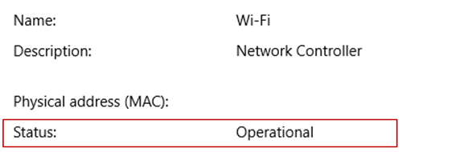

# Remote Desktop - Allow access to your PC from outside your PC's network

When you connect to your PC by using a Remote Desktop client, you're creating a peer-to-peer connection. This means you need direct access to the PC (sometimes called "the host"). If you need to connect to your PC from outside of the network your PC is running on, you need to enable that access. You have a couple of options: use port forwarding or set up a VPN.

## Enable port forwarding on your router

Port forwarding simply maps the port on your router's IP address (your public IP) to the port and IP address of the PC you want to access.

Specific steps for enabling port forwarding depend on the router you're using, so you need to search online for your router's instructions. For a general discussion of the steps, check out [How to Set Up Port Forwarding on a Router](https://www.wikihow.com/Set-Up-Port-Forwarding-on-a-Router).

Before you map the port, you need the following information:

- PC internal IP address: Look in **Settings > Network & Internet > Status > View your network properties**. Find the network configuration with an "Operational" status and then get the **IPv4 address**.

   

- Your public IP address (the router's IP). There are many ways to find your public IP. You can search (in Bing or Google) for "my IP" or view the [network properties](https://support.microsoft.com/en-us/windows/essential-network-settings-and-tasks-in-windows-f21a9bbc-c582-55cd-35e0-73431160a1b9) (for Windows 10 or later).
- Port number being mapped. Typically, the port is 3389 - that's the default port used by Remote Desktop connections.
- Admin access to your router.

   >[!WARNING]
   > You're opening your PC up to the internet, which isn't recommended. If you must, make sure you have a strong password set for your PC. It's preferable to [use a VPN](#use-a-vpn).

After you map the port, you'll be able to connect to your host PC from outside the local network by connecting to the public IP address of your router.

The router's IP address can change - your internet service provider (ISP) can assign you a new IP at any time. To avoid running into this issue, consider using Dynamic DNS. Dynamic DNS (DDNS) lets you connect to the PC using an easy to remember domain name, instead of the IP address. Your router automatically updates the DDNS service with your new IP address, should it change.

Most routers allow you to define which source IP or source network can use port mapping. So, if you know you're only going to connect from work, you can add the IP address for your work network - that lets you avoid opening the port to the entire public internet. If the host you're using to connect uses dynamic IP address, set the source restriction to allow access from the whole range of that particular ISP.

You might also consider setting up a static IP address on your PC so the internal IP address doesn't change. If you do that, the router's port forwarding always points to the correct IP address.

## Use a VPN

If you connect to your local area network by using a virtual private network (VPN), you don't have to open your PC to the public internet. Instead, when you connect to the VPN, your RD client acts like it's part of the same network and is able to access your PC. There are many VPN services available - you can find and use whichever works best for you.
