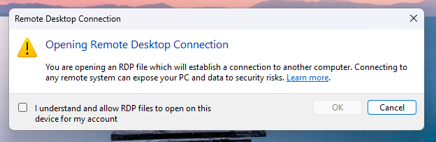
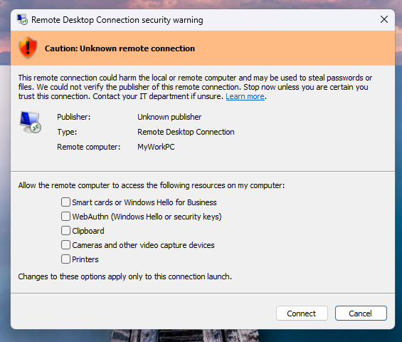
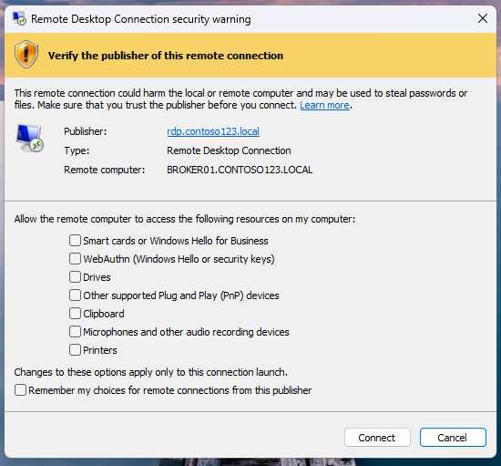
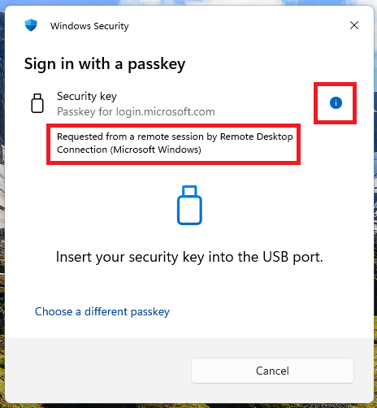

# Understanding security warnings when opening Remote Desktop (RDP) files

Starting with [the April 2026 security update](https://msrc.microsoft.com/update-guide/vulnerability/CVE-2026-26151), the Remote Desktop Connection app shows new security warnings when you open RDP files. This article explains what these warnings mean and how to respond to them safely.

## What is Remote Desktop?

Remote Desktop lets you connect to a computer in another location, such as your work PC, over a network connection like the internet. You can see the remote computer's screen, open files, run applications, and use your mouse and keyboard as if you were sitting in front of it.

## Risks of RDP files

An RDP file tells the Remote Desktop Connection app how to connect to a remote computer. Depending on its settings, the file can also share parts of your local device, such as your clipboard, drives, or camera, with the remote computer.

Malicious actors misuse this capability by sending RDP files through phishing emails. When a victim opens the file, their device silently connects to a server controlled by the attacker and shares local resources, giving the attacker access to files, credentials, and more.

> [!IMPORTANT]
> Never open an RDP file you weren't expecting, even if the email looks legitimate. When in doubt, contact your IT department.

## How to stay safe

Pausing to think before you click is the single most effective defense against phishing. Here are practical steps:
* **Don't open unexpected RDP files.** If you receive one you weren't expecting, don't open it - even if the email looks legitimate. Verify with the sender through a separate channel (like a phone call).
* **Check the remote computer address.** If you don't recognize the computer name or address in the dialog, don't connect.
* **Only enable redirections you need.** Leave all others unchecked.
* **Pay attention to dialog and whether the publisher can be verified.** Verify the publisher even when the file is signed.
* **Report suspicious RDP files to your IT security team.**

## The first-launch dialog

The first time you open an RDP file after installing this update, an educational dialog appears. It explains what RDP files are and warns about phishing risks. After you allow RDP file connections in this dialog, it doesn't appear again for your account.

## The connection security dialog

Every time you open an RDP file, a security dialog appears before any connection is made. It shows the remote computer address and a check box for each local resource the file wants to access. Access to all these resources is **off by default** - you must explicitly enable each one.

This dialog exists in two versions depending on whether the publisher of the RDP file can be verified.

### RDP files with no verifiable publisher

When an RDP file is **not digitally signed**, there's no way to verify who created it or whether it was tampered with. In this case, the security dialog shows a banner titled **Caution: Unknown remote connection** and sets the **Publisher** field to "Unknown publisher," as the following image shows.

> [!WARNING]
> An unsigned RDP file can come from anyone. Treat it with extreme caution, especially if you received it by email or downloaded it from the internet.

### RDP files with a verifiable publisher

When a publisher **digitally signs** an RDP file, the signature confirms who created or distributed it. The publisher's name appears in the dialog, and the banner is titled "Verify the publisher of this remote connection," as the following image shows.

A signature confirms the identity of the entity that created the file and that the file wasn't tampered with since it was signed. It doesn't guarantee the file is safe. Cyberattackers can sign files by using names that closely resemble legitimate organizations - for example, "Contoso Security" instead of "Contoso Ltd." Always read the publisher name carefully and verify it matches the organization you expect.

> [!NOTE]
> Your IT department might configure your computer to trust specific publishers. When an RDP file is signed by a trusted publisher, the experience might differ based on your organization's policies.

## Understanding redirections

When you open an RDP file, it can request access to resources on your local device. These requests are called redirections. They share parts of your local device with the remote computer. After this update, all redirections requested by RDP files are **turned off by default** unless you opt into them.

The following list explains each redirection type and the risk it poses. Older versions of Windows support a different set of redirections, so not all of these might be available on your device.

### Clipboard

* **What it does:** Shares the contents of your clipboard (anything you copy and paste) between your device and the remote computer.
* **Risk:** A cyberattacker could read anything you copy on your local device - including passwords, sensitive text, or confidential information. The cyberattacker could also place malicious content in your clipboard, which you might then paste into a local application.

### Printers

* **What it does:** Makes your local printers available from the remote computer, so remote applications can print to your local printers.
* **Risk:** A cyberattacker who controls a remote session could send print jobs to your printers, potentially wasting resources or printing misleading documents that appear to be local.

### Microphones and other audio recording devices

* **What it does:** Shares your local microphone and audio recording devices with the remote computer, so remote applications can record audio from your environment.
* **Risk:** With access to your microphone, an attacker can eavesdrop on conversations, meetings, or other audio in your environment without your knowledge.

### Smart cards or Windows Hello for Business

* **What it does:** Allows the remote computer to use smart cards or Windows Hello for Business credentials that you connect or configure on your local device.
* **Risk:** An attacker can use your redirected smart card or Windows Hello for Business credentials to authenticate as you on the remote system or on other systems accessible from the remote computer. This action can lead to unauthorized access to your organization's resources using your identity.

### WebAuthn (Windows Hello or security keys)

* **What it does:** Allows the remote computer to use your local FIDO2 security keys or Windows Hello passkeys to complete web authentication challenges.
* **Risk:** Authentication prompts might be redirected from a malicious remote session to the local device and used for phishing.

> [!NOTE]
> When a WebAuthn request is redirected through a remote session, Windows displays this information in the authentication prompt. If you see an indication that the request is coming from a remote connection and you didn't expect it, don't approve the request.
>
> 

### Ports

* **What it does:** Shares your local serial (COM) and parallel (LPT) ports with the remote computer.
* **Risk:** An attacker could access devices connected to these ports, such as specialized hardware or legacy peripherals, and potentially read or send data through them.

### Location

* **What it does:** Shares your device's geographic location with the remote computer.
* **Risk:** An attacker could determine your physical location, which might be sensitive depending on your role or context (for example, military, law enforcement, or executive personnel).

### Point-of-service devices

* **What it does:** Shares point-of-service (POS) devices, such as barcode scanners and receipt printers, that you connect to your local device.
* **Risk:** An attacker could interact with POS equipment, potentially interfering with transactions or reading financial data from connected devices.

### Drives

* **What it does:** Makes your local drives (hard drives, USB drives, network-mapped drives) accessible from the remote computer. The remote computer can read files from and write files to your local drives.
* **Risk:** This redirection is one of the most dangerous. An attacker can:
  * Steal files from your local drives, including documents, databases, and credentials stored on disk.
  * Plant malware on your local drives. For example, the attacker could write a malicious program to your Startup folder, which runs the next time you sign in.
  * Access network shares that are mapped as drives on your device, potentially reaching other systems in your organization.

> [!NOTE]
> Avoid redirecting your system drive (often associated with the letter C:).

### Cameras and other video capture devices

* **What it does:** Shares your local cameras and video capture devices with the remote computer, so remote applications can record video from your environment.
* **Risk:** An attacker with access to your camera can see your surroundings, read documents on your desk, observe your screen, or conduct visual surveillance without your awareness.

### Other supported Plug and Play (PnP) devices

* **What it does:** Shares other supported Plug and Play devices with the remote computer, including a wide range of USB and other peripherals.
* **Risk:** Depending on the device, an attacker could read data, interact with the device, or use it as a pivot point for further attacks.

### Other supported RemoteFX USB devices

* **What it does:** Shares supported USB devices with the remote computer at a low level by using RemoteFX USB redirection. The remote computer gets more direct access to the device than standard redirection.
* **Risk:** RemoteFX USB redirection provides deeper access to USB devices. An attacker could exploit this access to interact with sensitive USB devices, such as authentication tokens, storage devices, or specialized hardware, at a level that bypasses typical application-layer protections.

## Frequently asked questions

### What if my organization's RDP files show a warning with an unknown publisher?

This warning means your organization's RDP files are unsigned. Contact your IT department - they can sign the files so they show their publisher instead.

### Does this update affect connections I start manually from Remote Desktop Connection?

No. This update only affects connections started by opening an RDP file. If you type a computer name directly into Remote Desktop Connection, the experience is unchanged.

### I'm seeing this warning from Azure Virtual Desktop or Windows 365. Is it safe?
RDP files from Microsoft services like Azure Virtual Desktop and Windows 365 are typically signed by Microsoft. You shouldn't see the new security dialog when connecting to these services. If you do, don't proceed - contact your IT department to investigate.
