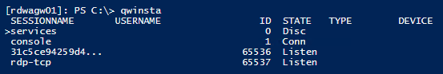

# General Remote Desktop connection troubleshooting

Use these steps when a Remote Desktop client can't connect to a remote desktop but doesn't provide messages or other symptoms that would help identify the cause.

## Check the status of the RDP protocol

### Check the status of the RDP protocol on a local computer

To check and change the status of the RDP protocol on a local computer, see [How to enable Remote Desktop](https://docs.microsoft.com/windows-server/remote/remote-desktop-services/clients/remote-desktop-allow-access#how-to-enable-remote-desktop).

> [!NOTE]  
> If the remote desktop options are not available, see [Check whether a Group Policy Object is blocking RDP](#check-whether-a-group-policy-object-gpo-is-blocking-rdp-on-a-local-computer).

### Check the status of the RDP protocol on a remote computer

> [!IMPORTANT]  
> Follow this section's instructions carefully. Serious problems can occur if the registry is modified incorrectly. Before you starty modifying the registry, [back up the registry](https://support.microsoft.com/help/322756) so you can restore it in case something goes wrong.

To check and change the status of the RDP protocol on a remote computer, use a network registry connection:

1. First, go to the **Start** menu, then select **Run**. In the text box that appears, enter **regedt32**.
2. In the Registry Editor, select **File**, then select **Connect Network Registry**.
3. In the **Select Computer** dialog box, enter the name of the remote computer, select **Check Names**, and then select **OK**.
4. Navigate to **HKEY\_LOCAL\_MACHINE\\SYSTEM\\CurrentControlSet\\Control\\Terminal Server**.  
   
   - If the value of the **fDenyTSConnections** key is **0**, then RDP is enabled.
   - If the value of the **fDenyTSConnections** key is **1**, then RDP is disabled.
5. To enable RDP, change the value of **fDenyTSConnections** from **1** to **0**.

### Check whether a Group Policy Object (GPO) is blocking RDP on a local computer

If you can't turn on RDP in the user interface or the value of **fDenyTSConnections** reverts to **1** after you've changed it, a GPO may be overriding the computer-level settings.

To check the group policy configuration on a local computer, open a Command Prompt window as an administrator, and enter the following command:

```cmd
gpresult /H c:\gpresult.html
```

After this command finishes, open gpresult.html. In **Computer Configuration\\Administrative Templates\\Windows Components\\Remote Desktop Services\\Remote Desktop Session Host\\Connections**, find the **Allow users to connect remotely by using Remote Desktop Services** policy.

- If the setting for this policy is **Enabled**, Group Policy is not blocking RDP connections.
- If the setting for this policy is **Disabled**, check **Winning GPO**. This is the GPO that is blocking RDP connections.
  
   
  

### Check whether a GPO is blocking RDP on a remote computer

To check the Group Policy configuration on a remote computer, the command is almost the same as for a local computer:

```cmd
gpresult /S <computer name> /H c:\gpresult-<computer name>.html
```

The file that this command produces (**gpresult-\<computer name\>.html**) uses the same information format as the local computer version (**gpresult.html**) uses.

### Modifying a blocking GPO

You can modify these settings in the Group Policy Object Editor (GPE) and Group Policy Management Console (GPM). For more information about how to use Group Policy, see [Advanced Group Policy Management](https://docs.microsoft.com/microsoft-desktop-optimization-pack/agpm/).

To modify the blocking policy, use one of the following methods:

- In GPE, access the appropriate level of GPO (such as local or domain), and navigate to **Computer Configuration** > **Administrative Templates** > **Windows Components** > **Remote Desktop Services** > **Remote Desktop Session Host** > **Connections** > **Allow users to connect remotely by using Remote Desktop Services**.  
   1. Set the policy to either **Enabled** or **Not configured**.
   2. On the affected computers, open a command prompt window as an administrator, and run the **gpupdate /force** command.
- In GPM, navigate to the organizational unit (OU) in which the blocking policy is applied to the affected computers and delete the policy from the OU.

## Check the status of the RDP services

On both the local (client) computer and the remote (target) computer, the following services should be running:

- Remote Desktop Services (TermService)
- Remote Desktop Services UserMode Port Redirector (UmRdpService)

You can use the Services MMC snap-in to manage the services locally or remotely. You can also use PowerShell to manage the services locally or remotely (if the remote computer is configured to accept remote PowerShell cmdlets).


On either computer, if one or both services are not running, start them.

> [!NOTE]  
> If you start the Remote Desktop Services service, click **Yes** to automatically restart the Remote Desktop Services UserMode Port Redirector service.

## Check that the RDP listener is functioning

> [!IMPORTANT]  
> Follow this section's instructions carefully. Serious problems can occur if the registry is modified incorrectly. Before you starty modifying the registry, [back up the registry](https://support.microsoft.com/help/322756) so you can restore it in case something goes wrong.

### Check the status of the RDP listener

For this procedure, use a PowerShell instance that has administrative permissions. For a local computer, you can also use a command prompt that has administrative permissions. However, this procedure uses PowerShell because the same cmdlets work both locally and remotely.

1. To connect to a remote computer, run the following cmdlet:

   ```powershell
   Enter-PSSession -ComputerName <computer name>
   ```

2. Enter **qwinsta**. 
    
3. If the list includes **rdp-tcp** with a status of **Listen**, the RDP listener is working. Proceed to [Check the RDP listener port](#check-the-rdp-listener-port). Otherwise, continue at step 4.
4. Export the RDP listener configuration from a working computer.
    1. Sign in to a computer that has the same operating system version as the affected computer has, and access that computer's registry (for example, by using Registry Editor).
    2. Navigate to the following registry entry:  
        **HKEY\_LOCAL\_MACHINE\\SYSTEM\\CurrentControlSet\\Control\\Terminal Server\\WinStations\\RDP-Tcp**
    3. Export the entry to a .reg file. For example, in Registry Editor, right-click the entry, select **Export**, and then enter a filename for the exported settings.
    4. Copy the exported .reg file to the affected computer.
5. To import the RDP listener configuration, open a PowerShell window that has administrative permissions on the affected computer (or open the PowerShell window and connect to the affected computer remotely).
   1. To back up the existing registry entry, enter the following cmdlet:  
   
      ```powershell  
      cmd /c 'reg export "HKLM\SYSTEM\CurrentControlSet\Control\Terminal Server\WinStations\RDP-tcp" C:\Rdp-tcp-backup.reg'   
      ```  
   

   2. To remove the existing registry entry, enter the following cmdlets:  
   
      ```powershell  
      Remove-Item -path 'HKLM:\SYSTEM\CurrentControlSet\Control\Terminal Server\WinStations\RDP-tcp' -Recurse -Force  
      ```
   
   3. To import the new registry entry and then restart the service, enter the following cmdlets:  
   
      ```powershell  
      cmd /c 'regedit /s c:\<filename>.reg'  
      Restart-Service TermService -Force  
      ```
      
      Replace \<filename\> with the name of the exported .reg file.

6. Test the configuration by trying the remote desktop connection again. If you still can't connect, restart the affected computer.
7. If you still can't connect, [check the status of the RDP self-signed certificate](#check-the-status-of-the-rdp-self-signed-certificate).

### Check the status of the RDP self-signed certificate

1. If you still can't connect, open the Certificates MMC snap-in. When you are prompted to select the certificate store to manage, select **Computer account**, and then select the affected computer.
2. In the **Certificates** folder under **Remote Desktop**, delete the RDP self-signed certificate. 
    
3. On the affected computer, restart the Remote Desktop Services service.
4. Refresh the Certificates snap-in.
5. If the RDP self-signed certificate has not been recreated, [check the permissions of the MachineKeys folder](#check-the-permissions-of-the-machinekeys-folder).

### Check the permissions of the MachineKeys folder

1. On the affected computer, open Explorer, and then navigate to **C:\\ProgramData\\Microsoft\\Crypto\\RSA\\**.
2. Right-click **MachineKeys**, select **Properties**, select **Security**, and then select **Advanced**.
3. Make sure that the following permissions are configured:
      - Builtin\\Administrators: Full control
      - Everyone: Read, Write

## Check the RDP listener port

On both the local (client) computer and the remote (target) computer, the RDP listener should be listening on port 3389. No other applications should be using this port.

> [!IMPORTANT]  
> Follow this section's instructions carefully. Serious problems can occur if the registry is modified incorrectly. Before you starty modifying the registry, [back up the registry](https://support.microsoft.com/help/322756) so you can restore it in case something goes wrong.

To check or change the RDP port, use the Registry Editor:

1. Go to the Start menu, select **Run**, then enter **regedt32** into the text box that appears.
      - To connect to a remote computer, select **File**, and then select **Connect Network Registry**.
      - In the **Select Computer** dialog box, enter the name of the remote computer, select **Check Names**, and then select **OK**.
2. Open the registry and navigate to **HKEY\_LOCAL\_MACHINE\\SYSTEM\\CurrentControlSet\\Control\\Terminal Server\\WinStations\\\<listener\>**. 
    
3. If **PortNumber** has a value other than **3389**, change it to **3389**. 
   > [!IMPORTANT]  
    > You can operate Remote Desktop services using another port. However, we don't recommend you do this. This article doesn't cover how to troubleshoot that type of configuration.
4. After you change the port number, restart the Remote Desktop Services service.

### Check that another application isn't trying to use the same port

For this procedure, use a PowerShell instance that has administrative permissions. For a local computer, you can also use a command prompt that has administrative permissions. However, this procedure uses PowerShell because the same cmdlets work locally and remotely.

1. Open a PowerShell window. To connect to a remote computer, enter **Enter-PSSession -ComputerName \<computer name\>**.
2. Enter the following command:  
   
     ```powershell  
    cmd /c 'netstat -ano | find "3389"'  
    ```
  
    
3. Look for an entry for TCP port 3389 (or the assigned RDP port) with a status of **Listening**. 
    > [!NOTE]  
   > The process identifier (PID) for the process or service using that port appears under the PID column.
4. To determine which application is using port 3389 (or the assigned RDP port), enter the following command:  
   
     ```powershell  
    cmd /c 'tasklist /svc | find "<pid listening on 3389>"'  
    ```  
  
    
5. Look for an entry for the PID number that is associated with the port (from the **netstat** output). The services or processes that are associated with that PID appear on the right column.
6. If an application or service other than Remote Desktop Services (TermServ.exe) is using the port, you can resolve the conflict by using one of the following methods:
      - Configure the other application or service to use a different port (recommended).
      - Uninstall the other application or service.
      - Configure RDP to use a different port, and then restart the Remote Desktop Services service (not recommended).

### Check whether a firewall is blocking the RDP port

Use the **psping** tool to test whether you can reach the affected computer by using port 3389.

1. Go to a different computer that isn't affected and download **psping** from <https://live.sysinternals.com/psping.exe>.
2. Open a command prompt window as an administrator, change to the directory in which you installed **psping**, and then enter the following command:  
   
   ```  
   psping -accepteula <computer IP>:3389  
   ```
   
3. Check the output of the **psping** command for results such as the following:  
      - **Connecting to \<computer IP\>**: The remote computer is reachable.
      - **(0% loss)**: All attempts to connect succeeded.
      - **The remote computer refused the network connection**: The remote computer is not reachable.
      - **(100% loss)**: All attempts to connect failed.
1. Run **psping** on multiple computers to test their ability to connect to the affected computer.
1. Note whether the affected computer blocks connections from all other computers, some other computers, or only one other computer.
1. Recommended next steps:
      - Engage your network administrators to verify that the network allows RDP traffic to the affected computer.
      - Investigate the configurations of any firewalls between the source computers and the affected computer (including Windows Firewall on the affected computer) to determine whether a firewall is blocking the RDP port.
