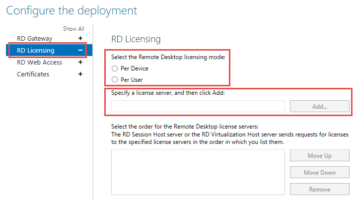

# Clients can't connect and see "No licenses available" error

This situation applies to deployments that include an RDSH server and a Remote Desktop Licensing server.

First, identify which behavior the users are seeing:

- The session was disconnected because no licenses are available or no license server is available.
- Access was denied because of a security error.

Sign in to the RD Session Host as a domain administrator and open the RD License Diagnoser. Look for messages like the following:

  - The grace period for the Remote Desktop Session Host server has expired, but the RD Session Host server hasn't been configured with any license servers. Connections to the RD Session Host server will be denied unless a license server is configured for the RD Session Host server.
  - License server \<computer name\> is not available. This could be caused by network connectivity problems, the Remote Desktop Licensing service is stopped on the license server, or RD Licensing isn't available.

These problems tend to be associated with the following user messages:

  - The remote session was disconnected because there are no Remote Desktop client access licenses available for this computer.
  - The remote session was disconnected because there are no Remote Desktop License Servers available to provide a license.

In this case, [configure the RD Licensing service](#configure-the-rd-licensing-service).

If the RD License Diagnoser lists other problems, such as “The RDP protocol component X.224 detected an error in the protocol stream and has disconnected the client,” there may be a problem that affects the license certificates. Such problems tend to be associated with user messages, such as the following:

Because of a security error, the client could not connect to the Terminal server. After making sure that you are signed in to the network, try connecting to the server again.

In this case, [refresh the X509 Certificate registry keys](#refresh-the-x509-certificate-registry-keys).

## Configure the RD Licensing service

The following procedure uses Server Manager to make the configuration changes. For information about how to configure and use Server Manager, see [Server Manager](../../../administration/server-manager/server-manager.md)

1. Open **Server Manager** and navigate to **Remote Desktop Services**.
2. On **Deployment Overview**, select **Tasks**, and then select **Edit Deployment Properties**.
3. Select **RD Licensing**, then select the appropriate licensing mode for your deployment (**Per Device** or **Per User**).
4. Enter the fully qualified domain name (FQDN) of your RD License server, and then select **Add**.
5. If you have more than one RD License server, repeat step 4 for each server. 
    

## Refresh the X509 Certificate registry keys

> [!IMPORTANT]  
> Follow this section's instructions carefully. Serious problems can occur if the registry is modified incorrectly. Before you starty modifying the registry, [back up the registry](https://support.microsoft.com/help/322756) so you can restore it in case something goes wrong.

To resolve this problem, back up and then remove the X509 Certificate registry keys, restart the computer, and then reactivate the RD Licensing server. Follow these steps.

> [!NOTE]
> Perform the following procedure on each of the RDSH servers.

Here's how to reactivate the RD Licensing server:

1. Open the Registry Editory and navigate to **HKEY\_LOCAL\_MACHINE\\SYSTEM\\CurrentControlSet\\Control\\Terminal Server\\RCM**.
2. On the Registry menu, select **Export Registry File**.
3. Enter **exported- Certificate** into the **File name** box, then select **Save**.
4. Right-click each of the following values, select **Delete**, and then select **Yes** to verify the deletion:  
      - **Certificate**
      - **X509 Certificate**
      - **X509 Certificate ID**
      - **X509 Certificate2**
5. Exit the Registry Editor and restart the RDSH server.