# Windows Server software-defined datacenter

>Applies To: Windows Server 2019, Windows Server 2016

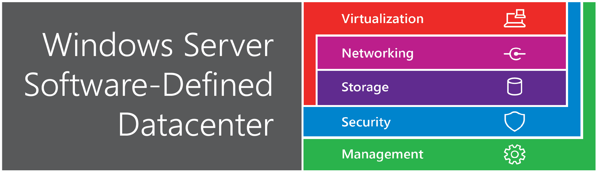

## What is Windows Server software-defined datacenter?

Software-defined datacenter (SDDC) is a common industry term that generally refers to a datacenter where all of the infrastructure is virtualized. Virtualization is the key, and it simply means that the hardware and software in the datacenter expand beyond a traditional one-to-one ratio. With a software hypervisor emulating hardware, operating systems and applications can be abstracted away from physical hardware, and multiplied to form elastic resource pools of processors, memory, I/O and networks.

Microsoft's implementation of the SDDC consists of the Windows Server technologies highlighted in this article. It starts with the Hyper-V hypervisor that provides the virtualization platform upon which networking and storage are built. Security technologies, developed for the unique challenges of virtualized infrastructure, mitigate internal and external threats. With PowerShell built into Windows Server, and the addition of [System Center](/system-center/) and/or [Operations Management Suite](/azure/operations-management-suite/operations-management-suite-overview), you can program and automate provisioning, deployment, configuration and management.

The technologies built into Windows Server and System Center are the main building blocks of the Windows Server SDDC experience. But even though it's a virtualized platform, it still requires the right hardware underneath. Microsoft partners participating in the **Windows Server Software-Defined (WSSD) Solutions** and the **Azure Stack HCI Solutions** programs can help your enterprise acquire the right hardware and get it up and running on day zero.

**[Watch a video to learn more about Microsoft's SDDC](https://mva.microsoft.com/training-courses/whats-new-in-windows-server-2016-16457?l=YcsJR6sXC_1006218965)**

**[Download a poster size .pdf file of this page](https://github.com/MicrosoftDocs/windowsserverdocs/blob/master/WindowsServerDocs/media/sddc/sddc_poster_0801417_ANSI-E.pdf)**

## Azure Stack HCI solutions

Building your Windows Server software-defined datacenter on the right hardware infrastructure is a crucial first step to success. That's why we've partnered with 15 partners to create Microsoft-validated SDDC designs and best practices for deployment.

Microsoft partners offer an array of solutions that work with Window Server 2019 via the Azure Stack HCI program and Windows Server 2016 via the Windows Server software-defined (WSSD) program to deliver high-performance, hyper-converged, storage and networking infrastructure. Hyper-converged solutions bring together compute, storage, and networking on industry-standard servers and components for improved datacenter intelligence and control.

**[Learn more about Azure Stack HCI Solutions](https://azure.microsoft.com/overview/azure-stack/hci)**

**[Learn more about WSSD Solutions](https://www.microsoft.com/cloud-platform/software-defined-datacenter)**

## Windows Server virtualized technologies ##

The remainder of this topic lists the Windows Server SDDC technologies and provides links to the documentation for each. The technologies are listed in the table below:

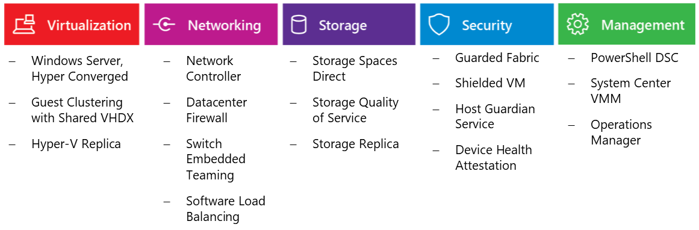

### Windows Server, hyper-converged

Windows Server Virtualization technologies include updates to Hyper-V, Hyper-V Virtual Switch, and Guarded Fabric and Shielded Virtual Machines (VMs), that improve security, scalability, and reliability. Updates to failover clustering, networking, and storage make it even easier to deploy and manage these technologies when used with Hyper-V.

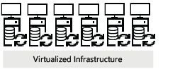

**[Learn more about Windows Server, Hyper-converged](./get-started/whats-new-in-windows-server-2016.md#compute)**

### Hyper-V hypervisor

Hyper-V is a hypervisor-based virtualization technology for Windows. The hypervisor is core to virtualization. It is the processor-specific virtualization platform that allows multiple isolated operating systems to share a single hardware platform.

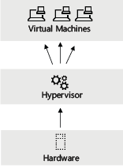

**[Learn more about Hyper-V Hypervisor](https://www.microsoft.com/cloud-platform/server-virtualization)**

### Guest clustering with shared VHDX

Flexible and secure, and not bound to the underlying storage topology, Shared VHDX removes the need to present the physical underlying storage to a guest OS. The new Shared VHDX supports online re-size.

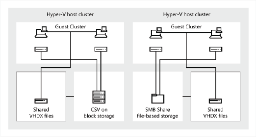

- Shared VHDX can reside on a Cluster Shared Volume (CSV) on block storage, or on SMB file-based storage.
- Protected: Shared VHDX supports Hyper-V Replica and host-level backup.

**[Learn more about  Guest Clustering with Shared VHDX](/previous-versions/windows/it-pro/windows-server-2012-R2-and-2012/dn281956(v=ws.11))**

### Hyper-V Replica

Integrated software-based VM replication across the network with certificates. Not bound to server, network or storage hardware on either site.

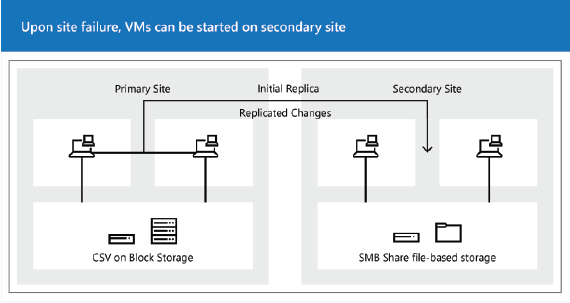

No need for other virtual machine replication technologies, reducing costs.
- Handles live migration automatically.
- Simple configuration and management — either through Hyper-V Manager, PowerShell, or with Azure Site Recovery.

**[Learn more about Hyper-V Replica](./virtualization/hyper-v/manage/set-up-hyper-v-replica.md)**

### Network Controller

A centralized, programmable point of automation to manage, configure, monitor, and troubleshoot virtual and physical network infrastructure in your datacenter.

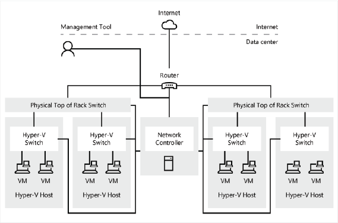

Administrators use a Management Tool that interacts directly with Network Controller. Network Controller provides information about the network infrastructure, including both virtual and physical infrastructure, to the Management Tool.

**[Learn more about Network Controller](./networking/sdn/technologies/network-controller/network-controller.md)**

### Datacenter Firewall

When deployed and offered as a service, tenant administrators can install and configure firewall policies to help protect virtual networks from unwanted traffic from Internet and intranet networks.

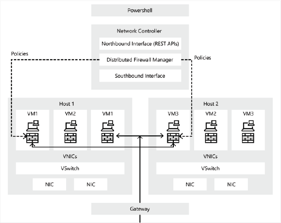

The service provider administrator or the tenant administrator can manage the Datacenter Firewall policies via the network controller.

**[Learn More about Datacenter Firewall](./networking/sdn/technologies/network-function-virtualization/datacenter-firewall-overview.md)**

### Switch Embedded Teaming

SET is an alternative NIC Teaming solution that you can use in environments that include Hyper-V and the [Software Defined Networking (SDN)](./networking/sdn/software-defined-networking.md) stack.

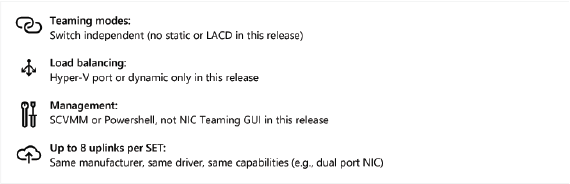

**[Learn more about Switch Embedded Teaming](./networking/sdn/technologies/set-for-sdn.md)**

### Software Load Balancing

SLB enables multiple servers to host the same workload, providing high availability and scalability. Scale out load balancing capabilities using SLB VMs on the same Hyper-V servers you use for your other VM workloads. SLB supports the rapid creation and deletion of load balancing endpoints for Cloud Service Provider operations. SLB supports tens of gigabytes per cluster, provides a simple provisioning model, and is easy to scale out and in.

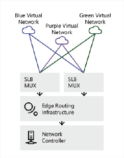

**[Learn more about Software Load Balancing](./networking/sdn/technologies/network-function-virtualization/software-load-balancing-for-sdn.md)**

### Storage Spaces Direct

Using industry-standard servers with local-attached drives, Storage Spaces Direct provides highly available, highly scalable software-defined storage at a fraction of the cost of traditional SAN or NAS arrays. Its architecture radically simplifies procurement and deployment.

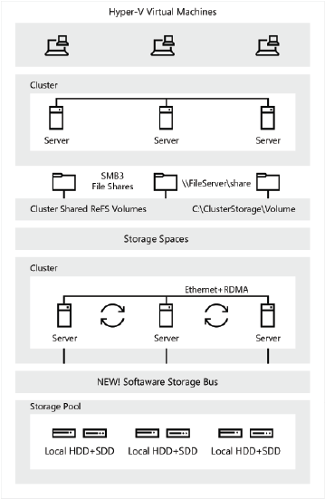

Storage Spaces Direct introduces the new Software Storage Bus and leverages many of the features you know today in Windows Server, such as Failover Clustering, Cluster Shared Volumes (CSVs), Server Message Block (SMB) 3, and Storage Spaces.

**[Learn more about Storage Spaces Direct](storage/storage-spaces/storage-spaces-direct-overview.md)**
### Storage Quality of Service ###

Centrally monitor and manage storage performance for virtual machines using Hyper-V and the Scale-Out File Server roles, improving storage resource fairness between multiple virtual machines.

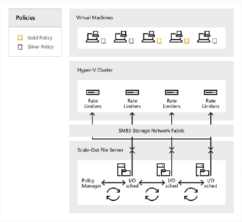

Storage QoS is built into the Microsoft software-defined storage solution provided by Scale-Out File Server and Hyper-V using SMB3 protocol. A new Policy Manager provides central storage performance monitoring.

**[Learn more about Storage QoS](./storage/storage-qos/storage-qos-overview.md)**

### Storage Replica

Disaster recovery and preparedness make possible zero data loss, with the ability to synchronously protect data on different racks, floors, buildings, campuses, cities, and countries with more efficient use of multiple datacenters.

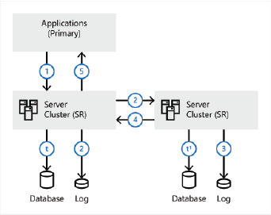

Synchronous replication

1. Application writes data
2. Log data is written and the data is replicated to the remote site
3. Log data is written at the remote site
4. Acknowledgment from the remote site
5. Application write acknowledged

t & t1 : Data flushed to the volume, logs always write through

**[Learn more about Storage Replica](./storage/storage-replica/storage-replica-overview.md)**

### Guarded fabric

As a cloud service provider or enterprise private cloud administrator, you can use a guarded fabric to provide a more secure environment for VMs. A guarded fabric consists of one Host Guardian Service (HGS) - typically, a cluster of three nodes - plus one or more guarded hosts, and a set of shielded virtual machines (VMs).

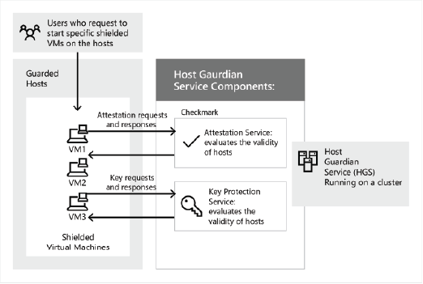

**[Learn more about guarded fabric](./security/guarded-fabric-shielded-vm/guarded-fabric-and-shielded-vms.md)**

### Shielded VMs

The data and state of a shielded VM are protected against inspection, theft and tampering, from both malware and datacenter administrators.

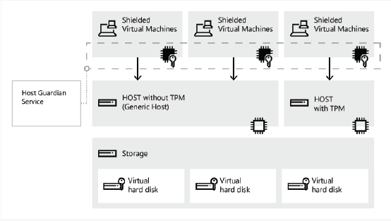

- Shielded VMs will only run in fabrics designated as owners of the VM.
- Shielded VMs are encrypted by BitLocker, or other means, so that only designated owners can run them.
- Running VMs can be converted to shielded.

**[Learn more about shielded VMs](./security/guarded-fabric-shielded-vm/guarded-fabric-and-shielded-vms.md)**

### Host Guardian Service

Host Guardian Service holds the keys to legitimate fabrics, as well as encrypted virtual machines.

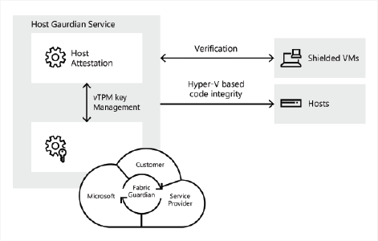

**[Learn more about the Host Guardian Service](./security/guarded-fabric-shielded-vm/guarded-fabric-manage-hgs.md)**

### Device Health Attestation

Attestation enables enterprises to raise the security bar of their organization to hardware monitored and attested security, with minimal or no impact on operation costs.

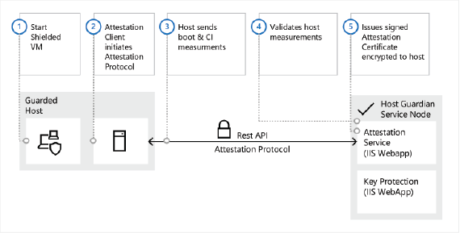

Hardware trusted mode, shown above, provides the highest
level of assurance, with TPM v2.0 hardware rooted trust and compliance with code-integrity policy for key-release.

**[Learn more about Device Health Attestation](./security/device-health-attestation.md)**

### PowerShell Desired State Configuration

Windows PowerShell Desired State Configuration is a configuration management platform built into Windows that is based on open standards. DSC is flexible enough to function reliably and consistently in each stage of the deployment lifecycle (development, test, pre-production, production), as well as during scale-out.

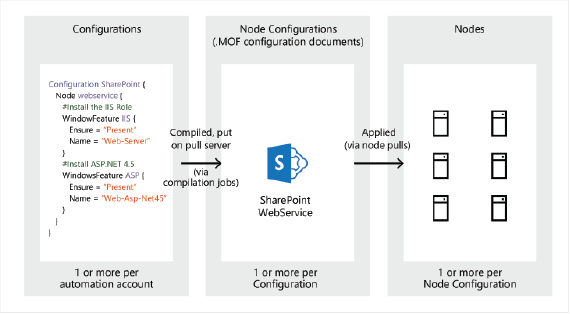

DSC supports  "continuous deployments," so you can deploy configurations over and over without breaking anything.

-  DSC configurations only apply settings that have changed from the original for faster deployments.
-  DSC can be used on-premises, in a public, or in a private Cloud environment.
-  You can integrate DSC with any Microsoft or non-Microsoft solution as long as you can execute a PowerShell script on the target system.

**[Learn more about PowerShell DSC](/powershell/dsc/overview)**

### System Center VMM

Virtual Machine Manager is part of the System Center suite, used to configure, manage and transform traditional datacenters to provide a unified management experience across on-premises, service provider, and the Azure cloud.

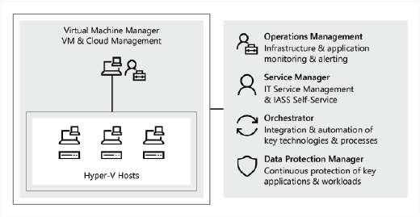

- Datacenter: Configure and manage datacenter components as a single fabric in VMM.
- Virtualization hosts: VMM can add, provision, and manage Hyper-V and VMware virtualization hosts and clusters.
- Networking: VMM provides network virtualization, including support for creating and manage virtual networks and network gateways.
- Storage: VMM can discover, classify, provision, allocate, and assign local and remote storage.

**[Learn more about System Center VMM](/system-center/vmm/)**

### Windows Admin Center

Windows Admin Center is a locally deployed, browser-based, management tool set that enables on-premises administration of Windows Servers with no Azure or cloud dependency. Windows Admin Center gives IT Admins full control over all aspects of their Server infrastructure, and is particularly useful for management on private networks that are not connected to the Internet.

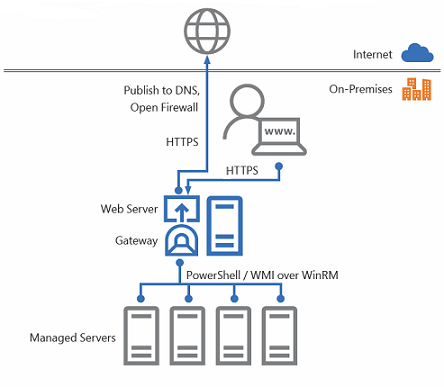

Publishing the web server to DNS and setting up the corporate firewall can allow you to access Windows Admin Center from the public internet, enabling you to connect to, and manage, your servers from anywhere with Microsoft Edge or Google Chrome.

**[Learn more about Windows Admin Center](manage/windows-admin-center/overview.md)**
