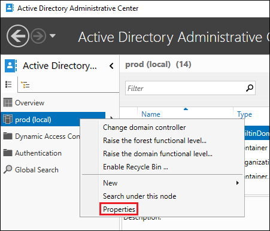
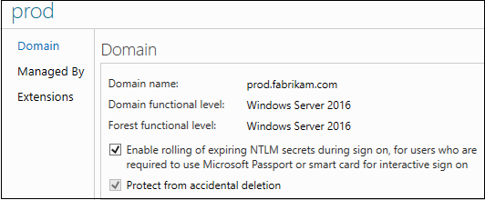

# What's new in Credential Protection

## Credential Guard for signed-in user

Beginning with Windows 10, version 1507, Kerberos and NTLM use virtualization-based security to protect Kerberos & NTLM secrets of the signed-in user logon session. 

Beginning with Windows 10, version 1511, Credential Manager uses virtualization-based security to protect saved credentials of domain credential type. Signed-in credentials and saved domain credentials will not be passed to a remote host using remote desktop. Credential Guard can be enabled without UEFI lock.

Beginning with Windows 10, version 1607, Isolated User Mode is included with Hyper-V so it no longer is installed separately for Credential Guard deployment.

[Learn more about Credential Guard](https://technet.microsoft.com/itpro/windows/keep-secure/credential-guard).

## Remote Credential Guard for signed-in user

Beginning with Windows 10, version 1607, Remote Credential Guard protects signed-in user credentials when using Remote Desktop by protecting the Kerberos and NTLM secrets on the client device. For the remote host to assess network resources as the user, authentication requests require the client device to use the secrets.

Beginning with Windows 10, version 1703, Remote Credential Guard protects supplied user credentials when using Remote Desktop.

[Learn more about Remote credential guard](https://technet.microsoft.com/itpro/windows/keep-secure/remote-credential-guard).

## Domain protections

Domain protections require an Active Directory domain.

### Domain-joined device support for authentication using public key

Beginning with Windows 10 version 1507 and Windows Server 2016, if a domain-joined device is able to register its bound public key with a Windows Server 2016 domain controller (DC), then the device can authenticate with the public key using Kerberos PKINIT authentication to a Windows Server 2016 DC.

Beginning with Windows Server 2016, KDCs support authentication using Kerberos key trust.  

[Learn more about public key support for domain-joined devices & Kerberos key trust](https://technet.microsoft.com/windows-server-docs/security/kerberos/whats-new-in-kerberos-authentication).

### PKINIT Freshness extension support

Beginning with Windows 10, version 1507 and Windows Server 2016, Kerberos clients will attempt the PKInit freshness extension for public key based sign-ons. 

Beginning with Windows Server 2016, KDCs can support the PKInit freshness extension.  By default, KDCs will not offer the PKInit freshness extension. 

[Learn more about PKINIT freshness extension support](https://technet.microsoft.com/windows-server-docs/security/kerberos/whats-new-in-kerberos-authentication).

### Rolling public key only user's NTLM secrets

Beginning with Windows Server 2016 domain functional level (DFL), DCs can support rolling a public key only user's NTLM secrets. This feature is unavailble in lower DFLs.

> [!WARNING] 
> Adding a domain controller to a domain with rolling NTLM secrets enabled before the DC has been updated with at least the November 8, 2016 servicing runs the risk of the DC crashing. 

Configuration: For new domains, this feature is enabled by default. For existing domains, it must be configured in the Active Directory Administrative center: 

1. From the Active Directory Administrative center, right-click the domain on the left pane and select **Properties**.

    

2. Select **Enable rolling of expiring NTLM secrets during sign on, for users who are required to use Microsoft Passport or smart card for interactive logon**.

    

3. Click **OK**. 

### Allowing network NTLM when user is restricted to specific domain-joined devices

Beginning with Windows Server 2016 domain functional level (DFL), DCs can support allowing network NTLM when a user is restricted to specific domain-joined devices. This feature is unavailable in lower DFLs.

Configuration: On the authentication policy, click **Allow NTLM network authentication when the user is restricted to selected devices**. 

[Learn more about authentication policies](https://technet.microsoft.com/windows-server-docs/security/credentials-protection-and-management/authentication-policies-and-authentication-policy-silos).
