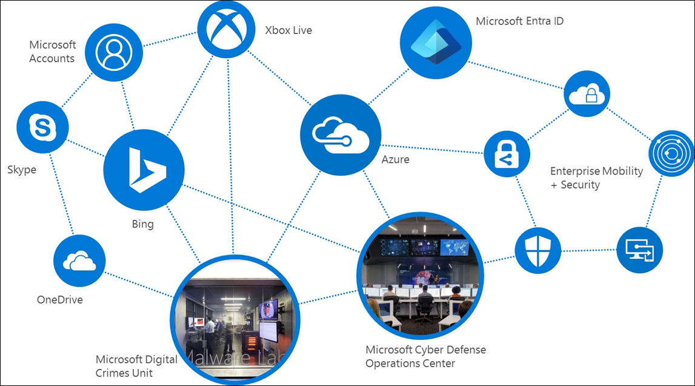

# Beginning your General Data Protection Regulation (GDPR) journey for Windows Server 

>Applies To: Windows Server (Semi-Annual Channel), Windows Server 2016

This article provides info about the GDPR, including what it is, and the products Microsoft provides to help you to become compliant.

## Introduction
On May 25, 2018, a European privacy law is due to take effect that sets a new global bar for privacy rights, security, and compliance.

The General Data Protection Regulation, or GDPR, is fundamentally about protecting and enabling the privacy rights of individuals. The GDPR establishes strict global privacy requirements governing how you manage and protect personal data while respecting individual choice — no matter where data is sent, processed, or stored.

Microsoft and our customers are now on a journey to achieve the privacy goals of the GDPR. At Microsoft, we believe privacy is a fundamental right, and we believe that the GDPR is an important step forward for clarifying and enabling individual privacy rights. But we also recognize that the GDPR will require significant changes by organizations all over the world.

We have outlined our commitment to the GDPR and how we are supporting our customers within the [Get GDPR compliant with the Microsoft Cloud](https://blogs.microsoft.com/on-the-issues/2017/02/15/get-gdpr-compliant-with-the-microsoft-cloud/#hv52B68OZTwhUj2c.99) blog post by our Chief Privacy Officer [Brendon Lynch](https://blogs.microsoft.com/on-the-issues/author/brendonlynch/) and the [Earning your trust with contractual commitments to the General Data Protection Regulation](https://blogs.microsoft.com/on-the-issues/2017/04/17/earning-trust-contractual-commitments-general-data-protection-regulation/#6QbqoGWXCLavGM63.99)” blog post by [Rich Sauer](https://blogs.microsoft.com/on-the-issues/author/rsauer/) - Microsoft Corporate Vice President & Deputy General Counsel.

Although your journey to GDPR-compliance may seem challenging, we're here to help you. For specific information about the GDPR, our commitments and how to begin your journey, please visit the [GDPR section of the Microsoft Trust Center](https://www.microsoft.com/trustcenter/privacy/gdpr).

## GDPR and its implications
The GDPR is a complex regulation that may require significant changes in how you gather, use and manage personal data. Microsoft has a long history of helping our customers comply with complex regulations, and when it comes to preparing for the GDPR, we are your partner on this journey.

The GDPR imposes rules on organizations that offer goods and services to people in the European Union (EU), or that collect and analyze data tied to EU residents, no matter where those businesses are located. Among the key elements of the GDPR are the following:

- **Enhanced personal privacy rights.** Strengthened data protection for residents of EU by ensuring they have the right to access to their personal data, to correct inaccuracies in that data, to erase that data, to object to processing of their personal data, and to move it.

- **Increased duty for protecting personal data.** Reinforced accountability of organizations that process personal data, providing increased clarity of responsibility in ensuring compliance.

- **Mandatory personal data breach reporting.** Organizations that control personal data are required to report personal data breaches that pose a risk to the rights and freedoms of individuals to their supervisory authorities without undue delay, and, where feasible, no later than 72 hours once they become aware of the breach.

As you might anticipate, the GDPR can have a significant impact on your business, potentially requiring you to update privacy policies, implement and strengthen data protection controls and breach notification procedures, deploy highly transparent policies, and further invest in IT and training. Microsoft Windows 10 can help you effectively and efficiently address some of these requirements.

## Personal and sensitive data
As part of your effort to comply with the GDPR, you will need to understand how the regulation defines personal and sensitive data and how those definitions relate to data held by your organization. Based on that understanding you'll be able to discover where that data is created, processed, managed and stored.

The GDPR considers personal data to be any information related to an identified or identifiable natural person. That can include both direct identification (such as, your legal name) and indirect identification (such as, specific information that makes it clear it is you the data references). The GDPR also makes clear that the concept of personal data includes online identifiers (such as, IP addresses, mobile device IDs) and location data.

The GDPR introduces specific definitions for genetic data (such as, an individual's gene sequence) and biometric data. Genetic data and biometric data along with other sub categories of personal data (personal data revealing racial or ethnic origin, political opinions, religious or philosophical beliefs, or trade union membership: data concerning health; or data concerning a person's sex life or sexual orientation) are treated as sensitive personal data under the GDPR. Sensitive personal data is afforded enhanced protections and generally requires an individual's explicit consent where these data are to be processed.

### Examples of info relating to an identified or identifiable natural person (data subject)
This list provides examples of several types of info that will be regulated through GDPR. This is not an exhaustive list.

-   Name

-   Identification number (such as, SSN)

-   Location data (such as, home address)

-   Online identifier (such as, e-mail address, screen names, IP address, device IDs)

-   Pseudonymous data (such as, using a key to identify individuals)

-   Genetic data (such as, biological samples from an individual)

-   Biometric data (such as, fingerprints, facial recognition)

## Getting started on the journey towards GDPR compliance
Given how much is involved to become GDPR-compliant, we strongly recommend that you don't wait to prepare until enforcement begins. You should review your privacy and data management practices now. We recommend that you begin your journey to GDPR compliance by focusing on four key steps:

-   **Discover.** Identify what personal data you have and where it resides. 

-   **Manage.** Govern how personal data is used and accessed.

-   **Protect.** Establish security controls to prevent, detect, and respond to vulnerabilities and data breaches.  

-   **Report.** Act on data requests, report data breaches, and keep required documentation.

    

For each of the steps, we've outlined example tools, resources, and features in various Microsoft solutions, which can be used to help you address the requirements of that step. While this article isn't a comprehensive “how-to” guide, we've included links for you to find out more details, and more info is available in the [GDPR section of the Microsoft Trust Center](https://www.microsoft.com/trustcenter/privacy/gdpr).

## Windows Server security and privacy
The GDPR requires you to implement appropriate technical and organizational security measures to protect personal data and processing systems. In the context of the GDPR, your physical and virtual server environments are potentially processing personal and sensitive data. Processing can mean any operation or set of operations, such as data collection, storage, and retrieval.

Your ability to meet this requirement and to implement appropriate technical security measures must reflect the threats you face in today's increasingly hostile IT environment. Today's security threat landscape is one of aggressive and tenacious threats. In previous years, malicious attackers mostly focused on gaining community recognition through their attacks or the thrill of temporarily taking a system offline. Since then, attacker's motives have shifted toward making money, including holding devices and data hostage until the owner pays the demanded ransom.

Modern attacks increasingly focus on large-scale intellectual property theft; targeted system degradation that can result in financial loss; and now even cyberterrorism that threatens the security of individuals, businesses, and national interests all over the world. These attackers are typically highly trained individuals and security experts, some of whom are in the employ of nation states that have large budgets and seemingly unlimited human resources. Threats like these require an approach that can meet this challenge.

Not only are these threats a risk to your ability to maintain control of any personal or sensitive data you may have, but they are a material risk to your overall business as well. Consider recent data from McKinsey, Ponemon Institute, Verizon, and Microsoft:

- The average cost of the type of data breach the GDPR will expect you to report is $3.5M.

- 63% of these breaches involve weak or stolen passwords that the GDPR expects you to address.

- Over 300,000 new malware samples are created and spread every day making your task to address data protection even more challenging.

As seen with the recent Ransomware attacks, once called the black plague of the Internet, attackers are going after bigger targets that can afford to pay more, with potentially catastrophic consequences. The GDPR includes penalties that make your systems, including desktops and laptops, that contain personal and sensitive data rich targets indeed.

Two key principles have guided and continue to guide the development of Windows:

- **Security.** The data our software and services store on behalf of our customers should be protected from harm and used or modified only in appropriate ways. Security models should be easy for developers to understand and build into their applications.

- **Privacy.** Users should be in control of how their data is used. Policies for information use should be clear to the user. Users should be in control of when and if they receive information to make best use of their time. It should be easy for users to specify appropriate use of their information including controlling the use of email they send.

Microsoft has remained steadfast against these principles as recently noted by Microsoft's CEO, Satya Nadella, 

> “_As the world continues to change and business requirements evolve, some things are consistent: a customer's demand for security and privacy._”

As you work to comply with the GDPR, understanding the role of your physical and virtual servers in creating, accessing, processing, storing and managing data that may qualify as personal and potentially sensitive data under the GDPR is important. Windows Server provides capabilities that will help you comply with the GDPR requirements to implement appropriate technical and organizational security measures to protect personal data.

The security posture of Windows Server 2016 isn't a bolt-on; it's an architectural principle. And, it can be best understood in four principals:

- **Protect.** Ongoing focus and innovation on preventative measures; block known attacks and known malware.

- **Detect.** Comprehensive monitoring tools to help you spot abnormalities and respond to attacks faster.

- **Respond.** Leading response and recovery technologies plus deep consulting expertise.

- **Isolate.** Isolate operating system components and data secrets, limit administrator privileges, and rigorously measure host health.

With Windows Server, your ability to protect, detect and defend against the types of attacks that can lead to data breaches is greatly improved. Given the stringent requirements around breach notification within the GDPR, ensuring that your desktop and laptop systems are well defended will lower the risks you face that could result in costly breach analysis and notification.

In the section that follows, you will see how Windows Server provides capabilities that fit squarely in the "Protect" stage of your GDPR compliance journey. These capabilities fall into three protection scenarios:

- **Protect your credentials and limit administrator privileges.** Windows Server 2016 helps to implement these changes, to help prevent your system from being used as a launching point for further intrusions.

- **Secure the operating system to run your apps and infrastructure.** Windows Server 2016 provides layers of protection, which helps to block external attackers from running malicious software or exploiting vulnerabilities.

- **Secure virtualization.** Windows Server 2016 enables secure virtualization, using Shielded Virtual Machines and Guarded Fabric. This helps you encrypt and run your virtual machines on trusted hosts in your fabric, better protecting them from malicious attacks.

These capabilities, discussed in more detail below with references to specific GDPR requirements, are built on top of advanced device protection that helps maintain the integrity and security of the operating system and data.

A key provision within the GDPR is data protection by design and by default, and helping with your ability to meet this provision are features within Windows 10 such as BitLocker Device Encryption. BitLocker uses the Trusted Platform Module (TPM) technology, which provides hardware-based, security-related functions. This crypto-processor chip includes multiple physical security mechanisms to make it tamper resistant, and malicious software is unable to tamper with the security functions of the TPM.

The chip includes multiple physical security mechanisms to make it tamper resistant, and malicious software is unable to tamper with the security functions of the TPM. Some of the key advantages of using TPM technology are that you can:

-   Generate, store, and limit the use of cryptographic keys.

-   Use TPM technology for platform device authentication by using the TPM's unique RSA key, which is burned into itself.

-   Help to ensure platform integrity by taking and storing security measurements.

Additional advanced device protection relevant to your operating without data breaches include Windows Trusted Boot to help maintain the integrity of the system by ensuring malware is unable to start before system defenses.

## Windows Server: Supporting your GDPR compliance journey
Key features within Windows Server can help you to efficiently and effectively implement the security and privacy mechanisms the GDPR requires for compliance. While the use of these features will not guarantee your compliance, they will support your efforts to do so.

The server operating system sits at a strategic layer in an organization's infrastructure, affording new opportunities to create layers of protection from attacks that could steal data and interrupt your business. Key aspects of the GDPR such as Privacy by Design, Data Protection, and Access Control need to be addressed within your IT infrastructure at the server level.

Working to help protect the identity, operating system, and virtualization layers, Windows Server 2016 helps block the common attack vectors used to gain illicit access to your systems: stolen credentials, malware, and a compromised virtualization fabric. In addition to reducing business risk, the security components built into Windows Server 2016 help address compliance requirements for key government and industry security regulations. 

These identity, operating system, and virtualization protections enable you to better protect your datacenter running Windows Server as a VM in any cloud, and limit the ability of attackers to compromise credentials, launch malware, and remain undetected in your network. Likewise, when deployed as a Hyper-V host, Windows Server 2016 offers security assurance for your virtualization environments through Shielded Virtual Machines and distributed firewall capabilities. With Windows Server 2016, the server operating system becomes an active participant in your datacenter security.

### Protect your credentials and limit administrator privileges 
Control over access to personal data, and the systems that process that data, is an area with the GDPR that has specific requirements including access by administrators. Privileged identities are any accounts that have elevated privileges, such as user accounts that are members of the Domain Administrators, Enterprise Administrators, local Administrators, or even Power Users groups. Such identities can also include accounts that have been granted privileges directly, such as performing backups, shutting down the system, or other rights listed in the User Rights Assignment node in the Local Security Policy console.

As a general access control principle and in-line with the GDPR, you need to protect these privileged identities from compromise by potential attackers. First, it's important to understand how identities are compromised; then you can plan to prevent attackers from gaining access to these privileged identities.

#### How do privileged identities get compromised?
Privileged identities can get compromised when organizations don't have guidelines to protect them. The following are examples:

- **More privileges than are necessary.** One of the most common issues is that users have more privileges than are necessary to perform their job function. For example, a user who manages DNS might be an AD administrator. Most often, this is done to avoid the need to configure different administration levels. However, if such an account is compromised, the attacker automatically has elevated privileges.

- **Constantly signed in with elevated privileges.** Another common issue is that users with elevated privileges can use it for an unlimited time. This is very common with IT pros who sign in to a desktop computer using a privileged account, stay signed in, and use the privileged account to browse the web and use email (typical IT work job functions). Unlimited duration of privileged accounts makes the account more susceptible to attack and increases the odds that the account will be compromised.

- **Social engineering research.** Most credential threats start out by researching the organization and then conducted through social engineering. For example, an attacker may perform an email phishing attack to compromise legitimate accounts (but not necessarily elevated accounts) that have access to an organization's network. The attacker then uses these valid accounts to perform additional research on your network and to identify privileged accounts that can perform administrative tasks. 

- **Leverage accounts with elevated privileges.** Even with a normal, non-elevated user account in the network, attackers can gain access to accounts with elevated permissions. One of the more common methods of doing so is by using the Pass-the-Hash or Pass-the-Token attacks. For more information on the Pass-the-Hash and other credential theft techniques, see the resources on the [Pass-the-Hash (PtH) page](https://technet.microsoft.com/dn785092.aspx).

There are of course other methods that attackers can use to identify and compromise privileged identities (with new methods being created every day). It is therefore important that you establish practices for users to log on with least-privileged accounts to reduce the ability of attackers to gain access to privileged identities. The sections below outline functionality where Windows Server can mitigate these risks.

#### Just-in-Time Admin (JIT) and Just Enough Admin (JEA)
While protecting against Pass-the-Hash or Pass-the-Ticket attacks is important, administrator credentials can still be stolen by other means, including social engineering, disgruntled employees, and brute force. Therefore, in addition to isolating credentials as much as possible, you also want a way to limit the reach of administrator-level privileges in case they are compromised.

Today, too many administrator accounts are over-privileged, even if they have only one area of responsibility. For example, a DNS administrator, who requires a very narrow set of privileges to manage DNS servers, is often granted domain admin-level privileges. In addition, because these credentials are granted for perpetuity, there is no limit on how long they can be used.

Every account with unnecessary domain admin-level privileges increases your exposure to attackers seeking to compromise credentials. To minimize the surface area for attack, you want to provide only the specific set of rights that an admin needs to do the job – and only for the window of time needed to complete it.

Using Just Enough Administration and Just-in-Time Administration, administrators can request the specific privileges they need for the exact window of time required. For a DNS administrator, for example, using PowerShell to enable Just Enough Administration lets you create a limited set of commands that are available for DNS management.

If the DNS administrator needs to make an update to one of her servers, she would request access to manage DNS using Microsoft Identity Manager 2016. The request workflow can include an approval process such as two-factor authentication, which could call the administrator's mobile phone to confirm her identity before granting the requested privileges. Once granted, those DNS privileges provide access to the PowerShell role for DNS for a specific time span.

Imagine this scenario if the DNS admin's credentials were stolen. First, since the credentials have no admin privileges attached to them, the attacker wouldn't be able to gain access to the DNS server – or any other systems – to make any changes. If the attacker tried to request privileges for the DNS server, second-factor authentication would ask them to confirm their identity. Since it isn't likely that the attacker has the DNS admin's mobile phone, authentication would fail. This would lock the attacker out of the system, and alert the IT organization that the credentials might be compromised.

In addition, many organizations use the free [Local Administrator Password Solution (LAPS)](https://aka.ms/laps) as a simple yet powerful JIT administration mechanism for their server and client systems. The LAPS capability provides management of local account passwords of domain joined computers. Passwords are stored in Active Directory (AD) and protected by and Access Control List (ACL) so only eligible users can read it or request its reset.

As noted in the [Windows Credential Theft Mitigation Guide](https://www.microsoft.com/download/confirmation.aspx?id=54095), 

> “_the tools and techniques criminals use to carry out credential theft and reuse attacks improve, malicious attackers are finding it easier to achieve their goals. Credential theft often relies on operational practices or user credential exposure, so effective mitigations require a holistic approach that addresses people, processes, and technology. In addition, these attacks rely on the attacker stealing credentials after compromising a system to expand or persist access, so organizations must contain breaches rapidly by implementing strategies that prevent attackers from moving freely and undetected in a compromised network._”

An important design consideration for Windows Server was mitigating credential theft—in particular, derived credentials. Credential Guard provides significantly improved security against derived credential theft and reuse by implementing a significant architectural change in Windows designed to help eliminate hardware-based isolation attacks rather than simply trying to defend against them.

While using Windows Defender Credential Guard, NTLM, and Kerberos derived credentials are protected using virtualization-based security, the credential theft attack techniques and tools used in many targeted attacks are blocked. Malware running in the operating system with administrative privileges cannot extract secrets that are protected by virtualization-based security. While Windows Defender Credential Guard is a powerful mitigation, persistent threat attacks will likely shift to new attack techniques and you should also incorporate Device Guard, as described below, along with other security strategies and architectures.

#### Windows Defender Credential Guard
Windows Defender Credential Guard uses virtualization-based security to isolate credential information, preventing password hashes or Kerberos tickets from being intercepted. It uses an entirely new isolated Local Security Authority (LSA) process, which is not accessible to the rest of the operating system. All binaries used by the isolated LSA are signed with certificates that are validated before launching them in the protected environment, making Pass-the-Hash type attacks completely ineffective.

Windows Defender Credential Guard uses:

- Virtualization-based security (required). Also required:

    - 64-bit CPU

    - CPU virtualization extensions, plus extended page tables

    - Windows hypervisor

- Secure boot (required)

- TPM 2.0 either discrete or firmware (preferred - provides binding to hardware)

You can use Windows Defender Credential Guard to help protect privileged identities by protecting the credentials and credential derivatives on Windows Server 2016. For more information on Windows Defender Credential Guard requirements, see [Protect derived domain credentials with Windows Defender Credential Guard](https://docs.microsoft.com/windows/access-protection/credential-guard/credential-guard).

#### Windows Defender Remote Credential Guard
Windows Defender Remote Credential Guard on Windows Server 2016 and Windows 10 Anniversary Update also helps protect credentials for users with remote desktop connections. Previously, anyone using Remote Desktop Services would have to log on to their local machine and then be required to log on again when they performed a remote connection to their target machine. This second login would pass credentials to the target machine, exposing them to Pass-the-Hash or Pass-the-Ticket attacks.

With Windows Defender Remote Credential Guard, Windows Server 2016 implements single sign-on for Remote Desktop sessions, eliminating the requirement to re-enter your username and password. Instead, it leverages the credentials that you've already used to log on to your local machine. To use Windows Defender Remote Credential Guard, the Remote Desktop client and server must meet the following requirements:

- Must be joined to an Active Directory domain and be in the same domain or a domain with a trust relationship.

- Must use Kerberos authentication.

- Must be running at least Windows 10 version 1607 or Windows Server 2016.	

- The Remote Desktop classic Windows app is required. The Remote Desktop Universal Windows Platform app doesn't support Windows Defender Remote Credential Guard.

You can enable Windows Defender Remote Credential Guard by using a registry setting on the Remote Desktop server and Group Policy or a Remote Desktop Connection parameter on the Remote Desktop client. For more information on enabling Windows Defender Remote Credential Guard, see [Protect Remote Desktop credentials with Windows Defender Remote Credential Guard](https://docs.microsoft.com/windows/access-protection/remote-credential-guard). As with Windows Defender Credential Guard, you can use Windows Defender Remote Credential Guard to help protect privileged identities on Windows Server 2016.

### Secure the operating system to run your apps and infrastructure
Preventing cyber threats also requires finding and blocking malware and attacks that seek to gain control by subverting the standard operating practices of your infrastructure. If attackers can get an operating system or application to run in a non-predetermined, non-viable way, they are likely using that system to take malicious actions. Windows Server 2016 provides layers of protection that block external attackers running malicious software or exploiting vulnerabilities. The operating system takes an active role in protecting infrastructure and applications by alerting administrators to activity that indicates a system has been breached.

#### Windows Defender Device Guard
Windows Server 2016 includes Windows Defender Device Guard to ensure that only trusted software can be run on the server. Using virtualization-based security, it can limit what binaries can run on the system based on the organization's policy. If anything, other than the specified binaries tries to run, Windows Server 2016 blocks it and logs the failed attempt so that administrators can see that there has been a potential breach. Breach notification is a critical part of the requirements for GDPR compliance.

Windows Defender Device Guard is also integrated with PowerShell so that you can authorize which scripts can run on your system. In earlier versions of Windows Server, administrators could bypass code integrity enforcement by simply deleting the policy from the code file. With Windows Server 2016, you can configure a policy that is signed by your organization so that only a person with access to the certificate that signed the policy can change the policy.

#### Control Flow Guard 
Windows Server 2016 also includes built-in protection against some classes of memory corruption attacks. Patching your servers is important, but there is always a chance that malware could be developed for a vulnerability that has not yet been identified. Some of the most common methods for exploiting these vulnerabilities are to provide unusual or extreme data to a running program. For example, an attacker can exploit a buffer overflow vulnerability by providing more input to a program than expected and overrun the area reserved by the program to hold a response. This can corrupt adjacent memory that might hold a function pointer.

When the program calls through this function, it can then jump to an unintended location specified by the attacker. These attacks are also known as jump-oriented programming (JOP) attacks. Control Flow Guard prevents JOP attacks by placing tight restrictions on what application code can be executed – especially indirect call instructions. It adds lightweight security checks to identify the set of functions in the application that are valid targets for indirect calls. When an application runs, it verifies that these indirect call targets are valid.

If the Control Flow Guard check fails at runtime, Windows Server 2016 immediately terminates the program, breaking any exploit that attempts to indirectly call an invalid address. Control Flow Guard provides an important additional layer of protection to Device Guard. If a white-listed application has been compromised, it would be able to run unchecked by Device Guard, because the Device Guard screening would see that the application has been signed and is considered trusted.

But because Control Flow Guard can identify whether the application is executing in a non-predetermined, non-viable order, the attack would fail, preventing the compromised application from running. Together, these protections make it very difficult for attackers to inject malware into software running on Windows Server 2016.

Developers building applications where personal data will be handled are encouraged to enable Control Flow Guard (CFG) in their applications. This feature is available in Microsoft Visual Studio 2015, and runs on "CFG-Aware" versions of Windows—the x86 and x64 releases for Desktop and Server of Windows 10 and Windows 8.1 Update (KB3000850). You don't have to enable CFG for every part of your code, as a mixture of CFG enabled and non-CFG enabled code will execute fine. But failing to enable CFG for all code can open gaps in the protection. Furthermore, CFG enabled code works fine on "CFG-Unaware" versions of Windows and is therefore fully compatible with them.

#### Windows Defender Antivirus
Windows Server 2016 includes the industry leading, active detection capabilities of Windows Defender to block known malware. Windows Defender Antivirus (AV) works together with Windows Defender Device Guard and Control Flow Guard to prevent malicious code of any kind from being installed on your servers. It is turned on by default – the administrator does not need to take any action for it to start working. Windows Defender AV is also optimized to support the various server roles in Windows Server 2016. In the past, attackers used shells such as PowerShell to launch malicious binary code. In Windows Server 2016, PowerShell is now integrated with Windows Defender AV to scan for malware before launching the code.

Windows Defender AV is a built-in antimalware solution that provides security and antimalware management for desktops, portable computers, and servers. Windows Defender AV has been significantly improved since it was introduced in Windows 8. Windows Defender Antivirus in Windows Server uses a multi-pronged approach to improve antimalware:

- **Cloud-delivered protection** helps detect and block new malware within seconds, even if the malware has never been seen before.

- **Rich local context** improves how malware is identified. Windows Server informs Windows Defender AV not only about content like files and processes but also where the content came from, where it has been stored, and more. 

- **Extensive global sensors** help keep Windows Defender AV current and aware of even the newest malware. This is accomplished in two ways: by collecting the rich local context data from end points and by centrally analyzing that data.

- **Tamper proofing** helps guard Windows Defender AV itself against malware attacks. For example, Windows Defender AV uses Protected Processes, which prevents untrusted processes from attempting to tamper with Windows Defender AV components, its registry keys, and so on.

- **Enterprise-level features** give IT pros the tools and configuration options necessary to make Windows Defender AV an enterprise-class antimalware solution.

#### Enhanced security auditing 
Windows Server 2016 actively alerts administrators to potential breach attempts with enhanced security auditing that provides more detailed information, which can be used for faster attack detection and forensic analysis. It logs events from Control Flow Guard, Windows Defender Device Guard, and other security features in one location, making it easier for administrators to determine what systems may be at risk.

New event categories include:

- **Audit Group Membership.** Allows you to audit the group membership information in a user's login token. Events are generated when group memberships are enumerated or queried on the PC where the login session was created. 
 
- **Audit PnP Activity.** Allows you to audit when plug and play detects an external device – which could contain malware. PnP events can be used to track down changes in system hardware. A list of hardware vendor IDs is included in the event.

Windows Server 2016 integrates easily with security incident event management (SIEM) systems, such as Microsoft Operations Management Suite (OMS), which can incorporate the information into intelligence reports on potential breaches. The depth of information provided by the enhanced auditing enables security teams to identify and respond to potential breaches more quickly and effectively.

### Secure virtualization
Enterprises today virtualize everything they can, from SQL Server to SharePoint to Active Directory Domain Controllers. Virtual machines (VMs) simply make it easier to deploy, manage, service, and automate your infrastructure. But when it comes to security, compromised virtualization fabrics have become a new attack vector that is hard to defend against – until now. From a GDPR perspective, you should think about protecting VMs as you would protect physical servers including the use of VM TPM technology.

Windows Server 2016 fundamentally changes how enterprises can secure virtualization, by including multiple technologies that allow you to create virtual machines that will run only on your own fabric; helping to protect from the storage, network, and host devices they run on.

#### Shielded Virtual Machines
The same things that make virtual machines so easy to migrate, backup, and replicate, also make them easier to modify and copy. A virtual machine is just a file, so it is not protected on the network, in storage, in backups, or elsewhere. Another issue is that fabric administrators – whether they are a storage administrator or a network administrator – have access to all the virtual machines.

A compromised administrator on the fabric can easily result in compromised data across virtual machines. All the attacker must do is use the compromised credentials to copy whatever VM files they like onto a USB drive and walk it out of the organization, where those VM files can be accessed from any other system. If any one of those stolen VMs were an Active Directory domain controller, for example, the attacker could easily view the content and use readily available brute force techniques to crack the passwords in the Active Directory database, ultimately giving them access to everything else within your infrastructure.

Windows Server 2016 introduces Shielded Virtual Machines (Shielded VMs) to help protect against scenarios like the one just described. Shielded VMs include a virtual TPM device, which enables organizations to apply BitLocker Encryption to the virtual machines and ensure they run only on trusted hosts to help protect against compromised storage, network, and host administrators. Shielded VMs are created using Generation 2 VMs, which support Unified Extensible Firmware Interface (UEFI) firmware and have virtual TPM.

#### Host Guardian service
Alongside Shielded VMs, the Host Guardian Service is an essential component for creating a secure virtualization fabric. Its job is to attest to the health of a Hyper-V host before it will allow a Shielded VM to boot or to migrate to that host. It holds the keys for Shielded VMs and will not release them until the security health is assured. There are two ways that you can require Hyper-V hosts to attest to the Host Guardian Service.

The first, and most secure, is hardware-trusted attestation. This solution requires that your Shielded VMs are running on hosts that have TPM 2.0 chips and UEFI 2.3.1. This hardware is required to provide the measured boot and operating system kernel integrity information required by the Host Guardian Service to ensure the Hyper-V host has not been tampered with.

IT organizations have the alternative of using Admin-trusted attestation, which may be desirable if TPM 2.0 hardware is not in use in your organization. This attestation model is easy to deploy because hosts are simply placed into a security group and the Host Guardian Service is configured to allow Shielded VMs to run on hosts that are members of the security group. With this method, there is no complex measurement to ensure that the host machine hasn't been tampered with. However, you do eliminate the possibility of unencrypted VMs walking out the door on USB drives or that the VM will run on an unauthorized host. This is because the VM files won't run on any machine other than those in the designated group. If you do not yet have TPM 2.0 hardware, you can start with Admin-trusted attestation and switch to hardware-trusted attestation when your hardware is upgraded.

#### Virtual Machine Trusted Platform Module
Windows Server 2016 supports TPM for virtual machines, which allows you to support advanced security technologies such as BitLocker® Drive Encryption in virtual machines. You can enable TPM support on any Generation 2 Hyper-V virtual machine by using Hyper-V Manager or the Enable-VMTPM Windows PowerShell cmdlet.

You can protect virtual TPM (vTPM) by using the local crypto keys stored on the host or stored in the Host Guardian Service. So, while the Host Guardian Service requires more infrastructure, it also provides more protection.

#### Distributed network firewall using software-defined networking
One way to improve protection in virtualized environments is to segment the network in a way that allows VMs to talk only to the specific systems required to function. For example, if your application doesn't need to connect with the Internet, you can partition it off, eliminating those systems as targets from external attackers. The software-defined networking (SDN) in Windows Server 2016 includes a distributed network firewall that allows you to dynamically create the security policies that can protect your applications from attacks coming from inside or outside a network. This distributed network firewall adds layers to your security by enabling you to isolate your applications in the network. Policies can be applied anywhere across your virtual network infrastructure, isolating VM-to-VM traffic, VM-to-host traffic, or VM-to-Internet traffic where necessary – either for individual systems that may have been compromised or programmatically across multiple subnets. Windows Server 2016 software-defined networking capabilities also enable you to route or mirror incoming traffic to non-Microsoft virtual appliances. For example, you could choose to send all your email traffic through a Barracuda virtual appliance for additional spam filtering protection. This allows you to easily layer in additional security both on-premises or in the cloud.

### Other GDPR considerations for servers
The GDPR includes explicit requirements for breach notification where a personal data breach means, “_a breach of security leading to the accidental or unlawful destruction, loss, alteration, unauthorized disclosure of, or access to, personal data transmitted, stored or otherwise processed._”  Obviously, you can't begin to move forward to meet the stringent GDPR notification requirements within 72 hours if you cannot detect the breach in the first place.

As noted in the Windows Security Center white paper, [Post Breach: Dealing with Advanced Threats](http://wincom.blob.core.windows.net/documents/Post_Breach_Dealing_with_Advanced_Threats_Whitepaper.pdf)

> “_Unlike pre-breach, post-breach assumes a breach has already occurred – acting as a flight recorder and Crime Scene Investigator (CSI). Post-breach provides security teams the information and toolset needed to identify, investigate, and respond to attacks that otherwise will stay undetected and below the radar._”

In this section we will look at how Windows Server can help you meet your GDPR breach notification obligations. This starts with understanding the underlying threat data available to Microsoft that is gathered and analyzed for your benefit and how, through Windows Defender Advanced Threat Protection (ATP), that data can be critical to you.

#### Insightful security diagnostic data
For nearly two decades, Microsoft has been turning threats into useful intelligence that can help fortify its platform and protect customers. Today, with the immense computing advantages afforded by the cloud, we are finding new ways to use our rich analytics engines driven by threat intelligence to protect our customers.

By applying a combination of automated and manual processes, machine learning and human experts, we can create an Intelligent Security Graph that learns from itself and evolves in real-time, reducing our collective time to detect and respond to new incidents across our products.

The scope of Microsoft's threat intelligence spans, literally, billions of data points: 35 billion messages scanned monthly, 1 billion customers across enterprise and consumer segments accessing 200+ cloud services, and 14 billion authentications performed daily. All this data is pulled together on your behalf by Microsoft to create the Intelligent Security Graph that can help you protect your front door in a dynamic way to stay secure, remain productive and meet the requirements of the GDPR.

#### Detecting attacks and forensic investigation
Even the best endpoint defenses may be breached eventually, as cyberattacks become more sophisticated and targeted. Two capabilities can be used to help with potential breach detection - Windows Defender Advanced Threat Protection (ATP) and Microsoft Advanced Threat Analytics (ATA).

Windows Defender Advanced Threat Protection (ATP) helps you detect, investigate, and respond to advanced attacks and data breaches on your networks. The types of data breach the GDPR expects you to protect against through technical security measures to ensure the ongoing confidentiality, integrity, and availability of personal data and processing systems.

Among the key benefits of Windows Defender ATP are the following:

- **Detecting the undetectable.** Sensors built deep into the operating system kernel, Windows security experts, and unique optics from over 1 billion machines and signals across all Microsoft services.

- **Built in, not bolted on.** Agentless, with high performance and minimal impact, cloud-powered; easy management with no deployment. 

- **Single pane of glass for Windows security.** Explore 6 months of rich, machine-timeline, unifying security events from Windows Defender ATP, Windows Defender Antivirus and Windows Defender Device Guard.

- **Power of the Microsoft graph.** Leverages the Microsoft Intelligence Security Graph to integrate detection and exploration with Office 365 ATP subscription, to track back and respond to attacks.

Read more at [What's new in the Windows Defender ATP Creators Update preview](https://blogs.microsoft.com/microsoftsecure/2017/03/13/whats-new-in-the-windows-defender-atp-creators-update-preview/).

ATA is an on-premises product that helps detect identity compromise in an organization. ATA can capture and parse network traffic for authentication, authorization, and information gathering protocols (such as Kerberos, DNS, RPC, NTLM, and other protocols). ATA uses this data to build a behavioral profile about users and other entities on a network so that it can detect anomalies and known attack patterns. The following table lists the attack types detected by ATA.

|Attack type |Description |
|---------|---------|
|Malicious attacks |These attacks are detected by looking for attacks from a known list of attack types, including:<ul><li>Pass-the-Ticket (PtT)</li><li>Pass-the-Hash (PtH)</li><li>Overpass-the-Hash</li><li>Forged PAC (MS14-068)</li><li>Golden Ticket</li><li>Malicious replications</li><li>Reconnaissance</li><li>Brute force</li><li>Remote execution</li></ul>For a complete list of malicious attacks that can be detected and their description, see [What Suspicious Activities Can ATA detect?](https://docs.microsoft.com/advanced-threat-analytics/understand-explore/ata-threats).|
|Abnormal behavior |These attacks are detected by using behavioral analysis and use machine learning to identify questionable activities, including:<ul><li>Anomalous logins</li><li>Unknown threats</li><li>Password sharing</li><li>Lateral movement</li></ul>|
|Security issues and risks |These attacks are detected by looking at current network and system configuration, including:<ul><li>Broken trust</li><li>Weak protocols</li><li>Known protocol vulnerabilities</li></ul>|

You can use ATA to help detect attackers attempting to compromise privileged identities. For more information on deploying ATA, see the Plan, Design, and Deploy topics in the [Advanced Threat Analytics documentation](https://docs.microsoft.com/advanced-threat-analytics/).

## Related content for associated Windows Server 2016 solutions

- **Windows Defender Antivirus:** https://www.youtube.com/watch?v=P1aNEy09NaI and https://docs.microsoft.com/windows/threat-protection/windows-defender-antivirus/windows-defender-antivirus-in-windows-10

- **Windows Defender Advanced Threat Protection:** https://www.youtube.com/watch?v=qxeGa3pxIwg and https://docs.microsoft.com/windows/threat-protection/windows-defender-atp/configure-server-endpoints-windows-defender-advanced-threat-protection

- **Windows Defender Device Guard:** https://www.youtube.com/watch?v=F-pTkesjkhI and https://docs.microsoft.com/windows/device-security/device-guard/device-guard-deployment-guide

- **Windows Defender Credential Guard:** https://www.youtube.com/watch?v=F-pTkesjkhI and https://docs.microsoft.com/windows/access-protection/credential-guard/credential-guard

- **Control Flow Guard:** https://msdn.microsoft.com/library/windows/desktop/mt637065(v=vs.85).aspx

- **Security and Assurance:** https://docs.microsoft.com/windows-server/security/security-and-assurance

## Disclaimer
This article is a commentary on the GDPR, as Microsoft interprets it, as of the date of publication. We've spent a lot of time with GDPR and like to think we've been thoughtful about its intent and meaning. But the application of GDPR is highly fact-specific, and not all aspects and interpretations of GDPR are well-settled.

As a result, this article is provided for informational purposes only and should not be relied upon as legal advice or to determine how GDPR might apply to you and your organization. We encourage you to work with a legally-qualified professional to discuss GDPR, how it applies specifically to your organization, and how best to ensure compliance.

MICROSOFT MAKES NO WARRANTIES, EXPRESS, IMPLIED, OR STATUTORY, AS TO THE INFORMATION IN THIS ARTICLE. This article is provided “as-is.” Information and views expressed in this article, including URL and other Internet website references, may change without notice.

This article does not provide you with any legal rights to any intellectual property in any Microsoft product.  You may copy and use this article for your internal, reference purposes only.  

Published September 2017 
Version 1.0 
© 2017 Microsoft. All rights reserved.

