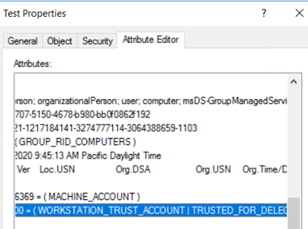

# Configuring Kerberos delegation for group Managed Service Accounts

Normally when working with Kerberos delegation, you just set the Service Principal Name (SPN) either with setspn.exe command or manually with the attribute editor in Active Directory Users and Computers. Additionally, enabling **View** > **Advanced features** in Active Directory Users and Computers adds another way to configure Kerberos delegation from the **Delegation** tab of a user or a computer account.

But for standalone and group Managed Service Accounts, the **Delegation** tab doesn't appear, even after adding SPNs to these accounts or enabling **View** > **Advanced features**.

To configure delegation for these special accounts, you need to set the correct attributes manually. 
There are two attributes that you need to modify for these accounts:

- userAccountControl defines the type of delegation
- msDS-AllowedToDelegateTo defines where the SPNs for delegation will be added
 
These attributes can be set in different ways:

- Use PowerShell
- Manually update the userAccountControl value

## Use PowerShell commands

The more secure and convenient way is by using PowerShell commands to update those attributes. You don't need to calculate final userAccountControl values when using PowerShell. Here are the commands to enable different types of delegation:

- **Do not trust this computer for delegation**
 
  ```powershell
  Set-ADAccountControl -Identity TestgMSA$ -TrustedForDelegation $false -TrustedToAuthForDelegation $false
  Set-ADServiceAccount -Identity TestgMSA$ -Clear 'msDS-AllowedToDelegateTo'
  ```

- **Unconstrained Delegation/Trust This Computer for Delegation to any service**

  ```powershell
  Set-ADAccountControl -Identity TestgMSA$ -TrustedForDelegation $true -TrustedToAuthForDelegation $false
  Set-ADServiceAccount -Identity TestgMSA$ -Clear 'msDS-AllowedToDelegateTo'
  ```

- **Kerberos Constrained Delegation/Trust this computer for delegation to specified services only (Use Kerberos Only)**

  ```powershell
  Set-ADAccountControl -Identity TestgMSA$ -TrustedForDelegation $false -TrustedToAuthForDelegation $false
  ```

  Update the Backend Service SPNs in msDS-AllowedToDelegateTo attribute.

- **Kerberos Constrained Delegation with Protocol Transition/Trust this computer for delegation to specified services only (Use Any Authentication Protocol)**

  ```powershell
  Set-ADAccountControl -Identity TestgMSA$ -TrustedForDelegation $false -TrustedToAuthForDelegation $true
  ```

  Update the Backend Service SPNs in msDS-AllowedToDelegateTo attribute.

## Manually update the userAccountControl value 

Some of the easiest ways to modify attributes are by enabling **View** > **Advanced features** in Active Directory Users and Computers or by using ADSIEdit.msc.

Here are the userAccountControl values that can be added for different types of delegation. Be careful while editing this attribute value and ensure only the TRUSTED_FOR_DELEGATION or TRUSTED_TO_AUTH_FOR_DELEGATION flags are added, and other properties are not changed. Also, ensure both the flags are not added together in the userAccountControl value on a Managed Service Account.

| Delegation Types | Property flag | Value in hexadecimal | Value in decimal |
|------------------|---------------|----------------------|------------------|
| Unconstrained Delegation/Trust This Computer for Delegation to any service | TRUSTED_FOR_DELEGATION | 0x80000 | 524288 |
| Kerberos Constrained Delegation/Trust this computer for delegation to specified services only (Use Kerberos Only) | No Change | No Change | No Change |
 Kerberos Constrained Delegation with Protocol Transition/Trust this computer for delegation to specified services only (Use Any Authentication Protocol) | TRUSTED_TO_AUTH_FOR_DELEGATION | 0x1000000 | 16777216 |

When you manually update the userAccountControl value, make sure the new value is added with the existing value but not replaced. 
For example, consider the current value of UAC is 4096 (Hex 0x1000) which is WORKSTATION_TRUST_ACCOUNT.


To enable **Unconstrained delegation (Not secure)**, you must add the userAccountControl value for TRUSTED_FOR_DELEGATION plus the existing value. 
The UAC value should become 0x81000 (0x1000 + 0x80000) which means WORKSTATION_TRUST_ACCOUNT and TRUSTED_FOR_DELEGATION.



If you have added some SPNs by mistake or want to remove some SPNs from the delegation list of the account, you can manually edit the attribute **msDS-AllowedToDelegateTo** of the account. This method is applicable for any user or computer account.


## Next step

- [Group Managed Service Accounts Overview](group-managed-service-accounts-overview.md)
- [Getting started with group Managed Service Accounts](getting-started-with-group-managed-service-accounts.md)


