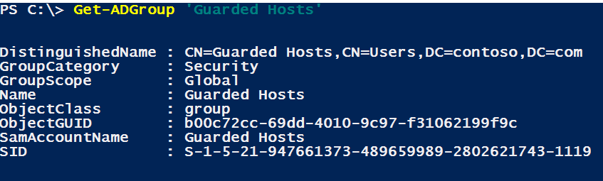

# Create a security group for guarded hosts and register the group with HGS

>Applies to: Windows Server (Semi-Annual Channel), Windows Server 2016

>[!IMPORTANT]
>AD mode is deprecated beginning with Windows Server 2019. For environments where TPM attestation is not possible, configure [host key attestation](guarded-fabric-initialize-hgs-key-mode.md). Host key attestation provides similar assurance to AD mode and is simpler to set up. 


This topic describes the intermediate steps to prepare Hyper-V hosts to become guarded hosts using Admin-trusted attestation (AD mode). Before taking these steps, complete the steps in [Configuring the fabric DNS for hosts that will become guarded hosts](guarded-fabric-configuring-fabric-dns-ad.md).


## Create a security group and add hosts

1. Create a new **GLOBAL** security group in the fabric domain and add Hyper-V hosts that will run shielded VMs. Restart the hosts to update their group membership.

2. Use Get-ADGroup to obtain the security identifier (SID) of the security group and provide it to the HGS administrator. 

    ```powershell
    Get-ADGroup "Guarded Hosts"
    ```

    

## Register the SID of the security group with HGS  

1. On an HGS server, run the following command to register the security group with HGS. 
   Re-run the command if necessary for additional groups. 
   Provide a friendly name for the group. 
   It does not need to match the Active Directory security group name. 

   ```powershell
   Add-HgsAttestationHostGroup -Name "<GuardedHostGroup>" -Identifier "<SID>"
   ```

2. To verify the group was added, run [Get-HgsAttestationHostGroup](https://technet.microsoft.com/library/mt652172.aspx). 

## Next step

> [!div class="nextstepaction"]
> [Confirm attestation](guarded-fabric-confirm-hosts-can-attest-successfully.md)


## See also

- [Deploying the Host Guardian Service for guarded hosts and shielded VMs](guarded-fabric-deploying-hgs-overview.md)
