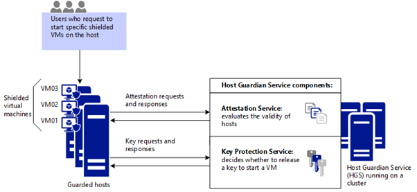
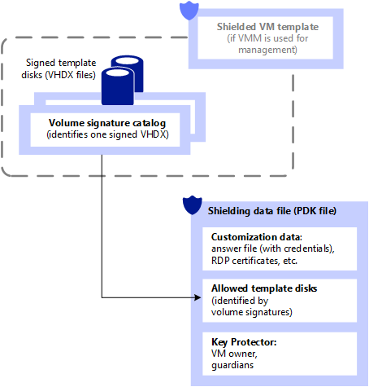
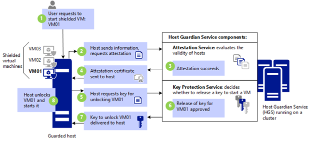

# Guarded fabric and shielded VMs overview

>Applies to: Windows Server 2019, Windows Server (Semi-Annual Channel), Windows Server 2016

## Overview of the guarded fabric

Virtualization security is a major investment area in Hyper-V. In addition to protecting hosts or other virtual machines from a virtual machine running malicious software, we also need to protect virtual machines from a compromised host. This is a fundamental danger for every virtualization platform today, whether it's Hyper-V, VMware or any other. Quite simply, if a virtual machine gets out of an organization (either maliciously or accidentally), that virtual machine can be run on any other system. Protecting high value assets in your organization, such as domain controllers, sensitive file servers, and HR systems, is a top priority.

To help protect against compromised virtualization fabric, Windows Server 2016 Hyper-V introduced shielded VMs. A shielded VM is a generation 2 VM (supported on Windows Server 2012 and later) that has a virtual TPM, is encrypted using BitLocker, and can run only on healthy and approved hosts in the fabric. Shielded VMs and guarded fabric enable cloud service providers or enterprise private cloud administrators to provide a more secure environment for tenant VMs. 

A guarded fabric consists of:

- 1 Host Guardian Service (HGS) (typically, a cluster of 3 nodes)
- 1 or more guarded hosts
- A set of shielded virtual machines. The diagram below shows how the Host Guardian Service uses attestation to ensure that only known, valid hosts can start the shielded VMs, and key protection to securely release the keys for shielded VMs.

When a tenant creates shielded VMs that run on a guarded fabric, the Hyper-V hosts and the shielded VMs themselves are protected by the HGS. The HGS provides two distinct services: attestation and key protection. The Attestation service ensures only trusted Hyper-V hosts can run shielded VMs while the Key Protection Service provides the keys necessary to power them on and to live migrate them to other guarded hosts.

## Video: Introduction to shielded virtual machines 

<iframe src="https://channel9.msdn.com/Shows/Mechanics/Introduction-to-Shielded-Virtual-Machines-in-Windows-Server-2016/player" width="650" height="440" allowFullScreen frameBorder="0"></iframe>

## Attestation modes in the Guarded Fabric solution

The HGS supports different attestation modes for a guarded fabric:

- TPM-trusted attestation (hardware-based)
- Host key attestation (based on asymmetric key pairs)

TPM-trusted attestation is recommended because it offers stronger assurances, as explained in the following table, but it requires that your Hyper-V hosts have TPM 2.0. If you currently do not have TPM 2.0 or any TPM, you can use host key attestation. If you decide to move to TPM-trusted attestation when you acquire new hardware, you can switch the attestation mode on the Host Guardian Service with little or no interruption to your fabric.

| **Attestation mode you choose for hosts**                                            | **Host assurances** |
|-------------------------------------|------------------------------------------------------------------------------------------------------------------------------------------------------------------------------------------------------------------------|
|**TPM-trusted attestation:** Offers the strongest possible protections but also requires more configuration steps. Host hardware and firmware must include TPM 2.0 and UEFI 2.3.1 with Secure Boot enabled. | Guarded hosts are approved based on their TPM identity, Measured Boot sequence, and code integrity policies to ensure they only run approved code.| 
| **Host key attestation:** Intended to support existing host hardware where TPM 2.0 is not available. Requires fewer configuration steps and is compatible with commonplace server hardware. | Guarded hosts are approved based on possession of the key. | 

Another mode named **Admin-trusted attestation** is deprecated beginning with Windows Server 2019. This mode was based on guarded host membership in a designated Active Directory Domain Services (AD DS) security group. Host key attestation provide similar host identification and is easier to set up. 

## Assurances provided by the Host Guardian Service

HGS, together with the methods for creating shielded VMs, help provide the following assurances.

| **Type of assurance for VMs**                         | **Shielded VM assurances, from Key Protection Service and from creation methods for shielded VMs** |
|----------------------------|--------------------------------------------------|
| **BitLocker encrypted disks (OS disks and data disks)**   | Shielded VMs use BitLocker to protect their disks. The BitLocker keys needed to boot the VM and decrypt the disks are protected by the shielded VM's virtual TPM using industry-proven technologies such as secure measured boot. While shielded VMs only automatically encrypt and protect the operating system disk, you can [encrypt data drives](https://technet.microsoft.com/itpro/windows/keep-secure/bitlocker-overview) attached to the shielded VM as well. |
| **Deployment of new shielded VMs from "trusted" template disks/images** | When deploying new shielded VMs, tenants are able to specify which template disks they trust. Shielded template disks have signatures that are computed at a point in time when their content is deemed trustworthy. The disk signatures are then stored in a signature catalog, which tenants securely provide to the fabric when creating shielded VMs. During provisioning of shielded VMs, the signature of the disk is computed again and compared to the trusted signatures in the catalog. If the signatures match, the shielded VM is deployed. If the signatures do not match, the shielded template disk is deemed untrustworthy and deployment fails. |
| **Protection of passwords and other secrets when a shielded VM is created** | When creating VMs, it is necessary to ensure that VM secrets, such as the trusted disk signatures, RDP certificates, and the password of the VM's local Administrator account, are not divulged to the fabric. These secrets are stored in an encrypted file called a shielding data file (a .PDK file), which is protected by tenant keys and uploaded to the fabric by the tenant. When a shielded VM is created, the tenant selects the shielding data to use which securely provides these secrets only to the trusted components within the guarded fabric. |
| **Tenant control of where the VM can be started** | Shielding data also contains a list of the guarded fabrics on which a particular shielded VM is permitted to run. This is useful, for example, in cases where a shielded VM typically resides in an on-premises private cloud but may need to be migrated to another (public or private) cloud for disaster recovery purposes. The target cloud or fabric must support shielded VMs and the shielded VM must permit that fabric to run it. |

## What is shielding data and why is it necessary?

A shielding data file (also called a provisioning data file or PDK file) is an encrypted file that a tenant or VM owner creates to protect important VM configuration information, such as the administrator password, RDP and other identity-related certificates, domain-join credentials, and so on. A fabric administrator uses the shielding data file when creating a shielded VM, but is unable to view or use the information contained in the file.

Among others, a shielding data files contain secrets such as:

- Administrator credentials
- An answer file (unattend.xml)
- A security policy that determines whether VMs created using this shielding data are configured as shielded or encryption supported
    - Remember, VMs configured as shielded are protected from fabric admins whereas encryption supported VMs are not
- An RDP certificate to secure remote desktop communication with the VM
- A volume signature catalog that contains a list of trusted, signed template-disk signatures that a new VM is allowed to be created from
- A Key Protector (or KP) that defines which guarded fabrics a shielded VM is authorized to run on

The shielding data file (PDK file) provides assurances that the VM will be created in the way the tenant intended. For example, when the tenant places an answer file (unattend.xml) in the shielding data file and delivers it to the hosting provider, the hosting provider cannot view or make changes to that answer file. Similarly, the hosting provider cannot substitute a different VHDX when creating the shielded VM, because the shielding data file contains the signatures of the trusted disks that shielded VMs can be created from.

The following figure shows the shielding data file and related configuration elements.

## What are the types of virtual machines that a guarded fabric can run?

Guarded fabrics are capable of running VMs in one of three possible ways:

1.	A normal VM offering no protections above and beyond previous versions of Hyper-V
2.	An encryption-supported VM whose protections can be configured by a fabric admin
3.	A shielded VM whose protections are all switched on and cannot be disabled by a fabric admin

Encryption-supported VMs are intended for use where the fabric administrators are fully trusted.  For example, an enterprise might deploy a guarded fabric in order to ensure VM disks are encrypted at-rest for compliance purposes. Fabric administrators can continue to use convenient management features, such VM console connections, PowerShell Direct, and other day-to-day management and troubleshooting tools.

Shielded VMs are intended for use in fabrics where the data and state of the VM must be protected from both fabric administrators and untrusted software that might be running on the Hyper-V hosts. For example, shielded VMs will never permit a VM console connection whereas a fabric administrator can turn this protection on or off for encryption supported VMs.

The following table summarizes the differences between encryption-supported and shielded VMs.

| Capability        | Generation 2 Encryption Supported     | Generation 2 Shielded         |
|----------|--------------------|----------------|
|Secure Boot        | Yes, required but configurable        | Yes, required and enforced    |
|Vtpm               | Yes, required but configurable        | Yes, required and enforced    |
|Encrypt VM state and live migration traffic | Yes, required but configurable |  Yes, required and enforced  |
|Integration components | Configurable by fabric admin      | Certain integration components blocked (e.g. data exchange, PowerShell Direct) |
|Virtual Machine Connection (Console), HID devices (e.g. keyboard, mouse) | On, cannot be disabled | Enabled on hosts beginning with Windows Server version 1803; Disabled on earlier hosts |
|COM/Serial ports   | Supported                             | Disabled (cannot be enabled) |
|Attach a debugger (to the VM process)1| Supported          | Disabled (cannot be enabled) |

1 Traditional debuggers that attach directly to a process, such as WinDbg.exe, are blocked for shielded VMs because the VM's worker process (VMWP.exe) is a protected process light (PPL). 
Alternative debugging techniques, such as those used by LiveKd.exe, are not blocked. 
Unlike shielded VMs, the worker process for encryption supported VMs does not run as a PPL so traditional debuggers like WinDbg.exe will continue to function normally. 

Both shielded VMs and encryption-supported VMs continue to support commonplace fabric management capabilities, such as Live Migration, Hyper-V replica, VM checkpoints, and so on.

## The Host Guardian Service in action: How a shielded VM is powered on

1. VM01 is powered on.

    Before a guarded host can power on a shielded VM, it must first be affirmatively attested that it is healthy. To prove it is healthy, it must present a certificate of health to the Key Protection service (KPS). The certificate of health is obtained through the attestation process.

2. Host requests attestation.

    The guarded host requests attestation. The mode of attestation is dictated by the Host Guardian Service:

    **TPM-trusted attestation**: Hyper-V host sends information that includes:

       - TPM-identifying information (its endorsement key)
       - Information about processes that were started during the most recent boot sequence (the TCG log)
       - Information about the Code Integrity (CI) policy that was applied on the host. 

       Attestation happens when the host starts and every 8 hours thereafter. If for some reason a host doesn't have an attestation certificate when a VM tries to start, this also triggers attestation.

    **Host key attestation**: Hyper-V host sends the public half of the key pair. HGS validates the host key is registered. 
    
    **Admin-trusted attestation**: Hyper-V host sends a Kerberos ticket, which identifies the security groups that the host is in. HGS validates that the host belongs to a security group that was configured earlier by the trusted HGS admin.

3. Attestation succeeds (or fails).

    The attestation mode determines which checks are needed to successfully attest the host is healthy. With TPM-trusted attestation, the host's TPM identity, boot measurements, and code integrity policy are validated. With host key attestation, only registration of the host key is validated. 

4. Attestation certificate sent to host.

    Assuming attestation was successful, a health certificate is sent to the host and the host is considered "guarded" (authorized to run shielded VMs). The host uses the health certificate to authorize the Key Protection Service to securely release the keys needed to work with shielded VMs

5. Host requests VM key.

    Guarded host do not have the keys needed to power on a shielded VM (VM01 in this case). To obtain the necessary keys, the guarded host must provide the following to KPS:

    - The current health certificate
    - An encrypted secret (a Key Protector or KP) that contains the keys necessary to power on VM01. The secret is encrypted using other keys that only KPS knows.

6. Release of key.

    KPS examines the health certificate to determine its validity. The certificate must not have expired and KPS must trust the attestation service that issued it.

7. Key is returned to host.

    If the health certificate is valid, KPS attempts to decrypt the secret and securely return the keys needed to power on the VM. Note that the keys are encrypted to the guarded host's VBS.

8. Host powers on VM01.

## Guarded fabric and shielded VM glossary

| Term              | Definition           |
|----------|------------|
| Host Guardian Service (HGS) | A Windows Server role that is installed on a secured cluster of bare-metal servers that is able to measure the health of a Hyper-V host and release keys to healthy Hyper-V hosts when powering-on or live migrating shielded VMs. These two capabilities are fundamental to a shielded VM solution and are referred to as the **Attestation service** and **Key Protection Service** respectively. |
| guarded host | A Hyper-V host on which shielded VMs can run. A host can only be considered _guarded_ when it has been deemed healthy by HGS' Attestation service. Shielded VMs cannot be powered-on or live migrated to a Hyper-V host that has not yet attested or that failed attestation. |
| guarded fabric    | This is the collective term used to describe a fabric of Hyper-V hosts and their Host Guardian Service that has the ability to manage and run shielded VMs. |
| shielded virtual machine (VM) | A virtual machine that can only run on guarded hosts and is protected from inspection, tampering and theft from malicious fabric admins and host malware. |
| fabric administrator | A public or private cloud administrator that can manage virtual machines. In the context of a guarded fabric, a fabric administrator does not have access to shielded VMs, or the policies that determine which hosts shielded VMs can run on. |
| HGS administrator | A trusted administrator in the public or private cloud that has the authority to manage the policies and cryptographic material for guarded hosts, that is, hosts on which a shielded VM can run.|
| provisioning data file or shielding data file (PDK file) | An encrypted file that a tenant or user creates to hold important VM configuration information and to protect that information from access by others. For example, a shielding data file can contain the password that will be assigned to the local Administrator account when the VM is created. |
| Virtualization-based Security (VBS) | A Hyper-V based processing and storage environment that is protected from administrators. Virtual Secure Mode provides the system with the ability to store operating system keys that are not visible to an operating system administrator.|
| virtual TPM | A virtualized version of a Trusted Platform Module (TPM). Beginning with Hyper-V in Windows Server 2016, you can provide a virtual TPM 2.0 device so that virtual machines can be encrypted, just as a physical TPM allows a physical machine to be encrypted.|

## See also

- [Guarded fabric and shielded VMs](guarded-fabric-and-shielded-vms-top-node.md)
- Blog: [Datacenter and Private Cloud Security Blog](https://blogs.technet.microsoft.com/datacentersecurity/)
- Video: [Introduction to Shielded Virtual Machines](https://channel9.msdn.com/Shows/Mechanics/Introduction-to-Shielded-Virtual-Machines-in-Windows-Server-2016)
- Video: [Dive into Shielded VMs with Windows Server 2016 Hyper-V](https://channel9.msdn.com/events/Ignite/2016/BRK3124)
