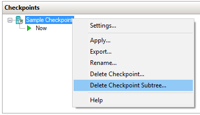

# Create a Linux shielded VM template disk

> Applies To: Windows Server 2019, Windows Server (Semi-Annual Channel), 

This topic explains how to prepare a template disk for Linux shielded VMs that can be used to instantiate one or more tenant VMs.

## Prerequisites

To prepare and test a Linux shielded VM, you will need the following resources available:

- A server with virtualization capababilities running Windows Server, version 1709 or later
- A second computer (Windows 10 or Windows Server 2016) capable of running Hyper-V Manager to connect to the running VM's console
- An ISO image for one of the supported Linux shielded VM OSes:
    - Ubuntu 16.04 LTS with the 4.4 kernel
    - Red Hat Enterprise Linux 7.3
    - SUSE Linux Enterprise Server 12 Service Pack 2
- Internet access to download the lsvmtools package and OS updates

> [!IMPORTANT]
> Newer versions of the preceding Linux OSes may include a known TPM driver bug which will prevent them from successfully provisioning as shielded VMs.
> It is not recommended that you update your templates or shielded VMs to a newer release until a fix is available.
> The list of supported OSes above will be updated when the updates are made public.

## Prepare a Linux VM

Shielded VMs are created from secure template disks.
Template disks contain the operating system for the VM and metadata, including a digital signature of the /boot and /root partitions, to ensure core OS components are not modified before deployment.

To create a template disk, you must first create a regular (unshielded) VM that you will prepare as the base image for future shielded VMs.
The software you install and configuration changes you make to this VM will apply to all shielded VMs created from this template disk.
These steps will walk you through the bare minimum requirements to get a Linux VM ready for templatization.

> [!NOTE]
> Linux disk encryption is configured when the disk is partitioned.
> This means that you must create a new VM that is pre-encrypted using dm-crypt to create a Linux shielded VM template disk.


1.  On the virtualization server, ensure that Hyper-V and the Host Guardian Hyper-V Support features are installed by running the following commands in an elevated PowerShell console:

    ```powershell
    Install-WindowsFeature Hyper-V, HostGuardian -IncludeManagementTools -Restart
    ```

2.  Download the ISO image from a trustworthy source and store it on your virtualization server, or on a file share accessible to your virtualization server.

3.  On your management computer running Windows Server version 1709, install the Shielded VM Remote Server Administration Tools by running the following command:

    ```powershell
    Install-WindowsFeature RSAT-Shielded-VM-Tools
    ```

4.  Open **Hyper-V Manager** on your management computer and connect to your virtualization server.
    You can do this by clicking "Connect to Server..." in the Actions pane or by right clicking on Hyper-V Manager and choosing "Connect to Server..."
    Provide the DNS name for your Hyper-V server and, if necessary, the credentials needed to connect to it.

5.  Using Hyper-V Manager, [configure an external switch](https://docs.microsoft.com/windows-server/virtualization/hyper-v/get-started/create-a-virtual-switch-for-hyper-v-virtual-machines) on your virtualization server so the Linux VM can access the Internet to obtain updates.

6.  Next, create a new virtual machine to install the Linux OS onto.
    In the Actions pane, click **New** > **Virtual Machine** to bring up the wizard.
    Provide a friendly name for your VM, such as "Pre-templatized Linux" and click **Next**.

7.  On the second page of the Wizard, select **Generation 2** to ensure the VM is provisioned with a UEFI-based firmware profile.

8.  Complete the rest of the wizard according to your preferences.
    Do not use a differencing disk for this VM; shielded VM template disks cannot use differencing disks.
    Lastly, connect the ISO image you downloaded earlier to the virtual DVD drive for this VM so that you can install the OS.

9.  In Hyper-V Manager, select your newly-created VM and click **Connect...** in the Actions pane to attach to a virtual console of the VM.
    In the window that appears, click **Start** to turn on the virtual machine.

10. Proceed through the setup process for your selected Linux distribution.
    While each Linux distribution uses a different setup wizard, the following requirements must be met for VMs that will become Linux shielded VM template disks:

    - The disk must be partitioned using the GUID Paritioning Table (GPT) layout
    - The root partition must be encrypted with dm-crypt. The passphrase should be set to **passphrase** (all lowercase). This passphrase will be randomized and the partition re-encrypted when a shielded VM is provisioned.
    - The boot partition must use the **ext2** file system

11. Once your Linux OS has fully booted and you have signed in, it is recommended that you install the linux-virtual kernel and associated Hyper-V integration services packages.
    Additionally, you will want to install an SSH server or other remote management tool to access the VM once it is shielded.

    On Ubuntu, run the following command to install these components:

    ```bash
    sudo apt-get install linux-virtual linux-tools-virtual linux-cloud-tools-virtual linux-image-extra-virtual openssh-server
    ```

    On RHEL, run the following command instead:

    ```bash
    sudo yum install hyperv-daemons openssh-server
    sudo service sshd start
    ```

    And on SLES, run the following command:

    ```bash
    sudo zypper install hyper-v
    sudo chkconfig hv_kvp_daemon on
    sudo systemctl enable sshd
    ```

12. Configure your Linux OS as desired.
    Any software you install, user accounts you add, and systemwide configuration changes you make will apply to all future VMs created from this template disk.
    You should avoid saving any secrets or unnecessary packages to the disk.

13. If you are planning to use System Center Virtual Machine Manager to deploy your VMs, install the VMM guest agent to enable VMM to specialize your OS during VM provisioning.
    Specialization allows each VM to be set up securely with different users and SSH keys, networking configurations, and custom setup steps.
    Learn how to [obtain and install the VMM guest agent](https://docs.microsoft.com/system-center/vmm/vm-linux#install-the-vmm-guest-agent) in the VMM documentation.

14. Next, [add the Microsoft Linux Software Repository to your package manager](../../administration/linux-package-repository-for-microsoft-software.md).

15. Using your package manager, install the lsvmtools package which contains the Linux shielded VM bootloader shim, provisioning components, and disk preparation tool.

    ```bash
    # Ubuntu 16.04
    sudo apt-get install lsvmtools

    # SLES 12 SP2
    sudo zypper install lsvmtools

    # RHEL 7.3
    sudo yum install lsvmtools
    ```

14. When you're done customizing the Linux OS, locate the lsvmprep installation program on your system and run it.
    
    ```bash
    # The path below may change based on the version of lsvmprep installed
    # Run "find /opt -name lsvmprep" to locate the lsvmprep executable
    sudo /opt/lsvmtools-1.0.0-x86-64/lsvmprep
    ```

15. Shut down your VM.

16. If you took any checkpoints of your VM (including automatic checkpoints created by Hyper-V with the Windows 10 Fall Creators Update), be sure to delete them before continuing.
    Checkpoints create differencing disks (.avhdx) that are not supported by the Template Disk Wizard.
    
    To delete checkpoints, open **Hyper-V Manager**, select your VM,  right click the topmost checkpoint in the Checkpoints pane, then click **Delete Checkpoint Subtree**.

    

## Protect the template disk

The VM you prepared in the previous section is almost ready to be used as a Linux shielded VM template disk.
The last step is to run the disk through the Template Disk Wizard, which will hash and digitally sign the current state of the root and boot partitions.
The hash and digital signature are verified when a shielded VM is provisioned to ensure that no unauthorized changes were made to the two partitions in between template creation and deployment.

### Obtain a certificate to sign the disk

In order to digitally sign the disk measurements, you will need to obtain a certificate on the computer where you will run the Template Disk Wizard.
The certificate must meet the following requirements:

Certificate Property | Required value
---------------------|---------------
Key Algorithm | RSA
Minimum key size | 2048 bits
Signature algorithm | SHA256 (Recommended)
Key Usage | Digital Signature

Details about this certificate will be shown to tenants when they create their shielding data files and are authorizing disks they trust.
Therefore, it is important to obtain this certificate from a certificate authority mutually trusted by you and your tenants.
In enterprise scenarios where you are both the hoster and tenant, you might consider issuing this certificate from your enterprise certificate authority.
Protect this certificate carefully, as anyone in possession of this certificate can create new template disks that are trusted the same as your authentic disk.

In a test lab environment, you can create a self-signed certificate with the following PowerShell command:

```powershell
New-SelfSignedCertificate -Subject "CN=Linux Shielded VM Template Disk Signing Certificate"
```

### Process the disk with the Template Disk Wizard cmdlet

Copy your template disk and certificate to a computer running Windows Server, version 1709, then run the following commands to initiate the signing process.
The VHDX you provide to the `-Path` parameter will be overwritten with the updated template disk, so be sure to make a copy before running the command.

> [!IMPORTANT]
> The Remote Server Administration Tools available on Windows Server 2016 or Windows 10 cannot be used to prepare a Linux shielded VM template disk.
> Only use the [Protect-TemplateDisk](https://docs.microsoft.com/powershell/module/shieldedvmtemplate/protect-templatedisk?view=win10-ps) cmdlet available on Windows Server, version 1709 or the Remote Server Administration Tools available on Windows Server 2019 to prepare a Linux shielded VM template disk.

```powershell
# Replace "THUMBPRINT" with the thumbprint of your template disk signing certificate in the line below
$certificate = Get-Item Cert:\LocalMachine\My\THUMBPRINT

Protect-TemplateDisk -Path 'C:\temp\MyLinuxTemplate.vhdx' -TemplateName 'Ubuntu 16.04' -Version 1.0.0.0 -Certificate $certificate -ProtectedTemplateTargetDiskType PreprocessedLinux
```

Your template disk is now ready to be used to provision Linux shielded VMs.
If you are using System Center Virtual Machine Manager to deploy your VM, you can now copy the VHDX to your VMM library.

You may also want to extract the volume signature catalog from the VHDX.
This file is used to provide information about the signing certificate, disk name, and version to VM owners who want to use your template.
They need to import this file into the Shielding Data File Wizard to authorize you, the template author in possession of the signing certificate, to create this and future template disks for them.

To extract the volume signature catalog, run the following command in PowerShell:

```powershell
Save-VolumeSignatureCatalog -TemplateDiskPath 'C:\temp\MyLinuxTemplate.vhdx' -VolumeSignatureCatalogPath 'C:\temp\MyLinuxTemplate.vsc'
```
