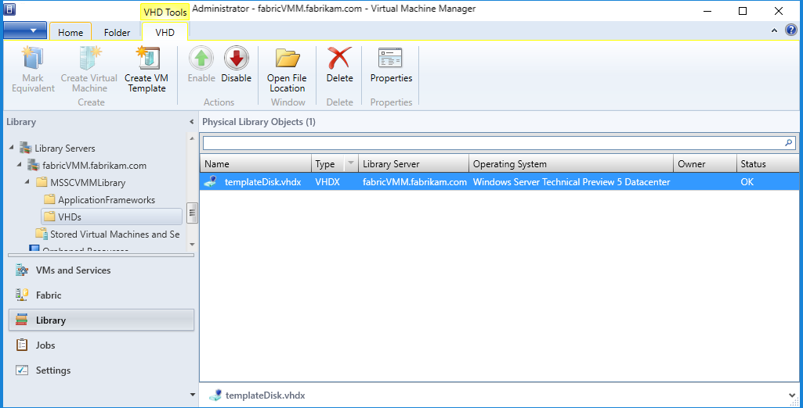

# Create a Windows shielded VM template disk

>Applies to: Windows Server (Semi-Annual Channel), Windows Server 2016, Windows Server 2019


As with regular VMs, you can create a VM template (for example, a [VM template in Virtual Machine Manager (VMM)](https://technet.microsoft.com/system-center-docs/vmm/manage/manage-library-add-vm-templates)) to make it easy for tenants and administrators to deploy new VMs on the fabric using a template disk. Because shielded VMs are security-sensitive assets, there are additional steps to create a VM template that supports shielding. This topic covers the steps to create a shielded template disk and a VM template in VMM.

To understand how this topic fits in the overall process of deploying shielded VMs, see [Hosting service provider configuration steps for guarded hosts and shielded VMs](guarded-fabric-configuration-scenarios-for-shielded-vms-overview.md).

## Prepare an operating system VHDX

First prepare an OS disk that you will then run through the Shielded Template Disk Creation Wizard. This disk will be used as the OS disk in your tenant's VMs. You can use any existing tooling to create this disk, such as Microsoft Desktop Image Service Manager (DISM), or manually set up a VM with a blank VHDX and install the OS onto that disk. When setting up the disk, it must adhere to the following requirements that are specific to generation 2 and/or shielded VMs: 

| Requirement for VHDX | Reason |
|-----------|----|
|Must be a GUID Partition Table (GPT) disk | Needed for generation 2 virtual machines to support UEFI|
|Disk type must be **Basic** as opposed to **Dynamic**. <br>Note: This refers to the logical disk type, not the "dynamically expanding" VHDX feature supported by Hyper-V. | BitLocker does NOT support dynamic disks.|
|The disk has at least two partitions. One partition must include the drive on which Windows is installed. This is the drive that BitLocker will encrypt. The other partition is the active partition, which contains the bootloader and remains unencrypted so that the computer can be started.|Needed for BitLocker|
|File system is NTFS | Needed for BitLocker|
|The operating system installed on the VHDX is one of the following:<br>- Windows Server 2019, Windows Server 2016, Windows Server 2012 R2, or Windows Server 2012 <br>- Windows 10, Windows 8.1, Windows 8| Needed to support generation 2 virtual machines and the Microsoft Secure Boot template|
|Operating system must be generalized (run sysprep.exe) | Template provisioning involves specializing VMs for a specific tenant's workload| 

> [!NOTE]
> If you use VMM, do not copy the template disk into the VMM library at this stage. 

## Run Windows Update on the template operating system

On the template disk, verify that the operating system has all of the latest Windows updates installed. Recently released updates improve the reliability of the end-to-end shielding process - a process that may fail to complete if the template operating system is not up-to-date.

## Prepare and protect the VHDX with the template disk wizard

To use a template disk with shielded VMs, the disk must be prepared and encrypted with BitLocker by using the Shielded Template Disk Creation Wizard. This wizard will generate a hash for the disk and add it to a volume signature catalog (VSC). The VSC is signed using a certificate you specify and is used during the provisioning process to ensure the disk being deployed for a tenant has not been altered or replaced with a disk the tenant does not trust. Finally, BitLocker is installed on the disk's operating system (if it is not already there) to prepare the disk for encryption during VM provisioning.

> [!NOTE]
> The template disk wizard will modify the template disk you specify in-place. You may want to make a copy of the unprotected VHDX before running the wizard to make updates to the disk at a later time. You will not be able to modify a disk that has been protected with the template disk wizard.

Perform the following steps on a computer running Windows Server 2016, Windows 10 (with Remote Server Management Tools, RSAT installed) or later (does not need to be a guarded host or a VMM server):

1. Copy the generalized VHDX created in [Prepare an operating system VHDX](#prepare-an-operating-system-vhdx) to the server, if it is not already there.

2. To administer the server locally, install the **Shielded VM Tools** feature from **Remote Server Administration Tools** on the server.

        Install-WindowsFeature RSAT-Shielded-VM-Tools -Restart
        
    You can also administer the server from a client computer on which you have installed the [Windows 10 Remote Server Administration Tools](https://www.microsoft.com/download/details.aspx?id=45520).

3. Obtain or create a certificate to sign the VSC for the VHDX that will become the template disk for new shielded VMs. Details about this certificate will be shown to tenants when they create their shielding data files and are authorizing disks they trust. Therefore, it is important to obtain this certificate from a certificate authority mutually trusted by you and your tenants. In enterprise scenarios where you are both the hoster and tenant, you might consider issuing this certificate from your PKI.

    If you are setting up a test environment and just want to use a self-signed certificate to prepare your template disk, run a command similar to the following:

        New-SelfSignedCertificate -DnsName publisher.fabrikam.com

4. Start the **Template Disk Wizard** from the **Administrative Tools** folder on the Start menu or by typing **TemplateDiskWizard.exe** into a command prompt.

5. On the **Certificate** page, click **Browse** to display a list of certificates. Select the certificate with which to prepare the disk template. Click **OK** and then click **Next**.

6. On the Virtual Disk page, click **Browse** to select the VHDX that you have prepared, then click **Next**.

7. On the Signature Catalog page, provide a friendly **disk name** and **version.** These fields are present to help you identify the disk once it has been prepared.

    For example, for **disk name** you could type _WS2016_ and for **Version**, _1.0.0.0_

8. Review your selections on the Review Settings page of the wizard. When you click **Generate**, the wizard will enable BitLocker on the template disk, compute the hash of the disk, and create the Volume Signature Catalog, which is stored in the VHDX metadata.

    Wait until the prep process has finished before attempting to mount or move the template disk. This process may take a while to complete, depending on the size of your disk.

    > [!IMPORTANT]
    > Template disks can only be used with the secure shielded VM provisioning process.
    > Attempting to boot a regular (unshielded) VM using a template disk will likely result in a stop error (blue screen) and is unsupported.

9. On the **Summary** page, information about the disk template, the certificate used to sign the VSC, and the certificate issuer is shown. Click **Close** to exit the wizard.

If you use VMM, follow the steps in the remaining sections in this topic to incorporate a template disk into a shielded VM template in VMM. 

## Copy the template disk to the VMM Library

If you use VMM, after you create a template disk, you need to copy it to a VMM library share so hosts can download and use the disk when provisioning new VMs. Use the following procedure to copy the template disk into the VMM library and then refresh the library.

1. Copy the VHDX file to the VMM library share folder. If you used the default VMM configuration, copy the template disk to _\\<vmmserver>\MSSCVMMLibrary\VHDs_.

2. Refresh the library server. Open the **Library** workspace, expand **Library Servers**, right-click on the library server that you want to refresh, and click **Refresh**.

3. Next, provide VMM with information about the operating system installed on the template disk:

    a. Find your newly imported template disk on your library server in the **Library** workspace.

    b. Right-click the disk and then click **Properties**.

    c. For **operating system**, expand the list and select the operating system installed on the disk. Selecting an operating system indicates to VMM that the VHDX is not blank.

    d. When you have updated the properties, click **OK**.

The small shield icon next to the disk's name denotes the disk as a prepared template disk for shielded VMs. You can also right click the column headers and toggle the **Shielded** column to see a textual representation indicating whether a disk is intended for regular or shielded VM deployments.



## Create the shielded VM template in VMM using the prepared template disk

With a prepared template disk in your VMM library, you are ready to create a VM template for shielded VMs. VM templates for shielded VMs differ slightly from traditional VM templates in that certain settings are fixed (generation 2 VM, UEFI and Secure Boot enabled, and so on) and others are unavailable (tenant customization is limited to a few, select properties of the VM). To create the VM template, perform the following steps:

1. In the **Library** workspace, click **Create VM Template** on the home tab at the top.

2. On the **Select Source** page, click **Use an existing VM template or a virtual hard disk stored in the library**, and then click **Browse**.

3. In the window that appears, select a prepared template disk from the VMM library. To more easily identify which disks are prepared, right-click a column header and enable the **Shielded** column. Click **OK** then **Next**.

4. Specify a VM template name and optionally a description, and then click **Next**.

5. On the **Configure Hardware** page, specify the capabilities of VMs created from this template. Ensure that at least one NIC is available and configured on the VM template. The only way for a tenant to connect to a shielded VM is through Remote Desktop Connection, Windows Remote Management, or other pre-configured remote management tools that work over networking protocols.

    If you choose to leverage static IP pools in VMM instead of running a DHCP server on the tenant network, you will need to alert your tenants to this configuration. When a tenant supplies their shielding data file, which contains the unattend file for the VMM, they will need to provide special placeholder values for the static IP pool information. For more information about VMM placeholders in tenant unattend files, see [Create an answer file](guarded-fabric-tenant-creates-shielding-data.md#create-an-answer-file). 

6. On the **Configure Operating System** page, VMM will only show a few options for shielded VMs, including the product key, time zone, and computer name. Some secure information, such as the administrator password and domain name, is specified by the tenant through a shielding data file (.PDK file). 

    > [!NOTE]
    > If you choose to specify a product key on this page, ensure it is valid for the operating system on the template disk. If an incorrect product key is used, the VM creation will fail.

After the template is created, tenants can use it to create new virtual machines. You will need to verify that the VM template is one of the resources available to the Tenant Administrator user role (in VMM, user roles are in the **Settings** workspace).

## Prepare and protect the VHDX using PowerShell

As an alternative to running the Template Disk Wizard, you can copy your template disk and certificate to a computer running RSAT and run [Protect-TemplateDisk](https://docs.microsoft.com/powershell/module/shieldedvmtemplate/protect-templatedisk?view=win10-ps
) to initiate the signing process.
The following example uses the name and version information specified by the _TemplateName_ and _Version_ parameters.
The VHDX you provide to the `-Path` parameter will be overwritten with the updated template disk, so be sure to make a copy before running the command.

```powershell
# Replace "THUMBPRINT" with the thumbprint of your template disk signing certificate in the line below
$certificate = Get-Item Cert:\LocalMachine\My\THUMBPRINT

Protect-TemplateDisk -Certificate $certificate -Path "WindowsServer2019-ShieldedTemplate.vhdx" -TemplateName "Windows Server 2019" -Version 1.0.0.0
```

Your template disk is now ready to be used to provision shielded VMs.
If you are using System Center Virtual Machine Manager to deploy your VM, you can now copy the VHDX to your VMM library.

You may also want to extract the volume signature catalog from the VHDX.
This file is used to provide information about the signing certificate, disk name, and version to VM owners who want to use your template.
They need to import this file into the Shielding Data File Wizard to authorize you, the template author in possession of the signing certificate, to create this and future template disks for them.

To extract the volume signature catalog, run the following command in PowerShell:

```powershell
Save-VolumeSignatureCatalog -TemplateDiskPath 'C:\temp\MyLinuxTemplate.vhdx' -VolumeSignatureCatalogPath 'C:\temp\MyLinuxTemplate.vsc'
```


## Next step

> [!div class="nextstepaction"]
> [Create a shielding data file](guarded-fabric-tenant-creates-shielding-data.md)

## See also

- [Hosting service provider configuration steps for guarded hosts and shielded VMs](guarded-fabric-configuration-scenarios-for-shielded-vms-overview.md)
- [Guarded fabric and shielded VMs](guarded-fabric-and-shielded-vms-top-node.md)
