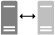

# Deploying the Host Guardian Service

>Applies to: Windows Server 2022, Windows Server 2019, Windows Server 2016

One of the most important goals of providing a hosted environment is to guarantee the security of the virtual machines running in the environment. As a cloud service provider or enterprise private cloud administrator, you can use a guarded fabric to provide a more secure environment for VMs. A guarded fabric consists of one Host Guardian Service (HGS) - typically, a cluster of three nodes - plus one or more guarded hosts, and a set of shielded virtual machines (VMs).

## Video: Deploying a guarded fabric

> [!VIDEO https://www.microsoft.com/videoplayer/embed/dcd8e99f-36f1-4bc8-b3d2-9576da38d9f1?autoplay=false]

## Deployment tasks for guarded fabrics and shielded VMs

The following table breaks down the tasks to deploy a guarded fabric and create shielded VMs according to different administrator roles. Note that when the HGS admin configures HGS with authorized Hyper-V hosts, a fabric admin will collect and provide identifying information about the hosts at the same time.

| Step and link to content | Image |
|--|--|--|
| 1 - [Verify HGS prerequisites](guarded-fabric-prepare-for-hgs.md) |  |
| 2 - [Configure first HGS node](guarded-fabric-choose-where-to-install-hgs.md) |  |
| 3 - [Configure additional HGS nodes](guarded-fabric-configure-additional-hgs-nodes.md) |  |
| 4 - [Configure fabric DNS](guarded-fabric-configuring-fabric-dns.md) |  |
| 5 - [Verify host prerequisites (Key)](guarded-fabric-guarded-host-prerequisites.md#host-key-attestation) and [Verify host prerequisites (TPM)](guarded-fabric-guarded-host-prerequisites.md#tpm-trusted-attestation) |  |
| 6 - [Create host key (Key)](guarded-fabric-create-host-key.md) and[Collect host information (TPM)](guarded-fabric-tpm-trusted-attestation-capturing-hardware.md) |  |
| 7 - [Configure HGS with host information](guarded-fabric-add-host-information-to-hgs.md) |  |
| 8 -  [Confirm hosts can attest](guarded-fabric-confirm-hosts-can-attest-successfully.md) |  |
| 9 - [Configure VMM (optional)](/system-center/vmm/deploy-guarded-host-fabric) |  |
| 10 - [Create template disks](guarded-fabric-create-a-shielded-vm-template.md) |  |
| 11 - [Create a VM shielding helper disk for VMM (optional)](guarded-fabric-vm-shielding-helper-vhd.md) |  |
| 12 - [Set up Windows Azure Pack (optional)](guarded-fabric-shielded-vm-windows-azure-pack.md) |  |
| 13 - [Create shielding data file](guarded-fabric-tenant-creates-shielding-data.md) |  |
| 14 - [Create shielded VMs using Windows Azure Pack](guarded-fabric-shielded-vm-windows-azure-pack.md) |  |
| 15 - [Create shielded VMs using VMM](/system-center/vmm/guarded-deploy-vm) |  |

## Additional References

- [Guarded fabric and shielded VMs](guarded-fabric-and-shielded-vms-top-node.md)
