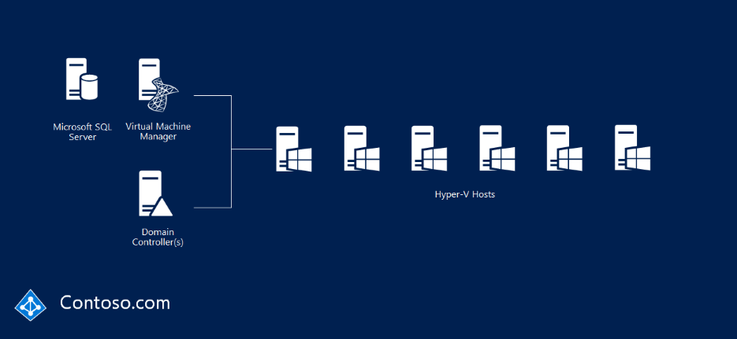
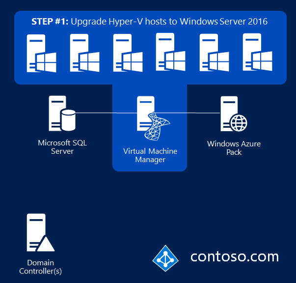
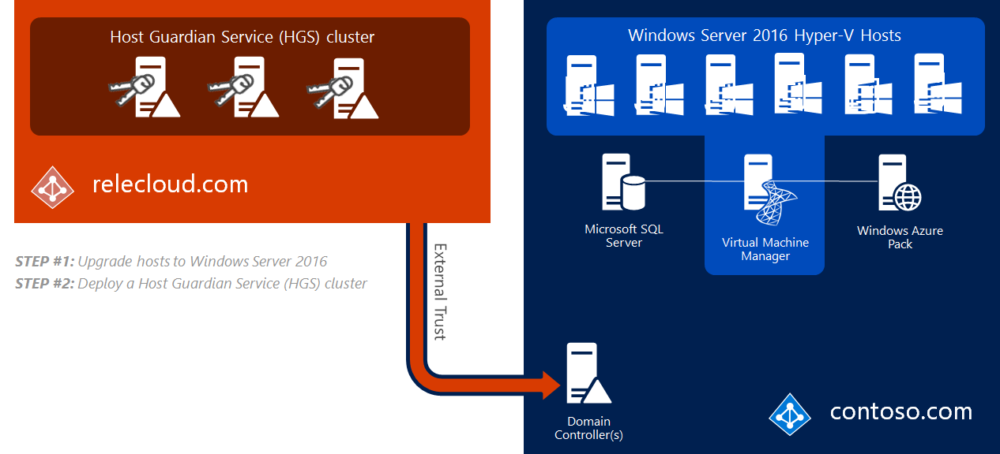
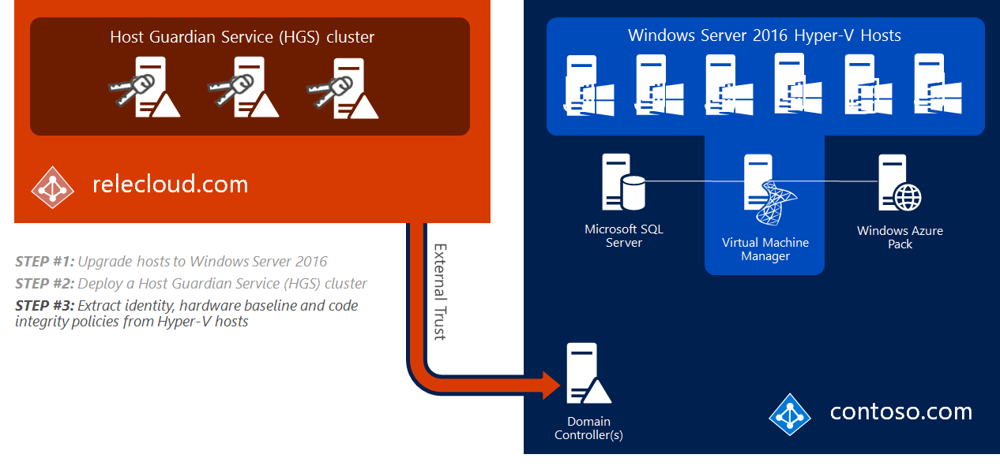
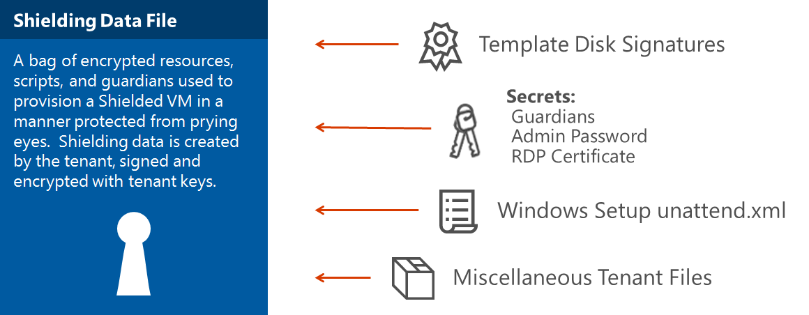
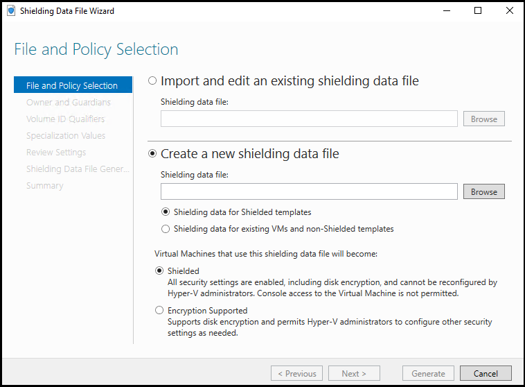
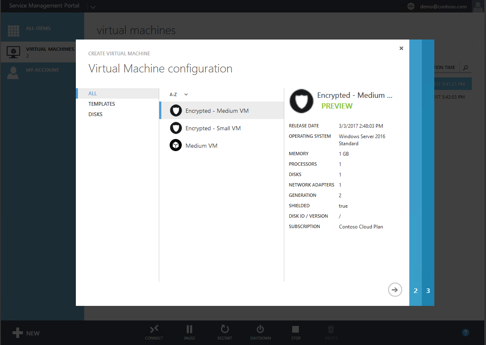

# Quick start for guarded fabric deployment

>Applies to: Windows Server (Semi-Annual Channel), Windows Server 2016

This topic explains what a guarded fabric is, its requirements, and a summary of the deployment process. 
For detailed deployment steps, see [Deploying the Host Guardian Service for guarded hosts and shielded VMs](https://technet.microsoft.com/windows-server-docs/security/guarded-fabric-shielded-vm/guarded-fabric-deploying-hgs-overview).

Prefer video? See the Microsoft Virtual Academy course [Deploying Shielded VMs and a Guarded Fabric with Windows Server 2016](https://mva.microsoft.com/training-courses/deploying-shielded-vms-and-a-guarded-fabric-with-windows-server-2016-17131?l=WFLef7vUD_4604300474).

## What is a guarded fabric

A _guarded fabric_ is a Windows Server 2016 Hyper-V fabric capable of protecting tenant workloads against inspection, theft, and tampering from malware running on the host, as well as from system administrators. 
These virtualized tenant workloads—protected both at rest and in-flight—are called _shielded VMs_. 

## What are the requirements for a guarded fabric

The requirements for a guarded fabric include:

- **A place to run shielded VMs that is free from malicious software.**

    These are called _guarded hosts_. 
    Guarded hosts are Windows Server 2016 Datacenter edition Hyper-V hosts that can run shielded VMs only if they can prove they are running in a known, trusted state to an external authority called the Host Guardian Service (HGS). 
    The HGS is a new server role in Windows Server 2016, and is typically deployed as a three-node cluster. 

- **A way to verify a host is in a healthy state.**

    The HGS performs _attestation_, where it measures the health of guarded hosts.

- **A process to securely release keys to healthy hosts.**

    The HGS performs _key protection and key release_, where it releases the keys back to healthy hosts.

- **Management tools to automate the secure provisioning and hosting of shielded VMs.**

    Optionally, you can add these management tools to a guarded fabric:

    - System Center 2016 Virtual Machine Manager (VMM). VMM is recommended because it provides additional management tooling beyond what you get from using just the PowerShell cmdlets that come with Hyper-V and the guarded fabric workloads).
    - System Center 2016 Service Provider Foundation (SPF). This is an API layer between Windows Azure Pack and VMM, and a prerequisite for using Windows Azure Pack.
    - Windows Azure Pack provides a good graphical web interface to manage a guarded fabric and shielded VMs. 

In practice, one decision must be made up front: the [mode of attestation](guarded-fabric-and-shielded-vms.md#attestation-modes-in-the-guarded-fabric-solution) used by the guarded fabric. 
There are two means—two mutually exclusive modes—by which HGS can measure that a Hyper-V host is healthy. 
When you initialize HGS, you need to choose the mode:  

- Host key attestation, or key mode, is less secure but easier to adopt  
- TPM-based attestation, or TPM mode, is more secure but requires more configuration and specific hardware

If necessary, you can deploy in key mode using existing Hyper-V hosts that have been upgraded to Windows Server 2019 Datacenter edition, and then convert to the more secure TPM mode when supporting server hardware (including TPM 2.0) is available. 

Now that you know what the pieces are, let's walk through an example of the deployment model.

## How to get from a current Hyper-V fabric to a guarded fabric

Let's imagine this scenario—you have an existing Hyper-V fabric, like Contoso.com in the following picture, and you want to build a Windows Server 2016 guarded fabric.



## Step 1: Deploy the Hyper-V hosts running Windows Server 2016 

The Hyper-V hosts need to run Windows Server 2016 Datacenter edition or later. If you are upgrading hosts, you can [upgrade](https://technet.microsoft.com/windowsserver/dn527667.aspx) from Standard edition to Datacenter edition.



## Step 2: Deploy the Host Guardian Service (HGS)

Then install the HGS server role and deploy it as a three-node cluster, like the relecloud.com example in the following picture. 
This requires three PowerShell cmdlets:

- To add the HGS role, use `Install-WindowsFeature` 
- To install the HGS, use `Install-HgsServer` 
- To initialize the HGS with your chosen mode of attestation, use `Initialize-HgsServer` 

If your existing Hyper-V servers don't meet the prerequisites for TPM mode (for example, they do not have TPM 2.0), you can initialize HGS using Admin-based attestation (AD mode), which requires an Active Directory trust with the fabric domain. 

In our example, let's say Contoso initially deploys in AD mode in order to immediately meet compliance requirements, and plans to convert to the more secure TPM-based attestation after suitable server hardware can be purchased. 



## Step 3: Extract identities, hardware baselines, and code integrity policies

The process to extract identities from Hyper-V hosts depends on the attestation mode being used.

For AD mode, the ID of the host is its domain-joined computer account, which must be a member of a designated security group in the fabric domain.
Membership in the designated group is the only determination of whether the host is healthy or not. 

In this mode, the fabric admin is solely responsible for ensuring the health of the Hyper-V hosts. 
Since HGS plays no part in deciding what is or is not allowed to run, malware and debuggers will function as designed. 

However, debuggers that attempt to attach directly to a process (such as WinDbg.exe) are blocked for shielded VMs because the VM's worker process (VMWP.exe) is a protected process light (PPL).
Alternative debugging techniques, such as those used by LiveKd.exe, are not blocked. 
Unlike shielded VMs, the worker process for encryption supported VMs does not run as a PPL so traditional debuggers like WinDbg.exe will continue to function normally.

Stated another way, the rigorous validation steps used for TPM mode are not used for AD mode in any way.

For TPM mode, three things are required: 

1.	A _public endorsement key_ (or _EKpub_) from the TPM 2.0 on each and every Hyper-V host. To capture the EKpub, use `Get-PlatformIdentifier`. 
2.	A _hardware baseline_. If each of your Hyper-V hosts are identical, then a single baseline is all you need. If they are not, then you'll need one for each class of hardware. The baseline is in the form of a Trustworthy Computing Group logfile, or TCGlog. The TCGlog contains everything that the host did, from the UEFI firmware, through the kernel, right up to where the host is entirely booted. To capture the hardware baseline, install the Hyper-V role and the Host Guardian Hyper-V Support feature and use `Get-HgsAttestationBaselinePolicy`. 
3.	A _Code Integrity policy_. If each of your Hyper-V hosts are identical, then a single CI policy is all you need. If they are not, then you'll need one for each class of hardware. Windows Server 2016 and Windows 10 both have a new form of enforcement for CI policies, called _Hypervisor-enforced Code Integrity (HVCI)_. HVCI provides strong enforcement and ensures that a host is only allowed to run binaries that a trusted admin has allowed it to run. Those instructions are wrapped in a CI policy that is added to HGS. HGS measures each host's CI policy before they're permitted to run shielded VMs. To capture a CI policy, use `New-CIPolicy`. The policy must then be converted to its binary form using `ConvertFrom-CIPolicy`.



That's all—the guarded fabric is built, in terms of the infrastructure to run it.  
Now you can create a shielded VM template disk and a shielding data file so shielded VMs can be provisioned simply and securely. 

## Step 4: Create a template for shielded VMs

A shielded VM template protects template disks by creating a signature of the disk at a known trustworthy point in time. 
If the template disk is later infected by malware, its signature will differ original template which will be detected by the secure shielded VM provisioning process. 
Shielded template disks are created by running the **Shielded Template Disk Creation Wizard** or `Protect-TemplateDisk` against a regular template disk. 

Each is included with the **Shielded VM Tools** feature in the [Remote Server Administration Tools for Windows 10](https://www.microsoft.com/download/details.aspx?id=45520).
After you download RSAT, run this command to install the **Shielded VM Tools** feature:

```powershell
Install-WindowsFeature RSAT-Shielded-VM-Tools -Restart
```

A trustworthy administrator, such as the fabric administrator or the VM owner, will need a certificate (often provided by a Hosting Service Provider) to sign the VHDX template disk. 


The disk signature is computed over the OS partition of the virtual disk.
If anything changes on the OS partition, the signature will also change.
This allows users to strongly identify which disks they trust by specifying the appropriate signature.

Review the [template disk requirements](guarded-fabric-create-a-shielded-vm-template.md) before you get started. 

## Step 5: Create a shielding data file 

A shielding data file, also known as a .pdk file, captures sensitive information about the virtual machine, such as the Administrator password. 



The shielding data file also includes the security policy setting for the shielded VM. You must choose one of two security policies when you create a shielding data file:

- Shielded
   
    The most secure option, which eliminates many administrative attack vectors.

- Encryption supported

    A lesser level of protection that still provides the compliance benefits of being able to encrypt a VM, but allows Hyper-V admins to do things like use VM console connection and PowerShell Direct. 

    

You can add optional management pieces like VMM or Windows Azure Pack. If you'd like to create a VM without installing those pieces, see [Step by step – Creating Shielded VMs without VMM](https://blogs.technet.microsoft.com/datacentersecurity/2016/06/06/step-by-step-creating-shielded-vms-without-vmm/).

## Step 6: Create a shielded VM

Creating shielded virtual machines differs very little from regular virtual machines. 
In Windows Azure Pack, the experience is even easier than creating a regular VM because you only need to supply a name, shielding data file (containing the rest of the specialization information), and the VM network. 



## Next step

> [!div class="nextstepaction"]
> [HGS Prerequisites](guarded-fabric-prepare-for-hgs.md)
