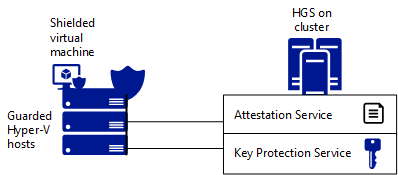

# Guarded Fabric and Shielded VM Planning Guide for Hosters

>Applies to: Windows Server 2019, Windows Server (Semi-Annual Channel), Windows Server 2016

This topic covers planning decisions that will need to be made to enable shielded virtual machines to run on your fabric. Whether you upgrade an existing Hyper-V fabric or create a new fabric, running shielded VMs consists of two main components:

- The Host Guardian Service (HGS) provides attestation and key protection so that you can make sure that shielded VMs will run only on approved and healthy Hyper-V hosts. 
- Approved and healthy Hyper-V hosts on which shielded VMs (and regular VMs) can run — these are known as guarded hosts.

## Decision #1: Trust level in the fabric

How you implement the Host Guardian Service and guarded Hyper-V hosts will depend mainly on the strength of trust that you are looking to achieve in your fabric. The strength of trust is governed by the attestation mode. There are two mutually-exclusive options:

1. TPM-trusted attestation

    If your goal is to help protect virtual machines from malicious admins or a compromised fabric, then you will use TPM-trusted attestation. This option works well for multi-tenant hosting scenarios as well as for high-value assets in enterprise environments, such as domain controllers or content servers like SQL or SharePoint.
    Hypervisor-protected code integrity (HVCI) policies are measured and their validity enforced by HGS before the host is permitted to run shielded VMs. 

2. Host key attestation

    If your requirements are primarily driven by compliance that requires virtual machines be encrypted both at rest as well as in-flight, then you will use host key attestation. This option works well for general purpose datacenters where you are comfortable with Hyper-V host and fabric administrators having access to the guest operating systems of virtual machines for day-to-day maintenance and operations. 

    In this mode, the fabric admin is solely responsible for ensuring the health of the Hyper-V hosts. 
    Since HGS plays no part in deciding what is or is not allowed to run, malware and debuggers will function as designed. 
    
    However, debuggers that attempt to attach directly to a process (such as WinDbg.exe) are blocked for shielded VMs because the VM’s worker process (VMWP.exe) is a protected process light (PPL). 
    Alternative debugging techniques, such as those used by LiveKd.exe, are not blocked. 
    Unlike shielded VMs, the worker process for encryption supported VMs does not run as a PPL so traditional debuggers like WinDbg.exe will continue to function normally.

    A similar attestation mode named Admin-trusted attestation (Active Directory-based) is deprecated beginning with Windows Server 2019. 

The trust level you choose will dictate the hardware requirements for your Hyper-V hosts as well as the policies that you apply on the fabric. If necessary, you can deploy your guarded fabric using existing hardware and admin-trusted attestation and then convert it to TPM-trusted attestation when the hardware has been upgraded and you need to strengthen fabric security.

## Decision #2: Existing Hyper-V fabric versus a new separate Hyper-V fabric

If you have an existing fabric (Hyper-V or otherwise), it is very likely that you can use it to run shielded VMs along with regular VMs. Some customers choose to integrate shielded VMs into their existing tools and fabrics while others separate the fabric for business reasons.

## HGS admin planning for the Host Guardian Service

Deploy the Host Guardian Service (HGS) in a highly secure environment, whether that be on a dedicated physical server, a shielded VM, a VM on an isolated Hyper-V host (separated from the fabric it's protecting), or one logically separated by using a different Azure subscription.   

| Area | Details |
|------|---------|
| Installation requirements | <ul><li>One server (three-node cluster recommended for high availability)</li><li>For fallback, at least two HGS servers are required</li><li>Servers can be either virtual or physical (physical server with TPM 2.0 recommended; TPM 1.2 also supported)</li><li>Server Core installation of Windows Server 2016 or later</li><li>Network line of sight to the fabric allowing HTTP or [fallback configuration](guarded-fabric-manage-branch-office.md#fallback-configuration)</li><li>HTTPS certificate recommended for access validation</li></ul> |
| Sizing | Each mid-size (8 core/4 GB) HGS server node can handle 1,000 Hyper-V hosts. |
| Management | Designate specific people who will manage HGS. They should be separate from fabric administrators. For comparison, HGS clusters can be thought of in the same manner as a Certificate Authority (CA) in terms of administrative isolation, physical deployment and overall level of security sensitivity. |
| Host Guardian Service Active Directory | By default, HGS installs its own internal Active Directory for management. This is a self-contained, self-managed forest and is the recommended configuration to help isolate HGS from your fabric.  If you already have a highly privileged Active Directory forest that you use for isolation, you can use that forest instead of the HGS default forest. It is important that HGS is not joined to a domain in the same forest as the Hyper-V hosts or your fabric management tools. Doing so could allow a fabric admin to gain control over HGS. |
| Disaster recovery | There are three options: <ol><li>Install a separate HGS cluster in each datacenter and authorize shielded VMs to run in both the primary and the backup datacenters. This avoids the need to stretch the cluster across a WAN and allows you to isolate virtual machines such that they run only in their designated site.</li><li>Install HGS on a stretch cluster between two (or more) datacenters. This provides resiliency if the WAN goes down, but pushes the limits of failover clustering. You cannot isolate workloads to one site; a VM authorized to run in one site can run on any other.</li><li>Register your Hyper-V host with another HGS as failover.</li></ol>You should also backup every HGS by exporting its configuration so that you can always recover locally. For more information, see [Export-HgsServerState](https://docs.microsoft.com/powershell/module/hgsserver/export-hgsserverstate) and [Import-HgsServerState](https://docs.microsoft.com/powershell/module/hgsserver/import-hgsserverstate). |
| Host Guardian Service keys | A Host Guardian Service uses two asymmetric key pairs — an encryption key and a signing key — each represented by an SSL certificate. There are two options to generate these keys: <ol><li>Internal certificate authority – you can generate these keys using your internal PKI infrastructure. This is suitable for a datacenter environment.</li><li>Publicly trusted certificate authorities – use a set of keys obtained from a publicly trusted certificate authority. This is the option that hosters should use.</li></ol>Note that while it is possible to use self-signed certificates, it is not recommended for deployment scenarios other than proof-of-concept labs.  In addition to having HGS keys, a hoster can use "bring your own key," where tenants can provide their own keys so that some (or all) tenants can have their own specific HGS key. This option is suitable for hosters that can provide an out-of-band process for tenants to upload their keys. |
| Host Guardian Service key storage | For the strongest possible security, we recommend that HGS keys are created and stored exclusively in a Hardware Security Module (HSM). If you are not using HSMs, applying BitLocker on the HGS servers is strongly recommended. |

## Fabric admin planning for guarded hosts

| Area | Details |
|------|---------|
| Hardware | <ul><li>Host key attestation: You can use any existing hardware as your guarded host. There are a few exceptions (to make sure that your host can use new security mechanisms beginning with Windows Server 2016, see [Compatible hardware with Windows Server 2016 Virtualization-based protection of Code Integrity](guarded-fabric-compatible-hardware-with-virtualization-based-protection-of-code-integrity.md).</li><li>TPM-trusted attestation: You can use any hardware that has the [Hardware Assurance Additional Qualification](https://msdn.microsoft.com/windows/hardware/commercialize/design/compatibility/systems#system-server-assurance) as long as it is configured appropriately (see [Server configurations that are compliant with Shielded VMs and Virtualization-based protection of code integrity](guarded-fabric-compatible-hardware-with-virtualization-based-protection-of-code-integrity.md) for the specific configuration). This includes TPM 2.0, and UEFI version 2.3.1c and above.</li></ul> |
| OS | We recommend using Server Core option for the Hyper-V host OS. |
| Performance implications | Based on performance testing, we anticipate a roughly 5% density-difference between running shielded VMs and non-shielded VMs. This means that if a given Hyper-V host can run 20 non-shielded VMs, we expect that it can run 19 shielded VMs.  Make sure to verify sizing with your typical workloads. For example, there might be some outliers with intensive write-oriented IO workloads that will further affect the density difference. |
| Branch office considerations | Beginning with Windows Server version 1709, you can specify a fallback URL for a virtualized HGS server running locally as a shielded VM in the branch office. The fallback URL can be used when the branch office loses connectivity to HGS servers in the datacenter. On previous versions of Windows Server, a Hyper-V host running in a branch office needs connectivity to the Host Guardian Service to power-on or to live migrate shielded VMs. For more information, see [Branch office considerations](guarded-fabric-manage-branch-office.md). |
