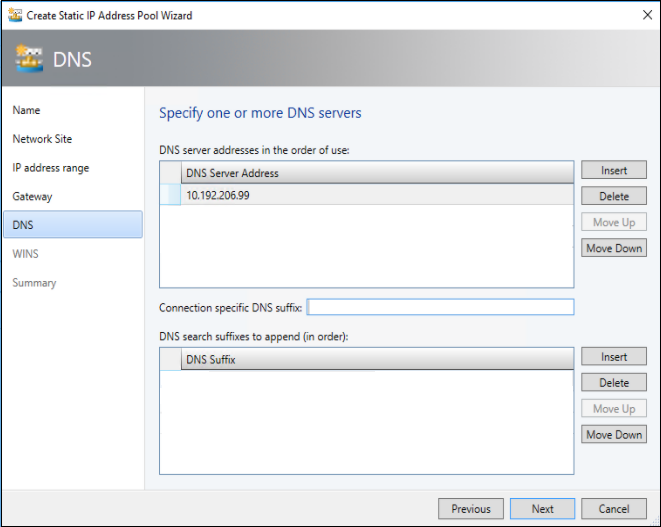
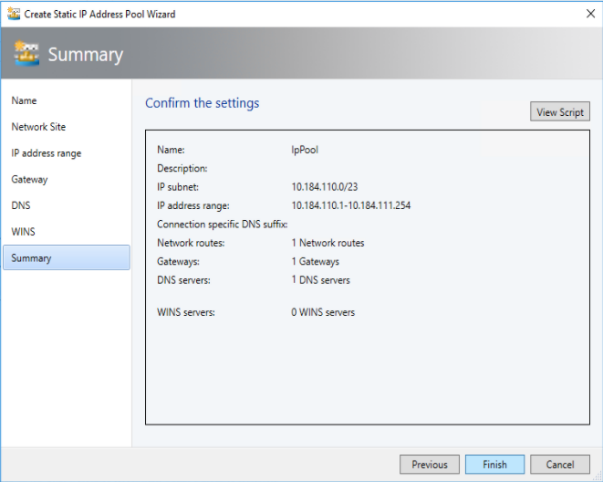
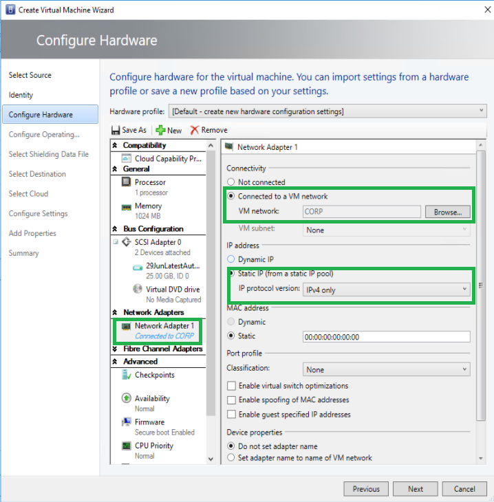

# Create OS specialization answer file

>Applies to: Windows Server 2019, Windows Server (Semi-Annual Channel), Windows Server 2016

In preparation to deploy shielded VMs, you may need to create an operating system specialization answer file. On Windows, this is commonly known as the "unattend.xml" file. The **New-ShieldingDataAnswerFile** Windows PowerShell function helps you do this. You can then use the answer file when you're creating shielded VMs from a template by using System Center Virtual Machine Manager (or any other fabric controller).

For general guidelines for Unattend files for shielded VMs, see [Create an answer file](guarded-fabric-tenant-creates-shielding-data.md#create-an-answer-file).
 
## Downloading the New-ShieldingDataAnswerFile function

You can obtain the **New-ShieldingDataAnswerFile** function from the [PowerShell Gallery](https://aka.ms/gftools). If your computer has Internet connectivity, you can install it from PowerShell with the following command:

```powershell
Install-Module GuardedFabricTools -Repository PSGallery -MinimumVersion 1.0.0
```

The `unattend.xml` output can be packaged into the shielding data, along with additional artifacts, so that it can be used to create shielded VMs from templates.

The following sections show how you can use the function parameters for an `unattend.xml` file containing various options:

- [Basic Windows Answer File](#basic-windows-answer-file)
- [Windows answer file with domain join](#windows-answer-file-with-domain-join)
- [Windows answer file with static IPv4 addresses](#windows-answer-file-with-static-ipv4-addresses)
- [Windows answer file with a custom locale](#windows-answer-file-with-a-custom-locale)
- [Basic Linux answer file](#basic-linux-answer-file)

## Basic Windows answer file

The following commands create a Windows answer file that simply sets the administrator account password and hostname.
The VM network adapters will use DHCP to obtain IP addresses, and the VM will not be joined to an Active Directory domain.
When prompted to enter an administrator credential, specify the desired username and password.
Use "Administrator" for the username if you wish to configure the built-in Administrator account.

```powershell
$adminCred = Get-Credential -Message "Local administrator account"

New-ShieldingDataAnswerFile -Path '.\ShieldedVMAnswerFile.xml' -AdminCredentials $adminCred
```

## Windows answer file with domain join

The following commands create a Windows answer file that joins the shielded VM to an Active Directory domain.
The VM network adapters will use DHCP to obtain IP addresses.

The first credential prompt will ask for the local administrator account information.
Use "Administrator" for the username if you wish to configure the built-in Administrator account.

The second credential prompt will ask for credentials that have the right to join the machine to the Active Directory domain.

Be sure to change the value of the "-DomainName" parameter to the FQDN of your Active Directory domain.

```powershell
$adminCred = Get-Credential -Message "Local administrator account"
$domainCred = Get-Credential -Message "Domain join credentials"

New-ShieldingDataAnswerFile -Path '.\ShieldedVMAnswerFile.xml' -AdminCredentials $adminCred -DomainName 'my.contoso.com' -DomainJoinCredentials $domainCred
```
## Windows answer file with static IPv4 addresses

The following commands create a Windows answer file that uses static IP addresses provided at deployment time by the fabric manager, such as System Center Virtual Machine Manager.

Virtual Machine Manager provides three components to the static IP address by using an IP pool: IPv4 address, IPv6 address, gateway address, and DNS address. If you want any additional fields to be included or require a custom network configuration, you will need to manually edit the answer file produced by the script.

The following screenshots show the IP pools that you can configure in Virtual Machine Manager. These pools are necessary if you want to use static IP.

Currently, the function supports only one DNS server. Here is what your DNS settings would look like:



Here is what your summary for creating the static IP address pool would look like. In short, you must have only one network route, one gateway, and one DNS server - and you must specify your IP address.



You need to configure your network adapter for your virtual machine. The following screenshot shows where to set that configuration and how to switch it to static IP.



Then, you can use the  `-StaticIPPool` parameter to include the static IP elements in the answer file. The parameters `@IPAddr-1@`, `@NextHop-1-1@`, and `@DNSAddr-1-1@` in the answer file will then be replaced with the real values that you specified in Virtual Machine Manager at deployment time.

```powershell
$adminCred = Get-Credential -Message "Local administrator account"

New-ShieldingDataAnswerFile -Path '.\ShieldedVMAnswerFile.xml' -AdminCredentials $adminCred -StaticIPPool IPv4Address
```

## Windows answer file with a custom locale

The following commands create a Windows answer file with a custom locale.

When prompted to enter an administrator credential, specify the desired username and password.
Use "Administrator" for the username if you wish to configure the built-in Administrator account.

```powershell
$adminCred = Get-Credential -Message "Local administrator account"
$domainCred = Get-Credential -Message "Domain join credentials"

New-ShieldingDataAnswerFile -Path '.\ShieldedVMAnswerFile.xml' -AdminCredentials $adminCred -Locale es-ES
```

## Basic Linux answer file

Starting with Windows Server version 1709, you can run certain Linux guest OSes in shielded VMs.
If you are using the System Center Virtual Machine Manager Linux agent to specialize those VMs, the New-ShieldingDataAnswerFile cmdlet can create compatible answer files for it.

In a Linux answer file, you will typically include the root password, root SSH key, and optionally static IP pool information.
Replace the path to the public half of your SSH key before running the script below.

```powershell
$rootPassword = Read-Host -Prompt "Root password" -AsSecureString

New-ShieldingDataAnswerFile -Path '.\ShieldedVMAnswerFile.xml' -RootPassword $rootPassword -RootSshKey '~\.ssh\id_rsa.pub'
```

## See also

- [Deploy shielded VMs](guarded-fabric-configuration-scenarios-for-shielded-vms-overview.md)
- [Guarded fabric and shielded VMs](guarded-fabric-and-shielded-vms-top-node.md)
