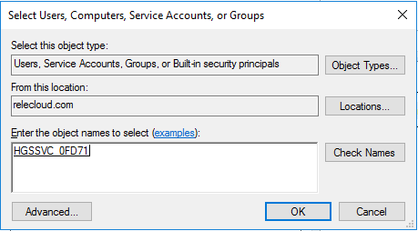

# Setting up the Host Guardian Service (HGS)

>Applies To: Windows Server 2016

This topic describes the process of setting up the Host Guardian Service (HGS), which includes reviewing prerequisites, setting up the first HGS node, configuring the secondary HGS nodes, and providing information to HGS about the hosts that HGS will support.

Together, HGS and the hosts it supports form a guarded fabric. After the guarded fabric is configured, shielded virtual machines (VMs) can run in it. For a list of the tasks for configuring a guarded fabric, see [Deployment tasks for guarded fabrics and shielded VMs](guarded-fabric-deploying-hgs-overview.md#deployment-tasks-for-guarded-fabrics-and-shielded-vms).

## Prerequisites for the Host Guardian Service

-   **Hardware**: HGS can be run on physical or virtual machines, but physical machines are recommended.

    If you want to run HGS as a three-node physical cluster (for availability), you must have three physical servers. (As a best practice for clustering, the three servers should have very similar hardware.)
  
-   **Operating system**: Windows Server 2016, Standard or Datacenter edition.

-   **Server Roles**: Host Guardian Service and supporting server roles.

-   **Configuration permissions/privileges for the fabric (host) domain**: You will need to be able to configure DNS forwarding between the fabric (host) domain and the HGS domain. If you are using Admin-trusted attestation, you will need to be able to configure Active Directory trusts between the fabric domain the HGS domain. Admin-trusted attestation is one of the two mutually-exclusive attestation modes that HGS uses, with the other mode being TPM-trusted attestation. For information about the two modes, including the hardware and firmware requirements for TPM-trusted attestation, see [Attestation modes in the Guarded Fabric solution](Guarded-Fabric-and-Shielded-VMs.md#attestation-modes-in-the-guarded-fabric-solution).
    
    As noted, a guarded fabric cannot contain a mix of admin- and TPM-trusted attestation. However, you can change from one attestation mode to the other. In other words, even though you must choose one mode for your initial deployment, you can change to the other mode later. For information about changing modes, see [Changing attestation modes](guarded-fabric-manage-hgs.md#changing-attestation-modes) in "Managing the Host Guardian Service."

    >**Important**&nbsp;&nbsp;By default, when you set up HGS, it creates its own forest. However, you can choose to add HGS to an existing forest. The forest used by HGS is sensitive because its administrators have access to the keys that control shielded VMs. For this reason, we strongly recommend that HGS either create its own forest during initial installation, or use an existing bastion forest - one that is isolated from traditional fabric or CORP-forest administrators. For more information, see [Choose whether to install HGS in its own new forest or in an existing bastion forest](guarded-fabric-setting-up-the-host-guardian-service-hgs.md#choose-whether-to-install-hgs-in-its-own-new-forest-or-in-an-existing-bastion-forest).

### Supported upgrade scenarios

Before you deploy a guarded fabric, make sure the servers have installed the latest Cumulative Update. 
If you deployed a guarded fabric before the release of the [October 27, 2016 Cumulative Update](http://support.microsoft.com/kb/3197954), the servers need to be upgraded:
- Guarded hosts can be upgraded in-place by installing the latest Cumulative Update.
- HGS servers need to be rebuilt, including configuring certificates and information about the hosts, as explained in this topic. 

Shielded VMs that ran on a guarded host with an earlier operating system version, such as TP5, can still run after the host is upgraded to Windows Server 2016. New shielded VMs cannot be created from template disks that were prepared using the template disk wizard from a Technical Preview build.

## Configure the first HGS node

The steps in this section guide you through setting up your first HGS node. You should perform these steps on a physical server with Windows Server 2016 installed.

### Add the HGS Role

Add the Host Guardian Service role by using Server Manager or by running the following command in an elevated Windows PowerShell console:

```powershell
Install-WindowsFeature -Name HostGuardianServiceRole -IncludeManagementTools -Restart
```
    
### Install the Host Guardian Service

After the role is added, the next step is to run the [Install-HgsServer](https://technet.microsoft.com/library/mt652169.aspx) cmdlet to install the HGS. HGS is a critical component in a guarded fabric and is responsible for attesting to a Hyper-V host's health as well as releasing keys needed to work with shielded VMs. The HGS forest is sensitive because its administrators have access to the keys that control shielded VMs. 

When you install HGS, it creates its own forest by default. Another option is to add HGS to an existing bastion forest.

#### Choose whether to install HGS in its own new forest or in an existing bastion forest

The default installation will set up a new Active Directory forest for HGS and configure other dependencies. This option is recommended because the environment is self-contained and known to be secure when it is created. 

There are no technical requirements that prevent installing HGS in an existing forest, but there are operational requirements and security-related best practices. Suitable forests are purposely built to serve one sensitive function, such as the forest used by [Privileged Access Management for AD DS](https://docs.microsoft.com/microsoft-identity-manager/pam/privileged-identity-management-for-active-directory-domain-services) or an [Enhanced Security Administrative Environment (ESAE) forest](https://technet.microsoft.com/windows-server-docs/security/securing-privileged-access/securing-privileged-access-reference-material#ESAE_BM). Such forests are suitable and usually exhibit the following characteristics:

- They have few admins (separate from fabric admins)
- They are not general-purpose in nature 
- They have a low number of logons

General purpose forests such as production forests are not suitable for use by the HGS. Because the HGS needs to be isolated from fabric administrators, fabric forests are unsuitable.

Depending on your deployment scenario, follow the steps to [install HGS in its own new forest](#install-hgs-in-its-own-new-forest) or [initialize HGS in an existing bastion forest](#initialize-hgs-in-an-existing-bastion-forest). 

#### Install HGS in its own new forest

The following steps describe the process for deploying the Host Guardian Service using its own newly created Active Directory forest. Ensure that the HGS machine is **not** joined to a domain before performing these steps.

1.  In an elevated Windows PowerShell console, run the following commands to install the Host Guardian Service and configure its domain. The password you specify here will only apply to the Directory Services Restore Mode password for Active Directory; it will *not* change the password you log in with.

    ```powershell
    $adminPassword = ConvertTo-SecureString -AsPlainText '<password>' -Force

    Install-HgsServer -HgsDomainName 'relecloud.com' -SafeModeAdministratorPassword $adminPassword -Restart
    ```

2.  After the computer restarts, log in as the domain administrator using the same password you previously used as the local administrator (regardless of the password you specified in the previous step).

### Specify the signing and encryption certificates that HGS will use

You need to configure the Host Guardian Service with two certificates for encryption and signing purposes. There are three options, as shown in the following table. These options are mutually exclusive. Choose the one that applies to your environment:

| Option | Procedure |
|----|------|
| You have your own PKI certificate and a PFX file. | [Use my own PKI certificates that are not backed by an HSM](#use-my-own-pki-certificates-that-are-not-backed-by-an-hsm) |
| You have a certificate backed by a Hardware Security Module (HSM). | [Use my own certificates with an HSM](#use-your-own-certificates-with-an-hsm) |
| You are using a self-signed certificate (only recommended for test or POC environments). | [Create and use self-signed certificates](#create-and-use-self-signed-certificates) |

>**Note**&nbsp;&nbsp;Regardless of how you create the certificates, they must support RSA 2048 bit keys and their key-usage policy (EKU) must permit digital signing and encryption.

HTTPS is not needed to secure communication between HGS and a Hyper-V host, but if you choose to enable HTTPS, you will need an additional certificate. The HTTPS certificate can be one that you already have, or you can create a new certificate that you will specify when initializing the HGS server. 

| Option | Additional procedure |
|----|-----------|
| You want to enable HTTPS  | [Configure a certificate for enabling HTTPS](#configure-a-certificate-for-enabling-https) |

#### Use my own PKI certificates that are not backed by an HSM

If you have obtained certificates from a trusted Public Key Infrastructure (PKI) environment and both the certificate and your organization permit the private keys to be exported to a PFX (personal information exchange) file, you are now able to conveniently add the PFX to any one node of the HGS cluster and have it automatically configured and replicated to all other nodes in the HGS cluster.

If you are unable to obtain a PFX or are unable to obtain one with the private key intact, you will need to install the certificates (including the private key) manually on each HGS node in your cluster according to your organization's certificate enrollment processes. Certificates that are added to HGS by thumbprint reference instead of a PFX file and password require additional action, as described in the following procedure.

##### To grant the HGS service access to the private keys of certificates added by thumbprint reference

1. Unlike other certificate-related tasks, you MUST repeat this process on each HGS node. Run CERTLM.MSC (which opens the Certificate Management Console for the local store).

2. Navigate to the signing certificate, right-click it, and then click **All Tasks** &gt; **Manage Private Keys**.

3. In the Security dialog box, add the group managed service account (gMSA) for HGS to the list of accounts. To do this, click **Add** and in the resulting dialog box, click **Object Types**, select **Service Accounts**, and click **OK**. Under **Enter the object names to select**, type the account name - by default, **HGSSVC** - and click **Check Names**. If you originally set up HGS in an existing domain, you'll type the name of the gMSA that you provided to the Initialize-HgsServer command.

    

4. Give the account **Read** access to the private keys for the certificate.

5. Repeat the process for the encryption certificate.
    
#### Use your own certificates with an HSM

If you plan to use certificates that reside in a Hardware Security Module (HSM), use the following high-level steps, which will vary according to your HSM vendor:

1.  Install the HSM vendor's software to ensure that the HSM is visible to Windows.

2.  Create two certificates within the HSM with RSA 2048 bit keys and key usage policies for signing and encryption purposes.

    1.  Create one encryption certificate within your HSM

    2.  Create one signing certificate within your HSM

3.  Verify that the certificates are installed in the local machine's certificate store. If they have not been automatically installed, they must be added per the HSM vendor's guidance (note that the private key remains in the HSM as expected). As before, you can add the certificate to the local machine's certificate store on any one node of the HGS cluster and it will automatically be configured and replicated to all other nodes in the HGS cluster.

4.  Finally, you must ensure that the group managed service account (gMSA) for HGS has been granted read access to the private keys for your certificate. By default, the gMSA account name is **HGSSVC**. If you originally set up HGS in an existing domain, the gMSA is the one that you provided to the Initialize-HgsServer command. The process for granting access varies between vendors, so please consult the user guide for your specific HSM for information on how to configure access for your HSM-backed certificate.

<span id="create-and-use-self-signed-certificates"/>
#### Create and use self-signed certificates (used primarily with test or proof-of-concept environments)

>**Warning**&nbsp;&nbsp;Creating self-signed certificates is not recommended outside of test/POC deployments. Use certificates that are issued by a trusted certificate authority if you are deploying in a production environment.

1.  Open an elevated Windows PowerShell console and run the following command to specify the password to use when exporting the self-signed certificate. For &lt;password&gt;, substitute a password.

    ```powershell
    $certificatePassword = ConvertTo-SecureString -AsPlainText '<password>' -Force
    ```
        
2.  Create and export the signing certificate by running the following commands. For signing (after `-DnsName`) and for `C:\signingCert`, you can leave the names as shown or substitute your preferred names.

    ```powershell
    $signingCert = New-SelfSignedCertificate -DnsName "signing.relecloud.com"

    Export-PfxCertificate -Cert $signingCert -Password $certificatePassword -FilePath 'C:\signingCert.pfx'
    ```

3.  Create and export the encryption certificate by running the following commands. For encryption (after `-DnsName`) and for `C:\encryptionCert`, you can leave the names as shown or substitute your preferred names.

    ```powershell
    $encryptionCert = New-SelfSignedCertificate -DnsName "encryption.relecloud.com"

    Export-PfxCertificate -Cert $encryptionCert -Password $certificatePassword -FilePath 'C:\encryptionCert.pfx'
    ```

#### Configure a certificate for enabling HTTPS

If you choose to enable HTTPS on your HGS server, you must have or create an additional certificate. To create a new certificate, run the following command. For `<HgsServiceName>`, choose a name that you will use as the distributed network name of your HGS server or HGS cluster.

```powershell
$HttpsCertificate = New-SelfSignedCertificate -DnsName "<HgsServiceName>.$env:userdnsdomain" -CertStoreLocation Cert:\LocalMachine\My
```

After you have chosen or created a certificate to use for HTTPS, use a command like the following to export it.

```powershell
Export-PfxCertificate -Cert $HttpsCertificate -Password $certificatePassword -FilePath 'c:\HttpsCertificate.pfx'
```

The options for specifying this certificate when initializing the HGS server are listed later in this topic.

### Initialize the HGS server with your chosen mode of attestation

The following commands will complete the configuration of the first HGS node.

>**Note**&nbsp;&nbsp;During this step, you will determine the attestation mode that HGS will use, either Admin-trusted or TPM-trusted attestation, although you can change the mode later. With HGS in TPM-trusted mode, hosts that you configure as guarded hosts must have TPM 2.0, UEFI 2.3.1, and boot in UEFI mode (not BIOS or "legacy" mode).

1.  Open an elevated Windows PowerShell console, and then run the following commands to initialize the HGS server with the encryption and signing certificates created earlier.

    For &lt;HgsServiceName&gt;, substitute a name of your choosing for the HGS cluster. This name is the distributed network name of the cluster. This name should *not* be fully qualified (e.g. enter "hgs" if you want the DNN to be configured as "hgs.relecloud.com").

    The syntax of the [Initialize-HgsServer](https://technet.microsoft.com/library/mt652185.aspx) command will vary according to the type of certificate you chose in [Specify the signing and encryption certificates that HGS will use](#specify-the-signing-and-encryption-certificates-that-hgs-will-use) and the desired attestation mode. Specifically:

    -   If you have PFX files with private keys intact, use the following parameter set:

        ```
        -SigningCertificatePath <path to PFX>
        -SigningCertificatePassword <secureString>
        -EncryptionCertificatePath <path to PFX>
        -EncryptionCertificatePassword <secureString>
        ```

        You also need to provide the certificate password you chose earlier to the *initialize* cmdlet as a secure string. Enter the following command if you have not already created a variable to hold it.

        ```powershell
        $certificatePassword = ConvertTo-SecureString -AsPlainText '<password>' -Force
        ```
    
    -   If your certificates are in your local certificate store, regardless of whether their private keys are intact or HSM-backed, use the following parameter set:

        ```
        -SigningCertificateThumbprint <thumbprint>
        -EncryptionCertificateThumbprint <thumbprint>
        ```

    Specify your attestation mode as follows:

    -   For Admin-trusted attestation, use: `-TrustActiveDirectory`

    -   For TPM-trusted attestation, use: `-TrustTpm`

    For information about attestation modes, see [Attestation modes in the Guarded Fabric solution](Guarded-Fabric-and-Shielded-VMs.md#attestation-modes-in-the-guarded-fabric-solution).

    Your final command syntax will resemble the following example:

    ```powershell
    Initialize-HgsServer -HgsServiceName '<HgsServiceName>' -SigningCertificatePath 'C:\signingCert.pfx' -SigningCertificatePassword $certificatePassword -EncryptionCertificatePath 'C:\encryptionCert.pfx' -EncryptionCertificatePassword $certificatePassword [-TrustActiveDirectory | -TrustTPM]
    ```
    
    Although HTTPS is not needed to secure communication between HGS and a Hyper-V host, if you want to enable HTTPS for HGS, instead of using the previous command syntax, see the next section. 

#### Initialize HGS server with an HTTPS Certificate 

If you want to enable HTTPS communication on the HGS server, you need to pass in the HTTPS certificate (the one you exported in [Configure a certificate for enabling HTTPS](#configure-a-certificate-for-enabling-https)) when initializing the HGS server. Modify the following example as appropriate, and then run it in place of the command in the previous section.

```powershell
Initialize-HgsServer -HgsServiceName '<HgsServiceName>' -EncryptionCertificateThumbprint $encryptionCert.Thumbprint -SigningCertificateThumbprint $signingCert.Thumbprint -TrustTpm -Http -Https -HttpsCertificatePath 'C:\HttpsCertificate.pfx' -HttpsCertificatePassword $certificatePassword
```
    
>**Note**&nbsp;&nbsp;If you are setting up multiple HGS servers in a high availability configuration, be sure to import the same HTTPS certificate on each machine. The variables **-Http -Https -HttpsCertificatePath 'C:\HttpsCertificate.pfx' -HttpsCertificatePassword $certificatePassword** (as shown in the previous command) should be included every time you initialize an HGS server in your environment.

#### Initialize HGS in an existing bastion forest

The following steps describe the process for adding HGS to an existing forest, rather than using the default process of allowing HGS to create its own forest and domain. 

**Requirements for adding HGS to an existing forest**

Before you can add HGS to an existing forest, you will need to add these objects to the target domain:

-   A Group Managed Service Account (gMSA) that is configured for use on the machine(s) that host HGS.

-   Two Active Directory groups that you will use for Just Enough Administration (JEA). One group is for users who can perform HGS administration through JEA, and the other is for users who can only view HGS through JEA.

-   For setting up the cluster, either [prestaged cluster objects](http://go.microsoft.com/fwlink/?LinkId=746122) or, for the user who runs **Initialize-HgsServer**, permissions to prestage the cluster objects.

**Command parameters for adding HGS to an existing forest**

The following tables describe the unique **Initialize-HgsServer** parameters to use when you add HGS to an existing forest. For the rest of the parameters, see [initialize the HGS server with your chosen mode of attestation](#initialize-the-hgs-server-with-your-chosen-mode-of-attestation).

| **Required Parameter**  | **Description**    |
|-------------|----------|
| `-UseExistingDomain`      | Adds HGS to an existing domain. HGS must already be joined to the existing domain.                                           |
| `-JeaAdministratorsGroup` | Identifies the Active Directory group of users who can perform HGS administration (through Just Enough Administration, JEA). |
| `-JeaReviewersGroup`      | Identifies the Active Directory group of users who can view, but not change, the HGS settings (through JEA).                                               |
| `-ServiceAccount`         | Identifies the group Managed Service Account (gMSA) that will be used for the Key Protection Service. The specified account must already be installed and configured for use on this machine.   |

| **Optional Parameter** | **Description**     |
|------------|-----------|
| `-ClusterName`           | Optionally, identifies the name of an existing cluster for HGS to use, rather than allowing a cluster to be automatically created by **Initialize-HgsServer**. |

**Windows PowerShell example line for adding HGS to an existing forest**

```powershell
Initialize-HgsServer -UseExistingDomain -JeaAdministratorsGroup <AdministratorsGroupName> -JeaReviewersGroup <ReviewersGroupName> -ServiceAccount <gMSAforKPS> -ClusterName <ExistingClusterName> -HgsServiceName '<HgsServiceName>' -SigningCertificatePath 'C:\signingCert.pfx' -SigningCertificatePassword $certificatePassword -EncryptionCertificatePath 'C:\encryptionCert.pfx' -EncryptionCertificatePassword $certificatePassword [-TrustActiveDirectory | -TrustTPM]
```

## Configure secondary HGS nodes

In production environments, HGS should be set up in a high availability cluster to ensure that shielded VMs can be powered on even if an HGS node goes down. For test environments, secondary HGS nodes are not required.

The following steps will add an additional node to the HGS cluster that you previously set up. The computer should *not* be joined to any domain before you perform these steps.

1.  To add the Host Guardian Service role to the computer, run the following command in an elevated Windows PowerShell console:

    ```powershell
    Install-WindowsFeature -Name HostGuardianServiceRole -IncludeManagementTools -Restart
    ```

    >**Note**&nbsp;&nbsp;If you are adding HGS to an existing domain not created with **Install-HgsServer**, you may skip to step 5.

2.  Configure at least one NIC on this machine to use the DNS server on your first HGS server for name resolution. This is necessary to enable the machine to resolve and join the HGS domain and cluster in the next step.

3.  Install the Host Guardian Service by running the command below. Substitute the IP addresses and names as appropriate for your environment:

    ```powershell
    $adSafeModePassword = ConvertTo-SecureString -AsPlainText '<password>' -Force

    $cred = Get-Credential 'relecloud\Administrator'

    Install-HgsServer -HgsDomainName 'relecloud.com' -HgsDomainCredential $cred -SafeModeAdministratorPassword $adSafeModePassword -Restart
    ```

4.  Wait for the server to restart, then sign in with the HGS domain administrator credentials.

5.  Run the commands below to finish adding the new node to the HGS cluster. Substitute the IP addresses and names as appropriate for your environment:

    ```powershell
    $cred = Get-Credential 'relecloud\Administrator'

    Initialize-HgsServer -HgsServerIPAddress <IP address of first HGS Server>
    ```

6.  Allow up to 10 minutes for the encryption and signing certificates from the first HGS server to replicate to this node.

7.  If you used HSM-backed certificates, you will need to install the driver for your HSM on this machine and grant the machine access to the private keys of the encryption and signing certificates per your HSM manufacturer's instructions. For both PKI-issued and HSM-backed certificates, you must manually grant the HGS service access to the private keys of the certificate per the instructions in [Use my own certificates with an HSM](#use-your-own-certificates-with-an-hsm).

## Verify HGS configuration

Next, we need to validate that things are working as expected. To do so, run the following command in an elevated Windows PowerShell console:

```powershell
Get-HgsTrace -RunDiagnostics
```

Because the HGS configuration does not yet contain information about the hosts that will be in the guarded fabric, the diagnostics will indicate that no hosts will be able to attest successfully yet. Ignore this result, and review the other information provided by the diagnostics.

<!-- When a link is available for an updated troubleshooting guide, add a sentence like the following and create a link to the troubleshooting guide:
If failures did occur, please review the remediation steps provided or see the Troubleshooting Guide.
-->

It is important to run the diagnostics on each node in your HGS cluster.

## Add host information to the HGS configuration

After you have confirmed the HGS server configuration by running diagnostics, HGS is ready to accept information that will come from the fabric administrator. The information that is needed, and the steps for adding it to HGS, depend on the mode of attestation:

- [Add host information for Admin-trusted attestation](#add-host-information-for-admin-trusted-attestation)
- [Add host information for TPM-trusted attestation](#add-host-information-for-tpm-trusted-attestation), later in this topic. 

### Add host information for Admin-trusted attestation

>**Important**&nbsp;&nbsp;The following steps apply only to Admin-trusted attestation. For the steps for TPM-trusted attestation, see [Add host information for TPM-trusted attestation](#add-host-information-for-tpm-trusted-attestation), later in this topic.

The following two sections describe how to add configure necessary DNS forwarding, and add necessary host information to HGS for Admin-trusted attestation:

- [Configuring DNS forwarding and domain trust](#admin-trusted-attestation-only---configuring-dns-forwarding-and-domain-trust)
- [Adding security group information to the HGS configuration](#admin-trusted-attestation-only---adding-security-group-information-to-the-hgs-configuration)

#### Admin-trusted attestation only - configuring DNS forwarding and domain trust

For Admin-trusted attestation, use the following steps to set up necessary DNS forwarding from the HGS domain to the fabric domain, and to establish a one-way forest trust to the fabric domain. These steps are necessary because this attestation mode identifies legitimate hosts through a designated Active Directory security group in the fabric (host) domain. To allow HGS to locate the fabric domain's domain controllers and validate group membership, you must configure a DNS forwarder and establish a one-way forest trust to the fabric domain.

1.  Configure a DNS forwarder that allows HGS to resolve resources located in the fabric (host) domain. There are many different ways to configure a DNS forwarder, and you can use any forwarder you choose. As one example, to create a conditional DNS forwarder zone, in the HGS domain, run the following command.

    For fabrikam.com, either use that name, or type the name of the fabric (host) domain.

    For `<DNSserverAddress1>`, type the IP address of a DNS server in the fabric (host) domain.

    For `<DNSserverAddress2>`, substitute the IP address of an additional DNS server (if one exists in the fabric domain). You can type additional IP addresses, if available.

    ```powershell
    Add-DnsServerConditionalForwarderZone -Name "fabrikam.com" -ReplicationScope "Forest" -MasterServers <DNSserverAddress1>, <DNSserverAddress2>
    ```

    >**Note**&nbsp;&nbsp;To enable high availability and ensure resiliency against a DNS node failure, configure your forwarder to point to more than one DNS server in the fabric domain.

2.  To create a one-way forest trust from the HGS domain to the fabric domain, use the Active Directory Domains and Trusts management console or run the following command in an elevated Command Prompt:

    For `relecloud.com`, substitute the name of your HGS domain if necessary.

    For `fabrikam.com,` substitute the name of the fabric domain if necessary.

    For `<password>`, substitute the Administrator password for the fabric domain.

        netdom trust relecloud.com /domain:fabrikam.com /userD:fabrikam.com\Administrator /passwordD:<password> /add

#### Admin-trusted attestation only - adding security group information to the HGS configuration 

For Admin-trusted attestation, the fabric administrator creates a security group, and places the intended guarded hosts into that group, as described in [Create a security group and place hosts in the group](guarded-fabric-admin-trusted-attestation-creating-a-security-group.md#create-a-security-group-and-place-hosts-in-the-group). You, the HGS administrator, must obtain the SID of that security group from the fabric administrator. Then you can complete the following steps.

1. On an HGS server, run the following command to register the security group with HGS as an Attestation Host Group. You can re-run the command if necessary for additional Attestation Host groups.

    For `<GuardedHostGroup>`, provide a friendly name for the guarded host group in HGS - this is useful if you need to differentiate one Attestation Host group from another in different domains. This name does not need to match the Active Directory security group name but it does not support spaces or common punctuation other than hyphens.<br>
    For `<SID>`, copy the SID as formatted in the output from the host domain (don't forget to wrap it in quotes).

    ```powershell
    Add-HgsAttestationHostGroup -Name "<GuardedHostGroup>" -Identifier "<SID>"
    ```

2. To verify that the guarded host group was successfully added, run [Get-HgsAttestationHostGroup](https://technet.microsoft.com/library/mt652172.aspx). The friendly name of your group should appear.

This completes the process of configuring an HGS cluster for Admin-trusted attestation. The fabric administrator might need you to provide two URLs from HGS before the configuration can be completed for the hosts. To obtain these URLs, on an HGS server, run [Get-HgsServer](https://technet.microsoft.com/library/mt652162.aspx).

### Add host information for TPM-trusted attestation

>**Important**&nbsp;&nbsp;The following steps apply only to TPM-trusted attestation. For the steps for Admin-trusted attestation, see [Add host information for Admin-trusted attestation](#add-host-information-for-admin-trusted-attestation), earlier in this topic.

For TPM-trusted attestation, the fabric administrator captures three kinds of host information, each of which needs to be added to the HGS configuration:

- A TPM identifier (EKpub) for each Hyper-V host
- Code Integrity policies, a white list of allowed binaries for the Hyper-V hosts
- A TPM baseline (boot measurements) that represents a set of Hyper-V hosts that run on the same class of hardware

The process that the fabric administrator uses is described in [TPM-trusted attestation for a guarded fabric - capturing information required by HGS](guarded-fabric-tpm-trusted-attestation-capturing-hardware.md#capture-hardware-and-software-information). 

After the fabric administrator captures the information, you, the HGS administrator, can add it to the HGS configuration as described in the following procedure.

1.  Obtain the XML files that contain the EKpub information and copy them to an HGS server. There will be one XML file per host. Then, in an elevated Windows PowerShell console on an HGS server, run the command below. Repeat the command for each of the XML files.

    ```powershell
    Add-HgsAttestationTpmHost -Path <Path><Filename>.xml -Name <HostName> -Force
    ```
    
    >**Note**&nbsp;&nbsp;The **-Force** flag is used here to bypass a validation of the EKcert of the host's TPM. Hosts using TPMs without an EKcert or with an EKcert issued by an authority your HGS server does not trust will throw an error without the use of -Force. For the highest level of security, do not use the -Force flag, so that you will be alerted to potentially untrustworthy TPMs.

2. Obtain the code integrity policy that the fabric administrator created for the hosts, in binary format (*.p7b). Copy it to an HGS server. Then run the following command.

    For `<PolicyName>`, specify a name for the CI policy that describes the type of host it applies to. A best practice is to name it after the make/model of your machine and any special software configuration running on it.<br>For `<Path>`, specify the path and filename of the code integrity policy.

    ```powershell
    Add-HgsAttestationCIPolicy -Path <Path> -Name '<PolicyName>'
    ```

3. Obtain the TCGlog file that the fabric administrator captured from a reference host. Copy the file to an HGS server. Then run the following command. Typically, you will name the policy after the class of hardware it represents (for example, "Manufacturer Model Revision").

    ```powershell
    Add-HgsAttestationTpmPolicy -Path <Filename>.tcglog -Name '<PolicyName>'
    ```

This completes the process of configuring an HGS cluster for TPM-trusted attestation. The fabric administrator might need you to provide two URLs from HGS before the configuration can be completed for the hosts. To obtain these URLs, on an HGS server, run [Get-HgsServer](https://technet.microsoft.com/library/mt652162.aspx).

## See also

- [Deploying the Host Guardian Service for guarded hosts and shielded VMs](guarded-fabric-deploying-hgs-overview.md)
- [Configuration steps for Hyper-V hosts that will become guarded hosts](guarded-fabric-configure-hgs-with-authorized-hyper-v-hosts.md)
