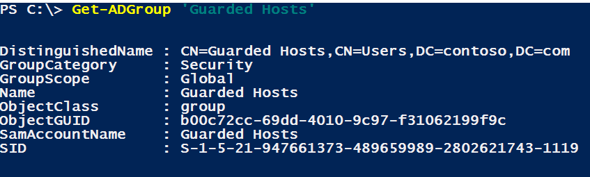

# Setting up the Host Guardian Service (HGS)

>Applies To: Windows Server 2016

This topic describes the process of setting up the Host Guardian Service (HGS), which includes setting up the first HGS node, configuring DNS and Hyper-V hosts, and configuring the secondary HGS nodes.

## Configure the first HGS node

The steps in this section guide you through setting up your first HGS node. You should perform these steps on a physical server with Windows Server 2016 installed.

>**Important**&nbsp;&nbsp;The Host Guardian Service has few prerequisites other than the Windows Server 2016 operating system. However, there are prerequisites for guarded hosts. For information, see [Prerequisites for Hyper-V hosts that will become guarded hosts](guarded-fabric-deployment-prerequisites.md#prerequisites-for-hyper-v-hosts-that-will-become-guarded-hosts).

### Add the HGS Role

Add the Host Guardian Service role by using Server Manager or by running the following command in an elevated Windows PowerShell console:

```powershell
Install-WindowsFeature -Name HostGuardianServiceRole -IncludeManagementTools -Restart
```
    
### Install the Host Guardian Service

After the role is added, the next step is to run the [Install-HgsServer](https://technet.microsoft.com/library/mt652169.aspx) cmdlet to install the HGS. HGS is a critical component in a guarded fabric and is responsible for attesting to a Hyper-V host's health as well as releasing keys needed to work with shielded VMs. The HGS forest is sensitive because its administrators have access to the keys that control shielded VMs. 

When you install HGS, it creates its own forest by default. Another option is to add HGS to an existing bastion forest.

#### Choose whether to install HGS in its own new forest or in an existing bastion forest

The default installation will set up a new Active Directory forest for HGS and configure other dependencies. This option is recommended because the environment is self-contained and known to be secure when it is created. 

There are no technical requirements that prevent installing HGS in an existing forest, but there are operational requirements and security-related best practices. Suitable forests are purposely built to serve one sensitive function, such as the forest used by [Privileged Access Management for AD DS](https://docs.microsoft.com/microsoft-identity-manager/pam/privileged-identity-management-for-active-directory-domain-services) or an [Enhanced Security Administrative Environment (ESAE) forest](https://technet.microsoft.com/windows-server-docs/security/securing-privileged-access/securing-privileged-access-reference-material#ESAE_BM). Such forests are suitable and usually exhibit the following characteristics:

- They have few admins 
- They are not general-purpose in nature 
- They have a low number of logons

General purpose forests such as CORP forests are not suitable for use by the HGS. Because the HGS needs to be isolated from fabric administrators, fabric forests are unsuitable.

Depending on your deployment scenario, follow the steps to [install HGS in its own new forest](#install-hgs-in-its-own-new-forest) or [initialize HGS in an existing bastion forest](#initialize-hgs-in-an-existing-bastion-forest). 

#### Install HGS in its own new forest

The following steps describe the process for deploying the Host Guardian Service using its own newly created Active Directory forest. Ensure that the HGS machine is **not** joined to a domain before performing these steps.

1.  In an elevated Windows PowerShell console, run the following commands to install the Host Guardian Service and configure its domain. The password you specify here will only apply to the Directory Services Restore Mode password for Active Directory; it will *not* change the password you log in with.

    ```powershell
    $adminPassword = ConvertTo-SecureString -AsPlainText '<password>' -Force

    Install-HgsServer -HgsDomainName 'relecloud.com' -SafeModeAdministratorPassword $adminPassword -Restart
    ```

2.  After the computer restarts, log in as the domain administrator using the same password you previously used as the local administrator (regardless of the password you specified in the previous step).

### Specify the signing and encryption certificates that HGS will use

You need to configure the Host Guardian Service with two certificates for encryption and signing purposes. There are three options, as shown in the following table. These options are mutually exclusive. Choose the one that applies to your environment:

| Option | Procedure |
|--------|-----------|
| You have your own PKI certificate and a PFX file. | [Use my own PKI certificates that are not backed by an HSM](#use-my-own-pki-certificates-that-are-not-backed-by-an-hsm) |
| You have a certificate backed by a Hardware Security Module (HSM). | [Use my own certificates with an HSM](#use-my-own-certificates-with-an-hsm) |
| You are using a self-signed certificate (only recommended for test or POC environments). | [Create and use self-signed certificates](#create-and-use-self-signed-certificates) |

>**Note**&nbsp;&nbsp;Regardless of how you create the certificates, they must support RSA 2048 bit keys and their key-usage policy (EKU) must permit digital signing and encryption.

HTTPS is not needed to secure communication between HGS and a Hyper-V host, but if you choose to enable HTTPS, you will need an additional certificate. The HTTPS certificate can be one that you already have, or you can create a new certificate that you will specify when initializing the HGS server. 

| Option | Additional procedure |
|--------|----------------------|
| You want to enable HTTPS  | [Configure a certificate for enabling HTTPS](#configure-a-certificate-for-enabling-https) |

#### Use my own PKI certificates that are not backed by an HSM

If you have obtained certificates from a trusted Public Key Infrastructure (PKI) environment and both the certificate and your organization permit the private keys to be exported to a PFX (personal information exchange) file, you are now able to conveniently add the PFX to any one node of the HGS cluster and have it automatically configured and replicated to all other nodes in the HGS cluster.

If you are unable to obtain a PFX or are unable to obtain one with the private key intact, you will need to install the certificates (including the private key) manually on each HGS node in your cluster according to your organization’s certificate enrollment processes. Certificates that are added to HGS by thumbprint reference instead of a PFX file and password require additional action, as described in the following procedure.

##### To grant the HGS service access to the private keys of certificates added by thumbprint reference

1. Unlike other certificate-related tasks, you MUST repeat this process on each HGS node. Run CERTLM.MSC (which opens the Certificate Management Console for the local store).

2. Navigate to the signing certificate, right-click it, and then click **All Tasks** &gt; **Manage Private Keys**.

3. In the Security dialog box, add the group managed service account (gMSA) for HGS to the list of accounts. To do this, click **Add** and in the resulting dialog box, click **Object Types**, select **Service Accounts**, and click **OK**. Under **Enter the object names to select**, type the account name—by default, **HGSSVC**—and click **Check Names**. If you originally set up HGS in an existing domain, you'll type the name of the gMSA that you provided to the Initialize-HgsServer command.

    

4. Give the account **Read** access to the private keys for the certificate.

5. Repeat the process for the encryption certificate.
    
#### Use your own certificates with an HSM

If you plan to use certificates that reside in a Hardware Security Module (HSM), use the following high-level steps, which will vary according to your HSM vendor:

1.  Install the HSM vendor’s software to ensure that the HSM is visible to Windows.

2.  Create two certificates within the HSM with RSA 2048 bit keys and key usage policies for signing and encryption purposes.

    1.  Create one encryption certificate within your HSM

    2.  Create one signing certificate within your HSM

3.  Verify that the certificates are installed in the local machine’s certificate store. If they have not been automatically installed, they must be added per the HSM vendor’s guidance (note that the private key remains in the HSM as expected). As before, you can add the certificate to the local machine’s certificate store on any one node of the HGS cluster and it will automatically be configured and replicated to all other nodes in the HGS cluster.

4.  Finally, you must ensure that the group managed service account (gMSA) for HGS has been granted read access to the private keys for your certificate. By default, the gMSA account name is **HGSSVC**. If you originally set up HGS in an existing domain, the gMSA is the one that you provided to the Initialize-HgsServer command. The process for granting access varies between vendors, so please consult the user guide for your specific HSM for information on how to configure access for your HSM-backed certificate.

<span id="create-and-use-self-signed-certificates"/>
#### Create and use self-signed certificates (used primarily with test or proof-of-concept environments)

>**Warning**&nbsp;&nbsp;Creating self-signed certificates is not recommended outside of test/POC deployments. Use certificates that are issued by a trusted certificate authority if you are deploying in a production environment.

1.  Open an elevated Windows PowerShell console and run the following command to specify the password to use when exporting the self-signed certificate. For &lt;password&gt;, substitute a password.

    ```powershell
    $certificatePassword = ConvertTo-SecureString -AsPlainText '<password>' -Force
    ```
        
2.  Create and export the signing certificate by running the following commands. For signing (after `-DnsName`) and for `C:\signingCert`, you can leave the names as shown or substitute your preferred names.

    ```powershell
    $signingCert = New-SelfSignedCertificate -DnsName "signing.relecloud.com"

    Export-PfxCertificate -Cert $signingCert -Password $certificatePassword -FilePath 'C:\signingCert.pfx'
    ```

3.  Create and export the encryption certificate by running the following commands. For encryption (after `-DnsName`) and for `C:\encryptionCert`, you can leave the names as shown or substitute your preferred names.

    ```powershell
    $encryptionCert = New-SelfSignedCertificate -DnsName "encryption.relecloud.com"

    Export-PfxCertificate -Cert $encryptionCert -Password $certificatePassword -FilePath 'C:\encryptionCert.pfx'
    ```

#### Configure a certificate for enabling HTTPS

If you choose to enable HTTPS on your HGS server, you must have or create an additional certificate. To create a new certificate, run the following command. For `<HgsServiceName>`, choose a name that you will use as the distributed network name of your HGS server or HGS cluster.

```powershell
$HttpsCertificate = New-SelfSignedCertificate -DnsName "<HgsServiceName>.$env:userdnsdomain" -CertStoreLocation Cert:\LocalMachine\My
```

After you have chosen or created a certificate to use for HTTPS, use a command like the following to export it.

```powershell
Export-PfxCertificate -Cert $HttpsCertificate -Password $certificatePassword -FilePath 'c:\\HttpsCertificate.pfx'
```

The options for specifying this certificate when initializing the HGS server are listed later in this topic.

### Initialize the HGS server with your chosen mode of attestation

The following commands will complete the configuration of the first HGS node.

>**Note**&nbsp;&nbsp;During this step, you will determine the attestation mode that HGS will use, either Admin-trusted or TPM-trusted attestation, although you can change the mode later. With HGS in TPM-trusted mode, hosts that you configure as guarded hosts must have TPM 2.0, UEFI 2.3.1, and boot in UEFI mode (not BIOS or “legacy” mode).

1.  Open an elevated Windows PowerShell console, and then run the following commands to initialize the HGS server with the encryption and signing certificates created earlier.

    For &lt;HgsServiceName&gt;, substitute a name of your choosing for the HGS cluster. This name is the distributed network name of the cluster. This name should *not* be fully qualified (e.g. enter “hgs” if you want the DNN to be configured as “hgs.relecloud.com”).

    The syntax of the [Initialize-HgsServer](https://technet.microsoft.com/library/mt652185.aspx) command will vary according to the type of certificate you chose in [Specify the signing and encryption certificates that HGS will use](#specify-the-signing-and-encryption-certificates-that-hgs-will-use) and the desired attestation mode. Specifically:

    -   If you have PFX files with private keys intact, use the following parameter set:

        ```
        -SigningCertificatePath <path to PFX>
        -SigningCertificatePassword <secureString>
        -EncryptionCertificatePath <path to PFX>
        -EncryptionCertificatePassword <secureString>
        ```

        You also need to provide the certificate password you chose earlier to the *initialize* cmdlet as a secure string. Enter the following command if you have not already created a variable to hold it.

        ```powershell
        $certificatePassword = ConvertTo-SecureString -AsPlainText '<password>' -Force
        ```
    
    -   If your certificates are in your local certificate store, regardless of whether their private keys are intact or HSM-backed, use the following parameter set:

        ```
        -SigningCertificateThumbprint <thumbprint>
        -EncryptionCertificateThumbprint <thumbprint>
        ```

    Specify your attestation mode as follows:

    -   For Admin-trusted attestation, use: `-TrustActiveDirectory`

    -   For TPM-trusted attestation, use: `-TrustTpm`

    For information about attestation modes, see [Attestation modes in the Guarded Fabric solution](Guarded-Fabric-and-Shielded-VMs.md#attestation-modes-in-the-guarded-fabric-solution).

    Your final command syntax will resemble the following example:

    ```powershell
    Initialize-HgsServer -HgsServiceName '<HgsServiceName>' -SigningCertificatePath 'C:\signingCert.pfx' -SigningCertificatePassword $certificatePassword -EncryptionCertificatePath 'C:\encryptionCert.pfx' -EncryptionCertificatePassword $certificatePassword [-TrustActiveDirectory | -TrustTPM]
    ```
    
    Although HTTPS is not needed to secure communication between HGS and a Hyper-V host, if you want to enable HTTPS for HGS, instead of using the previous command syntax, see the next section. 

#### Initialize HGS server with an HTTPS Certificate 

If you want to enable HTTPS communication on the HGS server, you need to pass in the HTTPS certificate (the one you exported in [Configure a certificate for enabling HTTPS](#configure-a-certificate-for-enabling-https)) when initializing the HGS server. Modify the following example as appropriate, and then run it in place of the command in the previous section.

```powershell
Initialize-HgsServer -HgsServiceName <HgsServiceName> -EncryptionCertificateThumbprint $encryptionCert.Thumbprint -SigningCertificateThumbprint $signingCert.Thumbprint -TrustTpm -Http -Https -HttpsCertificatePath 'C:\\HttpsCertificate.pfx' -HttpsCertificatePassword $certificatePassword
```
    
>**Note**&nbsp;&nbsp;If you are setting up multiple HGS servers in a high availability configuration, be sure to import the same HTTPS certificate on each machine. The variables **-Http -Https -HttpsCertificatePath 'C:\\HttpsCertificate.pfx' -HttpsCertificatePassword $certificatePassword** (as shown in the previous command) should be included every time you initialize an HGS server in your environment.

#### Initialize HGS in an existing bastion forest

The following steps describe the process for adding HGS to an existing forest, rather than using the default process of allowing HGS to create its own forest and domain. 

##### Requirements for adding HGS to an existing forest

Before you can add HGS to an existing forest, you will need to add these objects to the target domain:

-   A Group Managed Service Account (gMSA) that is configured for use on the machine(s) that host HGS.

-   Two Active Directory groups that you will use for Just Enough Administration (JEA). One group is for users who can perform HGS administration through JEA, and the other is for users who can only view HGS through JEA.

-   For setting up the cluster, either [prestaged cluster objects](http://go.microsoft.com/fwlink/?LinkId=746122) or, for the user who runs **Initialize-HgsServer**, permissions that would are required to prestage the cluster objects.

##### Command parameters for adding HGS to an existing forest

The following tables describe the unique **Initialize-HgsServer** parameters to use when you add HGS to an existing forest. For the rest of the parameters, see [initialize the HGS server with your chosen mode of attestation](#initialize-the-hgs-server-with-your-chosen-mode-of-attestation).

| **Required Parameter**  | **Description**    |
|-------------------------|--------------------|
| `-UseExistingDomain`      | Adds HGS to an existing domain.                                                                                              |
| `-JeaAdministratorsGroup` | Identifies the Active Directory group of users who can perform HGS administration (through Just Enough Administration, JEA). |
| `-JeaReviewersGroup`      | Identifies the Active Directory group of users who can view HGS (through JEA).                                               |
| `-ServiceAccount`         | Identifies the group Managed Service Account (gMSA) that will be used for the Key Protection Service.                        |

| **Optional Parameter** | **Description**     |
|------------------------|---------------------|
| `-ClusterName`           | Optionally, identifies the name of an existing cluster for HGS to use, rather than allowing a cluster to be automatically created by **Initialize-HgsServer**. |

##### Windows PowerShell example line for adding HGS to an existing forest

```powershell
Initialize-HgsServer -UseExistingDomain '<DomainName>' -JeaAdministratorsGroup <AdministratorsGroupName> -JeaReviewersGroup <ReviewersGroupName> -ServiceAccount <gMSAforKPS> -ClusterName <ExistingClusterName> -HgsServiceName '<HgsServiceName>' -SigningCertificatePath 'C:\signingCert.pfx' -SigningCertificatePassword $certificatePassword -EncryptionCertificatePath 'C:\encryptionCert.pfx' -EncryptionCertificatePassword $certificatePassword [-TrustActiveDirectory | -TrustTPM]
```

## Configure secondary HGS nodes

In production environments, HGS should be set up in a high availability cluster to ensure that shielded VMs can be powered on even if an HGS node goes down. For test environments, secondary HGS nodes are not required.

The following steps will add an additional node to the HGS cluster that you previously set up. The computer should *not* be joined to any domain before you perform these steps.

1.  To add the Host Guardian Service role to the computer, run the following command in an elevated Windows PowerShell console:

    ```powershell
    Install-WindowsFeature -Name HostGuardianServiceRole -IncludeManagementTools -Restart
    ```

    >**Note**&nbsp;&nbsp;If you are adding HGS to an existing domain not created with **Install-HgsServer**, you may skip to step 5.

2.  Configure at least one NIC on this machine to use the DNS server on your first HGS server for name resolution. This is necessary to enable the machine to resolve and join the HGS domain and cluster in the next step.

3.  Install the Host Guardian Service by running the command below. Substitute the IP addresses and names as appropriate for your environment:

    ```powershell
    $adSafeModePassword = ConvertTo-SecureString -AsPlainText '<password>' -Force

    $cred = Get-Credential 'relecloud\Administrator'

    Install-HgsServer -HgsDomainName 'relecloud.com' -HgsDomainCredential $cred -SafeModeAdministratorPassword $adSafeModePassword -Restart -Confirm:$false
    ```

4.  Wait for the server to restart, then sign in with the HGS domain administrator credentials.

5.  Run the commands below to finish adding the new node to the HGS cluster. Substitute the IP addresses and names as appropriate for your environment:

    ```powershell
    $cred = Get-Credential 'relecloud\Administrator'

    Initialize-HgsServer -HgsServerIPAddress <IP address of first HGS Server> -Confirm:$false
    ```

6.  Allow up to 10 minutes for the encryption and signing certificates from the first HGS server to replicate to this node.

7.  If you used HSM-backed certificates, you will need to install the driver for your HSM on this machine and grant the machine access to the private keys of the encryption and signing certificates per your HSM manufacturer’s instructions. For both PKI-issued and HSM-backed certificates, you must manually grant the HGS service access to the private keys of the certificate per the instructions in [Use my own certificates with an HSM](#use-my-own-certificates-with-an-hsm).

Next, we need to validate that things are working as expected. To do so, run the following command in an elevated PowerShell console:

```powershell
Get-HgsTrace -RunDiagnostics
```

Review the results paying careful attention to any test that failed. If no failures occurred, it will return:

    "Overall Result: Pass"

<!-- If/when a better link is available for the troubleshooting guide, replace the link in the following sentence. -->

If failures did occur, please review the remediation steps provided or see the [Troubleshooting Guide](https://gallery.technet.microsoft.com/Shielded-VMs-and-Guarded-70c5b471).

It is important to repeat these steps for each additional node in your HGS cluster.

### For Admin-trusted attestation only: configuring DNS forwarding and domain trust

>**Important**&nbsp;&nbsp;The following steps are unnecessary for TPM-trusted attestation.

If you are using HGS with Admin-trusted attestation, use the steps that follow. If you are using HGS with TPM-trusted attestation, skip these steps and go on to [Configure the fabric DNS](#configure-the-fabric-dns).

For Admin-trusted attestation, use the following steps to set up necessary DNS forwarding from the HGS domain to the fabric domain, and to establish a one-way forest trust to the fabric domain. These steps are necessary because this attestation mode identifies legitimate hosts through a designated Active Directory security group in the fabric (host) domain. To allow HGS to locate the fabric domain’s domain controllers and validate group membership, you must configure a DNS forwarder and establish a one-way forest trust to the fabric domain.

1.  Configure a DNS forwarder that allows HGS to resolve resources located in the fabric (host) domain. There are many different ways to configure a DNS forwarder, and you can use any forwarder you choose. As one example, to create a conditional DNS forwarder zone, in the HGS domain, run the following command.

    For fabrikam.com, either use that name, or type the name of the fabric (host) domain.

    For `<DNSserverAddress1>`, type the IP address of a DNS server in the fabric (host) domain.

    For `<DNSserverAddress2>`, substitute the IP address of an additional DNS server (if one exists in the fabric domain). You can type additional IP addresses, if available.

    ```powershell
    Add-DnsServerConditionalForwarderZone -Name "fabrikam.com" -ReplicationScope "Forest" -MasterServers <DNSserverAddress1>, <DNSserverAddress2>
    ```

    >**Note**&nbsp;&nbsp;To enable high availability and ensure resiliency against a DNS node failure, configure your forwarder to point to more than one DNS server in the fabric domain.

2.  To create a one-way forest trust from the HGS domain to the fabric domain, use the Active Directory Domains and Trusts management console or run the following command in an elevated Command Prompt:

    For `relecloud.com`, substitute the name of your HGS domain if necessary.

    For `fabrikam.com,` substitute the name of the fabric domain if necessary.

    For `<password>`, substitute the Administrator password for the fabric domain.

        netdom trust relecloud.com /domain:fabrikam.com /userD:fabrikam.com\Administrator /passwordD:<password> /add

3.  Continue setting up the hosting environment by configuring DNS as described in the next section.

## Configure the fabric DNS

Regardless of the attestation mode that you use, guarded hosts must be able to resolve the HGS cluster. Therefore, you must set up a DNS forwarder from the fabric domain to the HGS domain. There are many ways to configure name resolution on the fabric domain. One way is to set up a conditional forwarder zone in DNS for the fabric. To set up this zone, run the following commands in an elevated Windows PowerShell console on a fabric DNS server.

Substitute the names and addresses in the Windows PowerShell syntax below as needed for your environment. Add master servers for the additional HGS nodes.

>**Note**&nbsp;&nbsp;Run these commands on a fabric DNS server, not the HGS server that you just configured.

```powershell
Add-DnsServerConditionalForwarderZone -Name 'relecloud.com' -ReplicationScope "Forest" -MasterServers <IP addresses of HGS server>
```

##  Configure HGS with authorized Hyper-V hosts

With HGS set up and name resolution in place, it’s time to configure HGS to recognize the guarded hosts. How you do this depends on which attestation mode you are using:

| Actions | Section |
|---------|---------|
| **Admin-trusted attestation**: Set up an Active Directory security group in the fabric domain, add guarded hosts as members of that group, and provide that group identifier to HGS. | See [Admin-trusted attestation: Creating a security group and placing hosts in the group](#admin-trusted-attestation-creating-a-security) |
| **TPM-trusted attestation**: Capture TPM identifiers (also called platform identifiers), create a TPM baseline, and create a Code Integrity policy. | See [TPM-trusted attestation: capturing hardware and software information that HGS uses in attestation](#tpm-trusted-attestation-capturing-hardware) |

<span id="admin-trusted-attestation-creating-a-security"/>
### Admin-trusted attestation: creating a security group and placing hosts in the group

Admin-trusted attestation identifies legitimate hosts through a designated Active Directory security group. Use the following procedures to create the security group and place hosts in that group.

>**Important**&nbsp;&nbsp;Before beginning these steps, be sure to review [Prerequisites for Hyper-V hosts that will become guarded hosts](guarded-fabric-deployment-prerequisites.md#prerequisites-for-hyper-v-hosts-that-will-become-guarded-hosts).<br>Also, for special considerations when using Nano server, see [Configure Nano server as TPM attested guarded host](guarded-fabric-configure-nano-server-as-tpm-guarded-host.md).

For hardware-based (TPM) attestation, these steps do not apply. Instead, see [TPM-trusted attestation: capturing hardware and software information that HGS uses in attestation](#tpm-trusted-attestation-capturing-hardware).

1.  **On a computer in the fabric (host) domain**: Create a new **GLOBAL** security group in the fabric domain to identify those hosts trusted to run shielded VMs. You can create this group in Active Directory Users and Computers or by running the Active Directory PowerShell commands on a computer with the AD DS Remote Server Administration Tools (RSAT) installed.

    >**Warning**&nbsp;&nbsp;You must restart each host after adding them to this security group to update their group membership, unless using a group that the host was already a member of.

2.  **On the HGS server**: Run the following command to register the group with HGS as an Attestation Host Group. You can re-run the command if necessary for additional Attestation Host groups.

    For `<GuardedHostGroup>`, provide a friendly name for the guarded host group in HGS—this is useful if you need to differentiate one Attestation Host group from another in different domains. This name does not need to match the Active Directory security group name but it does not support spaces or common punctuation other than hyphens.

    ```powershell
    Add-HgsAttestationHostGroup -Name "<GuardedHostGroup>" -Identifier "<SID>"
    ```
        
    To obtain the SID, use the following PowerShell command against the fabric AD and copy the SID as formatted in the output (don’t forget to wrap it in quotes).

    
    
3.  To verify that the guarded host group was successfully added, run [Get-HgsAttestationHostGroup](https://technet.microsoft.com/library/mt652172.aspx). The friendly name of your group should appear.

<span id="tpm-trusted-attestation-capturing-hardware"/>
### TPM-trusted attestation: capturing hardware and software information that HGS uses in attestation

As the name implies, TPM-trusted attestation uses a TPM identifier (also called a platform identifier or endorsement key \[EKpub\]) to begin determining whether a particular host is authorized as “guarded.” This mode of attestation uses secure boot and code integrity measurements to ensure that a given Hyper-V host is in a healthy state and is running only trusted code. In order for attestation to understand what is and is not healthy, you must define the following for each class of hardware before configuring HGS to use TPM-trusted attestation:

1.  TPM identifier (EKpub)

    -  This information is unique to each Hyper-V host

2.  TPM baseline (boot measurements)

    -  This is applicable to all Hyper-V hosts that run on the same class of hardware

3.  Code Integrity policies (a white list of allowed binaries)

    -  This is applicable to all Hyper-V hosts that share both common hardware and software

We recommend that you elect a “reference host” to represent each unique class of hardware configuration within your datacenter. Then, as noted in the instructions below, you can use the reference host to capture the necessary information for TPM-trusted attestation. Note that item \#1 in the list above must be obtained from each individual Hyper-V host.

>**Important**&nbsp;&nbsp;Before beginning these steps, be sure to review [Prerequisites for Hyper-V hosts that will become guarded hosts](guarded-fabric-deployment-prerequisites.md#prerequisites-for-hyper-v-hosts-that-will-become-guarded-hosts).

<!-- This comment creates a break between the Important above and the Nano Server note below. -->

>**Nano Server Only**&nbsp;&nbsp;If you are using Nano Server to host your shielded VMs, there are special steps you must take to acquire the attestation artifacts listed in this section. For more information, see [Configure Nano server as TPM attested guarded host](guarded-fabric-configure-nano-server-as-tpm-guarded-host.md).

#### To capture the TPM identifier (platform identifier or EKpub) for each host

1.  Ensure the TPM on each host is ready for use – that is, the TPM is initialized and ownership obtained. You can check the status of the TPM by opening the TPM Management Console (tpm.msc) or by running **Get-Tpm** in an elevated Windows PowerShell window. If your TPM is not in the “ready” state, you will need to initialize it and set its ownership. This can be done in the TPM Management Console or by running **Initialize-Tpm**.

    More information about TPM management is available at [Initialize and configure ownership of the TPM](https://technet.microsoft.com/itpro/windows/keep-secure/initialize-and-configure-ownership-of-the-tpm).

2.  On each guarded host, run the following command in an elevated Windows PowerShell console to obtain its EKpub. For `<HostName>`, substitute the unique host name with something suitable to identify this host—this can be its hostname or the name used by a fabric inventory service (if available). For convenience, name the output file using the host’s name.

    ```powershell
    (Get-PlatformIdentifier -Name '<HostName>').InnerXml | Out-file <Path><HostName>.xml -Encoding UTF8
    ```
        
3.  Copy the resulting XML file to an HGS server.

4.  In an elevated Windows PowerShell console on the HGS server, run the command below.

    ```powershell
    Add-HgsAttestationTpmHost -Path <Path><Filename>.xml -Name <HostName> -Force
    ```
        
    >**Note**&nbsp;&nbsp;The **-Force** flag is used here to bypass a validation of the EKcert of the host’s TPM. Hosts using TPMs without an EKcert or with an EKcert issued by an authority your HGS server does not trust will throw an error without the use of -Force. For the highest level of security, do not use the -Force flag, so that you will be alerted to potentially untrustworthy TPMs.

5.  Repeat the preceding steps for each host that will become a guarded host, being sure to give each XML file a unique name.

#### Create and apply a Code Integrity policy

A Code Integrity policy helps ensure that only the executables you trust to run on a host are allowed to run. Malware and other executables outside the trusted executables are prevented from running.

Each guarded host must have a code integrity policy applied in order to run shielded VMs. You specify the exact code integrity policies you trust by adding them to HGS. Code integrity policies can be configured to enforce the policy, blocking any software that does not comply with the policy, or simply audit (log an event when software not defined in the policy is executed). It is recommended that you first create the CI policy in audit (logging) mode to see if it’s missing anything, then enforce the policy when using the system to host production workloads. For more information about generating CI policies and the enforcement mode, see:

- [Planning and getting started on the Device Guard deployment process](https://technet.microsoft.com/itpro/windows/keep-secure/planning-and-getting-started-on-the-device-guard-deployment-process#getting-started-on-the-deployment-process)
- [Deploy Device Guard: deploy code integrity policies](https://technet.microsoft.com/itpro/windows/keep-secure/deploy-device-guard-deploy-code-integrity-policies)

Before you can use the [New-CIPolicy](https://technet.microsoft.com/library/mt634473.aspx) cmdlet to generate a Code Integrity policy, you will need to decide the rule levels to use. For Server Core, we recommend a primary level of **FilePublisher** with fallback to **Hash**. This allows files with publishers to be updated without changing the CI policy. Addition of new files or modifications to files without publishers (which are measured with a hash) will require you to create a new CI policy matching the new system requirements. For Server with Desktop Experience, we recommend a primary level of **Publisher** with fallback to **Hash**. For more information about the available CI policy rule levels, see [Deploy code integrity policies: policy rules and file rules](https://technet.microsoft.com/itpro/windows/keep-secure/deploy-code-integrity-policies-policy-rules-and-file-rules) and cmdlet help.

1.  On the reference host, generate a new code integrity policy. The following commands create a policy at the **FilePublisher** level with fallback to **Hash**. It then converts the XML file to the binary file format Windows and HGS need to apply and measure the CI policy, respectively.

    ```powershell
    New-CIPolicy -Level FilePublisher -Fallback Hash -FilePath 'C:\temp\HW1CodeIntegrity.xml' -UserPEs

    ConvertFrom-CIPolicy -XmlFilePath 'C:\temp\HW1CodeIntegrity.xml' -BinaryFilePath 'C:\temp\HW1CodeIntegrity.p7b'
    ```

    >**Note**&nbsp;&nbsp;The above command creates a CI policy in audit mode only. It will not block unauthorized binaries from running on the host. You should not use such policies in production; use only enforced policies to ensure malware and other unintended programs are not running on your guarded hosts.

2.  Keep your Code Integrity policy file (XML file) where you can easily find it. You will need to edit this file later to enforce the CI policy or merge in changes from future updates made to the system.

3.  Now, apply the CI policy to your reference host. Each host may only have one CI policy applied at a given time. To apply a CI policy, perform the following steps:

    1.  Copy the binary CI policy file (HW1CodeIntegrity.p7b) to the following location on your reference host (the filename must exactly match):<br>
        **C:\\Windows\\System32\\CodeIntegrity\\SIPolicy.p7b**

    2.  Restart the host to apply the policy.

3.  Test the code integrity policy by running a typical workload representative of your production environment on the reference machine. This may include running VMs, any fabric management agents, backup agents, or troubleshooting tools on the machine. Check if there are any code integrity violations and update your CI policy if necessary (see guidance in the “[Audit code integrity policies](https://technet.microsoft.com/itpro/windows/keep-secure/deploy-code-integrity-policies-steps#audit-code-integrity-policies)” section of the Device Guard Deployment Guide).

4.  Change your CI policy to enforced mode by running the following commands against your updated CI policy XML file.

    ```powershell
    Set-RuleOption -FilePath 'C:\temp\HW1CodeIntegrity.xml' -Option 3 -Delete

    ConvertFrom-CIPolicy -XmlFilePath 'C:\temp\HW1CodeIntegrity.xml' -BinaryFilePath 'C:\temp\HW1CodeIntegrity_enforced.p7b'
    ```

5.  Apply the CI policy to all of your hosts (with identical hardware and software configuration) using the following commands:

    ```powershell
    Copy-Item -Path '<Path to HW1CodeIntegrity\_enforced.p7b>' -Destination 'C:\Windows\System32\CodeIntegrity\SIPolicy.p7b'

    Restart-Computer
    ```

    >**Note**&nbsp;&nbsp;Be careful when applying CI policies to hosts and when updating any software on these machines. Any kernel mode drivers that are non-compliant with the CI Policy may prevent the machine from starting up. For best practices regarding CI policies, see [Planning and getting started on the Device Guard deployment process](https://technet.microsoft.com/itpro/windows/keep-secure/planning-and-getting-started-on-the-device-guard-deployment-process#getting-started-on-the-deployment-process) and [Deploy Device Guard: deploy code integrity policies](https://technet.microsoft.com/itpro/windows/keep-secure/deploy-device-guard-deploy-code-integrity-policies).

6.  Copy the binary file (HW1CodeIntegrity\_enforced.p7b) to an HGS server.

7.  **On an HGS server**: To register the Code Integrity policy with the Attestation Service, run the following command.

    For `<PolicyName>`, specify a name for the CI policy that describes the type of host it applies to. A best practice is to name it after the make/model of your machine and any special software configuration running on it.

    ```powershell
    Add-HgsAttestationCIPolicy -Path <Path> -Name '<PolicyName>'
    ```
        
#### Capture the TPM baseline for each unique class of hardware

A TPM baseline is required for each unique class of hardware in your datacenter fabric.

>**Important**&nbsp;&nbsp;As before, we recommend that you use a “reference host” that represents each unique class of hardware configuration in your datacenter. You do not need to collect the baseline for each individual host in your environment.

1. On the reference host, make sure that the Hyper-V role and the Host Guardian Hyper-V Support feature are installed. You should verify in a lab environment that the reference host can run the Host Guardian Hyper-V Support feature.

    ```powershell
    Install-WindowsFeature Hyper-V, HostGuardian -IncludeManagementTools -Restart
    ```
        
2. To capture the baseline policy, run the following command in an elevated Windows PowerShell console.
        
    ```powershell
    Get-HgsAttestationBaselinePolicy -Path 'HWConfig1.tcglog'
    ```

    >**Note**&nbsp;&nbsp;You will need to provide the **-SkipValidation** flag if the reference host does not have Secure Boot enabled, an IOMMU present, Virtualization Based Security enabled and running, or a code integrity policy applied. These validations are designed to make you aware of the minimum requirements of running a shielded VM on the host. Using the -SkipValidation flag does not change the output of the cmdlet; it merely silences the errors.

2.  Copy the TCGlog file to an HGS server.

3.  On the HGS server where you copied the TCGlog file, add the baseline policy as an authorized baseline for attestation purposes using the following command. Typically, you will name the policy after the class of hardware it represents (e.g. “Manufacturer Model Revision”).

    ```powershell
    Add-HgsAttestationTpmPolicy -Path <Filename>.tcglog -Name '<PolicyName>'
    ```
        
## Verify HGS is configured properly

Now that HGS has been configured, it is time to check whether everything is configured correctly by running the HGS diagnostics tool. This tool will check for common misconfigurations and best practices and, when possible, provide information on how to fix any issues detected.

Run the HGS Diagnostics tool [Get-HgsTrace](https://technet.microsoft.com/library/mt718831.aspx), using the following command:

```powershell
Get-HgsTrace -RunDiagnostics
```

In the output, check for any failures or warnings and address the concerns raised by the diagnostics tool. You can safely ignore failures if you are using a certificate with an HSM. These failures appear because HGS cannot check the HSM to verify the permissions of the certificate. 

## Confirm hosts can attest successfully

Once your HGS nodes are set up, it is time to configure the Hyper-V hosts so that they can contact the HGS instance for attestation. If the previous configuration procedures for your chosen mode of attestation have been completed successfully, attestation will succeed on the hosts.

Complete the following steps on at least one host that you want to run as a guarded host:

1.  Confirm that your host or hosts meet the [Prerequisites for Hyper-V hosts that will become guarded hosts](guarded-fabric-deployment-prerequisites.md#prerequisites-for-hyper-v-hosts-that-will-become-guarded-hosts). If you have not already installed the prerequisite role and feature (Hyper-V role and Host Guardian Hyper-V Support feature), install them with the following command:

    ```powershell
    Install-WindowsFeature Hyper-V, HostGuardian -IncludeManagementTools -Restart
    ```
        
2.  Configure the host’s Key Protection and Attestation URLs by executing the following command in an elevated Windows PowerShell console. For &lt;FQDN&gt;, use the FQDN of your HGS cluster (for example, hgs.relecloud.com, or run **Get-HgsServer** cmdlet on the HGS server to retrieve the URL).

    ```powershell
    Set-HgsClientConfiguration -AttestationServerUrl 'http://<FQDN>/Attestation' -KeyProtectionServerUrl 'http://<FQDN>/KeyProtection'
    ```
        
    >**Notes**
    > - You can also use System Center 2016 - Virtual Machine Manager (VMM) to set the Attestation and Key Protection URLs. For details, see [Scenario 1 - Provision guarded hosts in VMM](https://technet.microsoft.com/system-center-docs/vmm/scenario/guarded-hosts). Whichever method you use, you can perform the next step by running **Get-HgsClientConfiguration** on the host, to see the current URL settings on that host.
    > - If you followed the steps in this topic to enable HTTPS on the HGS server, when specifying the host's Key Protection and Attestation URLs, remember to begin the URLs with `https://` rather than `http://`.
    > -  If you followed the steps in this topic to enable HTTPS on the HGS server, and you used a self-signed certificate, you will need to import the certificate into the Trusted Root Certificate Authorities store on every host. To do this, run the following command on each host machine:<br>
        `Import-Certificate -FilePath "C:\temp\HttpsCertificate.cer" -CertStoreLocation Cert:\LocalMachine\Root`
    
3.  To initiate an attestation attempt on the host and view the attestation status, run the following command:

    ```powershell
    Get-HgsClientConfiguration
    ```

    The display shows whether attestation succeeded, that is, whether the host is now a guarded host.

## Next steps

For hosters and tenant administrators, see [Configuration scenarios for shielded VMs in a guarded fabric](guarded-fabric-configuration-scenarios-for-shielded-vms-overview.md) for more information about how to deploy guarded hosts and prepare and create shielded VMs.

## See also

- [Deploying the Host Guardian Service for guarded hosts and shielded VMs](guarded-fabric-deploying-hgs-overview.md)
- [Configuration scenarios for shielded VMs in a guarded fabric](guarded-fabric-configuration-scenarios-for-shielded-vms-overview.md)
