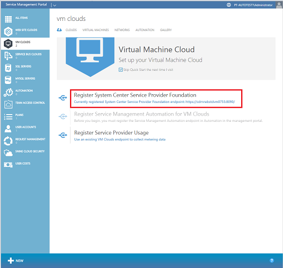
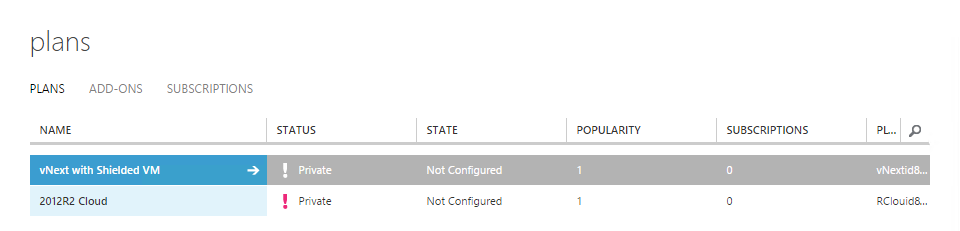
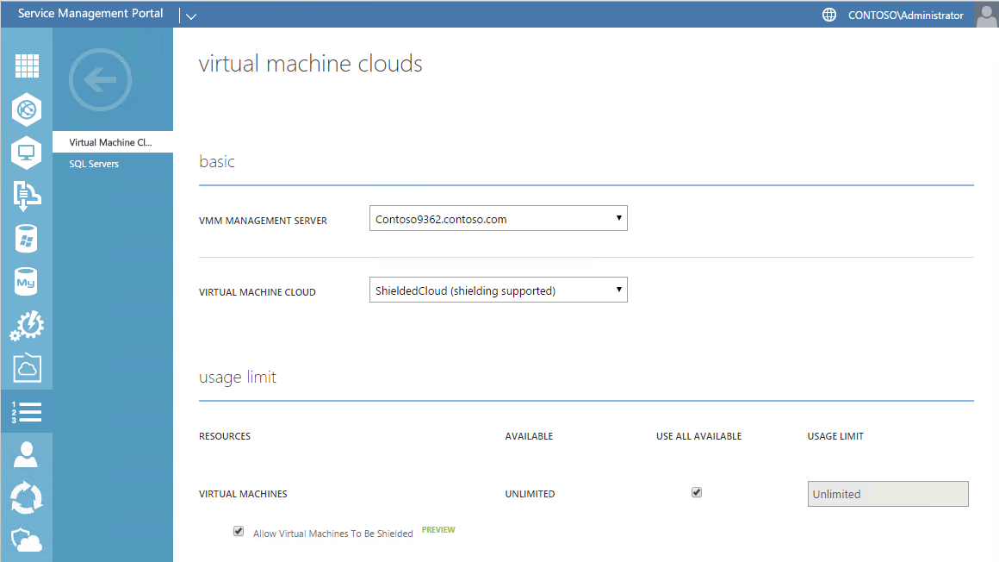
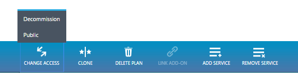

# Scenario 2 - Deploy a shielded VM by using Windows Azure Pack

>Applies To: Windows Server 2016

This topic continues the process begun in the following topics:

- [Setting up the Host Guardian Service - HGS](guarded-fabric-setting-up-the-host-guardian-service-hgs.md)

- [Scenario 1 - Deploy guarded hosts and shielded virtual machines in VMM](https://technet.microsoft.com/system-center-docs/vmm/scenario/guarded-overview)
 
This topic describes how to deploy a shielded VM by using Windows Azure Pack, a web portal that extends the functionality of System Center Virtual Machine Manager to allow tenants to deploy and manage their own VMs through a simple web interface. Windows Azure Pack fully supports shielded VMs and makes it even easier for tenants to create and manage their shielding data files.

## Setting up Windows Azure Pack

You will complete the following tasks to set up Windows Azure Pack in your environment:

1. Complete configuration of System Center 2016 - Virtual Machine Manager (VMM) for your hosting fabric. This includes setting up VM templates and a VM cloud, which will be exposed through Windows Azure Pack:

    [Scenario 1 - Deploy guarded hosts and shielded virtual machines in VMM](https://technet.microsoft.com/system-center-docs/vmm/scenario/guarded-overview)

2. Install and configure System Center 2016 - Service Provider Foundation (SPF). This software enables Windows Azure Pack to communicate with your VMM servers:

    [Set up System Center 2016 - Service Provider Foundation](#set-up-system-center-2016---service-provider-foundation) (in this topic)

3. Install Windows Azure Pack and configure it to communicate with SPF:

    - [Install Windows Azure Pack](#install-windows-azure-pack) (in this topic)
    - [Configure Windows Azure Pack](#configure-windows-azure-pack) (in this topic)

4. Create one or more hosting plans in Windows Azure Pack to allow tenants access to your VM clouds:

    [Create a plan in Windows Azure Pack](#create-a-plan-in-windows-azure-pack) (in this topic)

### Steps tenants take to create shielded VMs with Windows Azure Pack

When the preceding steps are complete, tenants can take the following steps:

<!-- When we have a link to the topic about how tenants subscribe, add that link as an indented item just under step 1 below. -->

1. **Tenants**: subscribe to one or more plans offered in Windows Azure Pack.

2. **Tenants**: create a shielded VM by using Windows Azure Pack.

    [Use shielded virtual machines](https://technet.microsoft.com/library/mt720674.aspx), which is described in the following topics:

    - [Create shielding data](https://technet.microsoft.com/library/mt720672.aspx) (and upload the shielding data file, as described in the second procedure in the topic).
    
    >**Note**&nbsp;&nbsp;As part of creating shielding data, you will download your guardian key file, which will be an XML file in UTF-8 format. Do not change the file to UTF-16.
    
    - [Create a shielded virtual machine](https://technet.microsoft.com/library/mt720673.aspx) - with **Quick Create**, through a shielded template, or through a regular template.
    
        >**Warning**&nbsp;&nbsp;If you [Create a shielded virtual machine by using a regular template](https://technet.microsoft.com/library/mt720673.aspx#Anchor_2), it is important to note that the VM is provisioned *unshielded*. This means that the template disk is not verified against the list of trusted disks in your shielding data file, nor are the secrets in your shielding data file used to provision the VM. If a shielded template is available, it is preferable to deploy a shielded VM with a shielded template to provide end-to-end protection of your secrets.
    
    - [Convert a Generation 2 virtual machine to a shielded virtual machine](https://technet.microsoft.com/library/mt720670.aspx)
    
        >**Note**&nbsp;&nbsp;If you convert a virtual machine to a shielded virtual machine, existing checkpoints and backups are not encrypted. You should delete old checkpoints when possible to prevent access to your old, decrypted data.

## Set up System Center 2016 - Service Provider Foundation

System Center 2016 - Service Provider Foundation (SPF) allows Windows Azure Pack to communicate with your VMM servers that manage the hosting fabric. Before installing Windows Azure Pack, you must set up System Center 2016 - SPF. For information about installing SPF, see [How to Install Service Provider Foundation](https://technet.microsoft.com/system-center-docs/spf/deploy/how-to-install-service-provider-foundation-for-system-center-technical-preview).

<!-- I have a question out to Erik Kjerland about whether the blog post in the following sentence is still helpful. If it's not, delete the sentence. -->

If you have issues with integrating Windows Azure Pack and Service Provider Foundation, see [Troubleshooting Windows Azure Pack, SPF and VMM](https://blogs.technet.microsoft.com/privatecloud/2013/11/08/troubleshooting-windows-azure-pack-spf-vmm/).

## Install Windows Azure Pack

The following steps to install and configure Windows Azure Pack (WAP) should be performed on the machine where you wish to host the web portal for your tenants. This machine will need to be able to reach the SPF server you installed in the previous section, and be reachable by your tenants (for example, be connected to the Internet if you’re a hosting service provider, or a corporate network in an enterprise environment).

1.  Plan for your installation of WAP by reviewing its [system requirements](https://technet.microsoft.com/library/dn296442.aspx) and installing the [prerequisite software](https://technet.microsoft.com/en-us/library/dn469335.aspx).

2.  Download and install the [Web Platform Installer](https://www.microsoft.com/web/downloads/platform.aspx). If the machine you are installing WAP onto is not connected to the Internet, you should also download this on an internet-connected machine and follow the [offline installation instructions](http://www.iis.net/learn/install/web-platform-installer/web-platform-installer-v4-command-line-webpicmdexe-rtw-release).

3.  Open the Web Platform Installer and find “Windows Azure Pack: Portal and API Express” under the Products tab. Click **Add** then **Install** at the bottom of the window.

4.  Proceed through the installation process. After installation completes, the configuration site (*https://&lt;wapserver&gt;:30101/*) opens in your web browser. On this website, provide information about your SQL server and finish configuring WAP.

If you need help setting up Windows Azure Pack, see the instructions at [Install an express deployment of Windows Azure Pack](https://technet.microsoft.com/dn296439.aspx).

\>**Note**&nbsp;&nbsp;If you already run Windows Azure Pack in your environment, you may use your existing installation. In order to work with the latest shielded VM features, however, you will need to upgrade your installation to at least Update Rollup 10.

### Configure Windows Azure Pack

Before you use Windows Azure Pack, you should already have it installed and configured for your infrastructure.

1.  Navigate to the Windows Azure Pack admin portal at *https://&lt;wapserver&gt;:30091*, and then log in using your administrator credentials.

2.  In the left pane, click **VM Clouds**.

3.  Connect Windows Azure Pack to the SAP to the Service Provider Foundation instance you already configured by clicking “Register System Center Service Provider Foundation.” You will need to specify the URL for Service Provider Foundation, as well as a username and password.

    

4.  Once completed, you should be able to see the VM clouds set up in your VMM environment. Ensure you have at least one VM cloud that supports shielded VMs available to WAP before continuing.

### Create a plan in Windows Azure Pack

In order to allow tenants to create VMs in WAP, you must first create a hosting plan to which tenants can subscribe. Plans define the allowed VM clouds, templates, networks, and billing entities for your tenants.

1.  On the lower pane of the portal, click **+NEW** &gt; **PLAN** &gt; **CREATE PLAN**.

2.  In the first step of the wizard, choose a name for your Plan. This is the name your tenants will see when subscribing.

3.  In the second step, select **VIRTUAL MACHINE CLOUDS** as one of the services to offer in the plan.

4.  Skip the step about selecting any add-ons for the plan.

5.  Click **OK** (check mark) to create the plan. Although this creates the plan, it is not yet in a configured state.

    

6.  To begin configuring the Plan, click its name.

7.  On the next page, under **plan services**, click **Virtual Machine Clouds**. This opens the page where you can configure quotas for this plan.

8.  Under **basic**, select the VMM Management Server and Virtual Machine Cloud you wish to offer to your tenants. Clouds that can offer shielded VMs will be displayed with “(shielding supported)” next to their name.

9.  Select the quotas you want to apply in this Plan. (For example, limits on CPU core and RAM usage). Make sure to leave the **Allow Virtual Machines To Be Shielded** checkbox selected.

    
    
10.  Scroll down to the section titled “**templates**”, and then select one or more templates to offer to your tenants. You can offer both shielded and unshielded templates to tenants, but a shielded template must be offered to give tenants end-to-end assurances about the integrity of the VM and their secrets.

11.  In the “**networks**” section, add one or more networks for your tenants.

12.  After setting any other settings or quotas for the Plan, click **Save** at the bottom.

13.  At the top left of the screen, click on the arrow to take you back to the **Plan** page.

14.  At the bottom of the screen change the Plan from being **Private** to **Public** so that tenants can subscribe to the Plan.

    

    At this point, Windows Azure Pack is configured and tenants will be able to subscribe to the plan you just created and deploy shielded VMs. For the steps tenants will take, see [Steps tenants take to create shielded VMs with Windows Azure Pack](#steps-tenants-take-to-create-shielded-vms-with-windows-azure-pack), earlier in this topic.

## See also

- [Configuration scenarios for shielded VMs in a guarded fabric](guarded-fabric-configuration-scenarios-for-shielded-vms-overview.md)
- [Guarded fabric and shielded VMs](guarded-fabric-and-shielded-vms-top-node.md)
